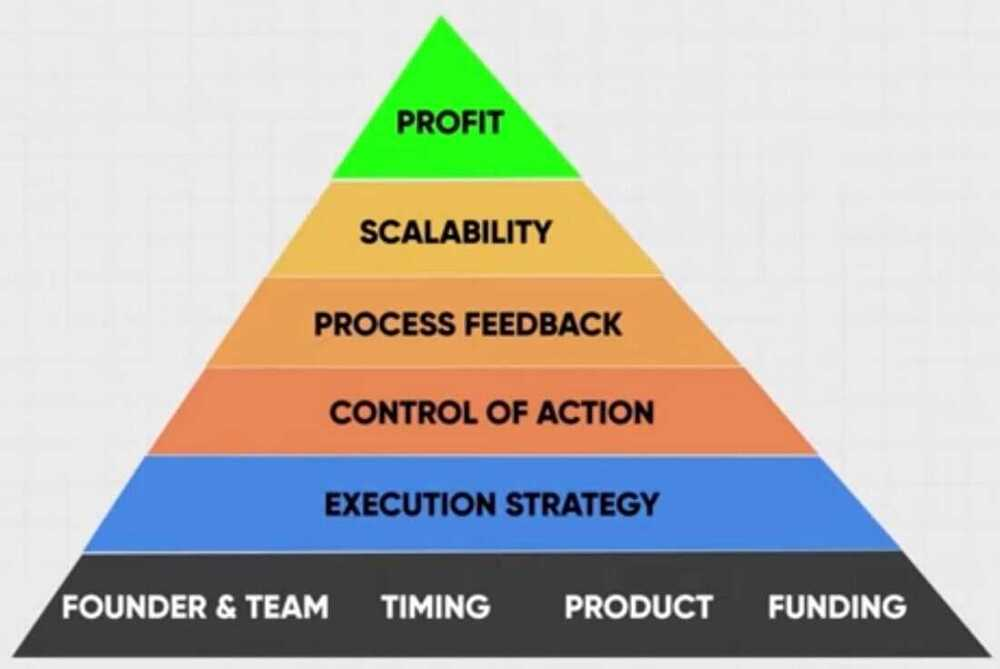
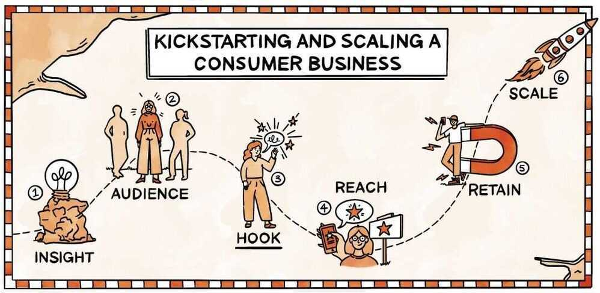
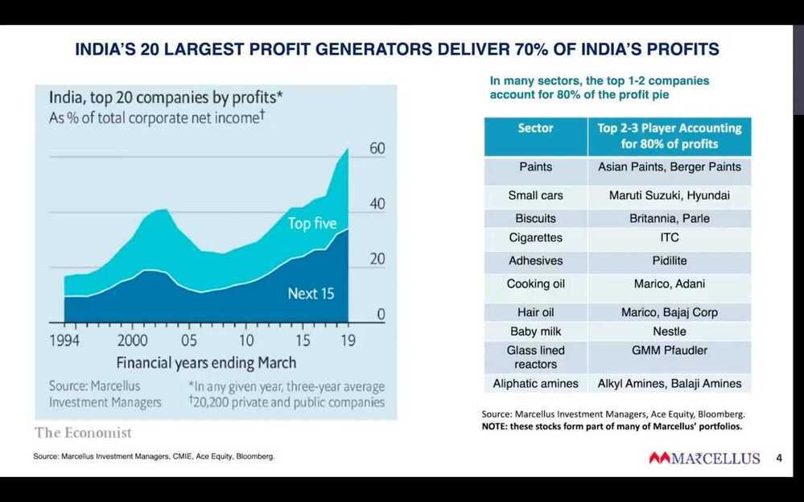
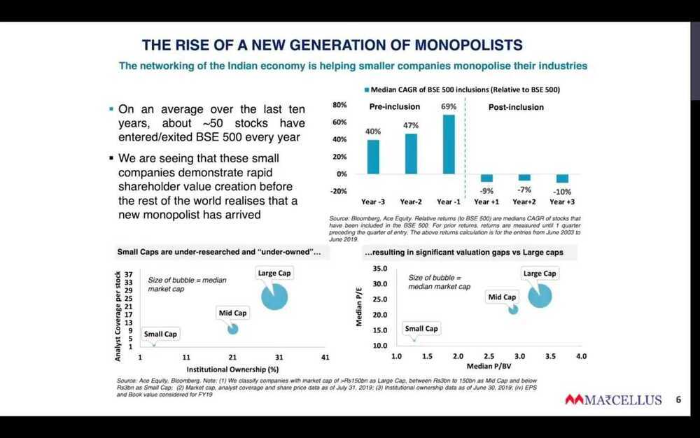
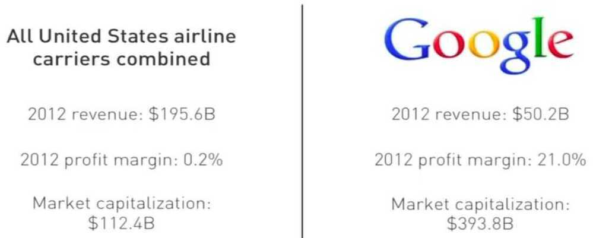
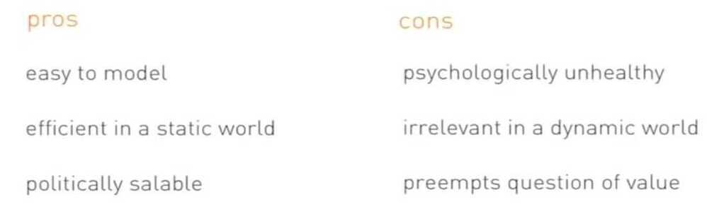
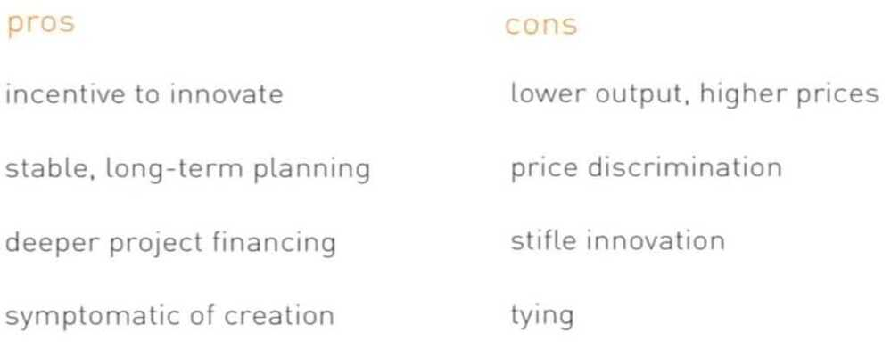
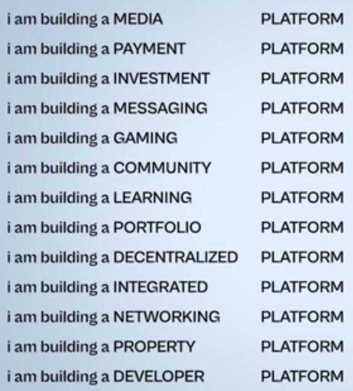
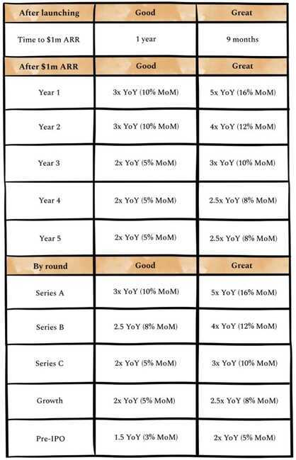

# Creating a Business / Startup

Brand name - [How to create a great brand name | Jonathan Bell](https://youtu.be/rzbXht7MJVM)

**Megatrends-** powerful, transformative forces that could change the global economy, business and society... Think electricity, automobile, the Internet.

You will have either of the 4 problems while building a startup

- access to capital
- building the product customers want
- able to distribute your product at scale
- ensuring you are able to monetise

15 day tech startup launch plan:

[Firstbase \| Incorporation, compliance, bookkeeping, and taxes – all in one place.](https://www.firstbase.io/)

- Domain on [GoDaddy](https://www.linkedin.com/company/godaddy/)- 5 minutes
- Logo ideas on [Dribbble](https://www.linkedin.com/company/dribbble/)- 5 minutes
- Brand assets on [Figma](https://www.linkedin.com/company/figma/)- 40 minutes
- Website template design on [Wix.com](https://www.linkedin.com/company/wix-com/)- 2 hours
- Webpage on [Webflow](https://www.linkedin.com/company/webflow-inc-/)- 2 hours
- Website to backend workflow on [Zapier](https://www.linkedin.com/company/zapier/) and [Notion](https://www.linkedin.com/company/notionhq/)- 2 hours
- Early user testimonial videos on [Testimonial](https://www.linkedin.com/company/testimonialto/)- 30 minutes
- Early app building on [FlutterFlow](https://www.linkedin.com/company/flutterflow/)- 7 days
- Step by step instructions on using app on [UserGuiding](https://www.linkedin.com/company/userguiding/)- 2 hours
- Payment collection on [Stripe](https://www.linkedin.com/company/stripe/) or [Bolt](https://www.linkedin.com/company/bolt-com/)- 2 hours
- shopify
- https://gumroad.com
- App distribution on ProductHunt - 5 hours
- Newsletter plan on [Substack](https://www.linkedin.com/company/substack/)- 7 days
- SEO on [Ahrefs](https://www.linkedin.com/company/ahrefs/)- 5 hours
- Landing page chatbot on [Landbot](https://www.linkedin.com/company/landbot-io/)- 1 hour
- CRM on [HubSpot](https://www.linkedin.com/company/hubspot/)- 1 hour

## Founders / Entrepreneurship

Two types of founders. Mercenary and missionary.

### Mercenary

Former are the ones who see a gap in the market and attack it. Shoe laces to ball bearings to plastic scoops - as long as there is a better way to serve the market, a market that already exists, they are in.

Usually, these are the guys who build profitable companies. Why?

Because they start with how the world is. Not how it should be. They meet the consumer where she stands today. And serve her needs.

### Missionary

Missionary founders are the opposite of mercenary in almost every way.

We see how (a certain part of) the world is, and we don’t like it. We want to change it.

We don’t go where the consumer is. We try and get her to where we believe she should be (how presumptuous).

And we usually don’t make money. Neither do our companies. Why?

Because we try and play God. We refuse to accept reality. We want to change it. Last I checked, reality remains unbeaten.

Change begets friction. This, according to me, is why so many purpose led businesses remain small.

[Purpose vs Profit - by Shashank Mehta](https://midlifeentrepreneur.substack.com/p/purpose-vs-profit)

[The Real Cost of Entrepreneurship - by Shashank Mehta](https://midlifeentrepreneur.substack.com/p/the-real-cost-of-entrepreneurship)

## Inspirations and Research and Product news

- Techcrunch
- ProductHunt - [Best rated products of November 2022. | Product Hunt](https://www.producthunt.com/products?order=best_rated&period=2022-11)
- [Hall of Fame - Golden Kitty Awards Winners | Product Hunt](https://www.producthunt.com/golden-kitty-awards/hall-of-fame)
- Demo Days
- [Y Combinator - YouTube](https://www.youtube.com/@ycombinator)

## How to start startup

Startups are built by generalists and scaled by specialists.

1. Ideation
    - Problem solving
    - Simple & practical
    - Futuristic approach (5 years later)
    - Tweakable (online pharmacy - pharmeasy)

2. Feasibility analysis
    - Economically feasible (will people be able to afford)
    - Financially feasible (not too much capex, opex)
    - Technically feasible

3. MVP
    - Market segmentation
    - Market analysis
    - Competitor analysis

4. Startup pilot run
    - Acquire first 1000 customers
        - Illusion vs reality
        - What is next to bring the best
        - Branding

            Branding is like a relationship, if you don't care, it won't care

            Either be the first or be really fast

5. Startup team building

    Your first 12 people will decide where will the startup go
    - Reliable
    - Vision oriented
    - Action takers
    - Not too motivated by money (if someone offers more he shouldn't leave)
    - You cannot execute fast if you have slow people with you
        - Leverage
        - Time freedom
        - Compound effect

6. Profitable & scalable business model
    - Growth plan (calculations for cash burn)
    - Profitability plan (next 2-5 years)
        - Dependency
        - Cost (expansion)
        - Recurring/one-time revenue
        - Upsell/cross sell

7. Startup funding & incubators
    - Pitch deck
        - product/concept
        - vision/mission
        - TAM/SAM
        - COCA
        - RPU (Revenue per user)
        - Growth projections
        - Customer base

    - Financial plan
        - Current financials
        - Revenue model
        - Expense sheet
        - Requirements
        - Budget allocation

    - Presentation & communication skill

https://youtu.be/Ndp_NnztS8U

[The single biggest reason why start-ups succeed | Bill Gross | TED - YouTube](https://www.youtube.com/watch?v=bNpx7gpSqbY&ab_channel=TED)

## Startup / Company Culture

- Open office, no different rooms for managers/boss
- No cubicles
- Same washrooms/eating areas for managers/bosses/employees
- Engage with employees

## Startup Journey Pyramid

- [Step 1: INSIGHT: Come up with your idea](https://substack.com/redirect/43f55649-3a4e-4d67-a897-cb95b997a73d?u=3531510)
- [Step 2: AUDIENCE: Identify your super-specific who](https://substack.com/redirect/9818beb8-c13d-4822-83c7-6f3860c81364?u=3531510)
- Step 3: HOOK: Craft your pitch
- Step 4: REACH: Find your early adopters by doing things that don't scale
- Step 5: RETAIN: Iterate until enough people stick around
- Step 6: SCALE: Build your growth engine

### 4 Phase Framework

1. Cash Drain
2. Trust Building
3. Dependency
4. Control

[Why is OLA's BUSINESS MODEL Failing MISERABLY in India? : Business case study](https://www.youtube.com/watch?v=LYs4b3fTX7Y)

[Masterclass with Saurabh Mukherjea: EDGE Institute](https://www.youtube.com/watch?v=8uCxFTghxtc)

https://marcellus.in/newsletter/little-champs/introducing-little-champs-our-small-cap-pms

- Relaxo case study
- India has 1 crore people leaving for less than 1 lakh rs per annum
- Barrier to entry
- Free cash flow = Return on capital - Cost of capital
- Government tries to control news media
- Government will never let go of money (Money vs Modern State)
    - Modern states cannot exist without controlling money
    - State will never let go it's money
- Junk science (doomscrolling)
- Poor man is more independent than rich man since rich man has to worry about money

[Competition is for Losers with Peter Thiel (How to Start a Startup 2014: 5)](https://www.youtube.com/watch?v=3Fx5Q8xGU8k&ab_channel=YCombinator)

1. Capturing Value

    

    **Perfect competition**

    

    **Monopoly**

    

2. Lies people tell
3. How to build a monopoly
4. Last mover advantage
5. History of innovation
6. Psychology of competition

|            | **one**                                              | **few**                                                |
|--------------------|----------------------------|------------------------|
| **sellers** | [monopoly](https://en.wikipedia.org/wiki/Monopoly)   | oligopoly                                              |
| **buyers**  | [monopsony](https://en.wikipedia.org/wiki/Monopsony) | [oligopsony](https://en.wikipedia.org/wiki/Oligopsony) |

**Oligopoly**

An oligopoly is a [market form](https://en.wikipedia.org/wiki/Market_structure) where in a [market](https://en.wikipedia.org/wiki/Market_(economics)) or [industry](https://en.wikipedia.org/wiki/Industry_(economics)) is dominated by a small group of large sellers (oligopolists). For example, it has been found out that insulin and the electrical industry are highly oligopolist in the US.

https://en.wikipedia.org/wiki/Oligopoly

https://www.lennysnewsletter.com/p/wedge

combine digital and physical

**Attention Economy -** Apps such as Facebook, Youtube that want to increase the time spent on their app... They are generally solving for entertainment or allowing self-expression. Their north star of these apps revolves around maximizing time spent by customers on the app. Think Spotify, Netflix, PubG, Tiktok etc.

**Transactions Economy -** Apps such as Amazon, Uber or any marketplace or platform that help make purchase decisions quickly. Here time spent is vanity, they focus on utility and fulfillment by increasing the number of transactions on the platform. Think Gpay, Swiggy, or any online retail company etc

**Productivity Economy -** Apps or products such as Slack, Trello, Microsoft Office, or most SAAS software that are working hard to improve your efficiency at work. Their key goals will revolve around solving a core problem and these measure success through usage, not time spent. Think Zoho, Adobe, Evernote, etc..

[Rise of Platform Businesses in India | Zomato, Policy Bazaar, IndiaMart | ET Money](https://www.youtube.com/watch?v=EHKgZSyBtnA)

- Aggregation platform
- Social platform
- Mobilization platform

The intensity of the signal each problem sends at any given time is determined by a bunch of factors, including:

- Total Addressable Market (TAM)
- Economics
- Visibility of the Opportunity
- Technical Difficulty of the Problem
- Market Structure / Barriers
- Impact
- Sexiness
- How Solved the Problem Already Is

https://www.lennysnewsletter.com/p/what-is-a-good-growth-rate

- In the early stages, investors don't care about month-over-month growth
- Instead,for early-stage B2B businesses, investors focus on how quickly they ramp to $1m ARR after going live
- Along those same lines, for early-stage consumer businesses, it's all about intensity of engagement, virality, and retention - not revenue

https://www.lennysnewsletter.com/p/winning-at-consumer-subscription

1. An obsession with efficiency
2. Alignment between product strategy and acquisition strategy
3. A singular focus to build a magical, sticky product through rapid iteration and endless optimization

## Financial model

1. Start (Summary / Navigation)
2. Dashboard (which provides a summary of the company)
3. Edit Sheet (allows you to experiment with different scenarios)
4. Business plan (For a 5 Year)
5. Employee Expense
6. Marketing Expense
7. Indirect Expense
8. Industry Analysis
9. Market Sizing (TAM, SAM, & SOM)
10. Monthly Profit & Loss
11. Income Statement
12. Balance Sheet
13. Cash flow
14. Revenue Breakup
15. Capex
16. Depreciation
17. Break Even Analysis (BEP - Break Even Point)
18. DCF Valuation
19. Dilution
20. Profitability Charts
21. Share Holding pattern

https://www.linkedin.com/posts/meet-jain-596636214_financialmodeling-finance-financialmodelling-activity-7008822429506514944-blUv

[How To Price For B2B | Startup School - YouTube](https://www.youtube.com/watch?v=4hjiRmgmHiU&ab_channel=YCombinator)

## Product Intro Examples

[daily.dev web app - All-in-one developer news reader](https://www.youtube.com/watch?v=igZCEr3HwCg)

## Discovery Commerce Platform (e-commerce)

Discovery commerce is an online sales method based on guiding the buyer towards a product.

Discovery shopping, on the other hand, is where **a user visits websites or marketplaces without a defined purpose**. This buyer isn’t looking for a specific product, but is open to being pleasantly surprised by exploring an online catalog or receiving suggestions.

Discovery commerce is the equivalent of 'I'm feeling lucky' in Google searches. While the main effort of an ecommerce strategy is aimed at efficiently meeting specific needs of the consumer, discovery commerce draws on the custom of strolling through a store, browsing shelves without intention to buy... until the perfect product catches your eye.

[The New Digital Trend: Discovery Commerce | Sales Layer](https://blog.saleslayer.com/the-new-digital-trend-discovery-commerce)

## Co-Founder

- [Y Combinator Co-Founder Matching Platform - find a co-founder through YC | Y Combinator](https://www.ycombinator.com/cofounder-matching)
- [Co-Founder Equity Mistakes to Avoid | Startup School - YouTube](https://www.youtube.com/watch?v=DISocTmEwiI)
- [How To Find A Co-Founder | Startup School - YouTube](https://www.youtube.com/watch?v=Fk9BCr5pLTU)

## Links

- [How I Turned $300 Into $5.1 Billion - YouTube](https://www.youtube.com/watch?v=XWwMr1jYIDE)
- [13 Businesses Making +$1,000,000/Year With 0 Employees - YouTube](https://www.youtube.com/watch?v=giis6_u8n3M)
- [How to build a company board as a founder?](https://shorts.growthx.club/how-to-build-a-board-with-intent)
- [GitHub - sdg-1/consulting-handbook: A guide for technical professionals looking to start consulting](https://github.com/sdg-1/consulting-handbook)
- [I Broke Down A Shocking Report About The Indian Luxury Market! - YouTube](https://www.youtube.com/watch?v=o5AAI5WaMFE)
- [Business Building Masterclass - Idea to Product ✈️ - YouTube](https://www.youtube.com/watch?v=juZmbYfGmiU&ab_channel=LabourLawAdvisor)
- [How To Start A Dev Tools Company | Startup School - YouTube](https://www.youtube.com/watch?v=z1aKRhRnVNk)
- [Make ₹50 Lakhs in 50 Days | E-Commerce/Business Masterclass - YouTube](https://www.youtube.com/watch?v=N3rZ6glHKTQ)
- [How Do Indian Founders make 100 Crores Selling Their Companies? - YouTube](https://www.youtube.com/watch?v=zrq7kczXpXQ)
