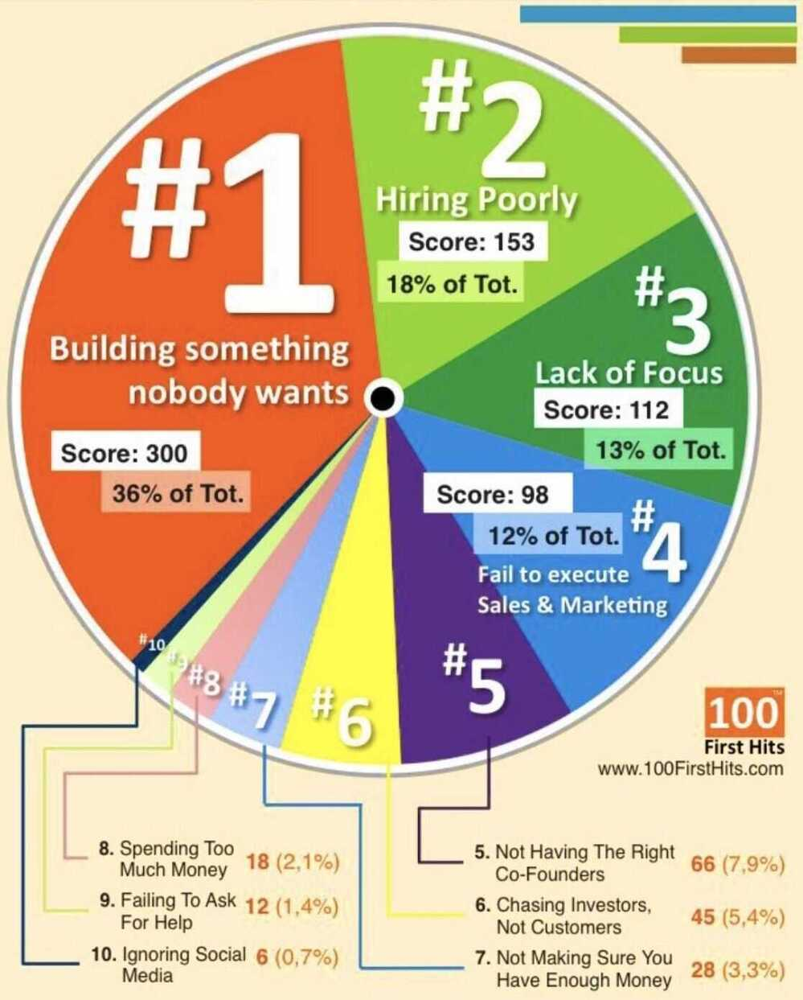
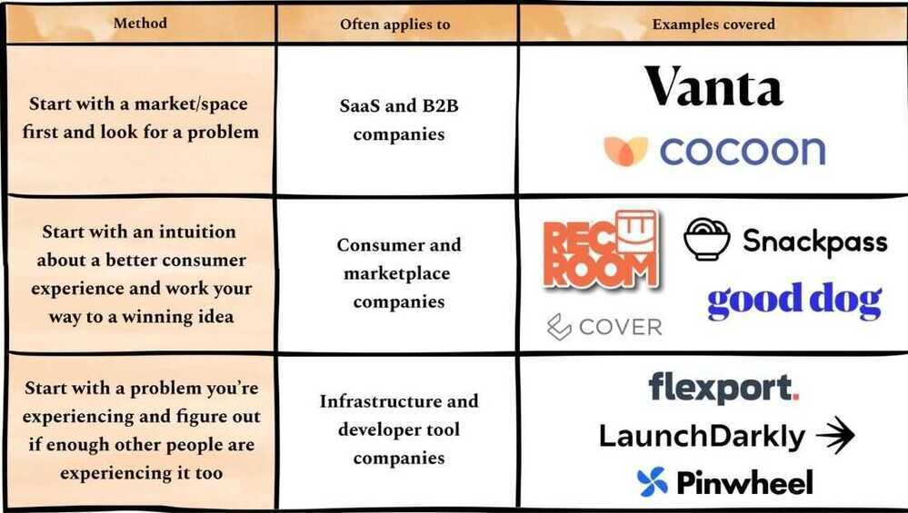

# Intro

Once an idea has taken hold of the brain it's almost impossible to eradicate. An idea that is fully formed - fully understood - that sticks; right in there somewhere. -- Inception

## Inspirations

- [Product Hunt - The best new products in tech.](https://www.producthunt.com/)
- https://startup.google.com
- https://redislabs.com/blog/build-on-redis-hackathon-winners
- https://www.freecodecamp.org/news/learn-how-to-build-apps-from-a-business-perspective
- https://github.com/florinpop17/app-ideas
- [Portfolio - 100X.VC | Top Startups in India 2022](https://www.100x.vc/portfolio)
- **Watch SharkTank for inspiration**

Startup time management in three simple steps:

1. Write down your todo list
2. Trash it
3. Do the absolute most essential thing for the survival of the company

- Misjudging the market size, establishing unreasonable expectations, and chasing valuations.

https://dev.to/kennedyrose/validating-your-saas-idea-gee

- 35% of startups fail because there was [no market need for their product](https://www.cbinsights.com/research/startup-failure-reasons-top/).
- Product validation is the process of finding customers who are willing to pay for your product, usually before you start building, or in the early stages of building
- product's market size, ex - wordpress market size,
- Reddit and Quora to find questions about your product idea
- Google's [Keyword Planner](https://ads.google.com/home/tools/keyword-planner/)
- When in doubt, just ask! If you have freelance or agency clients, just ask them if a product like that would solve their problems, and what they might be willing to pay for it

## Thoughts

Most important thing for a country/economy/world - **Education**

Impact - education+ food + living

Impact - technological innovation

## Future / Future predictions

- Everyone will order something from app online and get it delivered at home (first using riders like food delivery guys and then by drones and robots)
- **Ultimate - Safe robots and drones are the future that can pick up and drop items safely**
- There will be a third world war because of China's authoritative rule

## How to kill a country in a war

- Kill its economy
- Print its currency and dump it there
- Credit whole nations account with millions of currency (cyber hacking)

Most important thing in Goverment and Companies - **Transparency**

https://julian.digital/2020/04/19/airpods-as-a-platform

I was at the right place at the right time, if someone asks how you became successful

Always talk in percentages and percentiles, and not in absolute numbers

Calendly business card

Calendly free and open source version

Checking emails at 11 3 6 and 12 am

Deep work

Sometimes to get to a bigger hill, you have to descend into the valley from a smaller hill

i.e. you have to leave a smaller job for a bigger job

The single most important decision you will make as a founder is "the pick".

Choosing what idea you work on.

Far too many shortcut this process.

Far too many amazing operators spend too long working on ideas that are poor or not worthy of their operational quality.

- Hot streaks in a career and make them count (Marcellus)
- Search engine made the file system redundant (Marcellus)

## Tools

- **Amazon Business**

    Claim 18-28% GST on every Purchase made on Amazon that's related to business once you signup through this link and be a part of their Business portal.

- **CashKaro**

    Whenever buying something online, I just use this service to get a Cashback on all the purchases

## Hiring

Hiring those people who can write well, if someone can write well, he can think well too.

## Team

- Vishal
- Sahil
- Nishant
- Vikas / Ayush / Kamini
- Swati / Vaibhav
- Prakhar / Sanchit / Priyank
- Mukesh
- Abhishek Dhar
- Shashank
- Bhawani
- Luv

https://www.lennysnewsletter.com/p/validating-your-startup-idea

Committing to a startup idea is possibly the most consequential decision you'll ever make. It'll impact everything they do for the next 1 to 50 years, and either lead you to fame and fortune or a brick wall to endlessly bang your head against. No pressure.

There are three common ways to come up with an idea:

1. **Market first:** Start with a market or space that interests you, then look for a specific problem
2. **Experience ripe for improvement:** Look for areas where you believe there should be a better consumer experience than what currently exists, and iterate from there
3. **Problem first:** Start with a problem you've experienced firsthand and figure out if enough other people have the same problem

### Stealth Startup

A stealth startup is a startup company that operates in stealth mode, i.e. that avoids public attention. This may be done to hide information from competitors, or - as part of a marketing strategy - to manage public image. The phenomenon is well known in the venture capital (VC) community. Normally a company would only operate in stealth mode for the first couple of years. As investors may have to disclose funding a stealth startup, their names are made public, but often only a general summary description is known about the company. "Most entrepreneurs say they are in stealth because they are worried about competitors stealing their ideas. This can be a risk if you have such a simple idea that just by hearing it, someone can replicate it."​

## Links

- [How to Generate Good Ideas — NIGHTVIEW CAPITAL](https://www.nightviewcapital.com/articlescommentary/how-to-generate-good-ideas)
    - Idea generation, in the investment business, has always been something of a dark art. Some managers prefer stringent quantitative screens to generate ideas. Others keep a narrow band of expertise and choose only to invest in particular niches. Then there are the generalists, who simply hunt in open territory for the best ideas. Each specialization requires specific frameworks to be successful, but the point is this: idea generation has always been—and will always be—part art, and part science.
    - …To be cross-disciplinary, and to meander among fields. This insight is important because some of the world’s best ideas were produced by individuals who pursued non-traditional, non-linear paths (and whose insights could be profoundly heretical.)
    - Countless philosophers have effused about the mental benefits of walking, ranging from the ancient Stoics ("We should take wandering outdoor walks, so that the mind might be nourished and refreshed by the open air and deep breathing." - Seneca) to more modern European philosophers ("All truly great thoughts are conceived by walking."  Nietszche) to the techno-libertarian walking ideology of Steve Jobs.
    - Perhaps my personal favorite quote on the subject comes from Thoreau, who once said: "Every walk is a sort of crusade." (Thoreau himself was obsessed with walking, and even wrote a book on the subject.)
    - The idea-enhancing benefits of walking are not entirely understood from a neurological perspective, but one Stanford study found that walking can boost creative thinking and idea generation by an average of 60 percent.
