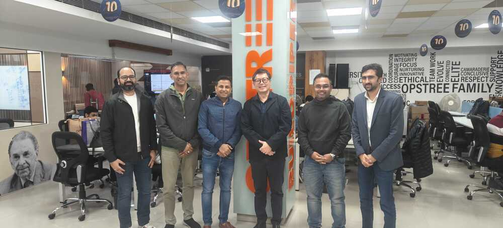

# Meetups / Talks / Sessions

## ClickHouse Meetup (22 March 2025)

Implementing Vector Search in ClickHouse for Scalable AI Solutions

Delve into ClickHouse's support for vector search, enabling efficient handling of high-dimensional data for AI applications. Understand how to implement vector similarity searches using ClickHouse's SQL functions and explore use cases such as semantic search and recommendation systems.

[ClickHouse Delhi/Gurgaon Meetup - March 2025, Sat, Mar 22, 2025, 10:30 AM \| Meetup](https://www.meetup.com/clickhouse-delhi-user-group/events/306253492/)

[Machine learning and GenAI with ClickHouse \| ClickHouse for ML and data science](https://clickhouse.com/use-cases/machine-learning-and-data-science)

[Announcing GenAI powered query suggestions in ClickHouse Cloud](https://clickhouse.com/blog/announcing-genai-powered-query-suggestions-clickhouse-cloud)

[How Poolside is using ClickHouse to build next-gen AI for software development](https://clickhouse.com/blog/poolside-using-clickhouse-to-build-next-gen-ai-for-software-development)

## Fareportal - Unlocking AI Meetup (8 March 2025)

Presentation - [Fareportal - Automating the Future: Build Powerful AI Agents - Google Slides](https://docs.google.com/presentation/d/1yC45PpMcHqgvlVmCutI2LUF_jmuZM9fH0A1NIa665Q8/edit?usp=sharing)

- How AI agents reason, plan, and execute autonomously
- Key frameworks & orchestration techniques
- Real-world use cases you can implement right away

### Session Line-up

**Automating the Future: Build Powerful AI Agents**

- Presenters: Ramneek Kaur (Sr. Data Engineer) and Deepak Sood (Senior AI, Data and DevOps Architect) from OpsTree

**Harnessing GenAI with Ollama & Open-WebUI for DevOps Automation**

- Presenters: Sajid Ansari (Lead DevOps) & Gaurav Bansal (VP IT – Developer Services) from Fareportal

**Quality Engineering 2.0: GenAI's Leap into the Future**

- Presenters: Manisha Dixit (Automation - Test Manager) and Manoj Jain (Senior Director - R&D) from Axtria

**AI-Powered Call Analytics at Fareportal**

- Presenters: Pranjal Kalbag (ML Engineer) & Vipin Siriah (Manager, Data Science) from Fareportal

[Deepak Sood on LinkedIn: #genai #aiagents #aiinnovation #beyondchatbots #unlockingai #techmeetup…](https://www.linkedin.com/posts/deepaksood619_genai-aiagents-aiforbusiness-activity-7303111555112386560-GzIs/)

## Build apps for Google Chat with Gemini (7 March 2025)

- Build with AI: Ghaziabad Edition - NITRA Technical Campus, Ghaziabad

Presentation - [NITRA - Zero to Hero: Mastering GenAI in a Flash - Google Slides](https://docs.google.com/presentation/d/1rmT_p4wagioys1iNRlEuCYdIRZO89CZEYwoODmi-iWs/edit?usp=sharing)

Build a Patent Search App with AlloyDB, Vector Search & Vertex AI!

1. Create an AlloyDB instance and load Patents Public Dataset data
2. Enable pgvector and generative AI model extensions in AlloyDB
3. Generate embeddings from the insights
4. Perform real time Cosine similarity search for user search text
5. Deploy the solution in serverless Cloud Functions

Google Chat apps with Gemini do the following:

- Bring your services and resources into Google Chat, which lets users get information and take action without leaving the conversation.
- Integrate with the generative AI model Gemini, so they can create or search data like text or images at specific times to streamline your workflows.

### Why integrate Google Chat apps with Gemini?

The typical use cases of Generative AI models like Gemini fall in the following categories:

- **Content creation and enhancement**. Generate marketing copy, craft social media posts, create realistic images, compose music, or aid in the creation of video content.
- **Data search**. Extract key insights from an unstructured knowledge base, summarize lengthy texts, classify contents, or translate languages with enhanced accuracy and speed.
- **Conversation**. Engage in natural, informative, and creative conversations.

### What you build

In this codelab, you build three Google Chat apps with Gemini to cover the three use cases introduced in the previous section.

1. Issue management app (content creation and enhancement)
2. Knowledge app (data search)
3. Feedback app (conversation)

### What you learn

- How to integrate Google Chat apps with Gemini through Vertex AI.
- How to integrate Google Chat apps with Dialogflow CX agents.
- How to use the latest features of Google Chat: app home, Google Chat Events, and accessory widgets.

[Deepak Sood on LinkedIn: #buildwithai #tensorflowug #ai #googlegemini #ghaziabad #techevent](https://www.linkedin.com/posts/deepaksood619_buildwithai-tensorflowug-ai-activity-7303412204479881217-vSYQ)

[Build apps for Google Chat with Gemini  \|  Google Codelabs](https://codelabs.developers.google.com/codelabs/chat-apps-gemini?hl=en#0)

[Build with AI: Ghaziabad Edition](https://www.commudle.com/communities/tensorflow-user-group-ghaziabad/events/women-in-ai-5d052ccf-e60e-4347-9c7c-0ba67cb1d47f)

[Google Codelabs](https://codelabs.developers.google.com/?category=aiandmachinelearning)

[Catalog \| Google Cloud Skills Boost](https://www.cloudskillsboost.google/catalog?keywords=&locale=&skill-badge%5B%5D=any&format%5B%5D=labs&language%5B%5D=en)

## Head Mentor for HackHound 3.0 (28 Feb 2024)

[Hackathon Hackhound](ai/hackathon-hackhound.md)

[Deepak Sood on LinkedIn: #hackhound #hackathon #techinnovation #ai #devops #dataengineering…](https://www.linkedin.com/posts/deepaksood619_hackhound-hackathon-techinnovation-activity-7301904510199742464-LMjz)

[Deepak Sood on LinkedIn: #hackhound #techmentor #ai #devops #dataengineering #innovation…](https://www.linkedin.com/posts/deepaksood619_hackhound-techmentor-innovation-activity-7300587865443377152-NsFa?utm_source=share&utm_medium=member_desktop&rcm=ACoAAAh8m-QBlVNXzETVf_L6BwCJR0kZzlb4FfE)

[HackHound on LinkedIn: #hackhound3 #hackathon #innovationinaction](https://www.linkedin.com/posts/hackhound_hackhound3-hackathon-innovationinaction-activity-7300473629589352448-c57n?utm_source=share&utm_medium=member_desktop&rcm=ACoAAAh8m-QBlVNXzETVf_L6BwCJR0kZzlb4FfE)

## Kafka Fundamentals - Max HealthCare (19 Feb 2024)

Presentation - [Kafka Fundamentals](https://deepaksood619.github.io/slides-kafka-fundamentals/)

[OpsTree Solutions on LinkedIn: #opstree #devops #kafka #datastreaming #techworkshop #knowledgesharing…](https://www.linkedin.com/posts/opstree-solutions_opstree-devops-kafka-ugcPost-7298275219016753152-f3ku/)

## Fuel Your Weekend with AI - ML Weekend (15 Feb 2024)

TFUG Ghaziabad and PyDelhi invites tech enthusiasts, innovators, and experts to share their insights at ML Weekend.  Be part of this transformative event, showcasing groundbreaking ideas and advancements in Machine Learning and its impact on industries.

Presentation - [Automating the Future: Build Powerful AI Agents - Google Slides](https://docs.google.com/presentation/d/1nRNP7h89k-8FTCP2kMSMbAa0zIJ6r0COm7voa1JT6Sc/edit?usp=sharing)

### Automating the Future: Build Powerful AI Agents with Vertex AI

Automating the Future: Building Powerful AI Agents

- AI is evolving beyond chatbots into **autonomous AI agents** that can reason, plan, and take action.
- **Google Vertex AI Studio** provides a seamless way to build, test, and deploy AI agents with **minimal coding**.
- This session will explore **how to create AI agents** using **Vertex AI Agent Builder**, integrating APIs, tools, and external data sources.
- **Hands-on Demo**: Step-by-step **live implementation** of an AI agent for a real-world use case.
- **Key Takeaways:**
    - Understand **Agentic AI** and how it differs from traditional AI.
    - Learn how to build **task-oriented, API-connected AI agents** using **Vertex AI Studio**.
    - Explore real-world **use cases** (customer support, automation, personal assistants).
    - Discover how to **deploy and integrate** AI agents into apps and workflows.

### Other Topics

- **GenAI at Scale: Building Large Language Models with Google AI**
	- Google’s Generative AI offerings (Gemini, Vertex AI, etc.)
	- Fine-tuning vs. Prompt Engineering for LLMs
	- Scaling GenAI applications on Google Cloud
- **AutoML: Making ML Accessible for Everyone**
	- What is AutoML and how it simplifies ML
	- Use cases and success stories
	- Hands-on demo using Vertex AI AutoML
- **MLOps on Google Cloud: CI/CD for Machine Learning**
	- MLOps best practices with Vertex AI
	- Model monitoring, versioning, and CI/CD pipelines
	- Case study on real-world deployments

### Industry-Specific Topics

1. **"ML for Fintech: Fraud Detection and Risk Analysis with Vertex AI"**
    - Real-time fraud detection using ML models
    - Risk assessment using predictive analytics
    - Implementing these solutions on Google Cloud
2. **"AI for Healthcare: Deploying Medical ML Models on Google Cloud"**
    - Medical imaging and diagnosis with ML
    - Regulatory compliance and cloud security
    - Case studies on Google AI in healthcare
3. **"Retail AI: Personalization and Demand Forecasting with Google AI"**
    - Leveraging AI for hyper-personalized shopping experiences
    - Demand forecasting using Time Series models
    - Running ML pipelines on Vertex AI

[ML Saturday – A Celebration of AI & Community!](https://www.commudle.com/communities/tensorflow-user-group-ghaziabad/events/ml-sunday-fuel-your-weekend-with-ai)

[Commudle - Connect & Learn With Software Developers](https://www.commudle.com/communities/tensorflow-user-group-ghaziabad)

[ChatGPT - ML Weekend Presentation Ideas](https://chatgpt.com/share/679f334e-ed74-8005-9e10-5893e55b715b)

[Deepak Sood on LinkedIn: #ai #machinelearning #vertexai #automation #tfugghaziabad #pydelhi…](https://www.linkedin.com/posts/deepaksood619_newevent-newpost-speaker-activity-7295867621755756544-WJT6?utm_source=share&utm_medium=member_desktop)

[PyDelhi on LinkedIn: 🤖 Automating the Future with AI Agents AI is evolving beyond chatbots!…](https://www.linkedin.com/posts/pydelhi-community_automating-the-future-with-ai-agents-activity-7296140007050739712-QYLb?utm_source=share&utm_medium=member_desktop&rcm=ACoAAAh8m-QBlVNXzETVf_L6BwCJR0kZzlb4FfE)

[Deepak Sood on LinkedIn: #ai #machinelearning #vertexai #automation #techcommunity #tfugghaziabad…](https://www.linkedin.com/posts/deepaksood619_ai-machinelearning-vertexai-activity-7297187347920474113-SOr4?utm_source=share&utm_medium=member_desktop&rcm=ACoAAAh8m-QBlVNXzETVf_L6BwCJR0kZzlb4FfE)

## AI use cases for Dummies (Internal Session - 2 Feb 2025)

- Use Cases
	- GenAI for coding & code reviews
	- For Research - NotebookLM
	- TextToSQL - GenerativeBI
	- Content generation - emails, flyers, engagement
- Prompt Engineering
- LLM
- RAG
- Fine Tuning

## Navigating Ethical Dilemmas in AI and ML Research and Education in Generative AI (24 January 2024)

- AIML Club at Manav Rachna International Institute of Research & Studies (MRIIRS)
- Second and third year students

Presentation - [Ethics in GenAI](https://docs.google.com/presentation/d/1R-o8VoK926GisNSoHL6c2t52cOYUWyLjRyqtpC7-ecw/edit?usp=sharing)

[MRAC on LinkedIn: #ai #machinelearning #ethicsinai #generativeai #manavrachna #aimlclub…](https://www.linkedin.com/posts/mrac-mri_ai-machinelearning-ethicsinai-activity-7288152581913165826-Ax8j?utm_source=share&utm_medium=member_desktop)

[Deepak Sood on LinkedIn: #ethicalai #generativeai #aiforgood #machinelearning #aimlclub #airesearch…](https://www.linkedin.com/posts/deepaksood619_ai-machinelearning-ethicsinai-activity-7288180380531073024-xwOY?utm_source=share&utm_medium=member_desktop)

[Deepak Sood on LinkedIn: #ethicalai #generativeai #aiforgood #innovationwithintegrity #futureofai…](https://www.linkedin.com/posts/deepaksood619_ethicalai-generativeai-aiforgood-activity-7289683456475758593-yKl6?utm_source=share&utm_medium=member_desktop)

## Kong in Action: Simplifying API Management for Modern Applications - CNCG (18 January 2024)

In today’s rapidly evolving digital landscape, efficient API management is the cornerstone of seamless application performance, scalability, and security. Join us for an insightful session on **"Kong in Action: Simplifying API Management for Modern Applications"**, where we unravel the power of Kong as a leading API gateway and management solution.

This session introduces Kong’s key features, including load balancing, traffic control, authentication, observability, and its plugin-driven architecture. Learn why API management is critical for modern application ecosystems and how Kong empowers developers to streamline API lifecycle management effortlessly.

**Key Takeaways**

- Explore real-world use cases showcasing Kong’s transformative capabilities in diverse industries.
- Understand the "why" behind API management and its role in enabling secure, scalable, and efficient integrations.
- Dive into API lifecycle management with Kong, covering design, deployment, monitoring, and iteration.
- Get actionable tips for getting started with Kong effectively, whether you're deploying on-premises or in the cloud.

Whether you’re a developer, architect, or tech enthusiast, this session offers valuable insights into leveraging Kong to simplify API management, reduce operational overhead, and future-proof your applications. Let’s simplify API management together!

Presentation - [Kong in Action](https://docs.google.com/presentation/d/1nVVmLVwAhyjERJafOMY-Tl6diNCMDeH6q3TpNdHak3I/edit?usp=sharing)

[See API Kong-Versations:Gateway to 2025 at CNCF New Delhi](https://community.cncf.io/events/details/cncf-new-delhi-presents-api-kong-versationsgateway-to-2025/)

[Deepak Sood on LinkedIn: #meetup #apimanagement #kongapi #techcommunity #apigateway #devops…](https://www.linkedin.com/posts/deepaksood619_meetup-apimanagement-kongapi-activity-7284961469870317568-vay_?utm_source=share&utm_medium=member_desktop)

[Deepak Sood on LinkedIn: #apimanagement #konginaction #techcommunity](https://www.linkedin.com/posts/deepaksood619_cncgnewdelhi-apikongversations-kong-activity-7285976509545070593--IJR?utm_source=share&utm_medium=member_desktop)

[Deepak Sood on LinkedIn: #apimanagement #kongapi #microservices #techtalks #knowledgesharing…](https://www.linkedin.com/posts/deepaksood619_apimanagement-kongapi-microservices-activity-7286813576332288000-YuzR?utm_source=share&utm_medium=member_desktop)

[CNCG New Delhi on LinkedIn: 𝗪𝗲 𝗖𝗮𝗺𝗲, 𝗪𝗲 𝗞𝗼𝗻𝗴-𝘃𝗲𝗿𝘁𝗲𝗱 𝘁𝗵𝗲 𝗰𝗿𝗼𝘄𝗱 At CNCG New…](https://www.linkedin.com/posts/cncgnd_%F0%9D%97%AA%F0%9D%97%B2-%F0%9D%97%96%F0%9D%97%AE%F0%9D%97%BA%F0%9D%97%B2-%F0%9D%97%AA%F0%9D%97%B2-%F0%9D%97%9E%F0%9D%97%BC%F0%9D%97%BB%F0%9D%97%B4-%F0%9D%98%83%F0%9D%97%B2%F0%9D%97%BF%F0%9D%98%81%F0%9D%97%B2%F0%9D%97%B1-ugcPost-7287826100376809472-HIZC?utm_source=share&utm_medium=member_desktop)

## Podcast - Stream Processing using Kafka and Flink (20 December 2024)

**Release date - 30 January 2024**

Spotify Code & Deploy - [How to Build a Data Streaming Platform - Introduction to Stream Processing, Stream Governance with Kafka and Flink. - Code and Deploy by BuildPiper \| Podcast on Spotify](https://open.spotify.com/episode/4aA64Ghofsv3RDa9f5ITw5)

Learn how to build a robust data streaming platform using Apache Kafka and Apache Flink!

In this session, we’ll explore:
🔹 Stream Processing – Handling real-time data efficiently
🔹 Stream Governance – Ensuring data consistency and reliability
🔹 Kafka & Flink Integration – Unlocking the power of scalable, fault-tolerant streaming

Perfect for developers, architects, and data engineers looking to master real-time data workflows!

- Transcript - [Podcast - Stream Processing using Kafka and Flink](about-deepak-sood/projects/43-podcast-stream-processing-using-kafka-and-flink.md)
- Raw Recording - [Raw Recording - Podcast - Stream Processing using Kafka and Flink](https://drive.google.com/file/d/1FLiWYSlUP3oHc954fuVVYxAmQKv35pZz/view?usp=drive_link)
- [Buildpiper - By Opstree on LinkedIn: #codeanddeploy #buildwithbuildpiper #kafka #flink #datastreaming #podcast…](https://www.linkedin.com/feed/update/urn:li:activity:7295336849651224576/)
- [Deepak Sood on LinkedIn: #codeanddeploy #buildwithbuildpiper #kafka #flink #datastreaming #podcast…](https://www.linkedin.com/posts/deepaksood619_codeanddeploy-buildwithbuildpiper-kafka-activity-7296591681624121344-m_Zc?utm_source=share&utm_medium=member_desktop&rcm=ACoAAAh8m-QBlVNXzETVf_L6BwCJR0kZzlb4FfE)

## Kong in Action: Simplifying API Management for Modern Applications - Kong (14 December 2024)

Introduction to Kong as an API gateway, key features, and benefits.

**Session Focus Areas**

- Real-world use case examples.
- API lifecycle management with Kong.
- Tips for getting started effectively.

Presentation - [Kong in Action: Simplifying API Management for modern Application](https://docs.google.com/presentation/d/1jOlgLiX3Bgu2daL7j8qPuuK4F8I8IOjplomguL0DQwU/edit?usp=sharing)

Deepak Sood is a Senior AI, Data, and DevOps Architect with over 8 years of experience in designing, deploying, and optimizing scalable tech infrastructures. Specializing in DevOps, he has deep expertise in CI/CD pipelines, Kubernetes orchestration, and cloud platforms like AWS and Azure. His work includes automating deployments, implementing microservices, and ensuring infrastructure reliability through tools like Prometheus, Grafana, and Elasticsearch.

- [Simplifying API Management for modern Application , Sat, Dec 14, 2024, 11:00 AM | Meetup](https://www.meetup.com/kong-delhi/events/304930016/?slug=kong-delhi&eventId=304930016)
- [Deepak Sood on LinkedIn: #kongmeetup #apimanagement #techtalks #networking #delhitechcommunity](https://www.linkedin.com/feed/update/urn:li:share:7272973093516582912/)
- [Kong](devops/others/kong.md)
- [Meetup - Mastering APIOps:From spec to portal with kong's Tools & Best Practices, Sat, Dec 7, 2024, 10:30 AM | Meetup](https://www.meetup.com/kong-bengaluru/events/302975712/)

## Neo4j Enablement Session at Opstree (12 December 2024)

- What is a Graph database?
- The Neo4j differences
- Graph database concepts
	- Architecture
	- Schema
- GDS, GenAI, 7 Graphs in an enterprise

[Deepak Sood on LinkedIn: #neo4j #graphdatabases #partnerenablement #opstree #datainnovation…](https://www.linkedin.com/feed/update/urn:li:ugcPost:7273262742159990784/)

## Interview Study Schedule - Unsaid Talks - Manav Rachna International Institute of Research & Studies (07 December 2024)

- Presentation - [Feedback, Doubts (DS/SQL) & Interview Study Schedule Discussion](https://docs.google.com/presentation/d/1hJvmlCAyP2TFq127pgWvqO1beXhqylB7I2hxzgHB180/edit?usp=sharing)
- Dr. Tapas Kumar - Associate Dean FET & Professor
- Dr Divyanshu Sinha - Lecturer, Professor

[Deepak Sood on LinkedIn: #techinterviews #careerguidance #placements #mriirs #unsaidtalks](https://www.linkedin.com/posts/deepaksood619_techinterviews-careerguidance-placements-activity-7271245841871306753-QC8H)

## Data Structures for Interview - UnsaidTalks (30 November 2024)

- Presentation - [Data Structures for Interviews!](https://docs.google.com/presentation/d/1ISahc8FaxUfgjHESCnYCkH3Td0MZvHKupJGx6O7p90w/edit?usp=sharing)
- Codes Notebook - Jupyter - Google Colab - [Session 13: Data Structures for Interviews!.ipynb - Colab](https://colab.research.google.com/drive/1Skn6Y3hHue0b9p9etHynRZ7x-iBY1xpP?usp=sharing)
- bit.ly/unsaid-session-14
- [Session 2- Resource & Tasks - Cracking SDE - Big Tech](https://docs.google.com/document/d/1zL0WGVSkMjSDETfca43GTMCzJVmP40AlewAroIkpx7U/edit?usp=sharing)

## Meetup Talk - Real-Time Data Warehousing Solution with AWS and Confluent Cloud - OpsTree Solutions (23 November 2024)

- Presentation - [Real-Time Data Warehousing Solution with AWS and Confluent Cloud ​](https://docs.google.com/presentation/d/118S2du_m7mJ2WFsbwtmFuLz6NApfblv-FmbBE3XQ6PU/edit?usp=sharing)
- Recording - https://www.youtube.com/live/7NqLTGKFK0c
- **Session 1**
	- How to Build a Data Streaming Platform: Introduction to Stream Processing & Stream Governance with Kafka and Flink
	- Speaker: Diptiman Raichaudhuri , Staff Developer Advocate, Confluent
- **Session 2**
	- Real-Time Data Warehousing Solution with AWS and Confluent Cloud
	- Speakers: Deepak Sood (Senior AI, Data & DevOps Architect) and Ramneek Kaur (Experienced Data Engineer), OpsTree Solutions

#### Questions

- Latency of insert of a single message to Kafka - 20ms
- Networking - Is it like a socket connection for producer, or creates new connection everytime?
- Exactly once processing
- Kafka connect vs Flink for connectors vs Kafka Streams
- Spark Streaming vs Kafka Streams vs Flink vs ksqldb
- Flink - kappa architecture
- Apache Hudi (aws) vs Delta Lake (databricks) vs **Apache Iceberg** (confluent, snowflake) vs OTF (open table format)
- Parquet vs ORC vs Avro
- OCC - Iceberg (Optimistic Concurrent)
- Benchmarketing
- Apache Calcite
- flink copies data from Kafka topic to dynamic table?
	- rocks db
	- So flink is not stateless, since it keeps in-memory
	- flink node manager
	- RMA - Rolling moving average
	- Tumbling window
	- Session window
	- Hoping window
	- Flink SQL - ANSI SQL?
- **Alerting with Flink and Kafka**
- flink behind working? - how upserts work? filesystem or database table
- **Schema management - how it works?**
	- Data Streaming Platform - DSP
	- Schema Registry
		- Schema
		- Data Validation
		- Data Quality Rules
	- Data Portal (Data Product / Data Catalog)
		- Search Lineage - Tag
		- Metadata - RBAC
		- Browse Data Assets
	- This Data Streaming Platform - DSP Confluent
	- Tableflow (Iceberg - Polaris - for data catalogue, metadata, RBAC)
	- Data Quality Rules - ?
	- Avro for Schema Registry
	- **Avro vs Protobuf vs JSON vs Thrift
		- Thrift not used anymore
- Common expression language
- Stream lineage
- Hive - no acid compliant read - Pig - not used anymore
- Query engine - Presto, **Trino** (very good), duckdb
- Pino (real time queries) vs clickhouse
- **How to keep up with these technologies**
- Flink table is append only mode
- Kafka producer and consumer has so many configuration

[Deepak Sood on LinkedIn: #dataengineering #apachekafka #eventstreaming #aws #confluentcloud…](https://www.linkedin.com/posts/deepaksood619_dataengineering-apachekafka-eventstreaming-activity-7266173593120567296-9RHY?utm_source=share&utm_medium=member_desktop)

[Deepak Sood on LinkedIn: #datastreaming #realtimedata #opstreemeetup #devops #community…](https://www.linkedin.com/feed/update/urn:li:share:7262934586911793153/)

[Deepak Sood on LinkedIn: #dataengineering #apachekafka #confluentcloud #realtimedata…](https://www.linkedin.com/posts/deepaksood619_theres-still-time-to-join-us-in-november-activity-7264225882469208064-xl9V)

[Buildpiper - By Opstree on LinkedIn: Apache Kafka x OpsTree](https://www.linkedin.com/posts/buildpiper_apache-kafka-x-opstree-activity-7265250832239992832-p2NJ?utm_source=share&utm_medium=member_desktop)

[Buildpiper - By Opstree on LinkedIn: #buildwithbuildpiper](https://www.linkedin.com/posts/buildpiper_buildwithbuildpiper-activity-7268216427860373504-cza3?utm_source=share&utm_medium=member_desktop)

## Podcast - Streamlining Cloud Migration Through Data Engineering

[Podcast - Streamlining Cloud Migration Through Data Engineering](about-deepak-sood/projects/46-podcast-streamlining-cloud-migration-through-data-engineering.md)

## NIT Delhi - GenAI for Freshers (18 September 2024)

Slides - [Unleash your inner innovator: GenAI for freshers](https://docs.google.com/presentation/d/11YL2HG7wLR2eLiG9Np4NuXJ8LpPoMrtQztb9hpRRkq8/edit?usp=drive_link)

Proportion of students - 1st year + 2nd year (70%), 3rd + 4th year (30%)

[Deepak Sood on LinkedIn: #genai #techforfreshers #aiinnovation #careermoves #nitdelhi](https://www.linkedin.com/posts/deepaksood619_genai-aiinnovation-nitdelhi-activity-7241120393694994433-jsdz?utm_source=share&utm_medium=member_desktop)

## OpsTree Tech Talk (12 September 2024 & 19 September 2024)

Slides - [From Zero to Hero: Mastering GenAI in a Flash](https://docs.google.com/presentation/d/1lPKz7SGSEKQ0z_2TqQGcNULBLrRgjRQ-R7rDTSHYb8w/edit?usp=sharing)

🚀 Ready to level up your AI game? Join us today from 4:30-5:30 for an exciting OpsTree Tech Talk: **"From Zero to Hero: Mastering GenAI in a Flash!"**

Presented by **Deepak Sood**, Senior AI, Data & DevOps Architect, this session will take you deep into the world of **Generative AI**—what it is, how it evolved, and what's next. We'll cover:

- **Prompt Engineering**
- The magic of **LLMs (Large Language Models)**
- **Embeddings** and their power
- **RAGs (Retrieval-Augmented Generation)** to supercharge your AI!

Get ready to go from **zero to GenAI hero**!
🕓 **4:30-5:30 PM**

## Mentorship - Unsaid Talks (22 August 2024)

[UnsaidTalks on LinkedIn: #unsaidtalks #mentorshipprogram #techcareers #careerguidance…](https://www.linkedin.com/posts/unsaidtalks_unsaidtalks-mentorshipprogram-techcareers-activity-7232001433175216129-Eff-?utm_source=share&utm_medium=member_desktop)

[Deepak Sood on LinkedIn: #mentorship #techcareers #generativeai #dataengineering…](https://www.linkedin.com/posts/deepaksood619_unsaidtalks-mentorshipprogram-techcareers-activity-7239180561490026496-VlRf?utm_source=share&utm_medium=member_desktop)

[High-Level Overview of CS Domains](https://docs.google.com/spreadsheets/d/1Ojy0rC60r5FrBOpmwkwXdL_F8lKUieDpWu_SGWE-rx8/edit?usp=sharing)

## GenAI Hands-on Workshop 'From Zero to Hero: Mastering GenAI in a Flash' - SRM-IST (2 September 2024)

Slides - [From Zero to Hero: Mastering GenAI in a Flash](https://docs.google.com/presentation/d/1go_DXxBZlhyr1Ap8QIQhXseCFTgKYJ4Obk8dHaJ8ZIk/edit?usp=sharing)

- Zero to Hero: Master GenAI from the ground up.
- Hands-On Learning: Dive into practical exercises.
- Hackathon: Test your skills in a live challenge.

"From Zero to Hero: Mastering GenAI in a Flash" is your one-stop session to dive deep into the world of Generative AI. We'll start by exploring **what GenAI is**, the **problems it solves**, and **where it all began**—taking you through its evolution. Then, we’ll glimpse into the **future of GenAI** and what’s on the horizon. In the technical deep dive, we’ll cover **prompt engineering**, the power of **LLMs (Large Language Models)**, the magic of **embeddings**, and how to supercharge your AI with **RAGs (Retrieval-Augmented Generation)**. It’s everything you need to go from zero to hero in GenAI!

[Deepak Sood on LinkedIn: #genai #aiworkshop #futuretalent #innovation #hackathon #srmist…](https://www.linkedin.com/posts/deepaksood619_genai-aiworkshop-futuretalent-activity-7237536731544051712-QH0m)

[Deepak Sood on LinkedIn: Looking forward to presenting the GenAI Hands-on Workshop 'From Zero to…](https://www.linkedin.com/posts/deepaksood619_genai-aiworkshop-hackathon-activity-7235575066032226304-Uz8q?utm_source=share&utm_medium=member_desktop)

## Unsaid Talks - Coding Ninjas, Chitkara University (24 August 2024)

Slides - [GenAI for Freshers](https://docs.google.com/presentation/d/1UdfCWT-YHMX0hhTO3DuwqdBLMvGT3a3KLyT9ldIkOpQ/edit?usp=sharing)

This webinar is presented by UnsaidTalks in collaboration with Coding Ninjas, Chitkara University

Meet and Learn from Deepak Sood: A seasoned engineer with 8+ years of experience in AI & data engineering. Deepak has a proven track record of enhancing system efficiency and leading multi-disciplinary teams.

Gain Insights into Gen AI: Discover the essentials of Generative AI, including its applications and opportunities for freshers.

Uncover Tips for a Successful Start: Learn how to kickstart your career in Gen AI, including practical advice and strategies for breaking into this innovative field.

This webinar will explore the fundamentals of Generative AI, offering essential skills for beginners and intermediate learners while discussing various career opportunities.🤩

Highlights

- Clear explanation of the underlying technology behind Generative AI.
- Learn how to access and use various AI tools and platforms.
- Discussion on the broader implications of AI on jobs and education.
- Gen AI Essentials: Understand Generative AI and its real-world applications
- Career Tips: Get strategies to break into Gen AI and explore other career options as a fresher

Date - Sun, 25 Aug, 2024

[Unleash your inner innovator: GenAI for freshers | UnsaidTalks X CN-CUIET](https://nas.io/unsaidtalks/events/genai-cn-cuit)

Post - [Deepak Sood on LinkedIn: I’m excited to be presenting in the upcoming webinar on 'Getting Started…](https://www.linkedin.com/posts/deepaksood619_webinar-genai-artificialintelligence-activity-7231675608508841984-ZRo-?utm_source=share&utm_medium=member_desktop)

Post - [Coding Ninjas CUIET on LinkedIn: Step into the future now—ignite your imagination with the limitless… | 10 comments](https://www.linkedin.com/posts/codingninjas-cuiet_step-into-the-future-nowignite-your-imagination-activity-7231187956198207488-NrVS?utm_source=share&utm_medium=member_desktop)

Post - [Deepak Sood on LinkedIn: #genai #rag #artificialintelligence #datascience #aiinnovation…](https://www.linkedin.com/posts/deepaksood619_genai-rag-artificialintelligence-activity-7234379881134862336-xMfH?utm_source=share&utm_medium=member_desktop)

## Unsaid Talks - CodeLocked, BMSCE University (27 August 2024)

Slides - [GenAI for Freshers](https://docs.google.com/presentation/d/1UdfCWT-YHMX0hhTO3DuwqdBLMvGT3a3KLyT9ldIkOpQ/edit?usp=sharing)

This Webinar is presented by UnsaidTalks in collaboration with CodeLocked, BMSCE University.

Gain Insights into Gen AI: Discover the essentials of Generative AI, including its applications and opportunities for freshers.

Uncover Tips for a Successful Start: Learn how to kickstart your career in Gen AI, including practical advice and strategies for breaking into this innovative field.

Date - Tue, 27 Aug, 2024

[Unleash your inner innovator: GenAI for freshers | UnsaidTalks X CODE LOCKED](https://nas.io/unsaidtalks/events/genai-code-locked)

## Expert Talk and Hands-on at Manav Rachna - Department of Computer Science and Engineering (14 August 2024)

Location - Manav Rachna International Institute Of Research And Studies, Research institution in Faridabad, Haryana

Presentation - [Introduction to GenAI](https://docs.google.com/presentation/d/10WUAGO62mXRem3CoK-fI2V9fOIFy__TbbD05fzVcs_w/edit?usp=sharing)

Post - [Deepak Sood on LinkedIn: #genai #rag #artificialintelligence #datascience #aiinnovation…](https://www.linkedin.com/posts/deepaksood619_genai-rag-artificialintelligence-activity-7230291496627789825-T9hR)

## Talk at Meetup Zero - GenAI Edition (3 August 2024)

Presentation - [Empowering GenAI with RAG](https://docs.google.com/presentation/d/1s8lM_3jm6eF_SbWRSzGjREO3QN7RZcgeUM_zA6TH-J8/edit?usp=drive_link)

TensorFlow User Group Ghaziabad (TFUG Ghaziabad)

Topic: Empowering GenAI with RAG (Retrieval-Augmented Generation)

- The fundamentals of RAG and its significance in the field of Generative AI.
- Practical applications and real-world use cases of RAG.
- How RAG is transforming industries by enhancing the capabilities of AI models.
- Insights into implementing RAG to empower your AI solutions.

[TensorFlow User Group Ghaziabad (TFUG Ghaziabad) on LinkedIn: #tfug #tfugghaziabad #tensorflow #genai #newevent #event #developers #gde…](https://www.linkedin.com/posts/tensorflow-user-group-ghaziabad_tfug-tfugghaziabad-tensorflow-activity-7223731628953460737-v3xA?utm_source=share&utm_medium=member_desktop)

[OpsTree Solutions on LinkedIn: #tfug #tfugghaziabad #tensorflow #genai #newevent #event #developers #gde…](https://www.linkedin.com/posts/opstree-solutions_tfug-tfugghaziabad-tensorflow-activity-7223967005920354304-vmVu?utm_source=share&utm_medium=member_desktop)

## India DevOps Roadshop (Opstree)

[India DevOps Show – Decode with Quantic : The DevOps Algorithm](https://indiadevopsshow.com/)

## AWS Presentation with Stashfin (16 July 2020)

https://yourstory.com/session/how-to-empower-a-platform-with-a-data-pipeline-at-

https://www.slideshare.net/deepaksood566/how-to-empower-a-platform-with-a-data-pipeline-at-a-scale

## Webinar on Career Guidance at SSTC (27 June 2020)

https://www.slideshare.net/deepaksood566/computer-science-career-guidance

## Others

- [TechSangam - **Tech4Hack**](https://www.commudle.com/communities/tech4hack/events/techsangam)
- [Nights Season 1!](https://www.commudle.com/communities/builders-space/events/the-nights-s1)
- [Udaan 2K25](https://www.commudle.com/communities/gurugram-kotlin-user-group/events/udaan-2025)

## Finding Meetups

- [Commudle - Connect & Learn With Software Developers](https://www.commudle.com/)
- [meetup.com](https://www.meetup.com/)
- [10 Alternatives to meetup 2024. In the realm of event organisation and… | by Sean Preusse | Medium](https://medium.com/@sppreus/10-alternatives-to-meetup-2024-07150b877bb0)
