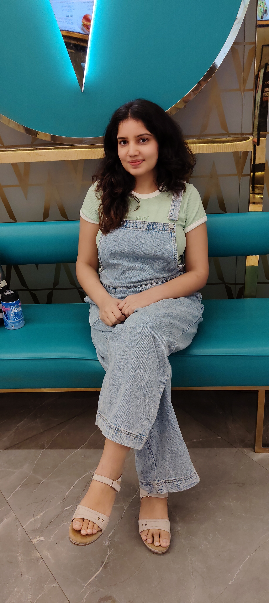

# Neha Rani Deswal

## Intro 1 - Short

Neha is a Software Engineer 2 at Microsoft, where she’s spent over five years on the Azure VMware Solutions team. She specializes in building scalable backend services and core resource provider functionalities that power Azure’s compute platform. Her work leverages modern engineering tools like GitHub Copilot and automation agents, helping drive productivity and innovation across critical cloud infrastructure.

Prior to Microsoft, Neha began her career at Qualcomm, rising to Senior Software Engineer within three years while working on IoT-connected camera technologies. As a mother to a two-year-old, she brings a unique perspective to balancing professional growth with personal life—embodying the evolving role of women in tech today.

## Intro 2 - Expanded

Neha is currently working as a Software Engineer 2 at Microsoft, where she’s been a key part of the Azure VMware Solutions team for over five years. Her work focuses on the compute platform within Azure, where she helps design and build scalable, backend cloud services that power critical infrastructure for customers worldwide.

She works with the latest tech stack in the Azure ecosystem and is deeply involved in building resource provider functionalities, which form the foundation of how Azure delivers services. She also leverages modern engineering tools like GitHub Copilot and automation agents to drive productivity and code excellence.

Before joining Microsoft, Neha began her career at Qualcomm, where she spent nearly three years. Starting through a college placement, she quickly grew into the role of Senior Software Engineer, working in the IoT Connected Camera domain.

With her experience transitioning from a student to a professional in two global tech companies, Neha brings valuable insights into career growth, modern cloud technologies, and the mindset required to thrive in the industry.

Neha is also a mother to a two-year-old, and her journey reflects the growing presence of women in tech who are shaping the future of the industry in their own way.

