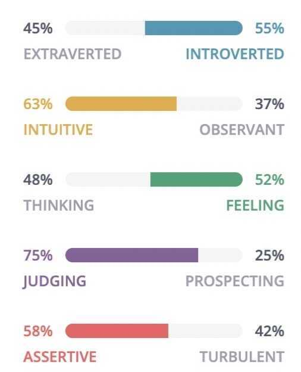

# Personality

## About Me

I change my views and thoughts when presented with new information

## Myers-Briggs Personality

Personality type: **[Advocate (INFJ-A)](https://www.16personalities.com/infj-personality?utm_source=welcome-assertive-advocate&utm_medium=email&utm_campaign=results&utm_content=type-personality-0)**

### Traits

- Introverted - 55%
- Intuitive - 63%
- Feeling - 52%
- Judging - 75%
- Assertive - 58%

Role: Diplomat

Strategy: Confident Individualism

https://www.16personalities.com/profiles/f66cfd172becd

Advocates are quiet visionaries, often serving as inspiring and tireless idealists.

An Advocate (INFJ) is someone with the [Introverted](https://www.16personalities.com/articles/mind-introverted-vs-extraverted), [Intuitive](https://www.16personalities.com/articles/energy-intuitive-vs-observant), [Feeling](https://www.16personalities.com/articles/nature-thinking-vs-feeling), and [Judging](https://www.16personalities.com/articles/tactics-judging-vs-prospecting)personality traits. They tend to approach life with deep thoughtfulness and imagination. Their inner vision, personal values, and a quiet, principled version of humanism guide them in all things.

#### Mind - Introvert

Introverted individuals tend to prefer fewer, yet deep and meaningful, social interactions and often feel drawn to calmer environments.

#### Energy - Intuitive

Intuitive individuals are very imaginative, open-minded, and curious. They value originality and focus on hidden meanings and distant possibilities.

#### Nature - Feeling

Feeling individuals value emotional expression and sensitivity. They place a lot of importance on empathy, social harmony, and cooperation.

#### Tactics - Judging

Judging individuals are decisive, thorough, and highly organized. They value clarity, predictability, and closure, preferring structure and planning to spontaneity.

#### Identity - Assertive

Assertive individuals are self-assured, even-tempered, and resistant to stress. They refuse to worry too much and tend to be self-confident when striving to achieve goals.

### Advocates are one of the most likely personality types to

- ...often feel misunderstood (94%)
- ...feel like helping others gives them purpose (93%)
- ...be humble in victory (93%)
- ...pass along a good opportunity if they thought someone else needed it more (83%)
- ...feel pain just by seeing someone else get hurt (81%)
- ...consider themselves a private person (97%)
- ...encourage their child to follow their passion in life, even if it's unlikely to result in prosperity (95%)
- ...refuse to take any credit for the work they haven't done (83%)
- ...have fears they know are irrational (83%)
- ...know how others are feeling just by looking at them (89%)
- ...stay awake at night thinking about something that upset them during the day (79%)
- ...feel upset they cannot help everyone (88%)
- ...be emotionally attached to their possessions (76%)
- ...re-read an e-mail after sending it (86%)
- ...be afraid of the dark as children (74%)
- ...enjoy "people watching"
- ...say modern human beauty standards are unrealistic
- ...go to great lengths to avoid stress

## high5test

- Strength 1 - Philomath
	- Philomaths love learning. They explore many interests, follow new paths and acquire as much knowledge as possible. They don’t enjoy the company of so-called 'know-it-alls’, people with little curiosity and no desire to explore new ideas.
- Strength 2 - Time Keeper
	- Nothing excites Time Keepers more than meeting a deadline. They enjoy setting up processes, timelines and plans. They may feel confused in chaotic circumstances where neither the outcomes nor the ways to achieve these are clear.
- Strength 3 - Storyteller
	- Storytellers are masters of communication. They like to host events, speak in public and be heard. They suffer in situations where they can’t express themselves through words.
- Strength 4 - Catalyst
	- Catalysts love to get things started and are great at creating momentum in stagnant environments. They have a hard time waiting and so-called ‘wasting time’ when they know they could be moving forward and getting things off the ground.
- Strength 5 - Empathizer
	- Empathizers are great at understanding how people feel and use this sensibility to do good for others. They become frustrated when asked to disregard feelings and focus solely on logic instead.

[Free Strengths Test \| Find Your Character Traits & Personality Types](https://high5test.com/)

## RISC DIGITAL MINDSET

### Resiliency - Adaptability

comfort in uncertainty and unstructured environments
navigating through complexity, volatility, and ambiguity
embracing change, especially when the change isn't our idea
curiosity and growth mind-set
reinventing ourselves as a way of life
learning from failure

### Inner strength - Being your best evolved self

- self-awareness
- open mindedness and inclusion
- courage
- humility - keeps us in touch with all we don't know
- embodying our humanity
- overcoming fear of conflict and risk

### Strategic thinker - Holistic

- creative thinking
- big picture and systems thinking
- customer obsessed
- forward thinker with transformative vision
- ideas based on intuition and insights as well as data and history
- openness to new ideas and possibilities

### Collaborative spirit

- collaborative problem solving
- emotional intelligence
- heart

## Links

[Personality](psychology/personality.md)

[Myers-Briggs Type Indicator - Wikipedia](https://en.wikipedia.org/wiki/Myers%E2%80%93Briggs_Type_Indicator)

[7 Random Ways Advocates (INFJs) Are the Most Extreme Personality Type | 16Personalities](https://www.16personalities.com/articles/7-random-ways-advocates-infjs-are-the-most-extreme-personality-type)

[It’s Hard for an Advocate (INFJ) to Truly Love Their Work Without… | 16Personalities](https://www.16personalities.com/articles/its-hard-for-an-advocate-infj-to-truly-love-their-work-without)
