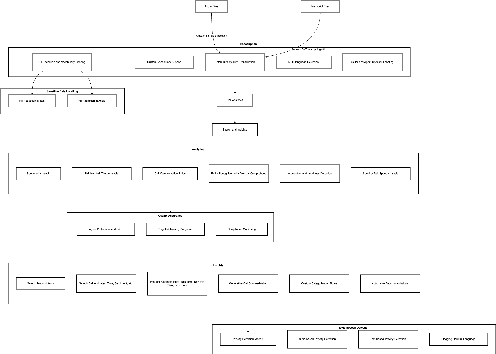

# AI Powered Call Quality Monitoring

## Overview

This solution document details the architecture and technical implementation of an AI-powered call quality monitoring system. The system provides end-to-end capabilities to process call recordings from existing contact centers, delivering actionable insights such as sentiment analysis, call transcription, categorization, and post-call analytics.

## High-Level Architecture Diagram

[GitHub - aws-samples/amazon-transcribe-post-call-analytics](https://github.com/aws-samples/amazon-transcribe-post-call-analytics)

## Components

https://drive.google.com/file/d/1m1S1eTfrySq2AauD4gNb5eByDW9pyfxU/view?usp=drive_link

1. **Source Input Data**
	1. Audio Files: Delivered to an ingestion location in Amazon S3.
	2. Transcript Files: Generated by Amazon Transcribe and stored in S3.
2. **Transcription**
	1. Batch processing of audio files using Amazon Transcribe.
	2. **Features include:**
		1. Custom vocabulary for domain-specific terminology.
		2. PII redaction and vocabulary filtering.
		3. Multi-language support with automatic detection.
		4. Caller and agent speaker labels using speaker diarization or channel identification.
3. **Data Processing & Enrichment**
	1. **Sentiment Analysis:** Detects caller and agent sentiment trends.
	2. **Talk & Non-Talk Time:** Measures speaking and silence intervals.
	3. **Interruption Detection:** Identifies overlapping speech.
	4. **Entity Detection:** Uses Amazon Comprehend for extracting entities.
	5. **Loudness Analysis:** Normalized loudness metrics for both parties.
4. **Analytics Engine**
	1. Provides insights such as:
		1. Sentiment trends.
		2. Call categorization based on keywords, sentiment, and interruptions.
		3. Issue detection using pre-built ML models.
	2. Generates summaries for key call information.
5. **Search Index**
	1. Indexes call attributes such as time range, sentiment, entities, and transcription for efficient search capabilities.
6. **Dashboards & Reporting**
	1. Visualizations include:
	2. Call trends (sentiment, loudness, interruptions).
	3. Training insights for quality assurance.
	4. Adherence to compliance standards.

## Technical Details

### Data Flow

1. **Ingestion**
	1. Audio and transcript files are uploaded to Amazon S3 buckets.
	2. Notifications (using S3 events) trigger processing workflows via AWS Lambda or Step Functions.
2. **Transcription**
	1. Audio files are processed using Amazon Transcribe.
	2. Transcriptions are stored in S3 for further processing.
3. **Processing Pipeline**
	1. AWS Glue processes transcripts and audio metadata.
	2. Sentiment analysis and entity detection are performed using Amazon Comprehend.
	3. Custom categorization is applied based on business rules.
4. **Storage**
	1. Processed data is stored in Amazon RDS or DynamoDB for structured queries.
	2. Elasticsearch or OpenSearch is used for indexing and search.
5. **Analytics & Reporting**
	1. Amazon QuickSight provides dashboards for real-time monitoring.
	2. Reports can be exported to PDF or CSV formats.

### Key AWS Services

- **Amazon S3:** For audio and transcript storage.
- **Amazon Transcribe:** For audio-to-text conversion.
- **Amazon Comprehend:** For NLP tasks such as sentiment and entity analysis.
- **Amazon RDS/DynamoDB:** For structured data storage.
- **Amazon OpenSearch:** For search indexing and querying.
- **AWS Glue:** For ETL processes.
- **Amazon QuickSight:** For analytics and reporting.
- **AWS Lambda:** For event-driven processing.

## Features

### Call Characteristics

- **Interruption Detection:** Identifies interruptions during calls.
- **Talk Time & Speed:** Measures speech duration and words per minute.
- **Loudness Analysis:** Detects yelling or speaking softly.
- **Non-Talk Time:** Tracks periods of silence.

### Generative Summarization

- Automatically summarizes calls, highlighting key issues, resolutions, and next steps.

### Toxic Speech Detection

- Flags abusive or harmful speech using pitch, tone, and content analysis.

### Scalability & Performance

- **Auto-scaling:** Leverages AWS Lambda and Step Functions for variable call volumes.
- **Data Partitioning:** Ensures performance across large datasets using DynamoDB partitioning.
- **Monitoring:** Uses AWS CloudWatch for real-time system monitoring.

### Security

- **PII Redaction:** Ensures sensitive information is removed from transcripts and audio.
- **Encryption:** S3 buckets and databases use server-side encryption.
- **Access Control:** Managed via IAM roles and policies.

## Conclusion

This AI-powered call quality monitoring system provides a robust, scalable, and secure solution for deriving actionable insights from call data. Leveraging AWS services, it ensures efficient processing, accurate analytics, and seamless integration with existing contact center workflows.

## Call Transcribing

"Call transcribing" refers to the process of converting a recorded phone conversation into written text, while "quality assurance" in this context means the practice of reviewing those transcribed calls to ensure accuracy and adherence to quality standards, often used to evaluate customer service interactions and agent performance within a company.

Key points about call transcribing and quality assurance:

### Purpose

Companies often record customer service calls for quality assurance, which involves transcribing the conversation to review details like agent responses, issue resolution, and adherence to company policies.

### Benefits

- **Agent training:** Transcripts can be used to identify areas where agents need improvement in communication skills or product knowledge.
- **Customer experience evaluation:** Analyzing transcripts allows companies to assess customer satisfaction and identify potential issues.
- **Compliance checks:** In industries with strict regulations, call transcripts can be used to verify compliance with legal requirements.

### Quality assurance process

- **Sampling:** A representative sample of calls is selected for transcription.
- **Transcription:** The audio is converted into written text, ensuring accuracy and capturing key details like pauses and tone of voice.
- **Review and evaluation:** Quality assurance specialists review the transcripts against established criteria, assessing aspects like agent greetings, problem-solving techniques, and overall professionalism.

### Real-Time Factor (RTF)

The **real-time factor (RTF)** is the ratio of the processing (or transcription) time to the actual duration of the audio. In other words, it measures how fast a system processes audio relative to real time. An RTF less than 1 means the system is faster than real time.

**Example:**

Suppose an AI tool transcribes a 1‑minute (60‑second) call in 1 second. Here, the RTF is:

  RTF = Processing Time / Audio Duration = 1 sec / 60 sec = 1/60

This indicates that the system is 60 times faster than real time. If you have a call lasting x minutes and the system transcribes it in x seconds, the RTF remains 1/60, meaning it delivers the transcript at 60× real-time speed.

This fast turnaround is particularly valuable in call quality monitoring, where near real‑time feedback can help promptly address issues or monitor performance.

## Tools

- [Amazon Transcribe](cloud/aws/ai/amazon-transcribe.md)
- [AI for Call Center Quality Assurance \| Voxjar](https://voxjar.com/)
	- [app.voxjar.com/dashboard](https://app.voxjar.com/dashboard)
- [Convin: Omnichannel Contact Centers Powered By Conversation Intelligence](https://convin.ai/)
	- [Kicking Off 2024 on a High: Convin Ranked as G2's #1 Speech Analytics Solution](https://convin.ai/news-collection/g2-rank-speech-analytics-category)
	- [Call Center Monitoring Software | Convin](https://convin.ai/products/call-center-monitoring-software)
- [Quality Assurance Software for Contact and Call Centers](https://thelevel.ai/quality-assurance-contact-center/)
- [Call Quality Monitoring Software with 100% AI \| Chatterscore](https://trellissoft.ai/products/chatterscore/)
- [AI-Powered Quality Management and Performance Monitoring in Call Centers 1](https://callcenterstudio.com/blog/ai-powered-quality-management-and-performance-monitoring-in-call-centers/)
- [10 Best Call Monitoring Software in 2024 - Enthu AI](https://enthu.ai/blog/call-center-quality-monitoring-software/)
- [GitHub - jiaaro/pydub: Manipulate audio with a simple and easy high level interface](https://github.com/jiaaro/pydub)

## Speech to text Model - Whisper / Voice to Text / Audio to Text

- [openai/whisper-large-v3 · Hugging Face](https://huggingface.co/openai/whisper-large-v3)
- Whisper is a general-purpose speech recognition model. It is trained on a large dataset of diverse audio and is also a multitasking model that can perform multilingual speech recognition, speech translation, and language identification.
- [GitHub - openai/whisper: Robust Speech Recognition via Large-Scale Weak Supervision](https://github.com/openai/whisper)
- [GitHub - petewarden/spchcat: Speech recognition tool to convert audio to text transcripts, for Linux and Raspberry Pi.](https://github.com/petewarden/spchcat)
- [The best dictation and speech-to-text software \| Zapier](https://zapier.com/blog/best-text-dictation-software/)
- [REGAL \| The AI Agent Platform](https://www.regal.ai/)
- [LiveKit](https://livekit.io/)
- [Demo \| GigaML](https://demo.gigaml.com/)
- [Teneo.ai \| Make Your AI Agent the Smartest](https://www.teneo.ai/)
- [Build Chat and Voice AI Agents Without Code \| Voiceflow](https://www.voiceflow.com/)

## Text to Voice

- [Voicemaker® - Text to Speech Converter](https://voicemaker.in/)
- [Bring Agents and Creative to Life with our AI Voice Generator](https://elevenlabs.io/)

### [GitHub - freddyaboulton/fastrtc: The python library for real-time communication](https://github.com/freddyaboulton/fastrtc)

Turn any python function into a real-time audio and video stream over WebRTC or WebSockets.

- 🗣️ Automatic Voice Detection and Turn Taking built-in, only worry about the logic for responding to the user.
- 💻 Automatic UI - Use the `.ui.launch()` method to launch the webRTC-enabled built-in Gradio UI.
- 🔌 Automatic WebRTC Support - Use the `.mount(app)` method to mount the stream on a FastAPI app and get a webRTC endpoint for your own frontend!
- ⚡️ Websocket Support - Use the `.mount(app)` method to mount the stream on a FastAPI app and get a websocket endpoint for your own frontend!
- 📞 Automatic Telephone Support - Use the `fastphone()` method of the stream to launch the application and get a free temporary phone number!
- 🤖 Completely customizable backend - A `Stream` can easily be mounted on a FastAPI app so you can easily extend it to fit your production application. See the [Talk To Claude](https://huggingface.co/spaces/fastrtc/talk-to-claude) demo for an example on how to serve a custom JS frontend.
