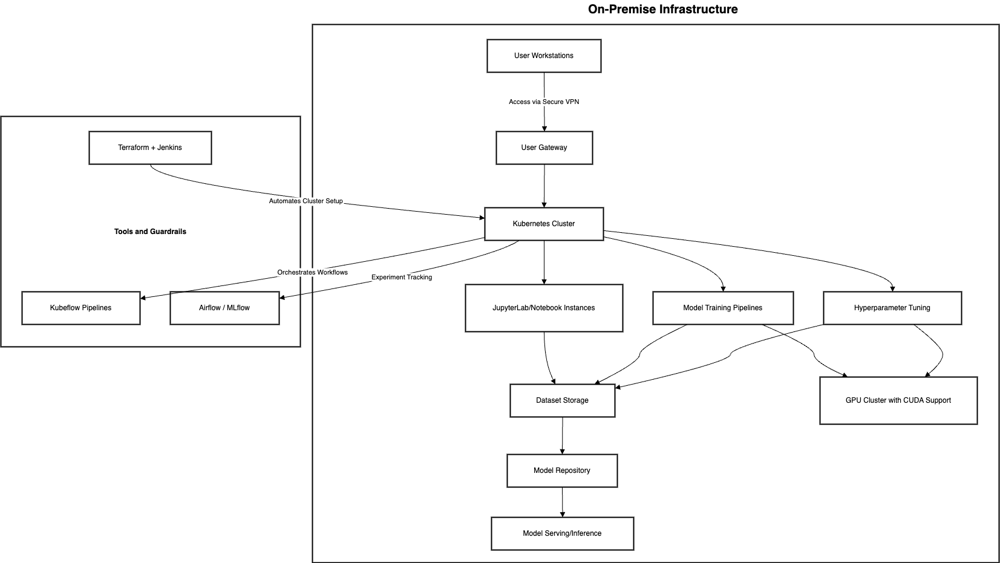

# On-Premise MLOps Platform

This document outlines the architecture and components of an on-premise MLOps platform for a cell detection system. The platform is designed to enable multiple users to train, tune, and deploy machine learning (ML) models securely and efficiently using a shared dataset. The architecture supports secure isolation for users, incorporates guardrails for compliance and right resource usage, and leverages state-of-the-art tools and technologies to ensure scalability and performance.

## High-Level Requirements

1. **User Isolation**: Each user operates in an isolated environment.
2. **Dataset Sharing**: A central repository for a shared dataset of 1000-2000 human cell images.
3. **Scalability**: Horizontally scalable infrastructure to accommodate up to 8-10 users per system.
4. **GPU Support**: CUDA-enabled GPUs for efficient training and hyperparameter tuning.
5. **Security**: VPN access, role-based access controls (RBAC), and data encryption.
6. **MLOps Features**:
    - Experiment tracking
    - Model management and repository
    - Automated hyperparameter tuning
    - Workflow orchestration
7. **On-Premise Deployment**: Ensures compliance with local data privacy and security requirements.

## Architecture Diagram

The architecture consists of the following layers:

1. **User Interface Layer**
2. **Compute and Orchestration Layer**
3. **Data Management Layer**
4. **Model Deployment and Serving Layer**

https://drive.google.com/file/d/1k1ZNZ_1UO-cFdyQ9IVlCPhFpYzJDL3gF/view?usp=drive_link

### Components Overview

- **User Workstations**: Access via secure VPN.
- **Kubernetes Cluster**: Manages isolated namespaces and workloads.
- **JupyterLab/Notebooks**: Interactive environments for experimentation.
- **Kubeflow Pipelines**: Orchestrates workflows.
- **MLflow**: Tracks experiments and manages models.
- **GPU Cluster**: Enables high-performance training.
- **Dataset Storage**: Centralized repository for images.
- **Model Repository**: Stores trained models for deployment.
- **Terraform + Jenkins**: Automates infrastructure setup.

## Component Details

### 1. User Workstations

- **Purpose**: Provide data scientists with secure access to the platform.
- **Key Features**:
    - Access via secure VPN.
    - Interface with JupyterLab for experimentation.
    - RBAC ensures controlled access.

### 2. Kubernetes Cluster

- **Purpose**: Core orchestration layer for resource allocation and isolation.
- **Technologies**:
    - Kubernetes for container orchestration.
    - Namespace isolation for user environments.
- **Key Features**:
    - Auto-scaling to handle increased workloads.
    - Secure communication within the cluster.

### 3. JupyterLab/Notebooks

- **Purpose**: Provide an interactive workspace for data scientists.
- **Technologies**: Dockerized JupyterLab instances.
- **Key Features**:
    - Pre-installed libraries (TensorFlow, Keras, etc.).
    - Isolated environments for each user.

### 4. Dataset Storage

- **Purpose**: Centralized storage for shared datasets.
- **Technologies**: Network-attached storage (NAS) with encryption.
- **Key Features**:
    - Access control for user security.
    - High availability and redundancy.

### 5. GPU Cluster

- **Purpose**: Accelerate model training and hyperparameter tuning.
- **Technologies**: CUDA-enabled GPUs.
- **Key Features**:
    - Resource allocation based on user workloads.
    - Integrated with Kubernetes for scaling.

### 6. Kubeflow Pipelines

- **Purpose**: Orchestrate ML workflows.
- **Key Features**:
    - Automates data preprocessing, training, and evaluation.
    - Logs and monitors pipeline runs.

### 7. MLflow

- **Purpose**: Manage experiments, track metrics, and store models.
- **Key Features**:
    - Experiment tracking with metrics visualization.
    - Model versioning for reproducibility.

### 8. Model Repository

- **Purpose**: Store and manage trained models.
- **Technologies**: S3-compatible object storage or MinIO.
- **Key Features**:
    - Support for TensorFlow and Keras models.
    - Integration with model deployment tools.

### 9. Terraform + Jenkins

- **Purpose**: Automate the deployment and management of infrastructure.
- **Key Features**:
    - Terraform for infrastructure as code (IaC).
    - Jenkins for CI/CD pipelines.

### 10. Model Serving/Inference

- **Purpose**: Deploy models for production use.
- **Technologies**: TensorFlow Serving, FastAPI.
- **Key Features**:
    - RESTful API for real-time inference.
    - Scalable deployment using Kubernetes.

## Security Measures

- **VPN Access**: Ensures secure access to the platform.
- **RBAC**: Role-based access controls for fine-grained permissions.
- **Data Encryption**: Encrypt sensitive datasets at rest and in transit.
- **Namespace Isolation**: Isolate user environments in Kubernetes.

## Workflow

1. **Data Preparation**:
    - Users upload data to the shared storage.
    - Preprocessing pipelines prepare data for training.
2. **Model Training**:
    - Users launch training jobs using JupyterLab.
    - Kubernetes schedules GPU resources for training.
3. **Hyperparameter Tuning**:
    - Leverage Kubeflow Pipelines for automated tuning.
4. **Experiment Tracking**:
    - Users log metrics and parameters in MLflow.
5. **Model Deployment**:
    - Trained models are stored in the repository.
    - Deployed using TensorFlow Serving or FastAPI.

## Scalability and Future Enhancements

- **Horizontal Scaling**: Add more nodes to the Kubernetes cluster.
- **Additional Tools**: Integrate advanced tools like SageMaker for hybrid workloads.
- **Federated Learning**: Enable collaboration across multiple locations.

## Conclusion

This architecture provides a robust, secure, and scalable on-premise MLOps platform tailored for cell detection systems. The integration of modern tools ensures efficiency while maintaining high security and user isolation.
