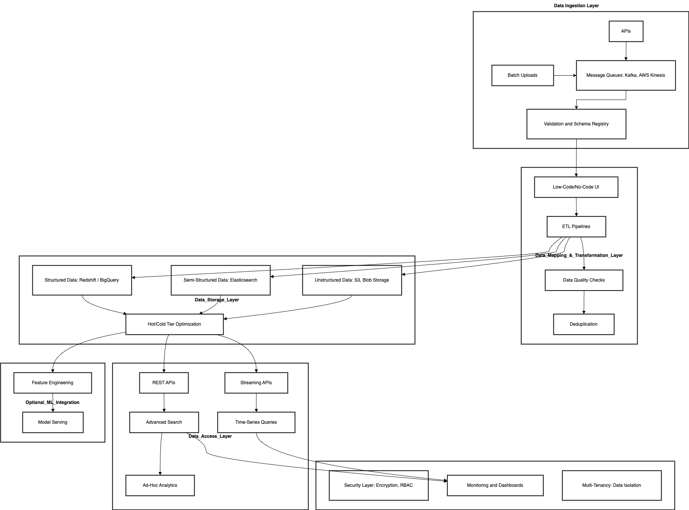

# Cloud Based SAAS Data Platform

## Question

### Scenario

Developing a Cloud-Based SaaS Data Platform. The platform will serve diverse clients, such as e-commerce businesses, healthcare providers, factories, and financial institutions needing scalable, secure, and efficient data handling.

### Problem Statement

Design and develop an architecture for a cloud-based SaaS data platform that offers a service to ingest, map, store, and secure large-scale datasets.

### Requirements

1. Data Ingestion:
	1. Support real-time ingestion of data streams from APIs, message queues, and batch uploads.
	2. Data formats include JSON, CSV, XML, and Parquet.
	3. Ensure data validation during ingestion and handle schema evolution for dynamic datasets.
2. Data Mapping and Transformation:
	1. Allow users to define mappings between raw data fields and standardised formats through a no-code/low-code UI.
	2. Implement ETL pipelines that scale for both real-time and batch data processing.
	3. Include data quality checks and deduplication mechanisms.
3. Data Storage:
	1. Use a scalable cloud-based storage solution that supports structured, semi-structured, and unstructured data.
	2. Optimise for query performance, ensuring low-latency access to frequently used datasets.
4. Data Retrieval
	1. Provide REST and Streaming APIs for data access.
	2. Implement advanced search capabilities with filters and aggregation functions.
	3. Support time-series queries and ad-hoc analytics.
5. Non-Functional Requirements
	1. Scalability: Scale horizontally to handle millions of transactions per second.
	2. Security: Implement end-to-end encryption, user authentication, and role-based access control.
	3. Cost Optimization: Use serverless or autoscaling architectures to optimise cost for varying workloads.
	4. High Availability: Ensure 99.9% uptime with disaster recovery mechanisms.
6. Additional Features
	1. Multi-Tenancy: Isolate data and configurations for different clients.
	2. Monitoring & Logging: Include comprehensive dashboards for monitoring system health and debugging issues.
	3. Compliance: Ensure compliance with data regulations like GDPR, HIPAA, and CCPA.
7. Stretch Goal (Optional)
	1. Describe how your platform could integrate with ML workflows, such as automated feature engineering or model serving.

### Deliverables

1. High-level block diagram detailing the data flow and key components.
2. Choice of cloud services (e.g., AWS, Azure, or GCP) with justification for each.
3. Explanation of how you would handle:
	1. Data schema evolution.
	2. Scaling challenges.
	3. Ensuring data security.
4. (Optional) Brief discussion of trade-offs made in the design.

## Solution

### 1. High-Level Block Diagram

https://drive.google.com/file/d/1Kk1_INbeBsGtxDgAVCBjlUDcSLd-B2_D/view?usp=drive_link

### 2. Data Flow Overview

1. Data Ingestion Layer:
	- Real-time data ingestion: APIs, Message Queues (e.g., Kafka, AWS Kinesis).
	- Batch ingestion: Bulk uploads (via SFTP, HTTP endpoints, etc.).
	- Validation and Schema Registry.
2. Data Mapping & Transformation Layer:
	- Low-code/no-code UI for data mapping.
	- Scalable ETL pipelines (real-time and batch).
	- Data quality checks and deduplication.
3. Data Storage Layer:
	- Storage for structured, semi-structured, and unstructured data.
	- Query-optimized storage for frequent access (e.g., hot and cold storage tiers).
4. Data Access Layer:
	- REST APIs for CRUD operations.
	- Streaming APIs for real-time data access.
	- Advanced search and analytics (e.g., filters, aggregations, time-series queries).
5. Supporting Components:
	- Security Layer: Authentication (OAuth2, JWT), role-based access control, and encryption.
	- Monitoring & Logging: Real-time dashboards, alerts, and audit trails.
	- Multi-Tenancy: Data isolation per client via namespace or account-level separation.
	- Compliance Manager: Validation against regulations (e.g., GDPR, HIPAA).

### 3. Choice of Cloud Services

- Compute:
	- AWS Lambda / GCP Cloud Functions / Azure Functions for serverless ingestion and transformation.
	- AWS Fargate / GCP Cloud Run for containerized microservices (batch jobs or long-running tasks).
- Data Ingestion:
	- AWS Kinesis / GCP Pub/Sub / Azure Event Hubs for real-time data streams.
	- APIs: API Gateway (AWS, GCP, or Azure) for ingesting RESTful data.
	- Batch uploads: AWS S3 / GCP Cloud Storage / Azure Blob Storage for bulk files.
- Data Storage:
	- AWS S3 / GCP Cloud Storage / Azure Blob Storage for unstructured data.
	- AWS Redshift / GCP BigQuery / Azure Synapse for structured and semi-structured data.
	- Elasticsearch / OpenSearch for advanced search capabilities.
	- AWS DynamoDB / GCP Firestore for metadata or key-value pairs.
- Data Transformation:
	- Apache Spark on EMR / Dataproc / Azure HDInsight for large-scale ETL.
	- Schema evolution: AWS Glue Schema Registry / Confluent Schema Registry.
- Data Access:
	- AWS API Gateway / GCP Endpoints / Azure API Management for REST APIs.
	- Kinesis Data Analytics / Apache Flink for real-time streaming analytics.
- Security:
	- Encryption: AWS KMS / Azure Key Vault / GCP KMS.
	- IAM: Role-based access control with cloud-native tools.
	- Audit: AWS CloudTrail / Azure Monitor / GCP Operations Suite.
- Monitoring & Logging:
	- AWS CloudWatch / GCP Operations Suite / Azure Monitor.
	- Prometheus and Grafana for custom dashboards.

### 4. Handling Specific Challenges

#### Data Schema Evolution

- Implement a schema registry (AWS Glue Schema Registry or Confluent Schema Registry).
- Use versioning to support backward compatibility.
- Dynamically validate and transform incoming data based on schema versions.

#### Scaling Challenges

- Use autoscaling for serverless services like AWS Lambda or Kubernetes.
- Partitioning and sharding strategies for message queues and databases.
- Design storage with hot/cold tiering for cost efficiency and scalability.

#### Ensuring Data Security

- End-to-end encryption: Encrypt data at rest and in transit (e.g., TLS, AES-256).
- Role-based access control: Use cloud-native IAM services.
- Secure data isolation with namespaces for multi-tenancy.

### 5. Integration with ML Workflows

- Feature Engineering:
	- Use ETL pipelines to automate feature extraction (e.g., AWS Glue + SageMaker).
- Model Serving:
	- Host pre-trained models with SageMaker Endpoints / Vertex AI / Azure ML.
- Integration:
	- Enable seamless access to processed data for ML workflows via APIs.
	- Automate data labeling and validation using services like AWS Rekognition or custom ML pipelines.

### 6. Trade-Offs

- **Serverless vs. Containerized Services:** Serverless solutions reduce operational overhead but may have execution time limits; containers provide more control for long-running tasks.
- **Hot/Cold Storage Optimization:** Improves cost efficiency but may introduce latency for accessing cold storage.
- **Schema Evolution Complexity:** Adds design overhead but ensures flexibility for clients with diverse and changing datasets.
