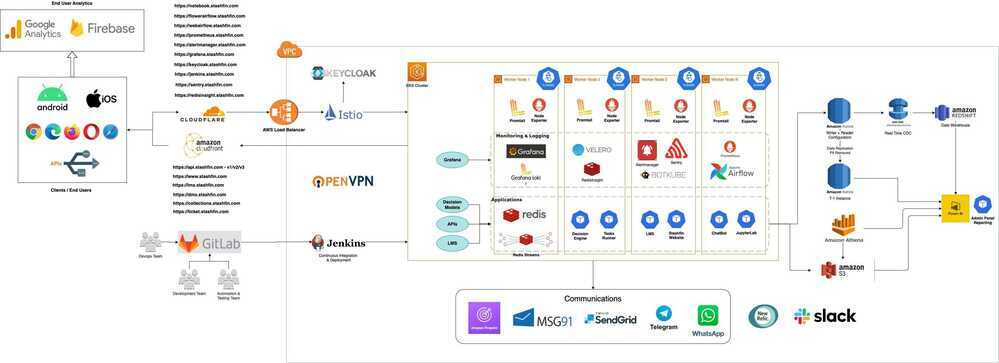

# Stashfin Tech Stack / Infra

## Stashfin Infra Diagram

## Tech Stack

1. Languages
    - Backend - PHP, Python
    - Frontend - HTML, CSS, JS, React
    - Android - Java + Kotlin, Firebase
    - iOS - Swift + Objective C
    - Libraries - Pandas, Numpy (other AI models and libraries)
2. Frameworks - CodeIgniter 3 for PHP, Flask/FastAPI and Django for Python
3. Unit Testing - Phpunit for PHP, Pytest for Python
4. Databases - Aurora MySQL (OLTP), Redshift (OLAP), Redis (Caching and Queueing), S3 (blob storage) + Athena (Query layer on top of S3)
5. Architecture - Microservices and Event Driven, REST Based
6. Testing and QA Tools - Postman, Appium, Selenium
7. DevOps - Docker, Kubernetes, Helm, Jenkins, Airflow, Prometheus + Grafana + Loki, Newrelic, Sentry, AWS (Cloud Provider)
8. BI Tool - PowerBI
9. Dev Tools - VSCode, Gitlab (git - VCS), Slack/Google Chats

## Kubernetes EKS Infra / Stashfin Infrastructure and DevOps

### Deployment Infra

- Helm package management (client) - Updates - Whatup
- Kubernetes Manifests
- Jenkins (CICD)
     1. Pipeline
     2. Self service CICD

### AWS

- VPCs
- S3 - Athena
- IAM
- EC2
- Spot Instances
- Savings plan
- Elastic Container Registry (ECR)
- Pinpoint - AWS Firehose for delivery metrics
- EKS
- ELB (Classic LoadBalancers)
- Amazon Rekognition
- Amazon Textract
- Amazon Transcribe

### Databases

- Redshift
- Aurora (RDS)
- Redis
     1. RedisInsight
     2. Redis Streams
- DynamoDB
- S3 (Blob storage)

### Airflow

- Postgres
- Airflow web
- Airflow flower
- Celery Workers
- Kubernetes Executor

### Others Used

1. CloudFlare
2. GitLab
3. Kubernetes - Kubernetes Dashboard / BotKube
4. Istio - Keycloak
5. Sentry (Error Tracking)
6. cert-manager and LetsEncrypt
7. NewRelic (Application Performance Monitoring APM)
8. Prometheus
9. Alertmanager
10. Grafana
11. Locust (load testing)
12. Application and Web Servers
    - Nginx
    - Apache
    - Gunicorn
13. Application Development
    - Precommit
    - Crashlytics
14. Testing
    - Selenium
    - Appium
    - Postman Runners (newman)
15. Languages used
    - PHP (Codeigniter)
    - Java + Kotlin (Android)
    - Python (Fast API / Django / Flask)
    - Javascript (React)
16. OpenVPN
17. JupyterLab
18. Analytics
    - PowerBI
    - Firebase
    - SonarQube
19. Velero - Disaster Recovery
20. Deployment Strategies
    - Blue/Green
    - Canary
    - A/B
    - Mirroring
21. ExternalDNS

### Others Alternatives POC

1. TICK
    - InfluxDB (device health monitoring)
    - InfluxDB (server health monitoring)
    - Kapacitor
    - Chronograf
    - Telegraf
2. Kong (dbless)
3. Konga
4. Vernemq (mqtt broker)
5. Druid - Zookeeper

## Fintech Tools

- perfios
- cibil
- Equifax
- razorpay
- [White-Label FinTech Solutions: Neobank|Ewallet|Payments | SDK.finance](https://sdk.finance/)
