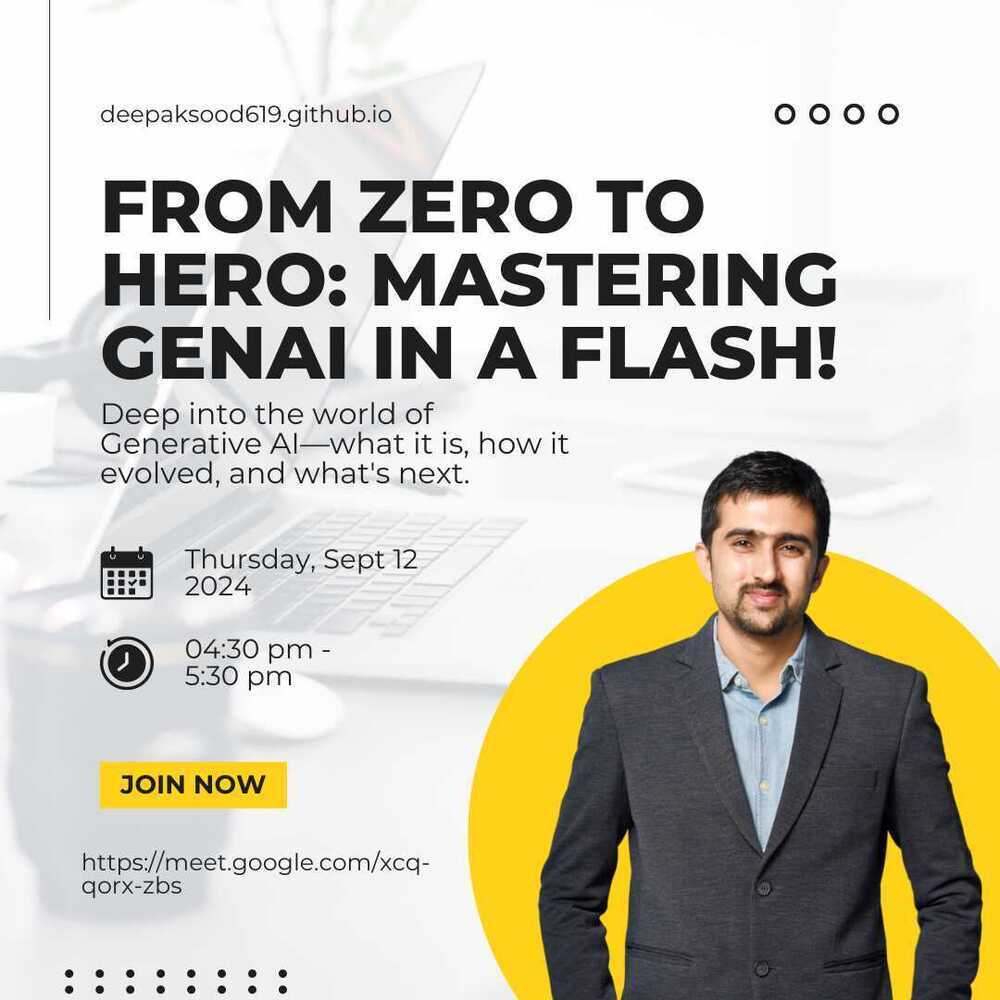

# Achievements / Activities / Awards

## Achievements

### Stashfin

Scaled the stack and business from Rs. 100M p.m. (10 crore) disbursals to Rs. 5000M p.m. (500 crore) disbursals

### Zenatix

I was responsible of creating a product and infrastructure around it to help save energy at a very large scale. I ported the legacy monolith software to microservices architecture adding observability and instrumentation in the process.

### Brilliant 100 day summer challenge

- Total - 100
- Attempted - 93
- Correct - 54
- https://drive.google.com/file/d/0B1jHFoEHN0zfRWpUTC1zbG0tWnM/view?usp=sharing

### Regex Crossword (Oct'17 - Nov'17)

- Regular Expressions Game
- https://github.com/deepaksood619/RegexCrossword/blob/master/README
- Profile - https://regexcrossword.com/players/38485
- Stats - https://regexcrossword.com/stats

## Activities

### Data Structures for Interview - UnsaidTalks (30 November 2024)

### Meetup Talk - Real-Time Data Warehousing Solution with AWS and Confluent Cloud - OpsTree Solutions (23 November 2024)

- Presentation - [Real-Time Data Warehousing Solution with AWS and Confluent Cloud ​](https://docs.google.com/presentation/d/118S2du_m7mJ2WFsbwtmFuLz6NApfblv-FmbBE3XQ6PU/edit?usp=sharing)
- Recording - https://www.youtube.com/live/7NqLTGKFK0c
- **Session 1**
	- How to Build a Data Streaming Platform: Introduction to Stream Processing & Stream Governance with Kafka and Flink  
	- Speaker: Diptiman Raichaudhuri , Staff Developer Advocate, Confluent  
- **Session 2**
	- Real-Time Data Warehousing Solution with AWS and Confluent Cloud  
	- Speakers: Deepak Sood (Senior AI, Data & DevOps Architect) and Ramneek Kaur (Experienced Data Engineer), OpsTree Solutions

#### Questions

- Latency of insert of a single message to Kafka - 20ms
- Networking - Is it like a socket connection for producer, or creates new connection everytime?
- Exactly once processing
- Kafka connect vs Flink for connectors vs Kafka Streams
- Spark Streaming vs Kafka Streams vs Flink vs ksqldb
- Flink - kappa architecture
- Apache Hudi (aws) vs Delta Lake (databricks) vs **Apache Iceberg** (confluent, snowflake) vs OTF (open table format)
- Parquet vs ORC vs Avro
- OCC - Iceberg (Optimistic Concurrent)
- Benchmarketing
- Apache Calcite
- flink copies data from Kafka topic to dynamic table?
	- rocks db
	- So flink is not stateless, since it keeps in-memory
	- flink node manager
	- RMA - Rolling moving average
	- Tumbling window
	- Session window
	- Hoping window
	- Flink SQL - ANSI SQL?
- **Alerting with Flink and Kafka**
- flink behind working? - how upserts work? filesystem or database table
- **Schema management - how it works?**
	- Data Streaming Platform - DSP
	- Schema Registry
		- Schema
		- Data Validation
		- Data Quality Rules
	- Data Portal (Data Product / Data Catalog)
		- Search Lineage - Tag
		- Metadata - RBAC
		- Browse Data Assets
	- This Data Streaming Platform - DSP Confluent
	- Tableflow (Iceberg - Polaris - for data catalogue, metadata, RBAC)
	- Data Quality Rules - ?
	- Avro for Schema Registry
	- **Avro vs Protobuf vs JSON vs Thrift
		- Thrift not used anymore
- Common expression language
- Stream lineage
- Hive - no acid compliant read - Pig - not used anymore
- Query engine - Presto, **Trino** (very good), duckdb
- Pino (real time queries) vs clickhouse
- **How to keep up with these technologies**
- Flink table is append only mode
- Kafka producer and consumer has so many configuration

[Deepak Sood on LinkedIn: #dataengineering #apachekafka #eventstreaming #aws #confluentcloud…](https://www.linkedin.com/posts/deepaksood619_dataengineering-apachekafka-eventstreaming-activity-7266173593120567296-9RHY?utm_source=share&utm_medium=member_desktop)

[Deepak Sood on LinkedIn: #datastreaming #realtimedata #opstreemeetup #devops #community…](https://www.linkedin.com/feed/update/urn:li:share:7262934586911793153/)

[Deepak Sood on LinkedIn: #dataengineering #apachekafka #confluentcloud #realtimedata…](https://www.linkedin.com/posts/deepaksood619_theres-still-time-to-join-us-in-november-activity-7264225882469208064-xl9V)

[Buildpiper - By Opstree on LinkedIn: Apache Kafka x OpsTree](https://www.linkedin.com/posts/buildpiper_apache-kafka-x-opstree-activity-7265250832239992832-p2NJ?utm_source=share&utm_medium=member_desktop)

### Podcast - Streamlining Cloud Migration Through Data Engineering

[Podcast - Streamlining Cloud Migration Through Data Engineering](about-me/projects/46-podcast-streamlining-cloud-migration-through-data-engineering.md)

### NIT Delhi - GenAI for Freshers (18 September 2024)

Slides - [Unleash your inner innovator: GenAI for freshers](https://docs.google.com/presentation/d/11YL2HG7wLR2eLiG9Np4NuXJ8LpPoMrtQztb9hpRRkq8/edit?usp=drive_link)

Proportion of students - 1st year + 2nd year (70%), 3rd + 4th year (30%)

[Deepak Sood on LinkedIn: #genai #techforfreshers #aiinnovation #careermoves #nitdelhi](https://www.linkedin.com/posts/deepaksood619_genai-aiinnovation-nitdelhi-activity-7241120393694994433-jsdz?utm_source=share&utm_medium=member_desktop)

### OpsTree Tech Talk (12 September 2024 & 19 September 2024)

Slides - [From Zero to Hero: Mastering GenAI in a Flash](https://docs.google.com/presentation/d/1lPKz7SGSEKQ0z_2TqQGcNULBLrRgjRQ-R7rDTSHYb8w/edit?usp=sharing)

🚀 Ready to level up your AI game? Join us today from 4:30-5:30 for an exciting OpsTree Tech Talk: **"From Zero to Hero: Mastering GenAI in a Flash!"**

Presented by **Deepak Sood**, Senior AI, Data & DevOps Architect, this session will take you deep into the world of **Generative AI**—what it is, how it evolved, and what's next. We'll cover:

- **Prompt Engineering**
- The magic of **LLMs (Large Language Models)**
- **Embeddings** and their power
- **RAGs (Retrieval-Augmented Generation)** to supercharge your AI!

Get ready to go from **zero to GenAI hero**!
🕓 **4:30-5:30 PM**

### Mentorship - Unsaid Talks (22 August 2024)

[UnsaidTalks on LinkedIn: #unsaidtalks #mentorshipprogram #techcareers #careerguidance…](https://www.linkedin.com/posts/unsaidtalks_unsaidtalks-mentorshipprogram-techcareers-activity-7232001433175216129-Eff-?utm_source=share&utm_medium=member_desktop)

[Deepak Sood on LinkedIn: #mentorship #techcareers #generativeai #dataengineering…](https://www.linkedin.com/posts/deepaksood619_unsaidtalks-mentorshipprogram-techcareers-activity-7239180561490026496-VlRf?utm_source=share&utm_medium=member_desktop)

[High-Level Overview of CS Domains](https://docs.google.com/spreadsheets/d/1Ojy0rC60r5FrBOpmwkwXdL_F8lKUieDpWu_SGWE-rx8/edit?usp=sharing)

### GenAI Hands-on Workshop 'From Zero to Hero: Mastering GenAI in a Flash' - SRM-IST (2 September 2024)

Slides - [From Zero to Hero: Mastering GenAI in a Flash](https://docs.google.com/presentation/d/1go_DXxBZlhyr1Ap8QIQhXseCFTgKYJ4Obk8dHaJ8ZIk/edit?usp=sharing)

- Zero to Hero: Master GenAI from the ground up.
- Hands-On Learning: Dive into practical exercises.
- Hackathon: Test your skills in a live challenge.

"From Zero to Hero: Mastering GenAI in a Flash" is your one-stop session to dive deep into the world of Generative AI. We'll start by exploring **what GenAI is**, the **problems it solves**, and **where it all began**—taking you through its evolution. Then, we’ll glimpse into the **future of GenAI** and what’s on the horizon. In the technical deep dive, we’ll cover **prompt engineering**, the power of **LLMs (Large Language Models)**, the magic of **embeddings**, and how to supercharge your AI with **RAGs (Retrieval-Augmented Generation)**. It’s everything you need to go from zero to hero in GenAI!

[Deepak Sood on LinkedIn: #genai #aiworkshop #futuretalent #innovation #hackathon #srmist…](https://www.linkedin.com/posts/deepaksood619_genai-aiworkshop-futuretalent-activity-7237536731544051712-QH0m)

[Deepak Sood on LinkedIn: Looking forward to presenting the GenAI Hands-on Workshop 'From Zero to…](https://www.linkedin.com/posts/deepaksood619_genai-aiworkshop-hackathon-activity-7235575066032226304-Uz8q?utm_source=share&utm_medium=member_desktop)

### Unsaid Talks - Coding Ninjas, Chitkara University (24 August 2024)

Slides - [GenAI for Freshers](https://docs.google.com/presentation/d/1UdfCWT-YHMX0hhTO3DuwqdBLMvGT3a3KLyT9ldIkOpQ/edit?usp=sharing)

This webinar is presented by UnsaidTalks in collaboration with Coding Ninjas, Chitkara University

Meet and Learn from Deepak Sood: A seasoned engineer with 8+ years of experience in AI & data engineering. Deepak has a proven track record of enhancing system efficiency and leading multi-disciplinary teams.

Gain Insights into Gen AI: Discover the essentials of Generative AI, including its applications and opportunities for freshers.

Uncover Tips for a Successful Start: Learn how to kickstart your career in Gen AI, including practical advice and strategies for breaking into this innovative field.

This webinar will explore the fundamentals of Generative AI, offering essential skills for beginners and intermediate learners while discussing various career opportunities.🤩

Highlights

- Clear explanation of the underlying technology behind Generative AI.
- Learn how to access and use various AI tools and platforms.
- Discussion on the broader implications of AI on jobs and education.
- Gen AI Essentials: Understand Generative AI and its real-world applications
- Career Tips: Get strategies to break into Gen AI and explore other career options as a fresher

Date - Sun, 25 Aug, 2024

[Unleash your inner innovator: GenAI for freshers | UnsaidTalks X CN-CUIET](https://nas.io/unsaidtalks/events/genai-cn-cuit)

Post - [Deepak Sood on LinkedIn: I’m excited to be presenting in the upcoming webinar on 'Getting Started…](https://www.linkedin.com/posts/deepaksood619_webinar-genai-artificialintelligence-activity-7231675608508841984-ZRo-?utm_source=share&utm_medium=member_desktop)

Post - [Coding Ninjas CUIET on LinkedIn: Step into the future now—ignite your imagination with the limitless… | 10 comments](https://www.linkedin.com/posts/codingninjas-cuiet_step-into-the-future-nowignite-your-imagination-activity-7231187956198207488-NrVS?utm_source=share&utm_medium=member_desktop)

Post - [Deepak Sood on LinkedIn: #genai #rag #artificialintelligence #datascience #aiinnovation…](https://www.linkedin.com/posts/deepaksood619_genai-rag-artificialintelligence-activity-7234379881134862336-xMfH?utm_source=share&utm_medium=member_desktop)

### Unsaid Talks - CodeLocked, BMSCE University (27 August 2024)

Slides - [GenAI for Freshers](https://docs.google.com/presentation/d/1UdfCWT-YHMX0hhTO3DuwqdBLMvGT3a3KLyT9ldIkOpQ/edit?usp=sharing)

This Webinar is presented by UnsaidTalks in collaboration with CodeLocked, BMSCE University.

Gain Insights into Gen AI: Discover the essentials of Generative AI, including its applications and opportunities for freshers.

Uncover Tips for a Successful Start: Learn how to kickstart your career in Gen AI, including practical advice and strategies for breaking into this innovative field.

Date - Tue, 27 Aug, 2024

[Unleash your inner innovator: GenAI for freshers | UnsaidTalks X CODE LOCKED](https://nas.io/unsaidtalks/events/genai-code-locked)

### Expert Talk and Hands-on at Manav Rachna - Department of Computer Science and Engineering (14 August 2024)

Location - Manav Rachna International Institute Of Research And Studies, Research institution in Faridabad, Haryana

Presentation - [Introduction to GenAI](https://docs.google.com/presentation/d/10WUAGO62mXRem3CoK-fI2V9fOIFy__TbbD05fzVcs_w/edit?usp=sharing)

Post - [Deepak Sood on LinkedIn: #genai #rag #artificialintelligence #datascience #aiinnovation…](https://www.linkedin.com/posts/deepaksood619_genai-rag-artificialintelligence-activity-7230291496627789825-T9hR)

### Talk at Meetup Zero - GenAI Edition (3 August 2024)

Presentation - [Empowering GenAI with RAG](https://docs.google.com/presentation/d/1s8lM_3jm6eF_SbWRSzGjREO3QN7RZcgeUM_zA6TH-J8/edit?usp=drive_link)

TensorFlow User Group Ghaziabad (TFUG Ghaziabad)

Topic: Empowering GenAI with RAG (Retrieval-Augmented Generation)

- The fundamentals of RAG and its significance in the field of Generative AI.
- Practical applications and real-world use cases of RAG.
- How RAG is transforming industries by enhancing the capabilities of AI models.
- Insights into implementing RAG to empower your AI solutions.

[TensorFlow User Group Ghaziabad (TFUG Ghaziabad) on LinkedIn: #tfug #tfugghaziabad #tensorflow #genai #newevent #event #developers #gde…](https://www.linkedin.com/posts/tensorflow-user-group-ghaziabad_tfug-tfugghaziabad-tensorflow-activity-7223731628953460737-v3xA?utm_source=share&utm_medium=member_desktop)

[OpsTree Solutions on LinkedIn: #tfug #tfugghaziabad #tensorflow #genai #newevent #event #developers #gde…](https://www.linkedin.com/posts/opstree-solutions_tfug-tfugghaziabad-tensorflow-activity-7223967005920354304-vmVu?utm_source=share&utm_medium=member_desktop)

### AWS Presentation with Stashfin (16 July 2020)

https://yourstory.com/session/how-to-empower-a-platform-with-a-data-pipeline-at-

https://www.slideshare.net/deepaksood566/how-to-empower-a-platform-with-a-data-pipeline-at-a-scale

### Webinar on Career Guidance at SSTC (27 June 2020)

https://www.slideshare.net/deepaksood566/computer-science-career-guidance

### Running / Marathon

#### 1947 Run - 19.47 KM in 02:05:15 (11 Aug 2019)

Bib number - 19054

https://runizen.com/p/53a716bacf82409f1b35

#### Kangra Xcountry Run - 32K in 3:23:36 (Trail Run) (28 Apr 2019)

Bib number - 3213

#### Trail-a-thon 2019 - 28 KM in 02:37:11 (03 Feb 2019)

Bib number - 28097

https://runizen.com/p/82693459b905be317633

#### ADHM Half Marathon - 21.097 KM in 01:59:42 (21 Oct 2018)

Unofficial timing - 01:52:14

Bib number - 13736

https://www.sportstimingsolutions.in/share/94E40E2576505E227757.html

#### New Delhi 10K Timed Run Challenge - 10.56 KM in 1:06:23 (1 Sep 2018)

Bib number - 1090

https://runizen.com/p/eedbd792ed8144d8e71b

### Google Developers Group Delhi member

### Android Roadshow Participant with codelabs

### Teaching school kids in state run schools (July, 2016 - Nov, 2016)

### We the people discussion - Question Faith, Invite Death Rational vs Radical

https://youtu.be/VqanFpi-4f8?t=688

https://www.ndtv.com/video/news/we-the-people/question-faith-invite-death-rational-vs-radical-382771

## Awards

Sangoshthi was awarded 100000 USD from Bill & Melinda Gates Foundation for project that aims to build A Mobile-Based Training Platform for ASHA workers.The project is one of the 35 winners across the world. The project is targeted towards educating and thus empowering a vital functionary of the National Health Mission known as ASHA (Accredit social Health Activists). **July 2018**

Winner of Bio-Bytes contest using Bio-Python for protein Sequencing (Nov, 16)

Winner of state level Autonomous Robotics Competition, held at SSITM, Bhilai in March,13.

Runner-up of Quiz competition held at RCET, Bhilai in August, 2012.

Runner-up in Sankul Shatriya Vigyan Pradarshan held at KV, Jabalpur in 2010.

Active participation in teaching govt. school and help for elderly in Help-Age India.

Active participation in yoga campaigns organised by Satyanand Yoga Ashram.
