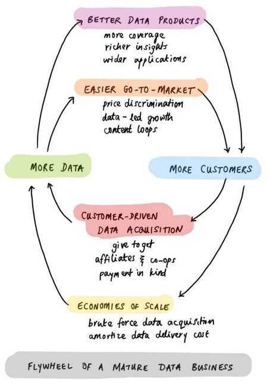

# Startups Ideas - SAAS

Create best software companies with Indian labour, since labour is cheap in India like Zoho

**Developer tools - pure software play**

Microproducts - [How I Sold My App For $30,000 In 4 Days | GrowthX Insider - YouTube](https://www.youtube.com/watch?v=lAUc1Gr_uDo&ab_channel=GrowthX)

### Weekend Jobs

- List jobs only for weekends
- Full hiring platform

### Others

- riverside.fm saas opensource alternative
- Multimodal transportation cost explorer

## AI/ChatGPT

- New questions every time during interview/tests
- Startup for creating advert from given text input
- Give whole schema and model to the LLM, and directly ask questions in plain english for analysis and dashboards
  - Automate data analytics and data engineering tasks
  - Automatically write the most efficient SQL query and give the answer
  - No need to create powerbi reports / write sql queries / create visualization, will choose best graph/plots/visualization, add refresh intervals, etc
- Generative AI Startups
  - Webtoons / Blocktoons / MangaPlus but by AI artists
- Subjective Paper scoring using chatgpt
  - Coding using chatgpt and not only coding for functions but full repositories. Having context of whole repository and tell which file and what line to change
- During interviews, automatic captions can be sent to chatgpt for giving answers directly

**Economics of Data Business**

https://pivotal.substack.com/p/economics-of-data-biz

Geospatial data startup

Microfinance

**AI Manager (single person can manage large number of people using Tech)**

**Free Open Source Ticketing + Chat system (hosted)**

**Free Open Source JIRA/Asana (hosted)**

**Ai hiring -** Hiring Portal

- Candidates agreement using ai
- Coding test taking platform end to end, free of cost, very cost competitive
- Something like **Turing**

Living as a service (Apartment swapping networks)

Child as a service

Flight as a service

Food as a service

Raising children roadmaps (step by step, day by day)

Teaching as a service (pedagogy)

Entertainment as a service

Vacation as a service

Online coding tool + Environment

- Just go to a repository and start coding
- All tools are already there with lint checks and code formatting tools all in browser (mobile friendly)
- Docker containers can directly be run there
- Each developer have their own isolated environment
- Database setup/access to each environment
- Fine grained control over all repositories/files/docs in browsers direcly
- Code testing / commiting / backup everything direcly in browser

Free Coding test taking platform (Think exam but free)

### Ecommerce for small businesses

- Mobile product scanner
- Any business can be online just by capturing photos of product
- Chat functionality between consumers and businesses
- Map functionality for each business location
- Powerful search for customers
- Automatic inventory management using camera
- No barcode and all
- Video for adding products using 360 scan
- Barcodes are dead

Money Investment Portal

- Only 1 investment type
  - Will be allocated and rebalanced automatically
  - Savings + FD + RD + Mutual Fund + Gilt + Stocks according to goals you define
  - Add Goals when you need money, and it automatically tells all allocations, and do it for you
  - Will move from equity to debt automatically when the goal is near

Diet chart + what should I eat today along with recipe

**Postman killer - Thunderclient**

- Opensource
- Bigger limits for collaboration using gitlab or something

## Finance / Economics

**Programmable currency, you can program the currency in a way that it can only be used for a certain thing like buying fertilizer by a farmer**

### Smart Credit

- Health Insurance money is paid by insurer directly to hospital (smart/programmable currency)
- Whatever credit you take is directly transfered to merchant to that purpose, it doesn't go to you, so that can give credit at lesser interest rate, like car loan, home loan
- Food Coupons, other coupons

### Regenerative Finance (ReFi)

ReFi is a beautiful idea -- a re-imagining of the financial system using the tools humanity now has at its disposal to better account for the needs of all stakeholders, current and future. It puts a price on externalities, charging those who create negative externalities (like the Once-ler) and rewarding those who create positive externalities (like the Lorax, who speaks for the trees)

ReFi seems hippie, but it isn't anti-growth or anti-progress. It's not anti anything. It's for a new financial model that includes and regenerates people as individuals with unique talents, communities as economic hubs, and the health and biodiversity of global ecosystems. Its participants want to accelerate the development of new, planet-positive technologies through better measurement and financing

That idea came from Charles Eisenstein's Sacred Economics: if you back money with more of the things you want to see in the world, you'll get more of those things

Celo is based on a belief that programmable money will unlock new economic models, and that changing the features of money (which is possible because money's just a technology) can lead to a more beautiful world. And it's a bet that mission-aligned builders will care as much about a Layer 1's community as they do its tech specs. When everything is open, liquidity has no loyalty, and each blockchain's technology continues to improve, standing for something, and building a community around it, might be a key competitive advantage in a multi-chain world

https://www.notboring.co/p/celo-building-a-regenerative-economy

Redis for notification

Pulp fiction

[Stats.iiitd.ac.in](http://stats.iiitd.ac.in/)

This will show all the statistics of iiit delhi with student placement record and student network graph. This will also contain the iiitd network usage of every day and then contains a trending search which will show what is trending in iiit delhi. Also we can use TIL blog where everybody can post what the learned today related to CS.

Artificial intelligence based governing.

Local guides app which will be like you guide telling about the monuments with location and images. A guided tour of monuments, tombs, places, etc.

Metro chat using adhoc network through mobiles

Conversational AI of important figures, ex. Mahatma Gandhi

Quiz app for class in which people can't cheat

App for suggestions for every person. Anonymous posts and non anonymous post option. Post problems and people will give suggestions. A timeline or feed to view problems.

Anchors - What is the lowest price of the product. Using Google assistant and Siri and Cortana.

Making an app that will make an online portal for any institution. Accept online payment through people and deposit to the institution bank account.

### Youtube

Subscribe all the youtube channel and make a channel where any people online in the youtube can see who is online. To talk to share or to discuss.

Adding science videos randomly to users suggestion to increase their curiosity and also increase their IQ and brain neurons

Audio and video quality improvement using ai in YouTube

### Google

Should have case sensitive google search. NCL or SMIL documents.

AI DJ with ML(learns from people excitation with voice and image processing and uses crowd sourcing from other dj player to teach about different tastes of people in songs, time of playing that songs like romantic when couples are there and party songs when friends crowd are their for party.) Also differentiate between nations and their preferences, plays according to the people present in the party.

AI suggestions for watch (Templates sent to reply to messages). (Like google messenger and Samsung gear fit 2 integration)

[Checklist.com](http://checklist.com/) for public to-do and checklist for creating perfect homes, weddings etc

CodePen type site for java and other scripts

Reading for websites and blog, where one can highlight directly in browser all the pages will be stored in there account. It will be like a notebook and everything is recorded in notebook. Can be sorted using tags for automatic distribution of pages and blogs accordingly

### Personal Location Sharing Service

Ask to get there location notification. Where default is 1 hour. I can request anyone's location and they can allow or reject.

**credit card based upi**

### Online maid services

Uber like service for maids and families. 0 day leave for families. If some maid is unavailable other will take her place.

### Recharge Guru

The single portal to recharge, no need of wallet, cashback, promo-codes.

Find the best place from where you can recharge and recharges for you.

Deduct the amount of cashback from your money and pay from itself, and recover it afterwards from merchants.

Hourly check for the best place to recharge from (paytm, mobikwik, freecharge, phonepay, etc.)

Can extend for flight bookings, hotel bookings and others.

Business model -

When everyone is onboard with the concept to not go to first every site for offers and then recharge, we can get a cut from the recharges. And exclusive codes also.

## Tech

### Simplify git and docker environment management

- It's too complex
- If you had to teach someone (like data science guys), it's too complex for them to pull, add keys, create images, commit, push, use requirements.txt, etc.
- Can commit hourly/daily by itself
- Can create environment by itself

Kubernetes

- No kubernetes
- Just give request, limit, HPA enable disable, network, and apply the kubernetes manifest
- No configuration or anything else

Single Tier Architecture which automatically generates 3/4 tier architecture

- We give root credentials to database
  - Automatically creates api for frontend to access only that specific data and nothing else with all rate limits and all.
  - Automatically handles token / auth for frontend to access database

### Study Projects

1. Create a camera that follows its subject (in case of teaching a course settings or a conference setting).
    - It should take in focus the moving person
    - If he/she writes on blackboard then it should be focused out to see the whole blackboard or the main context of the blackboard
    - If there is a presentation, then two cameras must coordinate to capture presentation, and the other will capture the speaker
    - Advanced - Final video can be created by switching between presentation, speaker.
    - Advanced - Create highlights of the whole video (like a short 5 - 10 mins highlight)

Script writer purely random by computer. Hero doesn't win always. Anything can happen.

Community work app. Get goodwill high goodwill and person

pixxel - earth monitoring and observation using satellites

Hyperspectral imaging

### Others

- Standalone chat bot for android
  - AI generated models, CS representatives
- Hyper-Casual games
- Zero-Profit Distributed stores
- https://hate2wait.io

## WIKI / PKM / Website

Using Google Chrome extension to annotate and keep all links and create markdowns etc.

## Internal Links

- [The Grid](../../book-summaries/the-grid)
