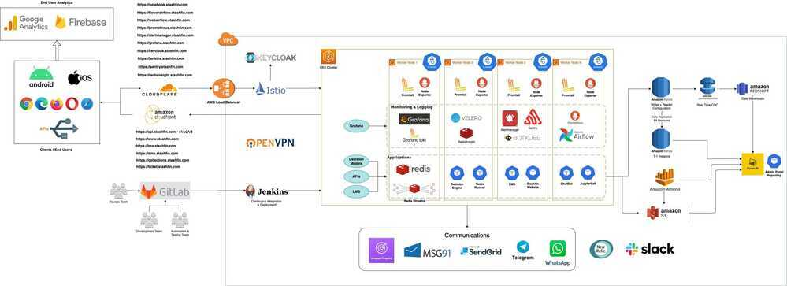

# Stashfin Tech Stack / Infra

### Stashfin Infra Diagram

### Tech Stack

1. Languages

    - Backend - PHP, Python
    - Frontend - HTML, CSS, JS, React
    - Android - Java + Kotlin, Firebase
    - iOS - Swift + Objective C
    - Libraries - Pandas, Numpy (other AI models and libraries)

2. Frameworks - CodeIgniter 3 for PHP, Flask/FastAPI and Django for Python
3. Unit Testing - Phpunit for PHP, Pytest for Python
4. Databases - Aurora MySQL (OLTP), Redshift (OLAP), Redis (Caching and Queueing), S3 (blob storage) + Athena (Query layer on top of S3)
5. Architecture - Microservices and Event Driven, REST Based
6. Testing and QA Tools - Postman, Appium, Selenium
7. DevOps - Docker, Kubernetes, Helm, Jenkins, Airflow, Prometheus + Grafana + Loki, Newrelic, Sentry, AWS (Cloud Provider)
8. BI Tool - PowerBI
9. Dev Tools - VSCode, Gitlab (git - VCS), Slack/Google Chats

### Kubernetes EKS Infra / Stashfin Infrastructure and DevOps

1. Deployment Infra

    - Helm package management (client)

        1. Updates - Whatup

    - Kubernetes Manifests
    - Jenkins (CICD)

        1. Pipeline
        2. Self service CICD

2. AWS

    - VPCs
    - S3

        1. Athena

    - IAM
    - EC2
    - Spot Instances
    - Savings plan
    - Elastic Container Registry (ECR)
    - Pinpoint

        1. AWS Firehose for delivery metrics

    - EKS
    - ELB (Classic LoadBalancers)

3. CloudFlare
4. GitLab
5. Kubernetes

    - Kubernetes Dashboard
    - BotKube

6. Istio

    - Keycloak

7. Sentry (Error Tracking)
8. cert-manager and LetsEncrypt
9. NewRelic (Application Performance Monitoring APM)
10. Prometheus

    - Alertmanager

11. Grafana
12. Locust (load testing)
13. Airflow

    - Postgres
    - Airflow web
    - Airflow flower
    - Celery Workers
    - Kubernetes Executor

14. Application and Web Servers

    - Nginx
    - Apache
    - Gunicorn

15. Application Development

    - Precommit
    - Crashlytics

16. Testing

    - Selenium
    - Appium
    - Postman Runners (newman)

17. Databases

    - Redshift
    - Aurora (RDS)
    - Redis

        1. RedisInsight
        2. Redis Streams

    - DynamoDB
    - S3 (Blob storage)

18. Languages used

    - PHP (Codeigniter)
    - Java + Kotlin (Android)
    - Python (Fast API / Django / Flask)
    - Javascript (React)

19. OpenVPN
20. JupyterLab
21. Analytics

    - PowerBI
    - Firebase
    - SonarQube

22. Velero - Disaster Recovery
23. Deployment Strategies

    - Blue/Green
    - Canary
    - A/B
    - Mirroring
24. ExternalDNS

### Others

1. TICK

    - InfluxDB (device health monitoring)
    - InfluxDB (server health monitoring)
    - Kapacitor
    - Chronograf
    - Telegraf

2. Kong (dbless)
3. Konga
4. Vernemq (mqtt broker)
5. Druid

    - Zookeeper
