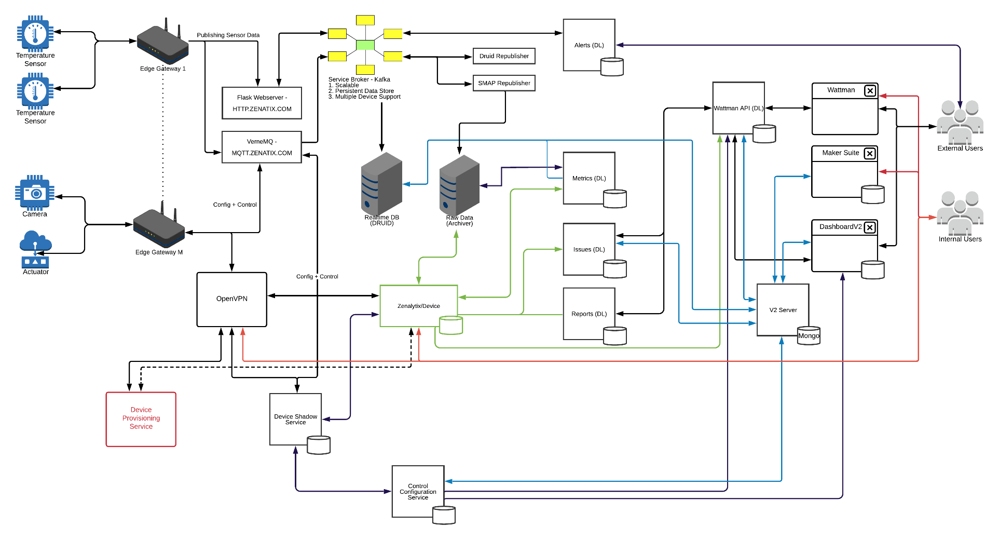
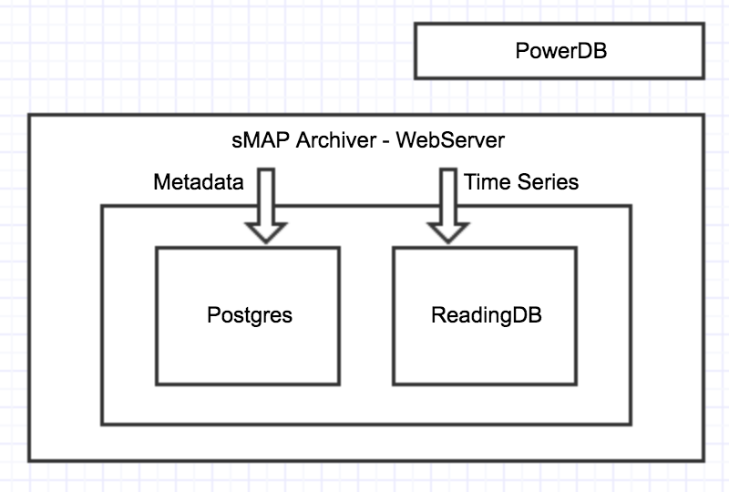

# Zenatix Architecture

### Legend

- Red Color signifies internal user interaction (except Team Team)
- Green Color signifies Django Device sync. Django Devices allows that module to query an archiver directly.
- Blue Color signifies V2 Server Interaction.
- Arrows do indicate data flow direction.

### Architecture

1. Front-End: Angular2.0 for web and Native Android for mobile
2. Backend Framework: Python-Django, Python-Flask
3. Messaging broker: MQTT
4. Databases: PostgreSQL, MongoDB, pgbouncer
5. Time-Series Database: ReadingDB with sMAP queries, PowerDB on top of archiver
6. Servers: Apache, Nginx, Nodejs, WSGI, bjourn, gunicorn
7. Architecture: Event Driven, Reactor Architecture
8. RPC: zeroRPC for Python and Nodejs
9. Asynchronous Multithreading: Greenlet, Gevent.
10. Message Broker Softwares : RabbitMQ, Celery
11. H/W Communication Protocols : ModBus
12. Open Source Tools : OpenWRT
13. Stacks: LAMP, MEAN
14. APIs: REST, GraphQL using Django REST Framework and Django-graphene

### Stack 2.0

1. Broker - Apache Kafka, Emqtt
2. Connectors - Kafka-connect
3. MQTT Client - PahoMqtt
4. Fast database - Druid
5. Dashbaords - Kafka-manager, topics-ui, schema-registry-ui, emqx dashboard, confluent control-center

### Modules

1. Republishers:

    1. Flask Webserver (Republisher)
    2. Druid Republisher + Redis
    3. SMAP Republisher

2. VerneMQ
3. Kafka
4. Realtime DB (Apache Druid)
5. Raw Data DB (SMAP)
6. SMAP Drivers (Vaibhav)

    1. Weather Driver
    2. LastDataDriver

7. Alerts (SMAP + V2-Alerts)
8. Locust
9. Metrics
10. Issues
11. Reports
12. Wattman (API + Frontend)
13. MakerSuite
14. Dashboard V2
15. V2 Server
16. Control Configuration Service
17. Device Shadow Service
18. Kubernetes and VMs
19. Alerting and Monitoring
20. Cron Jobs
    - publish_device_hierarchy management command - wattman cron job (every 6 hours)

Publish device_hierarchy to consumers redis where druid_consumers get metadata from.

- publish_druid_metrics_csv - cronjob in notebook 0 */2* **
- /home/ubuntu/sources/druid/get-data.sh 15 1-23/2 ** *
- Kubernetes cron jobs (example namespace, example codebase)
  - Livenotebook-commit - "15 20 ** *" + 5:30
  - Upload-deployment-photos - "0 22 ** *" + 5:30
  - Pgdump-postgres - "45 18 ** *" + 5:30

### Time-Series Data

Any data which is a series of time, sequence, value points

### ReadingDB

ReadingDB buckets and compresses your data using a
delta encoding and zlib, and then writes this into a bdb installation with a bdb index. It uses the bdb transaction manager for write-ahead logging so that the volume will not become corrupted.

BDB - Berkeley DB

Task - app - control rpi with different features, like ps_utils, generic_command

Metric - app - calculated computed data and store

Smap_utils - It queries the time_series database for plotting graphs in front-end

SMAP is hit using queries and data is showed in dashboard and all.

Only one query has one parameters.

SMAP_UTILS app is API creates SMAP Query (Ex - select data in (starttime, endtime) where path=" "

QUERY

1. Select data before time where path=" "
2. Select data after time where path=" "
3. Select data in (starttime, endtime) where path=" "
4. Apply sum to data in (st, endtime) where path=" "

### Parameters

1. Energy (increasing)
2. Additive (sum)
3. Non-additive (mean)

### Native Server Services

1. SMAP Archivers

    - Lastdata driver

2. OpenVPN

    - SMS Gateway
    - TimeSync Service

3. Control
4. Device shadow
