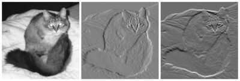

# Computer Vision / CV Intro

1. [13.1. Image Augmentation](https://d2l.ai/chapter_computer-vision/image-augmentation.html)
2. [13.2. Fine-Tuning](https://d2l.ai/chapter_computer-vision/fine-tuning.html)
3. [13.3. Object Detection and Bounding Boxes](https://d2l.ai/chapter_computer-vision/bounding-box.html)
4. [13.4. Anchor Boxes](https://d2l.ai/chapter_computer-vision/anchor.html)
5. [13.5. Multiscale Object Detection](https://d2l.ai/chapter_computer-vision/multiscale-object-detection.html)
6. [13.6. The Object Detection Dataset](https://d2l.ai/chapter_computer-vision/object-detection-dataset.html)
7. [13.7. Single Shot Multibox Detection](https://d2l.ai/chapter_computer-vision/ssd.html)
8. [13.8. Region-based CNNs (R-CNNs)](https://d2l.ai/chapter_computer-vision/rcnn.html)
9. [13.9. Semantic Segmentation and the Dataset](https://d2l.ai/chapter_computer-vision/semantic-segmentation-and-dataset.html)
10. [13.10. Transposed Convolution](https://d2l.ai/chapter_computer-vision/transposed-conv.html)
11. [13.11. Fully Convolutional Networks (FCN)](https://d2l.ai/chapter_computer-vision/fcn.html)
12. [13.12. Neural Style Transfer](https://d2l.ai/chapter_computer-vision/neural-style.html)
13. [13.13. Image Classification (CIFAR-10) on Kaggle](https://d2l.ai/chapter_computer-vision/kaggle-cifar10.html)
14. [13.14. Dog Breed Identification (ImageNet Dogs) on Kaggle](https://d2l.ai/chapter_computer-vision/kaggle-dog.html)

https://d2l.ai/chapter_computer-vision/index.html

Computer vision involves analyzing patterns in visual images and reconstructing the real-world objects that produced them. The process is often broken up into two phases: **feature detection and pattern recognition.** Feature detection involves selecting important features of the image; pattern recognition involves discovering patterns in the features.

Content-Based Image Retrieval (CBIR) is the process of building image search engines

ANPR - Automatic Number Plate Recognition

## Face Detection Concepts

Face detection locates human faces in visual media such as digital images or video. When a face is detected it has an associated position, size, and orientation; and it can be searched for landmarks such as the eyes and nose.

Here are some of the terms that we use regarding the face detection feature of ML Kit:

- Face tracking extends face detection to video sequences. Any face that appears in a video for any length of time can be tracked from frame to frame. This means a face detected in consecutive video frames can be identified as being the same person. Note that this isn't a form offace recognition; face tracking only makes inferences based on the position and motion of the faces in a video sequence.
- A landmark is a point of interest within a face. The left eye, right eye, and base of the nose are all examples of landmarks. ML Kit provides the ability to find landmarks on a detected face.
- A contour is a set of points that follow the shape of a facial feature. ML Kit provides the ability to find the contours of a face.
- Classification determines whether a certain facial characteristic is present. For example, a face can be classified by whether its eyes are open or closed, or if the face is smiling or not.

### Cases

- Perfect Light
- Dull light
- BW
- Half face
- Atoneside
- Side face
- Multiple face dull

https://developers.google.com/ml-kit/vision/face-detection/face-detection-concepts

## Image Gradient

An image gradient is a directional change in the intensity or color in an image. The gradient of the image is one of the fundamental building blocks in [image processing](https://en.wikipedia.org/wiki/Image_processing). For example, the [Canny edge detector](https://en.wikipedia.org/wiki/Canny_edge_detector) uses image gradient for [edge detection](https://en.wikipedia.org/wiki/Edge_detection). In [graphics software](https://en.wikipedia.org/wiki/Graphics_software) for [digital image editing](https://en.wikipedia.org/wiki/Digital_image_editing), the term gradient or [color gradient](https://en.wikipedia.org/wiki/Color_gradient) is also used for a gradual blend of [color](https://en.wikipedia.org/wiki/Color) which can be considered as an even [gradation](https://en.wiktionary.org/wiki/gradation) from low to high values, as used from white to black in the images to the right. Another name for this is color progression.

Mathematically, the [gradient](https://en.wikipedia.org/wiki/Gradient) of a two-variable function (here the image intensity function) at each image point is a 2D [vector](https://en.wikipedia.org/wiki/Vector_(geometric)) with the components given by the [derivatives](https://en.wikipedia.org/wiki/Derivative) in the horizontal and vertical directions. At each image point, the gradient vector points in the direction of largest possible intensity increase, and the length of the gradient vector corresponds to the rate of change in that direction.

Since the intensity function of a digital image is only known at discrete points, derivatives of this function cannot be defined unless we assume that there is an underlying [continuous](https://en.wikipedia.org/wiki/Continuous_function) intensity function which has been sampled at the image points. With some additional assumptions, the derivative of the continuous intensity function can be computed as a function on the sampled intensity function, i.e., the digital image. Approximations of these derivative functions can be defined at varying degrees of accuracy. The most common way to approximate the image gradient is to [convolve](https://en.wikipedia.org/wiki/Convolution) an image with a kernel, such as the [Sobel operator](https://en.wikipedia.org/wiki/Sobel_operator) or [Prewitt operator](https://en.wikipedia.org/wiki/Prewitt_operator).

On the left, an intensity image of a cat. In the center, a gradient image in the x direction measuring horizontal change in intensity. On the right, a gradient image in the y direction measuring vertical change in intensity. Gray pixels have a small gradient; black or white pixels have a large gradient.

[Calculus - Gradient](mathematics/calculus/gradient.md)

https://en.wikipedia.org/wiki/Image_gradient

## Hough Transform

The **Hough transform** is a [feature extraction](https://en.wikipedia.org/wiki/Feature_extraction) technique used in [image analysis](https://en.wikipedia.org/wiki/Image_analysis), [computer vision](https://en.wikipedia.org/wiki/Computer_vision), and [digital image processing](https://en.wikipedia.org/wiki/Digital_image_processing).The purpose of the technique is to find imperfect instances of objects within a certain class of shapes by a voting procedure. This voting procedure is carried out in a [parameter space](https://en.wikipedia.org/wiki/Parameter_space), from which object candidates are obtained as local maxima in a so-called accumulator space that is explicitly constructed by the algorithm for computing the Hough transform.

https://en.wikipedia.org/wiki/Hough_transform

## Canny Edge Detection

https://opencv-python-tutroals.readthedocs.io/en/latest/py_tutorials/py_imgproc/py_canny/py_canny.html

## Peak Signal to Noise Ratio (PSNR)

Peak signal-to-noise ratio(PSNR) is an engineering term for the ratio between the maximum possible power of a [signal](https://en.wikipedia.org/wiki/Signal_(information_theory)) and the power of corrupting [noise](https://en.wikipedia.org/wiki/Noise) that affects the fidelity of its representation. Because many signals have a very wide [dynamic range](https://en.wikipedia.org/wiki/Dynamic_range), PSNR is usually expressed as a [logarithmic](https://en.wikipedia.org/wiki/Logarithm) quantity using the [decibel](https://en.wikipedia.org/wiki/Decibel) scale.

PSNR is commonly used to quantify reconstruction quality for images and video subject to [lossy compression](https://en.wikipedia.org/wiki/Lossy_compression).

https://en.wikipedia.org/wiki/Peak_signal-to-noise_ratio

## References

[Self Driving Nanodegree](courses/self-driving-nanodegree.md)

https://towardsdatascience.com/understanding-ssd-multibox-real-time-object-detection-in-deep-learning-495ef744fab

https://www.freecodecamp.org/news/advanced-computer-vision-with-python

[Comic book panel segmentation • Max Halford](https://maxhalford.github.io/blog/comic-book-panel-segmentation/)

[Unbelievable Face Swapping with 5 Lines Code - YouTube](https://www.youtube.com/watch?v=a8vFMaH2aDw)
