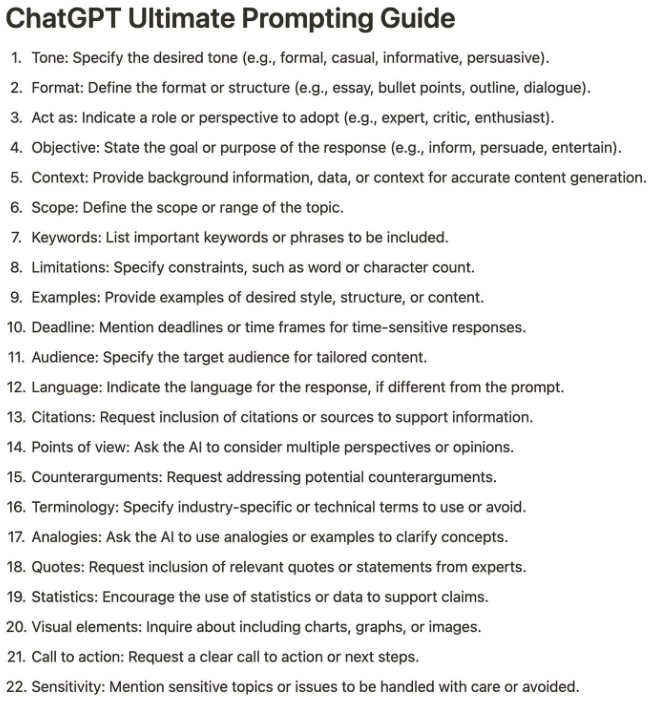

# ChatGPT Prompt Engineering for Developers

## Introduction

Two types of large language models (LLMs)

### Base LLM

Predicts next word, based on text training data

Prompt - What is the capital of France?

Ans - What is France's largest city?

Ans - What is France's population?

### Instruction Tuned LLM

Tries to follow instructions

Fine-tune on instructions and good attempts at following those instructions.

RLHF: Reinforcement Learning with Human Feedback - [Human Feedback in AI: The Essential Ingredient for Success | Label Studio](https://labelstud.io/blog/human-feedback-in-ai/) [Create a High-Quality Dataset for RLHF | Label Studio](https://labelstud.io/blog/create-a-high-quality-rlhf-dataset/)

Helpful, Honest, Harmless

Prompt - What is the capital of France?

Ans - The capital of France is Paris.

### Prompting Principles

#### Prompts

[https://snackprompt.com](https://snackprompt.com/)

[GitHub - f/awesome-chatgpt-prompts: This repo includes ChatGPT prompt curation to use ChatGPT better.](https://github.com/f/awesome-chatgpt-prompts)

##### ChatGPT prompt to write error free

{paste your writing}

Prompt: "Proofread my writing above. Fix grammar and spelling mistakes. And make suggestions that will improve the clarity of my writing"

##### Learn-fast prompt using the 80/20 principle to knowledge

Prompt: "I want to learn about {insert topic}. Identify and share the most important 20% of learnings from this topic that will help me understand 80% of it."

#### Principle 1: Write clear and specific instructions

##### Tactic 1: Use delimiters to clearly indicate distinct parts of the input

- Delimiters can be anything like: , `"""`, `< >`, `<tag> </tag>`, `:`

##### Tactic 2: Ask for a structured output

- JSON, HTML

##### Tactic 3: Ask the model to check whether conditions are satisfied

##### Tactic 4: "Few-shot" prompting

#### Principle 2: Give the model time to "think"

##### Tactic 1: Specify the steps required to complete a task

##### Tactic 2: Instruct the model to work out its own solution before rushing to a conclusion

### Imitating

- In the style of x write about x

### Model Limitations

##### Hallucinations

Makes statements that sound plausible but are not true

##### Reducing hallucinations

First find relevant information, then answer the question based on the relevant information

## Other Topics

- Iterative
- Summarizing
- Inferring
- Transforming
- Expanding
- Chatbot
- Conclusion

[ChatGPT Prompt Engineering for Developers - DeepLearning.AI](https://www.deeplearning.ai/short-courses/chatgpt-prompt-engineering-for-developers/)

## Prompting Techniques

### Chain-of-thought

_Chain-of-thought_ (CoT) prompting is a technique that allows [large language models](https://en.wikipedia.org/wiki/Large_language_models "Large language models") (LLMs) to solve a problem as a series of intermediate steps before giving a final answer. Chain-of-thought prompting improves reasoning ability by inducing the model to answer a multi-step problem with steps of reasoning that mimic a [train of thought](https://en.wikipedia.org/wiki/Train_of_thought "Train of thought"). It allows large language models to overcome difficulties with some reasoning tasks that require [logical thinking](https://en.wikipedia.org/wiki/Logical_reasoning "Logical reasoning") and multiple steps to solve, such as [arithmetic](https://en.wikipedia.org/wiki/Arithmetic "Arithmetic") or [commonsense reasoning](https://en.wikipedia.org/wiki/Commonsense_reasoning "Commonsense reasoning") questions.

### Other techniques

- Generated knowledge prompting
- Least-to-most prompting
- Self-consistency decoding
- Complexity-based prompting
- Self-refine
- Tree-of-thought
- Maieutic prompting
- Directional-stimulus prompting

[Prompt engineering - Wikipedia](https://en.wikipedia.org/wiki/Prompt_engineering)

## Prompt Examples

Share the most important leadership lessons and insights from the book {insert book} by {insert author}. For each insight suggest an actionable way I can embody it.

## Parameters

### Temperature

Controls the randomness of the model's output. A higher temperature makes the output more random, while a lower temperature makes it more deterministic.

## Learning

- [Large Language Models and Cybersecurity – What You Should Know](https://www.freecodecamp.org/news/large-language-models-and-cybersecurity/)
- [Understanding Large Language Models - by Sebastian Raschka](https://magazine.sebastianraschka.com/p/understanding-large-language-models?utm_source=substack&utm_medium=email)
- [The Art of Prompt Design: Use Clear Syntax | by Scott Lundberg | May, 2023 | Towards Data Science](https://towardsdatascience.com/the-art-of-prompt-design-use-clear-syntax-4fc846c1ebd5)
- [Prompt Engineering - Google Slides](https://docs.google.com/presentation/d/1wNm1uQs5JnmnxR7es2pb4koEELZ9k_CeTdjvTa38cT8/edit?usp=sharing)
- [Prompt Engineering Tutorial – Master ChatGPT and LLM Responses - YouTube](https://www.youtube.com/watch?v=_ZvnD73m40o)
