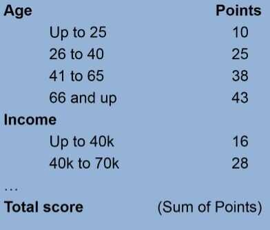
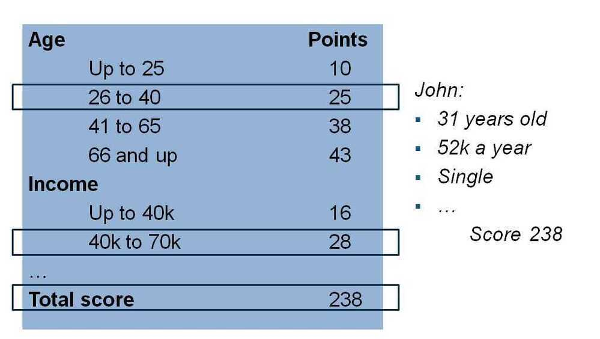
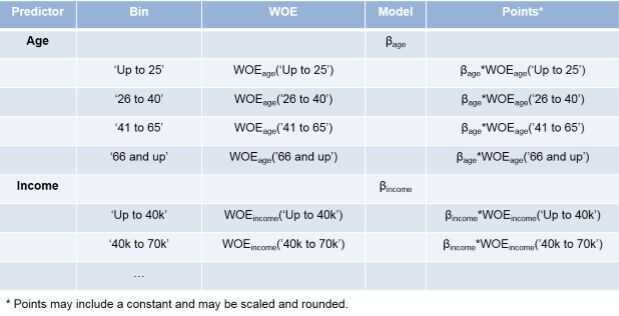
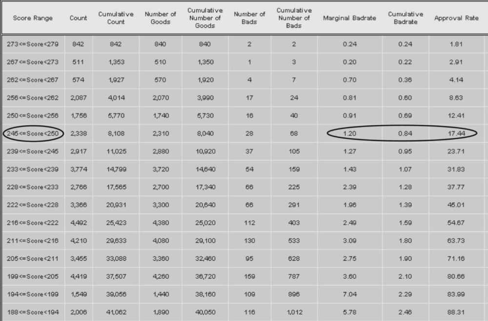

# Decision Areas & Credit Scorecards

## Decision Areas

- Underwriting
- Claims Processing
- Credit Risk scoring
- Regulatory Compliance
- Product Configuration
- Product Recommendation
- Business Process Automation
- Benefits Analysis
- Fraud Alerts
- Marketing Cross-sell / Upsell
- Group Enrollment
- Commission Calculations
- Phone Usage Analysis
- Pricing
- Intelligent Call Routing (CRM)
- Warranty Claims Management
- Fault Diagnosis
- Fee Calculations
- Eligibility
- Equipment Failure Detection
- Spend Management

## Credit Scorecards

Credit scorecardsare mathematical models which attempt to provide a quantitative estimate of the probability that a customer will display a defined behavior (e.g. loan default, bankruptcy or a lower level of delinquency) with respect to their current or proposed credit position with a lender. Scorecards are built and optimized to evaluate the credit file of a homogeneous population (e.g. files with delinquencies, files that are very young, files that have very little information). Most empirically derived credit scoring systems have between 10 and 20 variables.Application scores tend to be dominated by credit bureau data which typically amounts to over 80% of the predictive power from closer to 60% in the late 1980sfor UK scorecards. Indeed there has been an increasing trend to minimize applicant or non-verifiable variables from scorecards which has increased the contribution of the credit bureau data.

Credit scoring typically uses observations or data from clients who defaulted on their loans plus observations on a large number of clients who have not defaulted. Statistically, estimation techniques such as [logistic regression](https://en.wikipedia.org/wiki/Logistic_regression) or [probit](https://en.wikipedia.org/wiki/Probit) are used to create estimates of the [probability of default](https://en.wikipedia.org/wiki/Probability_of_default) for observations based on this historical data. This model can be used to predict probability of default for new clients using the same observation characteristics (e.g. age, income, house owner). The default probabilities are then scaled to a "credit score." This score ranks clients by riskiness without explicitly identifying their probability of default.

There are a number of credit scoring techniques such as: hazard rate modeling, reduced form credit models, weight of evidence models, linear or logistic regression. The primary differences involve the assumptions required about the explanatory variables and the ability to model continuous versus binary outcomes. Some of these techniques are superior to others in directly estimating the probability of default. Despite much research from academics and industry, no single technique has been proven superior for predicting default in all circumstances.

A typical mistaken belief about [credit scoring](https://en.wikipedia.org/wiki/Credit_score) is that the only trait that matters is whether you have actually made payments on time as well as satisfied your monetary obligations in a prompt way. While payment background is essential, however it still just composes just over one-third of the credit rating score. Furthermore, the repayment background is only shown in your credit history.

<https://en.wikipedia.org/wiki/Credit_scorecards>

## [Credit bureaus](https://en.wikipedia.org/wiki/Credit_bureau)

- Major US Bureaus:[Dun & Bradstreet](https://en.wikipedia.org/wiki/Dun_%26_Bradstreet)•[Equifax](https://en.wikipedia.org/wiki/Equifax)•[Experian](https://en.wikipedia.org/wiki/Experian)•[TransUnion](https://en.wikipedia.org/wiki/TransUnion)
- Major Canadian Bureaus:[Equifax](https://en.wikipedia.org/wiki/Equifax)•[TransUnion](https://en.wikipedia.org/wiki/TransUnion)
- Major UK Bureaus:[Equifax](https://en.wikipedia.org/wiki/Equifax)•[Experian](https://en.wikipedia.org/wiki/Experian)•[Callcredit](https://en.wikipedia.org/w/index.php?title=Callcredit&action=edit&redlink=1)
- Major Indian Bureaus:[CIBIL](https://en.wikipedia.org/wiki/CIBIL)•[Equifax](https://en.wikipedia.org/wiki/Equifax)•[Experian](https://en.wikipedia.org/wiki/Experian)•[Highmark](https://en.wikipedia.org/wiki/Highmark)

## Credit Scorecards

Credit scoring is one of the most widely used credit risk analysis tools. The goal of credit scoring is ranking borrowers by their credit worthiness. In the context of retail credit (credit cards, mortgages, car loans, and so on), credit scoring is performed using a credit scorecard. Credit scorecards represent different characteristics of a customer (age, residential status, time at current address, time at current job, and so on) translated into points and the total number of points becomes the credit score. The credit worthiness of customers is summarized by their credit score; high scores usually correspond to low-risk customers, and conversely. Scores are also used for corporate credit analysis of small and medium enterprises, and, large corporations.

A credit scorecard is a lookup table that maps specific characteristics of a borrower into points. The total number of points becomes the credit score. Credit scorecards are a widely used type of credit scoring model. As such, the goal of a credit scorecard is to distinguish between customers who repay their loans ("good" customers), and customers who will not ("bad" customers). Like other credit scoring models, credit scorecards quantify the risk that a borrower will not repay a loan in the form of a score and a probability of default.

For example, a credit scorecard can give individual borrowers points for their age and income according to the following table. Other characteristics such as residential status, employment status, might also be included, although, for brevity, they are not shown in this table.

Using the credit scorecard in this example, a particular customer who is 31 and has an income of $52,000 a year, is placed into the second age group (26--40) and receives 25 points for their age, and similarly, receives 28 points for their income. Other characteristics (not shown here) might contribute additional points to their score. The total score is the sum of all points, which in this example is assumed to give the customer a total of 238 points (this is a fictitious example on an arbitrary scoring scale).

Technically, to determine the credit scorecard points, start out by selecting a set of potential predictors (column 1 in the next figure). Then, bin data into groups (for example, ages 'Up to 25', '25 to 40' (column 2 in the figure). This grouping helps to distinguish between "good" and "bad" customers. The Weight of Evidence (WOE) is a way to measure how well the distribution of "good" and "bad" are separated across bins or groups for each individual predictor (column 3 in the figure). By fitting a logistic regression model, you can identify which predictors, when put together, do a better job distinguishing between "good" and "bad" customers. The model is summarized by its coefficients (column 4 in the figure). Finally, the combination of WOE's and model coefficients (commonly scaled, shifted, and rounded) make up the scorecard points (column 5 in the figure).

## Credit Scorecard Development Process

1. Data gathering and preparation phase
    This includes data gathering and integration, such as querying, merging, aligning. It also includes treatment of missing information and outliers. There is a prescreening step based on reports of association measures between the predictors and the response variable. Finally, there is a sampling step, to produce a training set, sometimes called the modeling view, and usually a validation set, too. The training set, in the form of a table, is the required data input to thecreditscorecardobject, and this training set table must be prepared before creating acreditscorecardobject in the Modeling phase.

2. Modeling phase
    Use thecreditscorecardobject and associated object functions to develop a credit scorecard model. You can bin the data, apply the Weight of Evidence (WOE) transformation, and compute other statistics, such as the Information Value. You can fit a logistic regression model and also review the resulting scorecard points and format their scaling and rounding. For details on using thecreditscorecardobject, see [creditscorecard](https://www.mathworks.com/help/finance/creditscorecard.html).

3. Deployment phase
    Deployment entails integrating a credit scorecard model into an IT production environment and keeping tracking logs, performance reports, and so on.

<https://www.mathworks.com/help/finance/about-credit-scorecards.html>

## Gains Chart

- For the score range 245--250, the expected **marginal bad rate** is 1.2%. That is, 1.2% of applicants with a score between 245 and 250 will likely be "bad."
- The **cumulative bad rate** - that is, the bad rate of all applicants above 245 - is 0.84%
- The **acceptance rate** at 245 is 17.44%, that is, 17.44% of all applicants score above 245
