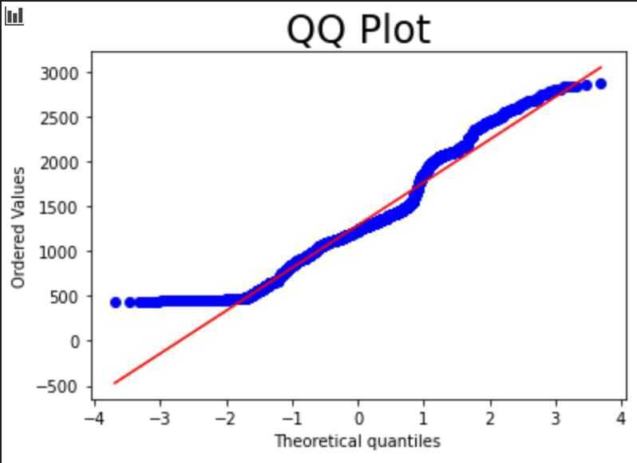
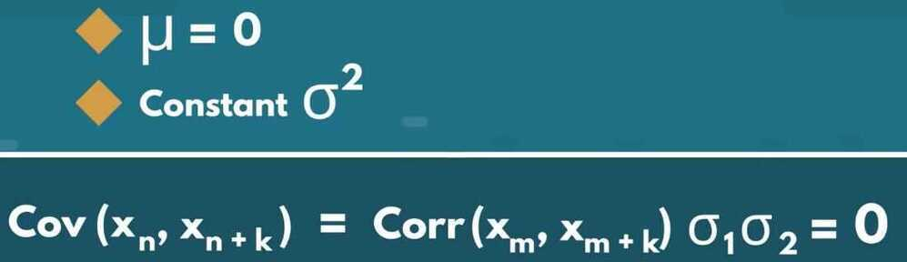
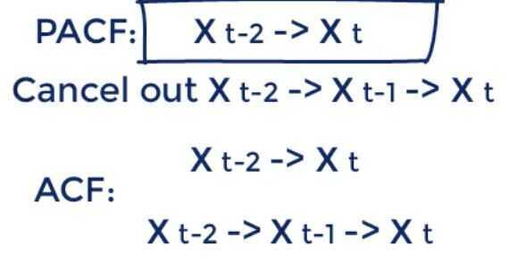

# Intro - Time Series

- QQ-Plot (Quantile-Quantile Plot)
  - Used to determine whether a data set is distributed a certain way (To see if the values of a data set follow a given distribution?)
  - Usually showcases how the data fits a Normal Distribution
  - Takes all the values a variable can take, and arranges them in accending order
  - 
  - Y-axis expresses the price with highest one on top and lowest on bottom
  - X-axis expresses theoretical quantiles of the dataset. How many standard deviations away from the mean these values are.
  - Diagonal line shows what the data points should follow, if they are Normally Distributed
- ACF
- PACF
- Seasonal Decomposition Graph
- Dickey-Fuller Test
- Time-series data processing
- Time stamps and missing values
- White noise
- Random walk
- Stationarity
- Autocorrelation
- Volatility

## Modeling

- Auto Regression (AR)

Predict movements based on correlations

- Moving Averages (MA)

Account for unexpected shocks in our data

- ARMA
- ARIMA (Auto Regressive Integrated Moving Average)
- ARMAX
- ARIMAX
- ARCH
- GARCH
- Auto ARIMA
- Forecasting

- SARIMA (seasonally integrated autoregressive-moving average)
- FARIMA (fractionally integrated autoregressive-moving average)
- Prophet
- **Neural Prophet**
- Vector Autoregression (VAR)


<https://www.machinelearningplus.com/time-series/arima-model-time-series-forecasting-python>

- **Univariate Time Series**
  - Simple Average

Sum all points divided by total number of points

- Moving Average

Take average of the last few data points only

- Single Exponential Smoothing

Attach larger weights to more recent observations than to observations from the distant past

- Holt's linear trend method
- Holt's winter seasonal method

- **Multivariate Time Series**
  - Finds linear interdependencies between multiple variables
  - Examples - ARIMA, ARIMAX

## Time-Series Data

A sequence of information which attaches a time period to each value

- Time period
- Frequency - How often values of the data set are recorded
- Analysing time-periods: All time-periods must be **equal and clearly defined** which would result in a **constant frequency**
- Patterns persist in future
- Finance - Determining the stability of financial markets and the efficiency of portfolios
- Time-dependency - The values for every period are affected by outside factors and by the values of past periods
- Time-Series data suffers from seasonality (is not often observed in regular data)
- Why isn't seasonality a trait of normal (cross-sectional) data?

There is no chronological order in cross-sectional data

## Time-series variables

X = $ S&P 500

T = entire period

t = a single period

## Pecurliarities

- Intervals need to be identical
- Adjust frequency

roll up - Aggregating the data

Increase frequency - Approximate missing values

- Requires chronological order
  - Choose a cut off time for train test data
  - Cannot shuffle data so cannot apply some ML models
- Never satisfies Gauss-Markov assumptions

Why do we decide to use the dates the values were recorded as indices, as opposed to any of the other columns?

Because all the other columns would automatically become time series, since there is a time period attached to each value.

Setting the desired frequency

df_comp = df_comp.asfreq()

h - hourly

w - weekly

d - daily

m - monthly

a - annual / yearly

b - business days / weekdays

## Filling the missing values

df_comp.spx=df_comp.spx.fillna(method='ffill')

1. Front filling: Assigns the value of the previous period.

fillna(method="ffill")

2. Back filling: Assigns the value for the next period

fillna(method="bfill")

3. Assigning the same value: Assign the average to all the missing values within the time-series

df_comp.dax=df_comp.dax.fillna(value=df_comp.dax.mean())

## White Noise

- A sequence of random data, where every value has a time-period associated with it.
- It behaves sporadically
- For a timeseries to satisfy as White Noise, it must satisfy 3 conditions

    1. constant mean

    2. constant variance

    3. no aurocorrelation (no clear relationship between past and present values)

## Random Walk

- A special type of time-series, where values tend to persist over time and the differences between periods are simply white noise
- Characteristics
  - The differences between periods are simply White Noise.
  - The best estimator for today's values is yesterday's value
  - The best estimator for tomorrow's value is today's value

Market efficiency - Measures the level of difficulty in forecasting correct future values

Arbitrage - Buy and sell commodities and make a safe profit, while the price adjusts

## Stationarity

In the most intuitive sense, stationarity means that the statistical properties of a process generating a time series do not change over time. It does not mean that the series does not change over time, just that thewayit changes does not itself change over time. The algebraic equivalent is thus a linear function, perhaps, and not a constant one; the value of a linear function changes as 𝒙 grows, but thewayit changes remains constant - it has a constant slope; one value that captures that rate of change.


Figure 1: Time series generated by a stationary (top) and a non-stationary (bottom) processes.

<https://towardsdatascience.com/stationarity-in-time-series-analysis-90c94f27322>

### Weak-form stationarity / covariance stationarity

Time-series stationarity implies taking consecutive samples of data with the same size should have identical covariances regardless of the starting point.


Covariance is correlation multiplied by standard deviations

Example of covariance stationarity is White Noise:



### Strict Stationarity


- Rarely observed in nature, therefore stationarity = covariance stationarity

## Determining Weak Form Stationarity

- Dickey-Fuller test (D-F test)


```bash
sts.adfuller(df.market_value)

(-1.7369847452352423, # T-statistics
0.41216456967706283, # p-value 40% chance of not rejecting a null
18, # num of lags, autocorrelation going back 18 periods
5002, # num of observations used
{'1%': -3.431658008603046, # critical values
'5%': -2.862117998412982,
'10%': -2.567077669247375},
39904.880607487445) # estimates the maximized information criteria provided there is apparent autocorrelation
```

## augmented df test

`sts.adfuller(df.rw)`

How do we interpret a p-value result of 0.04 as an outcome of the Augmented Dickey-Fuller test?

The data in question is stationary, assuming 5% significance

## Seasonality

Trends will appear on a cyclical basis

- Decomposition

Split into 3 effects:

- Trend -> Pattern
- Seasonal -> Cyclical effects
- Residual -> Error of prediction

The difference between true values and predictions for any period

- Types of Decomposition
  - Naive Decomposition
    - Additive

observed = trend + seasonal + residual

- Multiplicative

observed = trend *seasonal* residual

```python
from stats models.tsa.seasonal import seasonal_decompose

s_dec_additive=seasonal_decompose(df.market_value,model="additive")

s_dec_additive.plot()

plt.show()

s_dec_multiplicative=seasonal_decompose(df.market_value,model="multiplicative")

s_dec_multiplicative.plot()

plt.show()
```

## Correlation between past and present values (Autocorrelation)

There is a correlation between the values of the time series and a lagged version of itself.

## ACF - Autocorrelation Function

The relationship between past values and the current one

```python
import statsmodels.graphics.tsaplots as sgt

sgt.plot_acf(df.market_value,lags=40,zero=False)

plt.title("ACFS&P",size=24)

plt.show()
```

Correlation can take values between -1.0 to +1.0

Blue line shows **Significance**


## PACF (Partial Autocorrelation Function)


```python
sgt.plot_pacf(df.market_value,lags=40,zero=False,method=('ols'))

plt.title("PACFS&P",size=24)

plt.show()
```

## OLS - Order of Least Squares

It cancels out all additional channels a previous period value affects the present one



## The PACF Method


## What is the difference between the ACF and the PACF?

The ACF measures the accumulated effects past lags have on the current value, while the PACFmeasures the direct effect.
