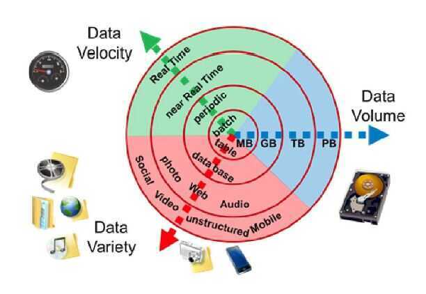

# Characteristics

Big Data includes huge volume, high velocity, and extensible variety of data.

### Volume - How much data you have

The quantity of generated and stored data. The size of the data determines the value and potential insight, and whether it can be considered big data or not.

### Variety - How heterogeneous your data is

The type and nature of the data. This helps people who analyze it to effectively use the resulting insight. Big data draws from text, images, audio, video; plus it completes missing pieces through data fusion.

- Structured data (ex - tabular data)
- Unstructured data - text, sensor data, audio, video
- Semi structured - web data, log files

### Velocity - How fast data is collected

In this context, the speed at which the data is generated and processed to meet the demands and challenges that lie in the path of growth and development. Big data is often available in real-time.

### Veracity

- The [data quality](https://en.wikipedia.org/wiki/Data_quality) of captured data can vary greatly, affecting the accurate analysis.
- Veracity refers to the biases, noise and abnormality in data, trustworthiness of data

### Value

### Validity

- accuracy and correctness of the data relative to a particular use
- Example - Gauging storm intensity (Satellite imaginery vs social media posts, prediction quality vs human impact)

### Variability

- How the meaning of data changes over time
- Language Evolution, Data availability, Sampling process, Changes in characteristics of the data source

### Viscosity & Volatility (related to velocity)

#### Viscosity - data velocity relative to timescale of event being studied

#### Volatility - rate of data loss and stable lifetime of data

### Viability - Which data has meaningful relations to questions of interest?

### Venue - Where does the data live and how do you get it?

### Vocabulary

- Metadata describing structure, content, & provenance
- Schemas, semantics, ontologies, taxonomies, vocabularies

### Vagueness

Confusion about what "Big Data" means

### Valence (Connectedness, such as in the form of graph networks)
