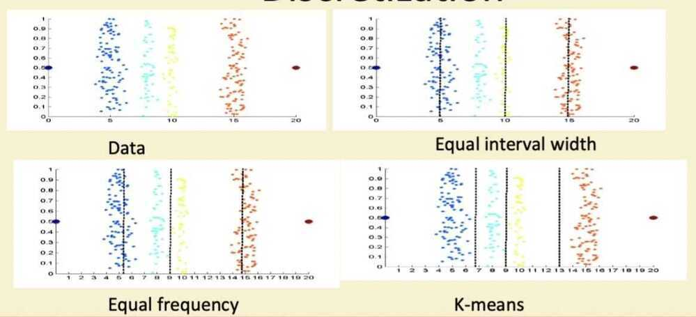
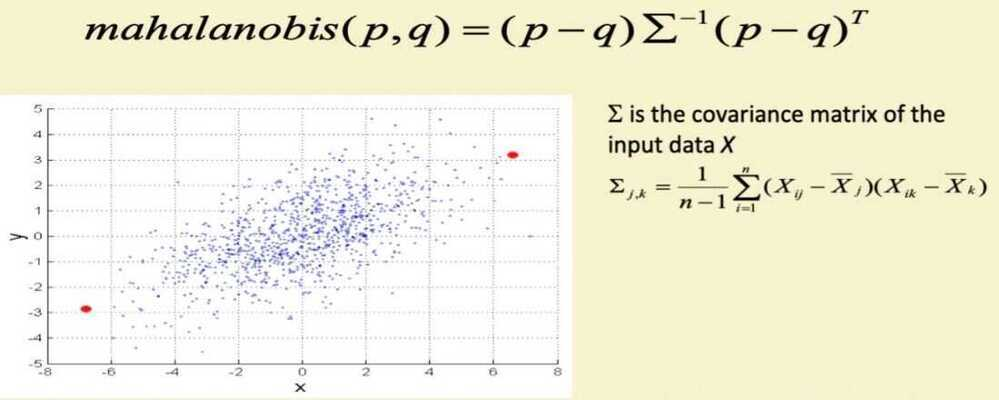
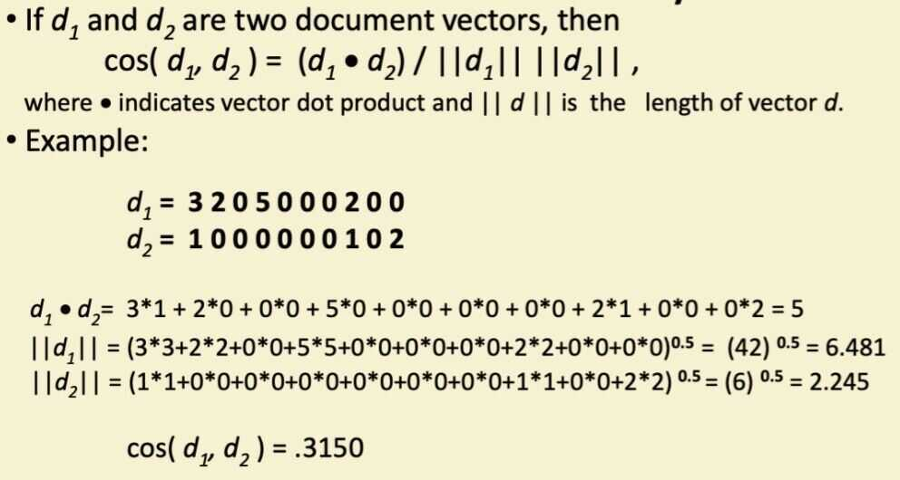
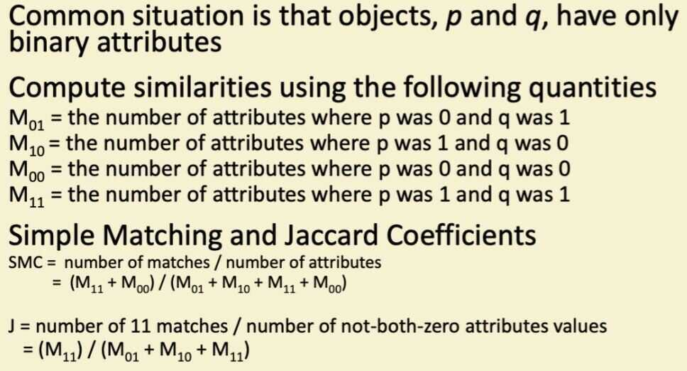
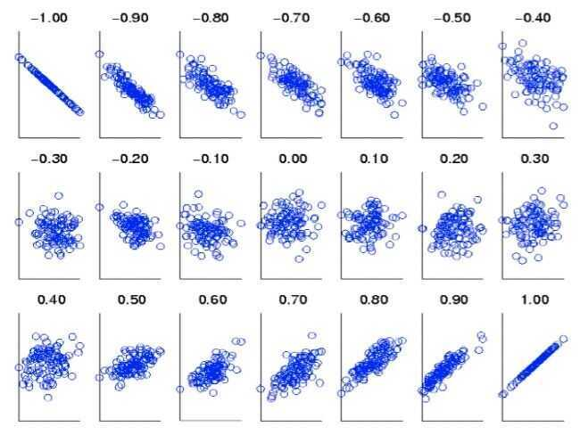

# Data Preprocessing

## Data Preprocessing

1. Aggregation
2. Attribute Transformation
3. Dimensionality Reduction

- Feature creation
- Feature subset selection

4. Discretization and Binarization
5. Sampling

### Aggregation

- Combining two or more attributes (or objects) into a single attribute (or object)
- Purpose
    - Data reduction
        - Reduce the number of attributes or objects
    - Change of scale
        - Cities aggregated into regions, states, countries, etc
    - More stable data
        - Aggregated data tends to have less variability

### Discretization

### Attribute Transformation

- A function that maps the entire set of values of a given attribute to a new set of replacement values such that each old value can be identified with one of the new values
    - Simple functions: x^k^, log(x), e^x^, |x|
    - Standardization and Normalization

## Similarity and Dissimilarity

- Similarity
    - Numerical measure of how alike two data objects are
    - Is higher when objects are more alike
    - Often falls in the range [0,1]
- Dissimilarity
    - Numerical measure of how different are two data objects
    - Lower when objects are more alike
    - Minimum dissimilarity is often 0
    - Upper limit varies
- Proximity refers to a similarity or dissimilarity

### Similarity/Dissimilarity for Simple Attributes

p and q are the attribute values for two data objects

### Types

1. Euclidean Distance
2. Mahalanobis Distance
3. Manhattan Distance
4. Jaccard Similarity
5. Minkowski Distance
6. Cosine Similarity

### Euclidean Distance

- Where n is the number of dimensions (attributes) and p~k~ and q~k~ are, respectively, the k^th^ attributes (components) or data objects p and q.
- Standardization is necessary, if scales differ

### Mahalanobis Distance

- For red points, the Euclidean distance is 14.7, Mahalanobis distance is 6

### Cosine Similarity

[Cosine Similarity - GeeksforGeeks](https://www.geeksforgeeks.org/cosine-similarity/)

[Cosine similarity: How does it measure the similarity, Maths behind and usage in Python | by Varun | Towards Data Science](https://towardsdatascience.com/cosine-similarity-how-does-it-measure-the-similarity-maths-behind-and-usage-in-python-50ad30aad7db)

### Similarity Between Binary Vectors

## Correlation

- Correlation measures the linear relationship between objects
- To compute correlation, we standardize data objects, p and q, and then take their dot product

### Visually Evaluating Correlation

- Scatter plots showing the similarity from -1 to 1

## Tidy Data

https://vita.had.co.nz/papers/tidy-data.pdf

https://cran.r-project.org/web/packages/tidyr/vignettes/tidy-data.html
