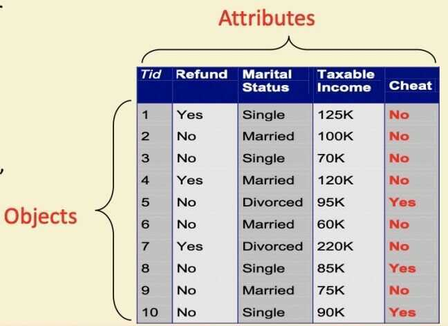
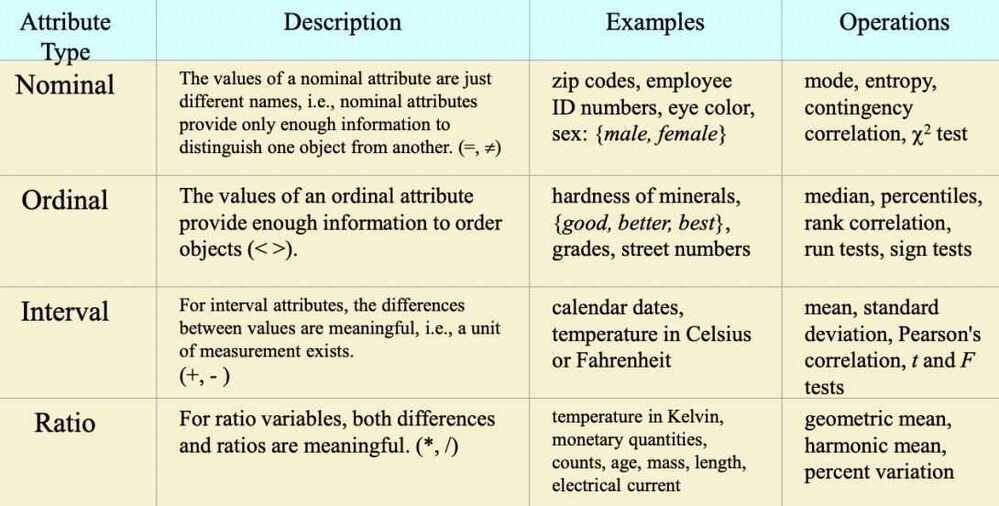

# Data

## What is Data

- Collection of data objects and their attributes
- An attribute is a property or characteristic of an object
  - Examples: eye color of a person, temperature, etc
  - Attribute is also known as variable, field, characteristic, or feature
- A collection of attributes describe an object
  - Object is also known as record, point, case, sample, entity, or instance

## Types of Attributes

- Nominal - Examples: ID numbers, eye color, zip colors
- Ordinal - Examples: rankings (e.g., taste of potato chips on a scale from 1-10), grades, height in {tall, medium, short}
- Interval - Examples: calendar dates, temperatures in Celsius or Fahrenheit
- Ratio - Examples: temperature in Kelvin, length, time, counts

## Properties of Attribute Values

The type of an attribute depends on which of the following properties it possesses:

- Distinctness: equal to, not equal to
- Order: < >
- Addition/Subtraction: + -
- Multiplication/Division: * /

### Types

- Nominal attribute: distinctness
- Ordinal attribute: distinctness & order
- Interval attribute: distinctness, order & addition
- Ratio attribute: all 4 properties

## Discrete and Continuous Attributes

### Discrete Attribute

- Has only a finite and countably infinite set of values
- Examples: zip code, counts, or the set of words in a collection of documents
- Often represented as integer variables
- Note: binary attributes are a special case of discrete attributes

### Continuous Attribute

- Has real numbers as attributes values
- Examples: temperature, height, or weight
- Practically, real values can only be measured and represented using a finite number of digits
- Continuous attributes are typically represented as floating-point variables
