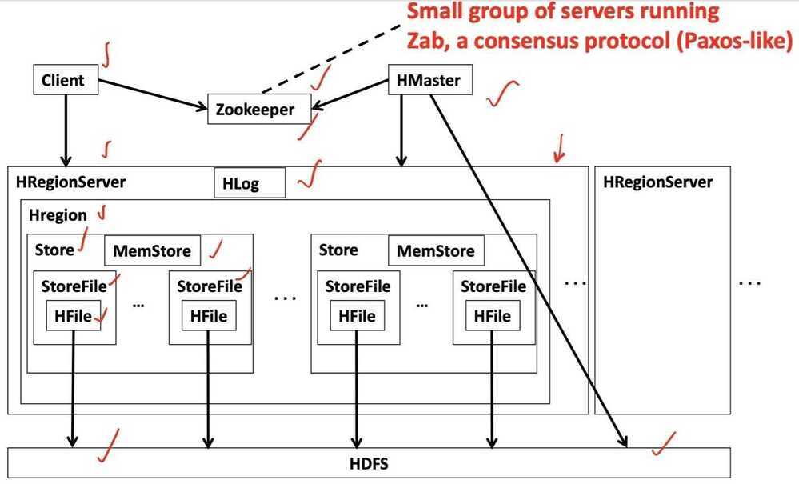
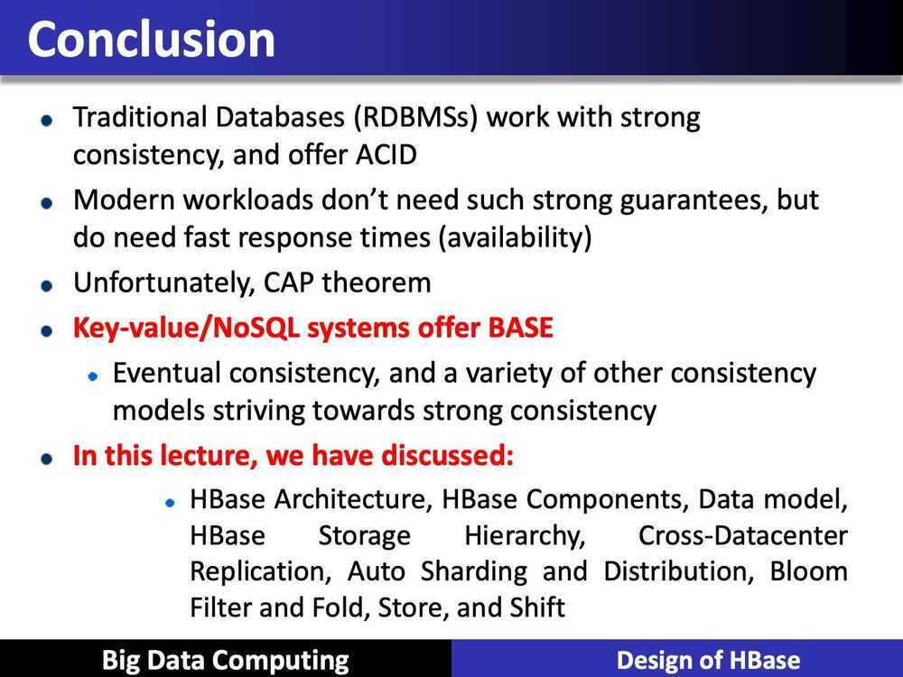

# Design of HBase

1. What is HBase

2. HBase Architecture

3. HBase Components

4. Data model

5. HBase Storage Hierarchy

6. Cross-Datacenter Replication

7. Auto Sharding and Distribution

8. Bloom Filter and Fold, Store, and Shift

## HBase is

- An opensource NoSQL database
- A distributed column-oriented data store that can scale horizontally to 1000s of commodity servers and petabytes of indexed storage
- Designed to operate on top of the Hadoop distributed file system. (HDFS) for scalability, fault tolerance, and high availability
- HBase is actually an implementation of the BigTable storage architecture, which is a distributed storage system developed by Google
- Works with structured, unstructured and semi-structured data
- Unlike Cassandra, HBase prefers consistency (over availability)

## HBase Architecture

- Table split into regions and served by region servers
- Regions vertically divided by column families into "stores"
- Stores saved as files on HDFS
- Hbase utilizes zookeeper for distributed coordination

## HBase components

- Client: Finds RegionServers that are serving particular row range of interest
- HMaster: Monitoring all RegionServer instances in the cluster
- Regions: Basic element of availability and distribution for tables
- RegionServer
    - Serving and managing regions
    - In a distributed cluster, a RegionServer runs on a DataNode
- Tables are divided into sequences of rows, by key range, called regions
- These regions are then assigned to the data nodes in the cluster called "RegionServers"

## Data Model

- Data stored in Hbase is located by its "rowkey"
- RowKey is like a primary key from a relational database
- Records in Hbase are stored in sorted order, according to rowkey
- Data in a row are grouped together as Column Families. Each Column Family has one or more Columns
- These Columns in a family are stored together in a low level storage file known as HFile

## HBase Data Model

1. Table

2. Row

3. Column Family

4. Column Qualifier

5. Cell

6. Timestamp

## HBase Data Model

- **Table:** HBase organizes data into tables. Table names are Strings and composed of characters that are safe for use in a file system path
- **Row:** Within a table, data is stored according to its row. Rows are identified uniquely by their row key. Row keys do not have a data type and are always treated as a byte [] (byte array)
- **Column Family:** Data within a row is grouped by column family. Every row in a table has the same column families, although a row need not store data in all its families. Column families are Strings and composed of characters that are safe for use in a file system path
- **Column Qualifier:** Data within a column family is addressed via its column qualifier, or simply, column, Column qualifiers need not be specified in advance. Column qualifiers need not be consistent between rows. Like row keys, column qualifiers do not have a data type and are always treated as a byte [ ].
- **Cell:** A combination of row key, column family, and column qualifier uniquely identifies a cell. The data stored in a cell is referred to as that cell's value
- **Timestamp:** Values within a cell are versioned. Versions are idenfied by their version number, which by default is the timestamp is used.
- If the timestamp is not specified for a read, the latest one is returned. The number of cell value versions retained by Hbase is configured for each column family. The default number of cell versions is three.

## Zab - Zookeeper Atomic Broadcast

## HBase Architecture

## Auto Sharding and Distribution

- Unit of scalability in HBase is the Region
- Sorted, contiguous range of rows
- Spread "randomly" across RegionServer
- Moved around for load balancing and failover
- Split automatically or manually to scale with growing data
- Capacity is solely a factor of cluster nodes vs Regions per node

## Bloom Filter

- Bloom filters are generated when HFile is pesisted

