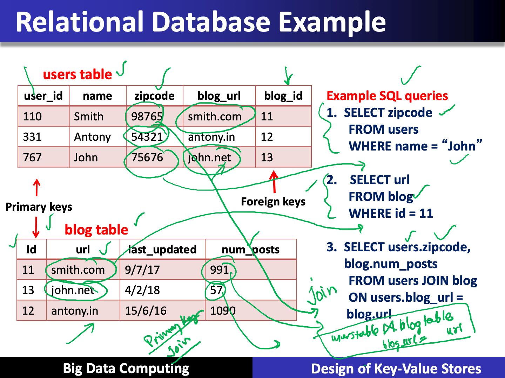
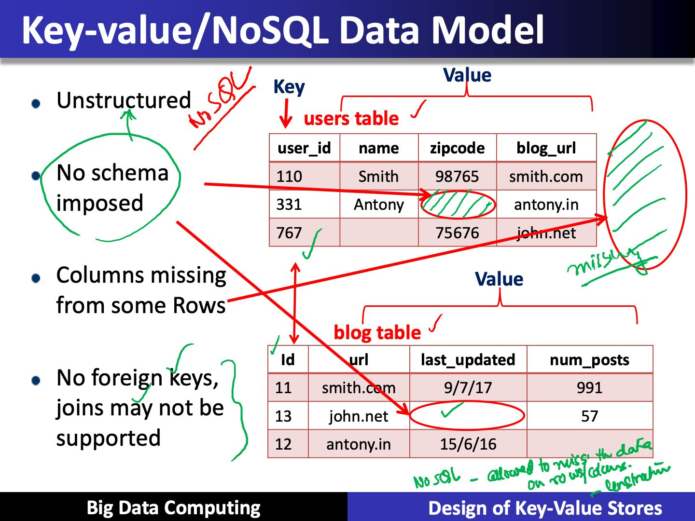

# Design of Key-Value Stores

- We will discuss the design and insight of key-value/NoSQL stores for today's cloud storage systems.
- We will also discuss Apache Cassandra and different consistency solutions

## The Key-Value Abstration

- (Business) Key -> Value
- (flipkart.com) item number -> information about it
- (easemytrip.com) Flight number -> information about flight, e.g., availability
- (twitter.com) tweet id -> information about tweet
- (mybank.com) account number -> information about it

- It's a dictionary datastructure
    - Insert, lookup, and delete by key
    - Example: hash table, binary tree
- But distributed
- Seems familiar? Remember **Distributed Hash Tables (DHT) in P2P systems**
- Key-value stores reuse many techniques from DHTs

## Is it a kind of database?

- RDMSs have been around for ages
- MySQL is the most popular among them
- Data stored in tables
- Schema-based, i.e., structured tables
- Each row (data item) in a table has a primary key that is unique within that table
- Queried using **SQL (Structured Query Language)**
- Supports joins

## Mismatch with today's workloads

- **Data: Large and unstructured:** Difficult to come out with schemas where the data can fit
- **Lots of random reads and writes:** Coming from millions of clients
- **Sometimes write-heavy:** Lot more writes compare to read
- **Foreign keys rarely needed**
- **Joins infrequent**

## Needs of Today's Workloads

- Speed (Lightning fast writes)
- Avoid Single Point of Failuer (SPoF) (Fault tolerant)
- **Low TCO (Total cost of operation and Total cost of ownership)**
- Fewer system administrators
- Incremental Scalability
    - Adding more nodes adds linear capabilities
- Scale out, not scale up

## Key-value / NoSQL Data Model

- NoSQL = Not Only SQL
- Necessaary API operations: get(key) and put(key, value)
    - And some extended operations, e.g., "CQL" in Cassandra key-value store
- **Tables**
    - **Column families** in Cassandra, **Table** in HBase, **Collection** in MongoDB
    - Like RDBMS tables, but ...
    - May be unstructured: May not have schemas
        - Some columns may be missing from some rows
    - Don't always support joins or have foreign keys
    - Can have index tables, just like RDBMSs

## Column-Oriented Storage

NoSQL systems often use column-oriented storage

- RDMSs store an entire row together (on disk or at a server)
- NoSQL systems typically store a column together (or a group of columns)
    - Entries within a column are indexed and easy to locate, given a key
- **Why useful?**
    - Range searches within a column are fast since you don't need to fetch the entire database
    - E.g., Get me all blog_ids from the blog table that were updated within the past month
        - Search in the last_updated column, fetch corresponding blog_id column
        - Don't need to fetch the other columns

## See Also

- Computer Science > Databases > Casandra > Design
