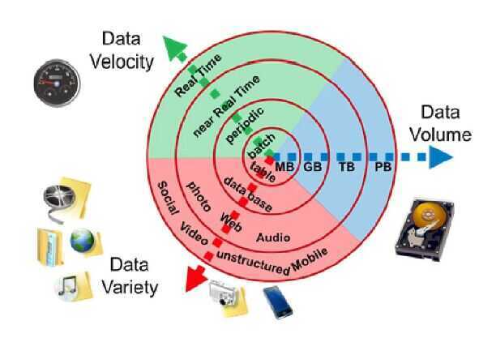

# Big Data

Big data is a term used to refer to [data sets](https://en.wikipedia.org/wiki/Data_set) that are too large or complex for traditional [data-processing](https://en.wikipedia.org/wiki/Data_processing) [application software](https://en.wikipedia.org/wiki/Application_software) to adequately deal with. Data with many cases (rows) offer greater [statistical power](https://en.wikipedia.org/wiki/Statistical_power), while data with higher complexity (more attributes or columns) may lead to a higher [false discovery rate](https://en.wikipedia.org/wiki/False_discovery_rate).Big data challenges include [capturing data](https://en.wikipedia.org/wiki/Automatic_identification_and_data_capture), [data storage](https://en.wikipedia.org/wiki/Computer_data_storage), [data analysis](https://en.wikipedia.org/wiki/Data_analysis), search, [sharing](https://en.wikipedia.org/wiki/Data_sharing), [transfer](https://en.wikipedia.org/wiki/Data_transmission), [visualization](https://en.wikipedia.org/wiki/Data_visualization), [querying,](https://en.wikipedia.org/wiki/Query_language) updating, [information privacy](https://en.wikipedia.org/wiki/Information_privacy) and data source. Big data was originally associated with three key concepts:**volume, variety, andvelocity.Other concepts later attributed with big data areveracity (i.e., how much noise is in the data) andvalue

- The challenges include capture, curation, storage, search, sharing, transfer, analysis and visualization.

## Why Big Data?

- Traditional RDBMS queries isn't sufficient to get useful information out of the huge volume of data
- To search it with traditional tools to find out if a particular topic was trending would take so long that the result would be meaningless by the time it was computed
- Big data come up with a solution to store this data in novel ways in order to make it more accessible, and also to come up with methods of performing analysis on it

## Challenges

- Capturing
- Storing
- Searching
- Sharing
- Analysing
- Visualization

## Characteristics

### Volume - How much data you have

The quantity of generated and stored data. The size of the data determines the value and potential insight, and whether it can be considered big data or not.

### Variety - How heterogeneous your data is

The type and nature of the data. This helps people who analyze it to effectively use the resulting insight. Big data draws from text, images, audio, video; plus it completes missing pieces through data fusion.

- Structured data (ex - tabular data)
- Unstructured data - text, sensor data, audio, video
- Semi structured - web data, log files

### Velocity - How fast data is collected

In this context, the speed at which the data is generated and processed to meet the demands and challenges that lie in the path of growth and development. Big data is often available in real-time.

### Veracity

- The [data quality](https://en.wikipedia.org/wiki/Data_quality) of captured data can vary greatly, affecting the accurate analysis.
- Veracity refers to the biases, noise and abnormality in data, trustworthiness of data

### Value

### Validity

- accuracy and correctness of the data relative to a particular use
- Example - Gauging storm intensity (Satellite imaginery vs social media posts, prediction quality vs human impact)

### Variability

- How the meaning of data changes over time
- Language Evolution, Data availability, Sampling process, Changes in characteristics of the data source

### Viscosity & Volatility (related to velocity)

#### Viscosity - data velocity relative to timescale of event being studied

#### Volatility - rate of data loss and stable lifetime of data

### Viability - Which data has meaningful relations to questions of interest?

### Venue - Where does the data live and how do you get it?

### Vocabulary

- Metadata describing structure, content, & provenance
- Schemas, semantics, ontologies, taxonomies, vocabularies

### Vagueness

Confusion about what "Big Data" means

### Valence (Connectedness, such as in the form of graph networks)

## YCSB Workloads

YCSB includes a set of core workloads that define a basic benchmark for cloud systems.

The **Yahoo! Cloud Serving Benchmark** (YCSB) is an open-source specification and program suite for evaluating retrieval and maintenance capabilities of computer programs. It is often used to compare relative performance of [NoSQL](https://en.wikipedia.org/wiki/NoSQL) database management systems.

<https://en.wikipedia.org/wiki/YCSB>

<https://github.com/brianfrankcooper/YCSB/wiki/Core-Workloads>

## Big data enabling technologies

- Apache Hadoop
- Hadoop Ecosystem
- HDFS Architecture
- YARN
- NoSQL
- Hive
- Map Reduce
- Apache Spark
- Zookeeper
- Cassandra
- Hbase
- Spark Streaming
- Kafka
- Spark MLib
- GraphX

## Steps for Data Platform

1. Data
2. Query
3. Merge
4. Wrangle
5. Visualize

## Links

<http://xyz.insightdataengineering.com/blog/pipeline_map>

[Big data - Wikipedia](https://en.wikipedia.org/wiki/Big_data)

<https://www.semantikoz.com/blog/getting-started-with-hadoop-and-big-data-with-text-and-hive>

<https://zerowithdot.com/splitting-to-batches>

<https://www.fast.ai/2020/01/07/data-questionnaire>

<https://www.digitalocean.com/community/tutorials/an-introduction-to-big-data-concepts-and-terminology>

[MotherDuck: Big Data is Dead](https://motherduck.com/blog/big-data-is-dead/)

- Data sizes may have gotten marginally larger, but hardware has gotten bigger at an even faster rate
- the era of Big Data is over. It had a good run, but now we can stop worrying about data size and focus on how we’re going to use it to make better decisions
- MOST PEOPLE DON’T HAVE THAT MUCH DATA
- THE STORAGE BIAS IN SEPARATION OF STORAGE AND COMPUTE.
- Instead of “shared nothing” architectures which are hard to manage in real world conditions, shared disk architectures let you grow your storage and your compute independently. The rise of scalable and reasonably fast object storage like S3 and GCS meant that you could relax a lot of the constraints on how you built a database.
- WORKLOAD SIZES ARE SMALLER THAN OVERALL DATA SIZES

[Zero ELT could be the death of the Modern Data Stack | by Hugo Lu | May, 2023 | Medium](https://medium.com/@hugolu87/zero-elt-could-be-the-death-of-the-modern-data-stack-cfdd56c9246d)
