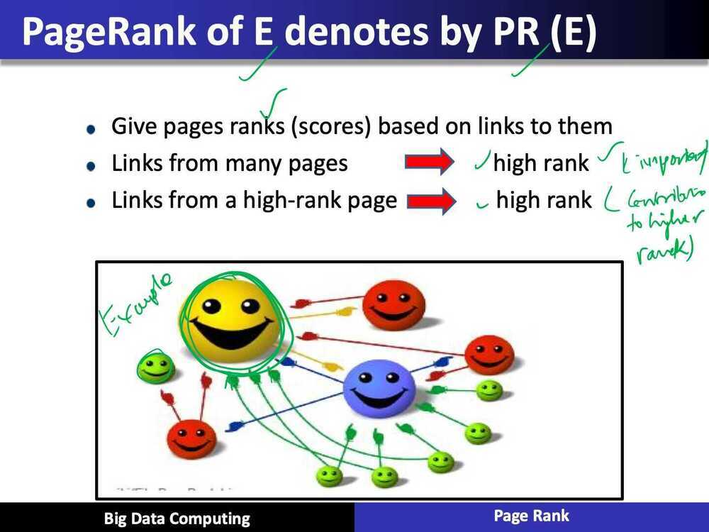
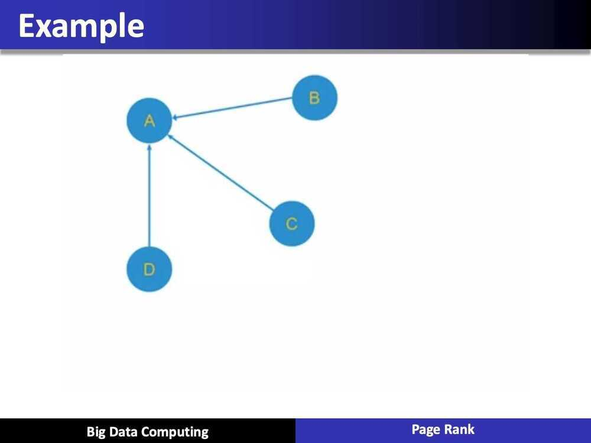
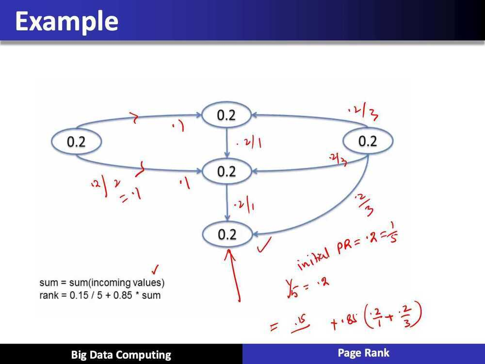
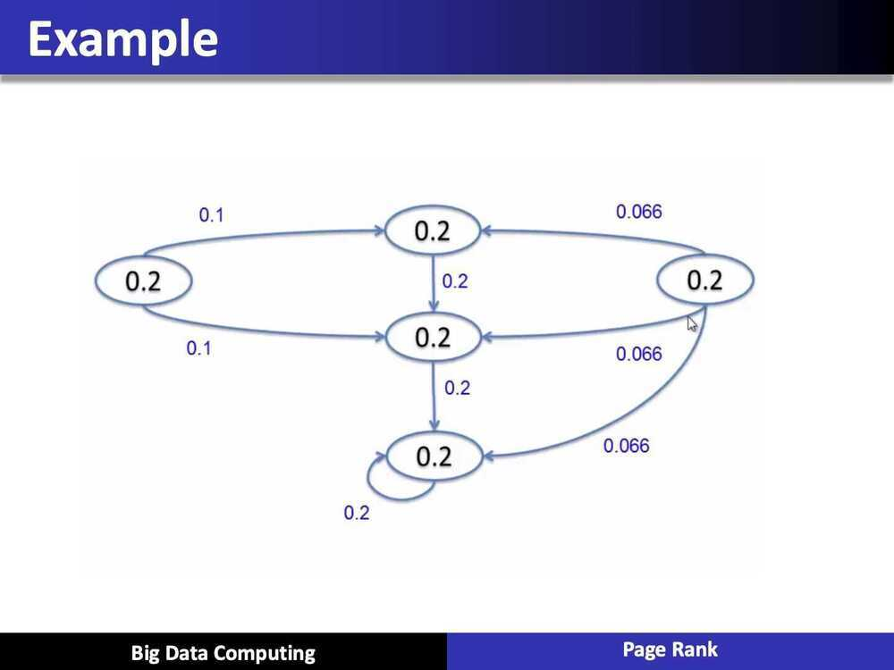
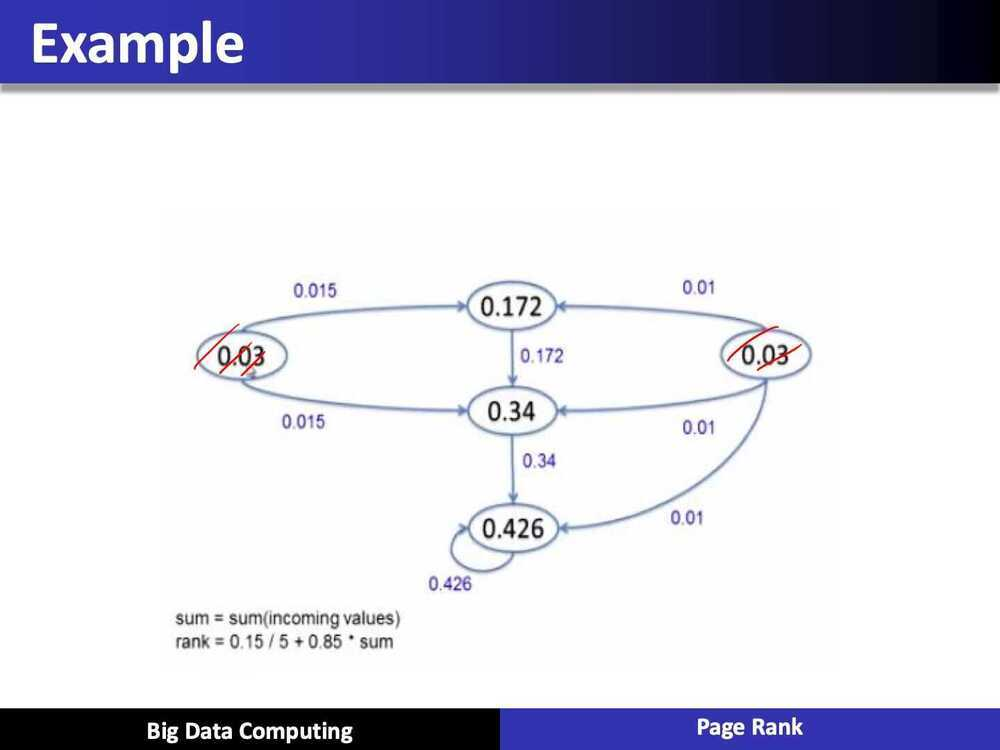

# Page Rank

<https://towardsdatascience.com/pagerank-algorithm-fully-explained-dc794184b4af>

## PageRank Algorithm in Big Data

## What is PageRank?

- Why is Page Importance Rating important?
  - New challenges for information retrieval on the World Wide Web
  - Huge number of web pages: 150 million by 1998, 1000 billion by 2008
  - Diversity of web pages: different topics, different quality, etc.
- What is PageRank?
  - A method for rating the importance of web pages objectively and mechanically using the link structure of the web.
  - History:
    - PageRank was developed by Larry Page and Sergey Brin
    - It was part of a research project about a new kind of search engine. That project started in 1995 and led to a functional prototype in 1998

## Conclusion

- Graph-structured data are increasingly common in data science contexts due to their ubiquity in modeling the communication between entities: people (social networks), computers (Internet communication), cities and countries (transportation networks), or corporations (financial transactions).
