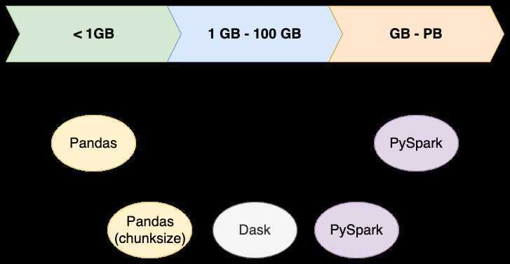

# Processing Engine

A processing engine, sometimes called a processing framework, is responsible for performing data processing tasks (an illuminating explanation, I know). A comparison is probably the best way to understand this. Apache Hadoop is an open source software platform that also deals with "Big Data" and distributed computing. Hadoop has a processing engine, distinct from Spark, called MapReduce. MapReduce has its own particular way of optimizing tasks to be processed on multiple nodes and Spark has a different way. One of Sparks strengths is that it is a processing engine that can be used on its own, or used in place of Hadoop MapReduce, taking advantage of the other features of Hadoop.

Processing frameworks compute over the data in the system, either by reading from non-volatile storage or as it is ingested into the system. Computing over data is the process of extracting information and insight from large quantities of individual data points.

- Batch-only frameworks:
  - [Apache Hadoop](https://www.digitalocean.com/community/tutorials/hadoop-storm-samza-spark-and-flink-big-data-frameworks-compared#apache-hadoop)
- Stream-only frameworks:
  - [Apache Storm](https://www.digitalocean.com/community/tutorials/hadoop-storm-samza-spark-and-flink-big-data-frameworks-compared#apache-storm)
  - [Apache Samza](https://www.digitalocean.com/community/tutorials/hadoop-storm-samza-spark-and-flink-big-data-frameworks-compared#apache-samza)
- Hybrid frameworks:
  - [Apache Spark](https://www.digitalocean.com/community/tutorials/hadoop-storm-samza-spark-and-flink-big-data-frameworks-compared#apache-spark)
  - [Apache Flink](https://www.digitalocean.com/community/tutorials/hadoop-storm-samza-spark-and-flink-big-data-frameworks-compared#apache-flink)

Processing frameworks and processing engines are responsible for computing over data in a data system. While there is no authoritative definition setting apart "engines" from "frameworks", it is sometimes useful to define the former as the actual component responsible for operating on data and the latter as a set of components designed to do the same.

For instance, Apache Hadoopcan be considered aprocessing frameworkwithMapReduceas its defaultprocessing engine. Engines and frameworks can often be swapped out or used in tandem. For instance, Apache Spark, another framework, can hook into Hadoop to replace MapReduce. This interoperability between components is one reason that big data systems have great flexibility.

## Batch Processing Systems

Batch processinghas a long history within the big data world. Batch processing involves operating over a large, static dataset and returning the result at a later time when the computation is complete.

The datasets in batch processing are typically...

- bounded: batch datasets represent a finite collection of data
- persistent: data is almost always backed by some type of permanent storage
- large: batch operations are often the only option for processing extremely large sets of data

Batch processing is well-suited for calculations where access to a complete set of records is required. For instance, when calculating totals and averages, datasets must be treated holistically instead of as a collection of individual records. These operations require that state be maintained for the duration of the calculations.

Tasks that require very large volumes of data are often best handled by batch operations. Whether the datasets are processed directly from permanent storage or loaded into memory, batch systems are built with large quantities in mind and have the resources to handle them. Because batch processing excels at handling large volumes of persistent data, it frequently is used with historical data.

The trade-off for handling large quantities of data is longer computation time. Because of this, batch processing is not appropriate in situations where processing time is especially significant.

## Stream Processing Systems

Stream processingsystems compute over data as it enters the system. This requires a different processing model than the batch paradigm. Instead of defining operations to apply to an entire dataset, stream processors define operations that will be applied to each individual data item as it passes through the system.

The datasets in stream processing are considered "unbounded". This has a few important implications:

- Thetotaldataset is only defined as the amount of data that has entered the system so far.
- Theworkingdataset is perhaps more relevant, and is limited to a single item at a time.
- Processing is event-based and does not "end" until explicitly stopped. Results are immediately available and will be continually updated as new data arrives.

Stream processing systems can handle a nearly unlimited amount of data, but they only process one (true stream processing) or very few (micro-batch processing) items at a time, with minimal state being maintained in between records. While most systems provide methods of maintaining some state, steam processing is highly optimized for morefunctional processingwith few side effects.

Functional operations focus on discrete steps that have limited state or side-effects. Performing the same operation on the same piece of data will produce the same output independent of other factors. This kind of processing fits well with streams because state between items is usually some combination of difficult, limited, and sometimes undesirable. So while some type of state management is usually possible, these frameworks are much simpler and more efficient in their absence.

This type of processing lends itself to certain types of workloads. Processing with near real-time requirements is well served by the streaming model. Analytics, server or application error logging, and other time-based metrics are a natural fit because reacting to changes in these areas can be critical to business functions. Stream processing is a good fit for data where you must respond to changes or spikes and where you're interested in trends over time.

## Hybrid Processing Systems: Batch and Stream Processors

Some processing frameworks can handle both batch and stream workloads. These frameworks simplify diverse processing requirements by allowing the same or related components and APIs to be used for both types of data.

As you will see, the way that this is achieved varies significantly between Spark and Flink, the two frameworks we will discuss. This is a largely a function of how the two processing paradigms are brought together and what assumptions are made about the relationship between fixed and unfixed datasets.

While projects focused on one processing type may be a close fit for specific use-cases, the hybrid frameworks attempt to offer a general solution for data processing. They not only provide methods for processing over data, they have their own integrations, libraries, and tooling for doing things like graph analysis, machine learning, and interactive querying.

## Summary

There are plenty of options for processing within a big data system.

For batch-only workloads that are not time-sensitive, Hadoop is a good choice that is likely less expensive to implement than some other solutions.

For stream-only workloads, Storm has wide language support and can deliver very low latency processing, but can deliver duplicates and cannot guarantee ordering in its default configuration. Samza integrates tightly with YARN and Kafka in order to provide flexibility, easy multi-team usage, and straightforward replication and state management.

For mixed workloads, Spark provides high speed batch processing and micro-batch processing for streaming. It has wide support, integrated libraries and tooling, and flexible integrations. Flink provides true stream processing with batch processing support. It is heavily optimized, can run tasks written for other platforms, and provides low latency processing, but is still in the early days of adoption.

The best fit for your situation will depend heavily upon the state of the data to process, how time-bound your requirements are, and what kind of results you are interested in. There are trade-offs between implementing an all-in-one solution and working with tightly focused projects, and there are similar considerations when evaluating new and innovative solutions over their mature and well-tested counterparts.

<https://www.digitalocean.com/community/tutorials/hadoop-storm-samza-spark-and-flink-big-data-frameworks-compared>

[Big Data Architecture: A ksqlDB and Kubernetes Tutorial](https://www.toptal.com/big-data/ksqldb-kubernetes-tutorial)
