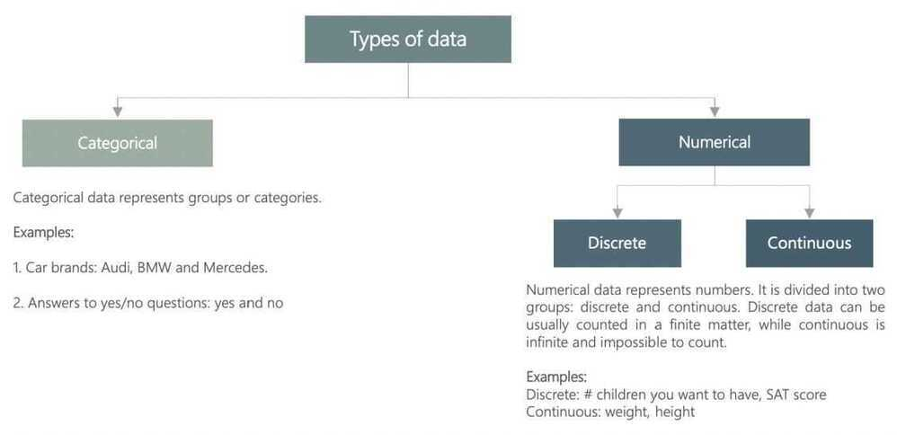

# Types of Data

## Types of Data - by organization

### 1. Structured data

Structured data is data whose elements are addressable for effective analysis. It has been organized into a formatted repository that is typically a database. It concerns all data which can be stored in database SQL in a table with rows and columns. They have relational keys and can easily be mapped into pre-designed fields. Today, those data are most processed in the development and simplest way to manage information.Example:Relational data.

### 2. Semi-Structured data

Semi-structured data is information that does not reside in a relational database but that have some organizational properties that make it easier to analyze. With some process, you can store them in the relation database (it could be very hard for some kind of semi-structured data), but Semi-structured exist to ease space.Example: XML data.

### 3. Unstructured data

Unstructured data is a data which is not organized in a predefined manner or does not have a predefined data model, thus it is not a good fit for a mainstream relational database. So for Unstructured data, there are alternative platforms for storing and managing, it is increasingly prevalent in IT systems and is used by organizations in a variety of business intelligence and analytics applications.Example: Word, PDF, Text, Media logs.

### Differences between Structured, Semi-structured and Unstructured data

| **Properties** | **Structured data** | **Semi-structured data** | **Unstructured data** |
|---|---|---|---|
| **Technology** | It is based on Relational database table | It is based on XML/RDF(Resource Description Framework). | It is based on character and binary data |
| **Transaction management** | Matured transaction and various concurrency techniques | Transaction is adapted from DBMS not matured | No transaction management and no concurrency |
| **Version management** | Versioning over tuples, row, tables | Versioning over tuples or graph is possible | Versioned as a whole |
| **Flexibility** | It is schema dependent and less flexible | It is more flexible than structured data but less flexible than unstructured data | It is more flexible and there is absence of schema |
| **Scalability** | It is very difficult to scale DB schema | It's scaling is simpler than structured data | It is more scalable. |
| **Robustness** | Very robust | New technology, not very spread | - |
| **Query performance** | Structured query allow complex joining | Queries over anonymous nodes are possible | Only textual queries are possible |

<https://www.geeksforgeeks.org/difference-between-structured-semi-structured-and-unstructured-data>

## Types of Data by data type

|  |  |
|---|---|
| Categorical data | A subset of types of data. Describes categories or groups. |
| Numerical data | A subset of types of data. Represents numbers. Can be further divided into discrete and continuous. |
| Discrete data | Data that can be counted in a finite matter. Opposite of continuous. |
| Continuous data | Data that is 'infinite' and impossible to count. Opposite of discrete. |
| Levels of measurement | A way to classify data. There are two levels of measurement - qualitative and quantitative, which are further divided into nominal & ordinal, and ratio & interval, respectively. |
| Qualitative data | A subset of levels of measurement. There are two types of qualitative data - nominal and ordinal. |
| Quantitative data | A subset of levels of measurement. There are two types of quantitative data - ratio and interval. |
| Nominal | Refers to variables that describe different categories and cannot be put in any order. |
| Ordinal | Refers to variables that describe different categories, but can be ordered. |
| Ratio | A number, no matter if whole or a fraction. There exists a unique and unambiguous zero point. |
| Interval | An interval variable represents a number or an interval. There isn't a unique and unambiguous zero point. For example, degrees in Celsius and Fahrenheit are interval variables, while Kelvin is a ratio variable. |

## Types of data sets

### Record

Data that consists of a collection of records, each of which consists of a fixed set of attributes

### Data Matrix

- If data objects have the same fixed set of numeric attributes, then the data objects can be thought of as points in a multi-dimensional space, where each dimension represents a distinct attribute
- Such data set can be represented by an m by n matrix, where there are m rows, one for each object, and n columns, one for each attribute

### Document Data

- Each document becomes a 'term' vector
  - Each term is a component (attribute) of the vector
  - the value of each component is the number of times the corresponding term occurs in the document

### Transaction Data

- A special type of record data, where
  - each record (transaction) involves a set of items
  - For example, consider a grocery store. The set of products purchased by a customer during one shopping trip consitute a transaction, while the individual products that were purchased are the items

- **Graph**
  - World Wide Web
  - Molecular Structures
- **Ordered**
  - Spatial Data
  - Temporal Data
  - Sequential Data
  - Genetic Sequence Data

### User Generated Data

1. Clickstreams

### Application Generated Data

1. Performance Metrics

### Machine Generated Data

1. Network flows
2. Server metrics

### Devops

1. Backfilling datasets
2. Validating data
3. Scheduling workflows
