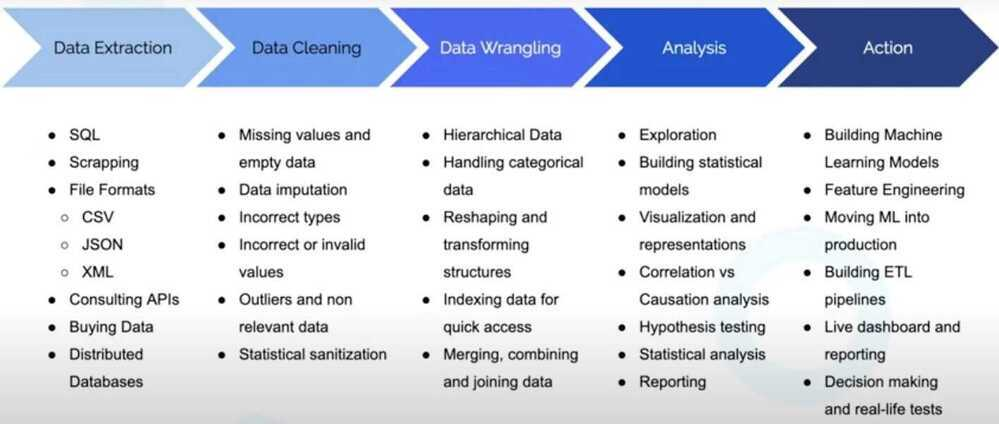

# Data Analysis

https://www.freecodecamp.org/learn/data-analysis-with-python

"All models are wrong, some are useful" - George Box

"Better to be roughly right than precisely wrong" - John Keynes

## Data Analysis

A process of inspecting, cleansing, transforming and modeling data with the goal of **discovering useful information**, informing conclusion and supporting decision-making.

## Exploratory Data Analysis (EDA)

In [statistics](https://en.wikipedia.org/wiki/Statistics), exploratory data analysis is an approach to [analyzing](https://en.wikipedia.org/wiki/Data_analysis)[data sets](https://en.wikipedia.org/wiki/Data_set) to summarize their main characteristics, often with visual methods. A [statistical model](https://en.wikipedia.org/wiki/Statistical_model) can be used or not, but primarily EDA is for seeing what the data can tell us beyond the formal modeling or hypothesis testing task. EDA is different from [initial data analysis (IDA)](https://en.wikipedia.org/wiki/Data_analysis#Initial_data_analysis), which focuses more narrowly on checking assumptions required for model fitting and hypothesis testing, and handling missing values and making transformations of variables as needed. EDA encompasses IDA.

- We can always use EDA to get insights on the data we are working on.
- Practice of using visual & quantitative methods to understand a dataset without making assumptions about its contents.
- Anscombe's Quartet

Anscombe's quartet comprises four [data sets](https://en.wikipedia.org/wiki/Data_set) that have nearly identical simple [descriptive statistics](https://en.wikipedia.org/wiki/Descriptive_statistics), yet have very different [distributions](https://en.wikipedia.org/wiki/Probability_distribution) and appear very different when [graphed](https://en.wikipedia.org/wiki/Plot_(graphics)). Each dataset consists of eleven [(x, y) points](https://en.wikipedia.org/wiki/Cartesian_coordinate_system). They were constructed in 1973 by the [statistician](https://en.wikipedia.org/wiki/Statistician)[Francis Anscombe](https://en.wikipedia.org/wiki/Francis_Anscombe) to demonstrate both the importance of graphing data before analyzing it and the effect of [outliers](https://en.wikipedia.org/wiki/Outlier) and other [influential observations](https://en.wikipedia.org/wiki/Influential_observations) on statistical properties. He described the article as being intended to counter the impression among statisticians that "numerical calculations are exact, but graphs are rough."

https://en.wikipedia.org/wiki/Anscombe%27s_quartet

- ggplot2, The Gramer of Graphics
- We have to remove outliers, so it does not skew out classifiers.

- Maximum penetration into the data
- Identification of basic structures
- Selection of the most important variables
- Detection of deviations and anomalies
- Testing of basic hypotheses

https://towardsdatascience.com/5-advanced-visualisation-for-exploratory-data-analysis-eda-c8eafeb0b8cb

[Unlock the Power of Data Analytics with Free Google Services](https://www.freecodecamp.org/news/data-analytics-with-google-stack/)

[A Course in Exploratory Data Analysis](https://bayesball.github.io/EDA/)

## Data Analyst Roadmap

- [Data Analyst Roadmap](https://roadmap.sh/data-analyst)
- [Solve Python | HackerRank](https://www.hackerrank.com/domains/python)
- [GitHub - alfarias/awesome-kaggle-kernels: Compilation of good Kaggle Kernels.](https://github.com/alfarias/awesome-kaggle-kernels)
- [Meta Data Analyst Professional Certificate | Coursera](https://www.coursera.org/professional-certificates/meta-data-analyst)
