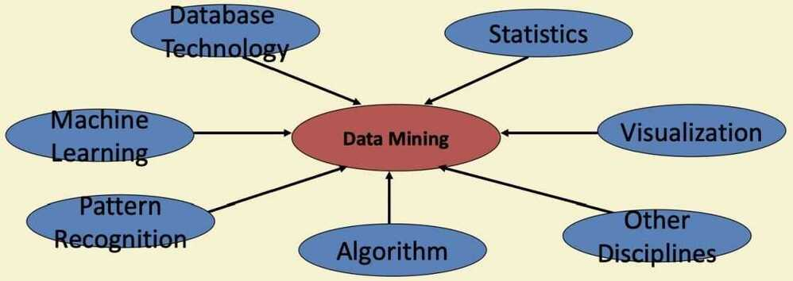

# Data Mining

## Why data Mining

- The explosive growth of data: from terabytes to petabytes
  - Data collection and data availability
    - Automated data collection tools, database systems, Web, computerized society
  - Major sources of abundant data
    - Business: Web, e-commerce, transactions, stocks
    - Science: Remate sensing, bioinformatics, scientific simulation
    - Society and everyone: news, digital cameras, YouTube
- We are drowning in data, but starving for knowledge
- "Necessity is the mother of investion" -- Data mining -- Automated analysis of massive data

## What is Data Mining

- Data mining (knowledge discovery from data)
  - Extraction of interesting (non-trivial, implicit, previously unknown and potentially useful) patterns of knowledge from huge amount of data
- Alternative nams
  - Knowledge discovery (mining) in databases (KDD), knowledge extraction, data/pattern analysis, data archeology, data dredging, information harvesting, business intelligence

## Data Mining: Confluence of Multiple Disciplines

## Why not traditional data analysis?

- Tremendous amount of data
  - Algorithms must be highly scalable to handle such terabytes of data
- High-dimensionality of data
  - Micro-array may have tens of thousands of dimensions
- High complexity of data
  - Data streams and sensor data
  - Time-series data, temporal data, sequence data
  - Structure data, graphs, social networks and multi-linked data
  - Heterogeneous dtabases and legacy databases
  - Spatial, spatiotemporal, multimedia, text and web data

## Data Mining: On what kinds of data?

- Database-oriented data sets and applications
  - Relational database, data warehouse, transactional database
- Advanced data sets and advanced applications
  - Data streams and sensor data
  - Time-series data, temporal data, sequence data (incl. bio-sequences)
  - Structure data, graphs, social networks and multi-linked data
  - Object-relational databases
  - Heterogeneous databases and legacy databases
  - Spatial data and spatiotemporal data
  - Multimedia database
  - Text databases
  - The world-wide web

## Data Mining Functionalities

- Multidimensional concept description: Characterization and discrimination
  - Generalize, summarize, and contrast data characteristics e.g. dry vs wet regions
- Frequent patterns, association, correlation vs causality
  - Tea -> Sugar [0.5%, 75%] (Correlation or causality?)
- Classification and prediction
  - Contruct models (functions) that describe and distinguish classes or concepts for future prediction
    - Eg. Classify countries based on (climate), or classify cars based on (gas mileage)
  - Predict some unknown or missing numerical values
- Cluster analysis
  - Class label is unknown: Group data to form new classes, e.g., cluster houses to find distribution patterns
  - Maximizing intra-class similarity & minimizing interclass similarity
- Outlier analysis
  - Outlier: Data object that does not comply with the general behavior of the data
  - Noise or exception? Useful in fraud detection, rare events analysis
- Trend and evolution analysis
  - Trend and deviation: e.g. regression analysis
  - Sequential pattern mining: e.g., digital camera -> large SD memory
  - Periodicity analysis
  - Similarity-based analysis
- Other pattern-directed or statistical analysis

## Major Issues in Data Mining

- **Mining methodology**
  - Mining different kinds of knowledge from diverse data types, e.g., bio, stream, web
  - Performance: efficiency, effectiveness, and scalability
  - Pattern evaluation: the interestingness problem
  - Incorporation of background knowledge
  - Handling noise and incomplete data
  - Parallel, distributed and incremental mining methods
  - Integration of the discovered knowledge with existing one: knowledge fusion
- **User interaction**
  - Data mining query languages and ad-hoc mining
  - Expression and visualization of data mining results
  - Interactive mining of knowledge at multiple levels of abstraction
- **Applications and social impacts**
  - Domain-specific data mining & invisible data mining
  - Protection of data security, integrity and privacy

## Architecture: Typical Data Mining System

## KDD Process: Summary

- Learning the application domain
  - Relevant prior knowledge and goals of application
- Creating a target data set: data selection
- Data cleaning and preprocessing
- Data reduction and transformation
  - Find useful features, dimensionality/variable reduction, invariant representation
- Choosing functions of data mining
  - Summarization, classification, regression, association, clustering
- Choosing the mining algorithm(s)
- Data mining: search for patterns of interest
- Pattern evaluation and knowledge presentation
  - Visualization, transformation, removing redundant patterns
- Use of discovered knowledge

## Components of Data Mining Algorithms

- Model Representation
  - Determining the nature and structure of the representation to be used
- Score function
  - Measuring how well different representations fit the data
- Search / Optimization method
  - An algorithm to optimize the score function
- Data management
  - Deciding what principles of data management are required to implement the algorithms efficiently

## Steps of Data Mining Algorithm

Task > Representation > Score Function > Search/Optimization > Data Management > Models, Parameters
