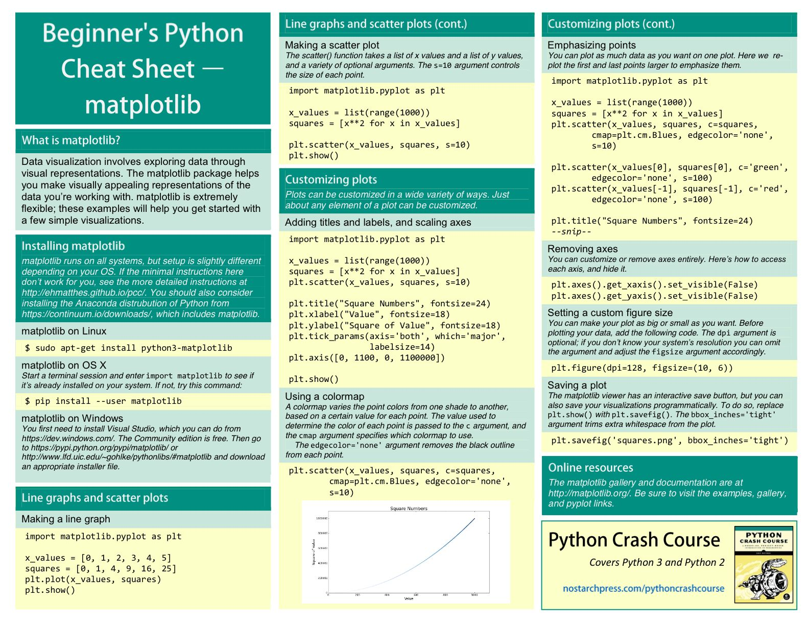
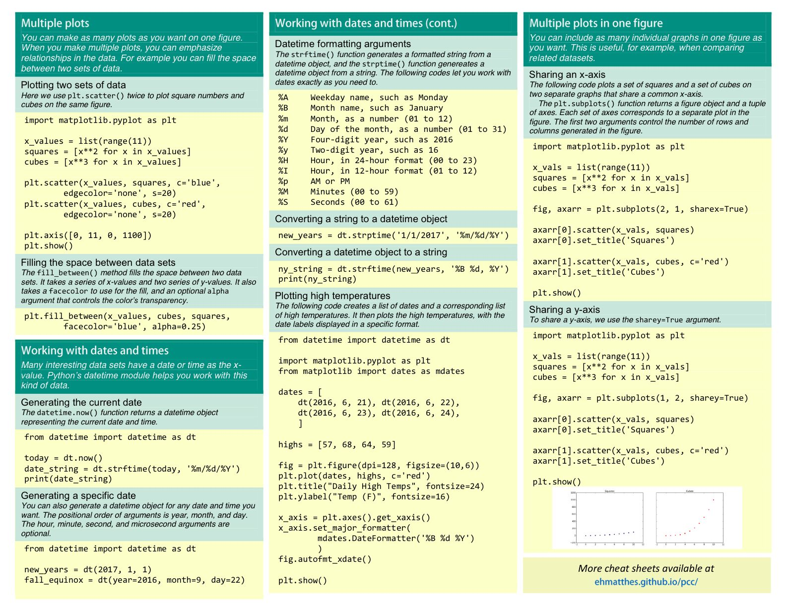
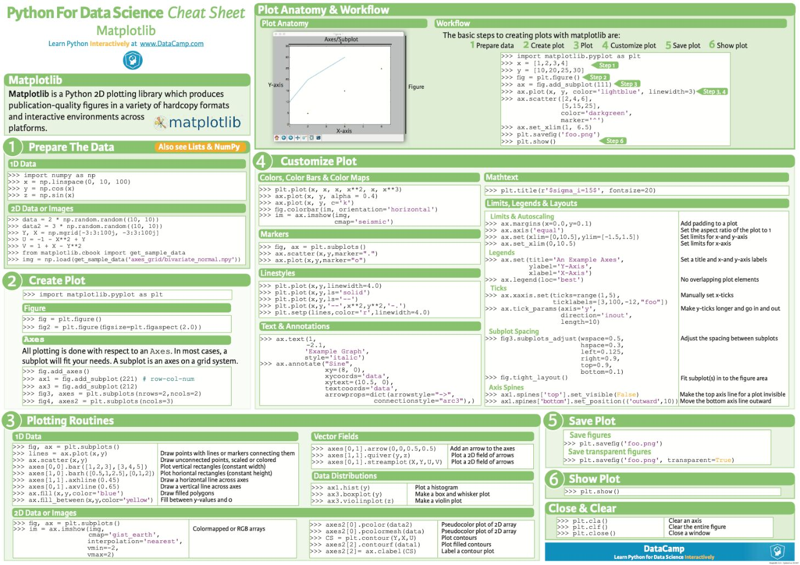
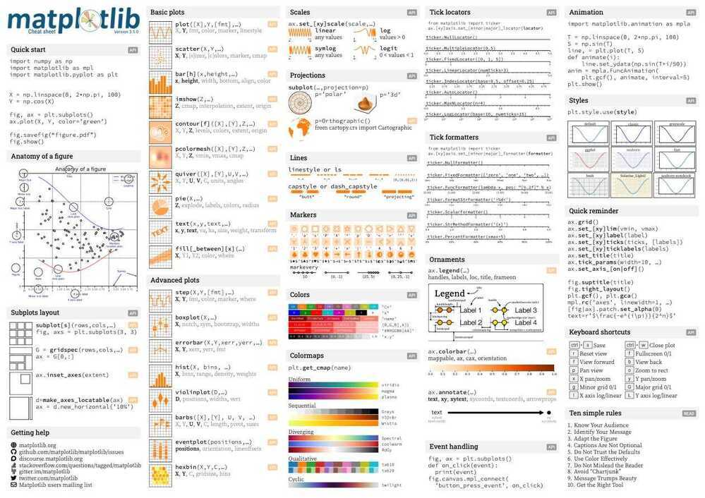
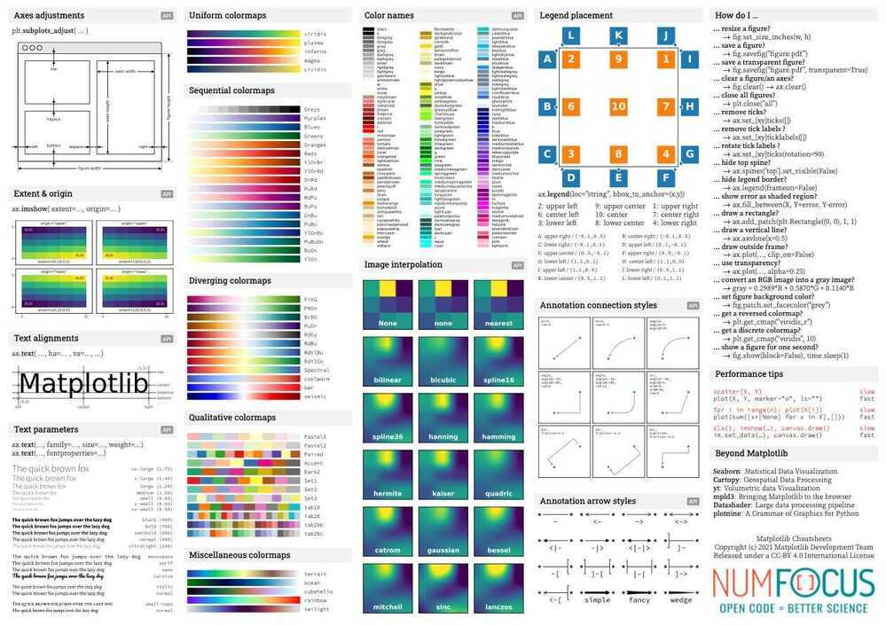

# Matplotlib

Matplotlib

2-dimensional graphs and plots

https://matplotlib.org

https://www.dataquest.io/blog/matplotlib-tutorial

https://www.machinelearningplus.com/plots/top-50-matplotlib-visualizations-the-master-plots-python

```python
import matplotlib.pyplot as plt

plt.bar(range(len(counts)), counts)
plt.show()

plt.hist(tweets ["user_age"])
plt.show()

plt.hist(tweets ["user_age"])
plt.title("Tweets mentioning candidates")
plt.xlabel("Twitter account age in years")
plt.ylabel("# of tweets")
plt.show()

plt.hist([
        cl_tweets,
        sa_tweets,
        tr_tweets
    ],
    stacked = True,
    label=["clinton", "sanders", "trump"]
)

plt.legend()

plt.title("Tweets mentioning each candidate")
plt.xlabel("Twitter account age in years")
plt.ylabel("# of tweets")

plt.show()
```











## Others

### seaborn

https://stackabuse.com/seaborn-library-for-data-visualization-in-python-part-1

### bokeh

https://docs.bokeh.org/en/latest/index.html
