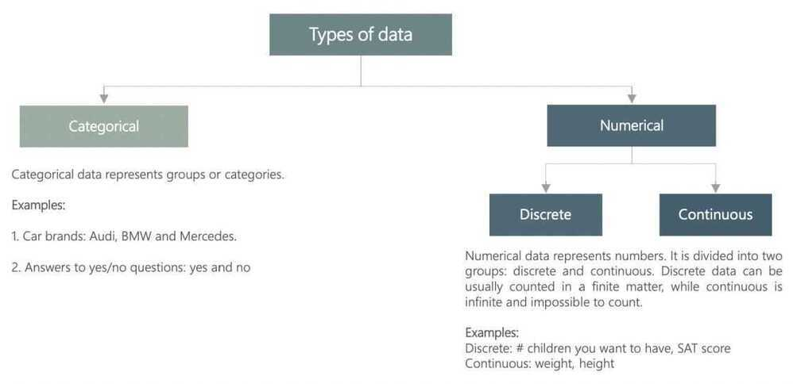
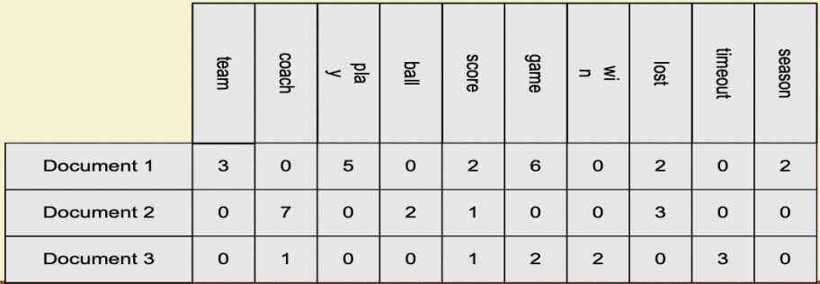
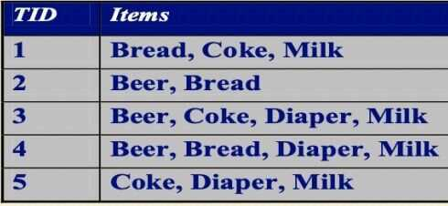

# Data

- What is Data
- Types of Attributes
  - Nominal
  - Ordinal
  - Interval
  - Ratio
- Properties of Attribute Values
  - Distinctness (=, !=)
  - Order (<, >)
  - Addition/Substraction
  - Multiplication/Division
- Discrete and Continuous Attributes
- Types of data set
  - Record
  - Graph
  - Ordered
- Data Quality
  - Noise and outliers
  - Missing values
  - Duplicate values
- Data Preprocessing
  - Aggregation
  - Attribute Transformation
  - Dimensionality Reduction
    - Feature Creation
    - Feature subset selection
  - Discretization and Binarization
  - Sampling
- Similarity and dissimilarity
  - Euclidean's distance
  - Mahalonobis distance
  - Cosine similarity
- Correlation

## What is Data

- Collection of data objects and their attributes
- An attribute is a property or characteristic of an object
  - Examples: eye color of a person, temperature, etc
  - Attribute is also known as variable, field, characteristic, or feature
- A collection of attributes describe an object
  - Object is also known as record, point, case, sample, entity, or instance

## Types of Attributes

There are different types of attributes

- Nominal
  - Examples: ID numbers, eye color, zip colors
- Ordinal
  - Examples: rankings (e.g., taste of potato chips on a scale from 1-10), grades, height in {tall, medium, short}
- Interval
  - Examples: calendar dates, temperatures in Celsius or Fahrenheit
- Ratio
  - Examples: temperature in Kelvin, length, time, counts

## Properties of Attribute Values

- The type of an attribute depends on which of the following properties it posseses:
  - Distinctness: equal to, not equal to
  - Order: < >
  - Addition: + -
  - Multiplication * /

- Nomical attribute: distinctness
- Ordinal attribute: distinctness & order
- Interval attribute: distinctness, order & addition
- Ratio attribute: all 4 properties

## Discrete and Continuous Attributes

- **Discrete Attribute**
  - Has only a finite and countably infinite set of values
  - Examples: zip code, counts, or the set of words in a collection of documents
  - Often represented as integer variables
  - Note: binary attributes are a special case of discrete attributes
- **Continuous Attribute**
  - Has real numbers as attributes values
  - Examples: temperature, height, or weight
  - Practically, real values can only be measured and represented using a finite number of digits
  - Continous attributes are typically represented as floating-point variables

## Types of Data

|  |  |
|---|---|
| Categorical data | A subset of types of data. Describes categories or groups. |
| Numerical data | A subset of types of data. Represents numbers. Can be further divided into discrete and continuous. |
| Discrete data | Data that can be counted in a finite matter. Opposite of continuous. |
| Continuous data | Data that is 'infinite' and impossible to count. Opposite of discrete. |
| Levels of measurement | A way to classify data. There are two levels of measurement - qualitative and quantitative, which are further divided into nominal & ordinal, and ratio & interval, respectively. |
| Qualitative data | A subset of levels of measurement. There are two types of qualitative data - nominal and ordinal. |
| Quantitative data | A subset of levels of measurement. There are two types of quantitative data - ratio and interval. |
| Nominal | Refers to variables that describe different categories and cannot be put in any order. |
| Ordinal | Refers to variables that describe different categories, but can be ordered. |
| Ratio | A number, no matter if whole or a fraction. There exists a unique and unambiguous zero point. |
| Interval | An interval variable represents a number or an interval. There isn't a unique and unambiguous zero point. For example, degrees in Celsius and Fahrenheit are interval variables, while Kelvin is a ratio variable. |

## Types of data sets

- **Record**
  - Data that consists of a collection of records, each of which consists of a fixed set of attributes

- Data Matrix
  - If data objects have the same fixed set of numeric attributes, then the data objects can be thought of as points in a multi-dimensional space, where each dimension represents a distinct attribute
  - Such data set can be represented by an m by n matrix, where there are m rows, one for each object, and n columns, one for each attribute

- Document Data
  - Each document becomes a 'term' vector
    - Each term is a component (attribute) of the vector
    - the value of each component is the number of times the corresponding term occurs in the document

- Transaction Data
  - A special type of record data, where
    - each record (transaction) involves a set of items
    - For example, consider a grocery store. The set of products purchased by a customer during one shopping trip consitute a transaction, while the individual products that were purchased are the items

- **Graph**
  - World Wide Web
  - Molecular Structures
- **Ordered**
  - Spatial Data
  - Temporal Data
  - Sequential Data
  - Genetic Sequence Data

## User Generated Data

1. Clickstreams

## Application Generated Data

1. Performance Metrics

## Machine Generated Data

1. Network flows
2. Server metrics

## Devops

1. Backfilling datasets
2. Validating data
3. Scheduling workflows

## Data Wrangling

Data wrangling, sometimes referred to asdata munging, is the process of transforming and [mapping data](https://en.wikipedia.org/wiki/Data_mapping) from one "[raw](https://en.wikipedia.org/wiki/Raw_data)" data form into another [format](https://en.wikipedia.org/wiki/Content_format) with the intent of making it more appropriate and valuable for a variety of downstream purposes such as analytics. Adata wrangleris a person who performs these transformation operations.

This may include further [munging](https://en.wikipedia.org/wiki/Mung_(computer_term)), [data visualization](https://en.wikipedia.org/wiki/Data_visualization), data aggregation, training a [statistical model](https://en.wikipedia.org/wiki/Statistical_model), as well as many other potential uses. Data munging as a process typically follows a set of general steps which begin with extracting the data in a raw form from the data source, "munging" the raw data using algorithms (e.g. sorting) or parsing the data into predefined data structures, and finally depositing the resulting content into a data sink for storage and future use.

<https://en.wikipedia.org/wiki/Data_wrangling>
