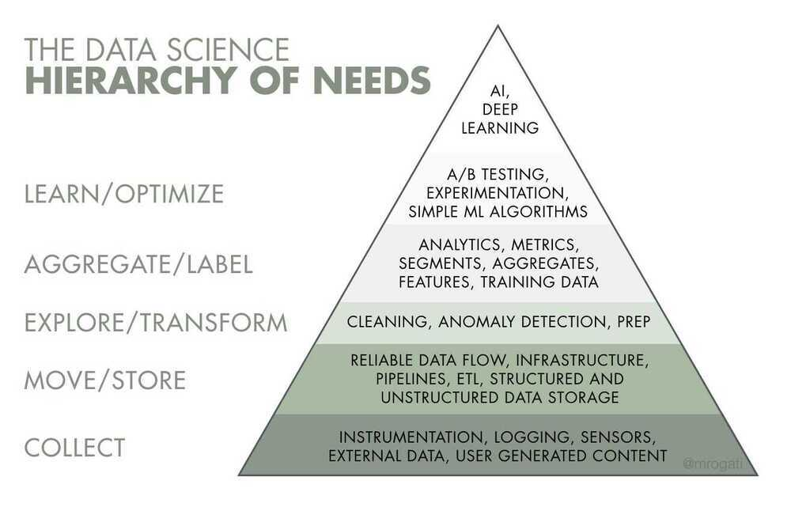

# Intro

1. Problem Framing
2. Data Understanding
3. Data Cleaning
4. Data Selection
5. Data Preparation
6. Model Evaluation
7. Model Configuration
8. Model Selection
9. Model Presentation
10. Model Predictions

https://machinelearningmastery.com/statistical-methods-in-an-applied-machine-learning-project

## Types of Data Science

### Descriptive Analytics (Business Intelligence)

Get useful data in front of the right people in the form of dashboards, reports and emails

- Which customers have churned?
- Which homes have sold in a given location, and do homes of a certain size sell more quickly?

### Predictive Analytics (Machine Learning)

Put data science models continuously into production

- Which customers may churn?
- How much will a home sell for, given its location and number of rooms?

### Prescriptive Analytics (Decision Science)

Use data to help a company make decisions

- What should we do about the particular types of customers that are prone to churn?
- How should we market a home to sell quickly, given its location and number of rooms?

Prescriptive analytics **uses data, algorithms, and machine learning to recommend the best course of action to achieve a specific goal**, going beyond predicting future outcomes to suggest "what should we do?". It optimizes processes, resource allocation, and decision-making by simulating various strategies and presenting the optimal one based on predicted outcomes and business rules.

### Difference

**Descriptive analytics explains what happened in the past, predictive analytics forecasts what is likely to happen in the future, and prescriptive analytics recommends the best course of action to take**. Descriptive analytics uses historical data to find patterns and answer "what happened?". Predictive analytics uses statistical models and historical data to forecast future outcomes and answer "what might happen?". Prescriptive analytics builds on these to suggest specific actions and answer "what should we do?".

## Fields

### Data Analysis

Taking raw information and turning it into knowledge that can be acted on or that can drive a decision

- Domain knowledge - translate a business need to a question, make accuracy-cost trade-offs
- Research - gather the data, design and conduct experiments
- Interpretation - Summarize and aggregate, visualize, apply statistical tools

### Data Modeling

Using the data that we have to estimate the data that we wish we had

- Supervised learning - classification, regression, anomaly detection
- Unsupervised learning - clustering, dimensionality reduction, anomaly detection
- Custom algorithm development - feature engineering, numerical optimization

### Data Engineering

Taking these analysis and modeling activities and making everything work faster, more robustly, and on larger quantities of data

- Data management - database management, pipeline construction, data collection
- Production - automation, system integration, robustification
- Software engineering - ensure maintainability, scaling, collaborative development

- https://medium.com/@darshilp/roadmap-for-data-engineering-2023-13f62f85d866
- https://medium.com/@darshilp/roadmap-for-data-engineering-2024-af7ea4ead400
- https://github.com/igorbarinov/awesome-data-engineering
- https://github.com/gunnarmorling/awesome-opensource-data-engineering

### Data Mechanics

- Data formatting - type conversion, string manipulation, fixing errors
- Value interpretation - dates and times, units of measurement, missing values
- Data handling - querying, slicing, joining

https://brohrer.github.io/data_science_archetypes.html

## Questions for any new data science project

1. What is the question you are trying to answer?
2. Do you know exactly what you are trying to measure?
3. Do you have the right data to answer your question?
4. Do you know enough about how your data was collected?
5. Are there any ethical considerations?
6. Who is going to read your analysis and how much do they understand statistics?
7. Do you need to be able to interrogate your methods?

## Talk: How did python become a data science powerhouse

1. Plotting libraries

   - Matplotlib
   - Bokeh

2. Numpy
3. Pandas
4. Scipy
5. Scikit-learn
6. Jupyter Notebook
7. Dask (parallel computation)
8. Numba (Code Optimization - convert to LLVM)
9. Cython (Code Optimization - compiles to C)

## Topic Models

The grouping of relevant words is highly suggestive of an abstract theme which is called a topic. Based on the assumption that words that are in the same topic are more likely to occur together, it is possible to attribute phrases or keywords to a particular topic. This allows us to alias a particular topic with a number of phrases and words.

- A topic example - tobacco, farm, crops
- Steps to perform topic modeling
    - Remove stop words
    - Stripping punctuation
    - Bigram collocation detection
    - Lemmatization
- Topic dendrograms (for hierarical clustering)
- Topic graphs
- Difference between graphs and dendrograms
- Gensim
- LDA

## Building a Data Science Team

- Data Engineer
    - Store and maintain data
    - SQL/Java/Scala/Python
    - These are the folks who build pipelines that feed data scientists with data and take the ideas from the data scientists and implement them. Aka, "the doers".
- Data Analyst
    - Visualize and describe data
    - SQL + BI Tools + Spreadsheets
- Machine Learning Engineer
    - Write production-level code to predict with data
    - Python/Java/R
    - Are experts at building machine learning and deep learning models. They build models not only for Amazon but also for other large enterprises on the AWS. In addition to building models, machine learning engineers at Amazon are also responsible for implementing models and getting them ready for production.
- Data Scientist
    - Build custom models to drive business decisions
    - Python/R/SQL
    - The folks who are "better engineers than statisticians and better statisticians than engineers". Aka, "the thinkers".
    - Have a focus on providing data-driven insights and are the link between the business and the technical side. They are responsible for analyzing large data sets and modeling them as well.
- Research scientists

Typically have a higher level of education, usually a Master's or a PhD. Research scientists are expected to push the envelope, meaning to extend the limits of what is possible. Research scientists will conduct research on old and new technologies to determine whether they're beneficial in practice.

- Applied scientists

Usually have a higher level of education. It is a slightly higher role than a research scientist at Amazon and requires passing a coding bar. Applied Scientists focus on projects to enhance Amazon's customer experience like Amazon's Automatic Speech Recognition (ASR), Natural Language Understanding (NLU), Audio Signal Processing, text-to-speech (TTS), and Dialog Management.

- SME - Subject Matter Expert
- Infrastructure Engineers

These are the folks who maintain the Hadoop cluster / big data infrastructure. Aka, "the plumbers".

## Data Science Team Organizational Models

## Hub and Spoke model

[Machine Learning Engineer vs Data Scientist vs Data Engineer](https://youtu.be/1xKzPBwBdn8)

https://www.analyticsvidhya.com/blog/2021/04/top-30-mcqs-to-ace-your-data-science-questions-interviews

[Learn Python for Data Science](https://www.youtube.com/playlist?list=PL2-dafEMk2A6QKz1mrk1uIGfHkC1zZ6UU)

## Learning / Resources / Newsletter

- All hands on data
- [11 Essential Plots That Data Scientists Use 95% of the Time](https://blog.dailydoseofds.com/p/11-essential-plots-that-data-scientists)

## Others

- [Global weather data from flying airplanes](https://clickhouse.com/blog/planes-weather)
