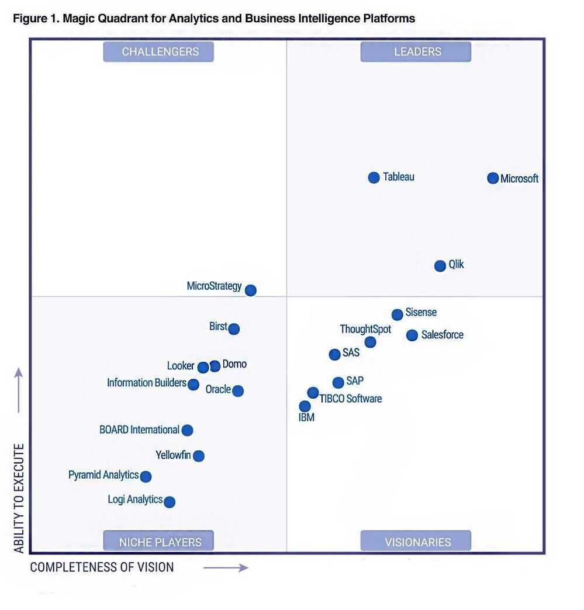

# BI Tools

https://www.toptal.com/business-intelligence/interview-questions

## PowerBI vs Google Data Studio

Overall, both Power BI and Google data studio are similar when it comes to data integration, **Power BI has better ease of working**(given our understanding of Microsoft tools such as Excel) and functionality whereas **Google data studio requires significant learning and workaround** to achievesimilar visualizations. Please find below details for the same.

- **Data Integration**
    - Both the tools connect to various data sources without much issues (In few instances, third party tools might be required for Google Data Studio).
    - However, Data studio has an edge when connecting with Google services. Google services like AdWords, Google Sheets and Google Analytics are natively fully integrated with Google Data Studio.
    - Google data studio might need third party applications such as Supermetricsfor adding few data sources.
- **Functionality**
    - Power BI has a large functionality with sophisticated functions. For example, basic functionality such asline, bar and pie chartsare available in both the tools, sophisticated functions suchCohort analysis, standard funnelare not available in Google data. However, I believe these visualizations could be achievedby modifying data using SQL queries.
    - Power BI is superior to Google data studio in processing data visualization with large data.
- **Ease of working**
    - Power BI's DAX functions being similarto Excel formulas (which most of the team members have experience on), is a bit easier to work on.
    - Working on Google data studio would be a learningcurve.
- **Pricing**
    - Power BI costs $10 per user while Google data studio is free of cost.
    - However, adding few data sources to Google data studio needs third party applications such as Supermetrics which costs between $20 - $50.
    - Given Google data studio is a cloud based application, it would eliminate the need for AWS machine(needed to build Power BI report)to builtthe reports.

## QlikView

- [Qlik Data Integration, Data Quality, and Analytics Solutions](https://www.qlik.com/us)
- [Qlik Sense | Modern Analytics](https://www.qlik.com/us/products/qlik-sense)
- [CDC Streaming: Modern Analytics & Data Replication \| Qlik](https://www.qlik.com/us/products/qlik-data-streaming-cdc)

## Others

1. QlikView
2. Klipfolio
3. Geckoboard
4. Google Data Studio
5. Domo
6. SSRS (Sql Server Reporting Services) - SQL Server Reporting Services(SSRS)is a server-based report generating software system from [Microsoft](https://en.wikipedia.org/wiki/Microsoft). It is part of a suite of [Microsoft SQL Server](https://en.wikipedia.org/wiki/Microsoft_SQL_Server) services, including SSAS ([SQL Server Analysis Services](https://en.wikipedia.org/wiki/SQL_Server_Analysis_Services)) and SSIS ([SQL Server Integration Services](https://en.wikipedia.org/wiki/SQL_Server_Integration_Services)).
7. Sisense - https://www.sisense.com
8. [SAS Viya: The High-Performance AI & Analytics Platform \| SAS India](https://www.sas.com/en_in/software/viya.html)

https://medium.com/activewizards-machine-learning-company/a-comparative-analysis-of-top-6-bi-and-data-visualization-tools-in-2018-658490665973

## Redash

Redash was built to allow fast and easy access to billions of records, that we process and collect using Amazon Redshift ("petabyte scale data warehouse" that "speaks" PostgreSQL). Today Redash has support for querying multiple databases, including: Redshift, Google BigQuery, PostgreSQL, MySQL, Graphite, Presto, Google Spreadsheets, Cloudera Impala, Hive and custom scripts.

### Redash consists of two parts

1. **Query Editor:** think of [JS Fiddle](https://jsfiddle.net/) for SQL queries. It's your way to share data in the organization in an open way, by sharing both the dataset and the query that generated it. This way everyone can peer review not only the resulting dataset but also the process that generated it. Also it's possible to fork it and generate new datasets and reach new insights.
2. **Visualizations and Dashboards:** once you have a dataset, you can create different visualizations out of it, and then combine several visualizations into a single dashboard. Currently Redash supports charts, pivot table, cohorts and [more](https://redash.io/help/user-guide/visualizations/visualization-types)

https://github.com/getredash/redash

[https://redash.io](https://redash.io/)

https://hub.helm.sh/charts/redash/redash

[redash, Re-imagine the Dash-board \| by Ajith Shetty \| Medium](https://ajithshetty28.medium.com/redash-re-imagine-the-dash-board-17d80b277f91)

[How to schedule a query](https://redash.io/help/user-guide/querying/scheduling-a-query/)

## Rive

Rive is a real-time interactive design tool that allows you to design, animate, and immediately integrate your assets into any platform thanks to our [open source runtimes](https://rive.app/runtimes)

https://rive.app

## AWS QuickSight

Amazon QuickSight is built with "SPICE" -- a Super-fast, Parallel, In-memory Calculation Engine. Built from the ground up for the cloud, SPICE uses a combination of columnar storage, in-memory technologies enabled through the latest hardware innovations and machine code generation to run interactive queries on large datasets and get rapid responses. SPICE supports rich calculations to help you derive valuable insights from your analysis without worrying about provisioning or managing infrastructure. Data in SPICE is persisted until it is explicitly deleted by the user. SPICE also automatically replicates data for high availability and enables QuickSight to scale to hundreds of thousands of users who can all simultaneously perform fast interactive analysis across a wide variety of AWS data sources.

- https://aws.amazon.com/blogs/aws/amazon-quicksight-q-business-intelligence-using-natural-language-questions
- https://aws.amazon.com/quicksight
- https://aws.amazon.com/blogs/big-data/add-comparative-and-cumulative-date-time-calculations-in-amazon-quicksight

### Amazon Q in Quicksight

- [Announcing Generative BI capabilities in Amazon QuickSight | AWS Business Intelligence Blog](https://aws.amazon.com/blogs/business-intelligence/announcing-generative-bi-capabilities-in-amazon-quicksight/)
- [Amazon Q in QuickSight: Hands-On Demo for Generative BI and Real-Time Insights | Amazon Web Services - YouTube](https://www.youtube.com/watch?v=CFBlREfSItc)
- [Amazon Q in QuickSight: 2024 Amazon QuickSight Learning Series - YouTube](https://www.youtube.com/watch?v=ioS4BZyxEK4)

### Topics

[Getting started with Amazon QuickSight Q - Amazon QuickSight](https://docs.aws.amazon.com/quicksight/latest/user/quicksight-q-get-started.html)

- Exclude unused fields
- Verify friendly field names
- Add synonyms to fields
- Review field configurations

### Pricing

- Per User Pricing
	- Author - $24 - Per user/month
		- $18 per user per month with annual commitment.
	- Author Pro - $50 - Per user/month
	- Reader - $3 - Per user/month
	- Reader Pro - $20 - Per user/month
- Capacity Pricing
	- Reader Capacity - From $250 - For 500 sessions/month
- Choose between per user pricing and Capacity pricing
- Quicksight account started may with 3 users, then on May 8th, 2 new users were created, which means there were 5 users in total
- Users are charged monthly whether or not you delete the users in the same month, it will still charge for the user until the last day of the month. Meaning, when a user is deleted from the account, billing continues until the last day of the month. For example, a user added on the 1st is deleted on the same day, they are still billed the full $24 since its a monthly user charge
- 5 users x $24 per user = $120 - so the total $120/31days = $3.87 per day

## DataIQ

DataIQ is a business intelligence platform designed to help organizations manage, analyze, and derive insights from their data. It typically combines data governance, analytics, and data science capabilities to enable companies to become more data-driven. DataIQ allows users to access and analyze large datasets, create predictive models, and generate actionable insights, often with a focus on improving business outcomes. It can integrate with various data sources and tools to provide a unified view of data across an organization. The platform is used by data professionals, including data scientists, analysts, and business users, to streamline data operations and decision-making processes.

[DataIQ - Collaboration and intelligence for data leaders.](https://www.dataiq.global/)

## [Datawrapper: Create charts, maps, and tables](https://www.datawrapper.de/)

- Share with - data@datawrapper.de
- [How to prepare your data for Datawrapper in Excel or Google Sheets - Datawrapper Academy](https://academy.datawrapper.de/article/240-how-to-prepare-your-data-for-datawrapper-in-excel-or-google-sheets)
- [Datawrapper: Create charts, maps, and tables](https://www.datawrapper.de/)
- [How to combine line and bar charts in Datawrapper - Datawrapper Academy](https://academy.datawrapper.de/article/266-how-to-make-bar-line-chart-combinations-in-datawrapper)
- [Number formats you can display in Datawrapper - Datawrapper Academy](https://academy.datawrapper.de/article/207-custom-number-formats-that-you-can-display-in-datawrapper)
- [Customizing your multiple lines chart - Datawrapper Academy](https://academy.datawrapper.de/article/385-customizing-your-small-multiple-line-chart)
- [Customizing your line chart - Datawrapper Academy](https://academy.datawrapper.de/article/47-customizing-your-line-chart)
- [**Easier, faster, and more flexible line chart editing \| Datawrapper Blog**](https://www.datawrapper.de/blog/improved-line-chart-editing)
- [Newsletter \| Datawrapper Blog](https://www.datawrapper.de/blog/newsletter)
- [Examples of Datawrapper line charts - Datawrapper Academy](https://academy.datawrapper.de/article/147-examples-of-datawrapper-line-charts)
- [My empty cells get displayed as zeros in tooltips](https://academy.datawrapper.de/article/271-my-empty-cells-get-displayed-as-zeros-in-tooltips)
- [Datawrapper River](https://app.datawrapper.de/river)

## Comparison

- [Choosing an Analytics Tool. Metabase Vs Superset Vs Redash \| by Stefan Mihaylov \| VorTECHsa \| Medium](https://medium.com/vortechsa/choosing-an-analytics-tool-metabase-vs-superset-vs-redash-afd88e028ba9)

## Others

- **[GitHub - microsoft/data-formulator: 🪄 Create rich visualizations with AI](https://github.com/microsoft/data-formulator)**
- https://www.talend.com/
- [GitHub - finos/perspective: A data visualization and analytics component, especially well-suited for large and/or streaming datasets.](https://github.com/finos/perspective)
- [ThoughtSpot | The AI-Powered Analytics Platform](https://www.thoughtspot.com/)
- [Reporting and embedded business intelligence software | Jaspersoft](https://www.jaspersoft.com/)
	- [JasperReports - Wikipedia](https://en.wikipedia.org/wiki/JasperReports)
- [Domo Charts, Visualizations, and Dashboards \| Domo](https://www.domo.com/business-intelligence/visualizations-and-dashboards)
- [InstaCharts \| Graph Data Trends Quickly](https://instacharts.io/)
- [Online Chart & Graph Maker\| LiveGap](https://charts.livegap.com/?lan=en)
- [Design, Automate & Share Beautiful, On-brand Reports \| Datylon](https://www.datylon.com/)
- [Online Chart Builder - ChartBlocks](https://www.chartblocks.io/)
- [Welcome \| Superset](https://superset.apache.org/)
- [Cube: Agentic Analytics Platform](https://cube.dev/)
	- [GitHub - cube-js/cube: 📊 Cube’s universal semantic layer platform is the next evolution of OLAP technology for AI, BI, spreadsheets, and embedded analytics](https://github.com/cube-js/cube)
	- [Cube.js, the Open Source Dashboard Framework: Ultimate Guide \| by Artyom Keydunov \| Cube Dev \| Medium](https://medium.com/cube-dev/cube-js-the-open-source-dashboard-framework-ultimate-guide-af38bc9955a1)
	- [Question about cube.dev : r/dataengineering](https://www.reddit.com/r/dataengineering/comments/1du2bij/question_about_cubedev/)
- [Semantic Layer Solution - BI & Data & Analytics Software \| AtScale](https://www.atscale.com/)
	- [Thoughts on AtScale and other semantic layer tools : r/PowerBI](https://www.reddit.com/r/PowerBI/comments/1e2b02c/thoughts_on_atscale_and_other_semantic_layer_tools/)
- [MatrixFlow](https://matrixflow.io/)
- [Sigma. Business Intelligence and Analytics Solution](https://www.sigmacomputing.com/)
