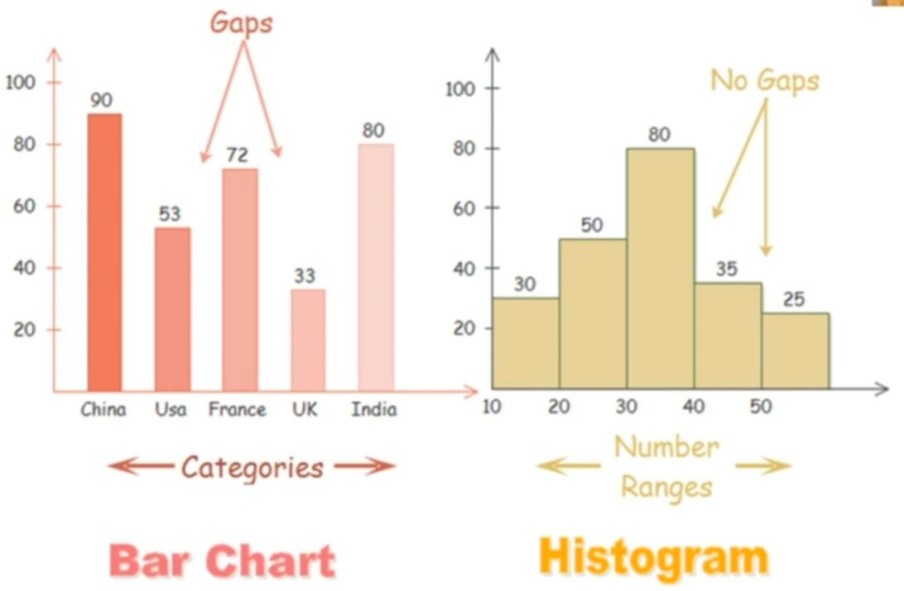

# Charts

## Graphic Types

1. Pareto chart
2. Area chart
3. Control chart
4. Run chart
5. Sankey diagrams
6. Stem-and-leaf display
7. Cartogram
8. Small multiple
9. Sparkline table
10. Network
11. Stream graph
12. Tree map
13. Heat map
14. Pheno plot
15. Cladogram - https://en.wikipedia.org/wiki/Cladogram
16. Flame Graphs

    - Icicle graph
    - Flame Charts
     - [Miha Rekar - What Are Flame Graphs and How to Read Them, RubyConfBY 2017](https://www.youtube.com/watch?v=6uKZXIwd6M0)
     - [USENIX ATC '17: Visualizing Performance with Flame Graphs](https://www.youtube.com/watch?v=D53T1Ejig1Q)

17. Sparklines

## Basic Charts

1. Scatter Plots (2D / 3D)
2. Line Charts - [Tableau Line & Area Chart Catalogue | Tableau Public](https://public.tableau.com/app/profile/rosa.mariana.de.leon.e/viz/TableauLineAreaChartCatalogue/Catalogue)
3. Bar Charts
4. Horizontal Bar Charts
5. Pie Charts
6. Bubble Charts
7. Dot Plots
8. Filled Area Plots
9. Gantt Charts
10. Tables
11. Gauge Charts
12. Sanky Diagram
13. Linear-Gauge Chart

## Statistical and Seaborn-style Charts

1. Error Bars
2. Continuous Error Bars
3. Box Plots
4. Histograms - https://www.datacamp.com/community/tutorials/histograms-matplotlib
5. Distplots
6. 2D Histograms
7. 2d Density Plots
8. Bullet Charts
9. Scatterplot matrix
10. Splom
11. Facet and Trellis Plots
12. Tree-plots
13. Treemaps
14. Violin Plots
15. 2D Histogram Contour

## Scientific Charts

1. Log Plots
2. Contour Plots
3. Heatmaps
4. WebGL Heatmaps
5. Annotated Heatmaps
6. Dendrograms
7. Wind Rose Charts
8. Ternary Plots
9. Ternary Contour Plots
10. Ternary Overlay
11. Parallel Coordinates Plot
12. Quiver Plots
13. Streamline Plots
14. Network Graphs Comparison
15. Network Graphs
16. Alpha Shapes
17. Python Chrod Diagram
18. Filled Chord Diagram
19. Carpet Plots
20. Carpet Contour Plot
21. Carpet Scatter Plot
22. Polar Charts
23. Radar Charts / Radar Graphs

## Financial Charts

1. Time Series
2. OHLC Charts
3. Candlestick Charts
4. Funnel Charts

## Maps

1. USA County Choropleth Maps
2. Choropleth Maps
3. Mapbox Choropleth Maps
4. Scatter Plots on Maps
5. Bubble Maps
6. Lines of Maps
7. Scatter Plots on Mapbox
8. Tesla Supercharging Stations

## 3D Charts

1. 3D Scatter Plots
2. 3D Bubble Charts
3. 3D Line Plots
4. Ribbon Plots
5. 3D Filled Line Plots
6. 3D Surface Plots
7. 3D Mesh Plots
8. 3D Wireframe Plots
9. Parametric Plots
10. Trisurf Plots
11. Surface Triangulation
12. Iso Surface
13. 3D Network Graphs
14. 3d Clustering
15. Projection of 3D Surface

## Multiple Axes, Subplots, and Insets

1. Multiple Axes
2. Subplots
3. Inset Plots
4. 3D Subplots
5. Map Subplots
6. Mixed Subplots
7. Figure Factory Subplots
8. Table and Chart Subplots

## Transforms

1. Filter
2. Group By
3. Aggregations
4. Multiple Transforms

## Add Custom Controls

1. Dash - Controls with Python Callbacks
2. Custom Buttons
3. Sliders
4. Dropdown Menus
5. Range Slider and Selector

## Animations

1. Intro to Animations
2. Adding Sliders to Animations
3. Filled-Area Animation
4. Visualizing MRI Volume Slices
5. Heatmap Animation

## Libraries

- [GitHub - highcharts/highcharts: Highcharts JS, the JavaScript charting framework](https://github.com/highcharts/highcharts)
- [Chart.js | Open source HTML5 Charts for your website](https://www.chartjs.org/)
- [10+ Free JavaScript Chart Library📊you must use in 2023. - DEV Community](https://dev.to/themeselection/10-javascript-chart-library-you-must-use-k20)
