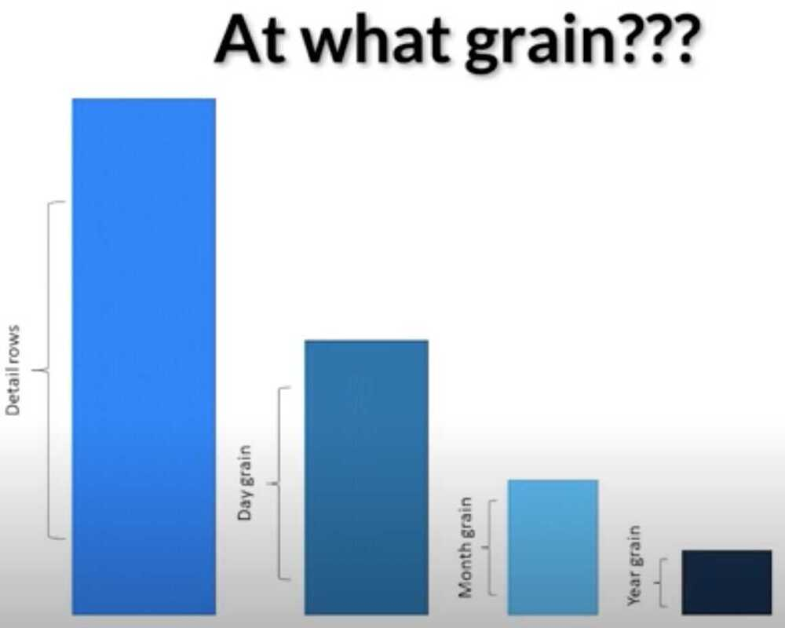

# PowerBI

## Questions

- save daily aggregates powerbi, and delete the underlying data
- powerbi save old roll ups
- saving average and count powerbi

Power BI is a Data Visualization and Business Intelligence tool that converts data from different data sources to interactive dashboards and BI reports. Power BI suite provides multiple software, connector, and services - Power BI desktop, Power BI service based on Saas, and mobile Power BI apps available for different platforms. These set of services are used by business users to consume data and build BI reports.

## DAX Language (Data Analysis Expressions)

DAX (Data Analysis Expressions) is a formula expression language and can be used in different BI and visualization tools. DAX is also known as function language, where the full code is kept inside a function. DAX programming formula contains two data types: Numeric and Other. Numeric includes - integers, currency and decimals, while Other includes: string and binary object.

https://docs.microsoft.com/en-us/power-bi/guided-learning/introductiontodax

https://www.tutorialspoint.com/power_bi/dax_basics_in_power_bi.htm

https://www.edureka.co/blog/interview-questions/power-bi-interview-questions

[**https://towardsdatascience.com/the-top-youtube-channels-for-you-to-learn-powerbi-and-data-analytics-for-free-8f8eb434b48d**](https://towardsdatascience.com/the-top-youtube-channels-for-you-to-learn-powerbi-and-data-analytics-for-free-8f8eb434b48d)

## Power BI Products

### Power BI Desktop

Power BI Desktop is the primary authoring and publishing tool for Power BI. Developers use it to create brand new models and reports from scratch.

### Power BI Service

Power BI service is an online Software as a Service (SaaS) where Power Bl data models, reports, and dashboards are hosted. Administration, sharing, and collaboration happens in the cloud.

### Power BI Data Gateway

Power BI Data Gateway works as the bridge between the Power Bl Service and on-premise data sources like Direct Query, Import, Live Query. It is Installed by Bl Admin.

### Power BI Report Server

It can host paginated reports, mobile reports, & Power Bl Desktop reports. The users can modify Power Bl reports other reports created by the development team.

### Power BI Mobile Apps

Power BI mobile app is available for iOS, Android, Windows. It can be managed using Microsoft Intune. The tool allows you to view reports and dashboards on the Power Bl Service Report Server.

## Basic Items

### Visualization (or visual)

is a type of chart built by Power BI designers. The visuals display the data fromreportsanddatasets. Typically, designersbuild the visuals in Power BI Desktop.

[Interact with Visuals in reports, dashboards, and apps](https://docs.microsoft.com/en-us/power-bi/consumer/end-user-visualizations)

https://docs.microsoft.com/en-us/power-bi/visuals/power-bi-visualization-types-for-reports-and-q-and-a

### Dataset

is a container of data. For example, it might be an Excel file from the World Health Organization. It could also be a company-owned database of customers or it might be a Salesforce file. Datasets are managed bydesigners.

### Dashboard

is a single screen with interactive visuals, text, and graphics. A dashboard collects your most important metrics, on one screen, to tell a story or answer a question. The dashboard content comes from one or more reports and one or more datasets.

[Dashboards for the Power BI service business users](https://docs.microsoft.com/en-us/power-bi/consumer/end-user-dashboards)

### Report

is one or more pages of interactive visuals, text, and graphics that together make up a single report. Power BI bases a report on a single dataset. Often, thedesignerorganizes report pages to address a central area of interest or answer a single question

[Reports in Power BI](https://docs.microsoft.com/en-us/power-bi/consumer/end-user-reports)

### App

is a way fordesignersto bundle and share related dashboards and reports together.Business usersreceive some apps automatically but can go search for other apps created by colleagues or by the community. For example, out-of-the-box apps are available for external services you may already use, like Google Analytics and Microsoft Dynamics CRM

https://docs.microsoft.com/en-us/power-bi/consumer/end-user-basic-concepts

## Terminology

- **Measure-** a measure is a quantitative (numeric) field that can be used to do calculations. Common calculations are sum, average, and minimum. For example, if our company makes and sells skateboards, our measures might be number of skateboards sold and average profit per year.
- **Dimension-** dimensions are categorical (text) data. A dimension describes a person, object, item, products, place, and time. In a a dataset, dimensions are a way to groupmeasuresinto useful categories. For our skateboard company, some dimensions might include looking at sales (a measure) by model, color, country, or marketing campaign.
- **Correlation-** a correlation tells us how the behavior of things are related. If their patterns of increase and decrease are similar, then they are positively correlated. And if their patterns are opposite, then they are negatively correlated. For example, if sales of our red skateboard increase each time we run a tv marketing campaign, then sales of the red skateboard and the tv campaign are positively correlated.
- **Time series-** a time series is a way of displaying time as successive data points. Those data points could be increments such as seconds, hours, months, or years.
- **Continuous variable-** a continuous variable can be any value between its minimum and maximum limits, otherwise it is a discrete variable. Examples are temperature, weight, age, and time. Continuous variables can include fractions or portions of the value. The total number of blue skateboards sold is a discrete variable since we can't sell half a skateboard.

## PowerBI Embeds

https://www.youtube.com/watch?v=0y2oJikC6Xc&ab_channel=GuyinaCube

https://docs.microsoft.com/en-us/power-bi/consumer/end-user-apps

https://www.youtube.com/watch?v=KpZPUdzNXeE&ab_channel=GuyinaCube

https://github.com/microsoft/PowerBI-Developer-Samples

## PowerBI slow - Guy In A Cube Youtube

- Too many visuals
- Inefficient data model
- Bad DAX

## Query Folding

Query folding is the ability for a Power Query query to generate a single query statement to retrieve and transform source data.

The **Vertipaq Engine** is the in-memory columnar database that stores and hosts your model.

- Compression
- Organization
- Segment Elimination

https://docs.microsoft.com/en-us/power-bi/guidance/star-schema

https://www.youtube.com/watch?v=S7Fh2l-4jlc

## Data import

- Import
- DirectQuery
- Live

## Incremental Refresh

https://docs.microsoft.com/en-us/power-bi/connect-data/incremental-refresh-overview

[Learn all about Power BI Aggregations](https://www.youtube.com/playlist?list=PLv2BtOtLblH0cQ7rWV2SVLGoplKdy0LtD)

1. Large data

2. Speed up refresh

3. Reduce model size

4. Future proof

https://docs.microsoft.com/en-us/power-bi/transform-model/desktop-aggregations

## AI

1. Decomposition Tree
2. Key Influencers
3. AutoML
4. Insights
    - Category outliers (top/bottom)
    - Change points in a time series
    - Correlation
    - Low Variance
    - Majority (Major factors)
    - Outliers
    - Overall trends in time series
    - Seasonality in time series
    - Steady share
    - Time series outliers

https://docs.microsoft.com/en-us/power-bi/consumer/end-user-insight-types

https://docs.microsoft.com/en-us/power-bi/consumer/end-user-insights

## Mobile View

https://docs.microsoft.com/en-us/power-bi/create-reports/desktop-create-phone-report

## Features

### Report usage metrics

https://docs.microsoft.com/en-us/power-bi/collaborate-share/service-usage-metrics

## Optimization

[3 signs it's time to OPTIMIZE your Power BI report](https://www.youtube.com/watch?v=uKSkMDEGM2I&ab_channel=GuyinaCube)

[Technique to improve Power BI report perf by reducing visuals](https://www.youtube.com/watch?v=kkIXtvU1AiM&ab_channel=GuyinaCube)

## Dashboards Showcases

[Amazing Power BI Reports for Inspiration - April 2021 Contest Winners](https://www.youtube.com/watch?v=l6NspVReKz0&ab_channel=BIElite)

[Contest #5 - YouTube Channel Analysis | BI Elite Training](https://training.bielite.com/contest-april-2021-youtube-analysis/)

[Top 17 Tableau Dashboard Examples For Enhanced Business Decisions | SPEC INDIA](https://www.spec-india.com/blog/tableau-dashboard-examples)

## Pbix and pbit files

[Solved: What is the difference between .pbix and .pbit ? - Microsoft Fabric Community](https://community.fabric.microsoft.com/t5/Desktop/What-is-the-difference-between-pbix-and-pbit/m-p/885263)

- the pbit file is basically cleaning the data from the file, therefore, the file is much lighter
