# Neural network and deep learning

## Logistic Regression as a Neural Network

## Logistic Regression - Binary Classification


And so we're going to use nx=12288to represent the dimension of the input features x.And sometimes for brevity, I will also just use lowercase nto represent the dimension of this input feature vector.

## Notation

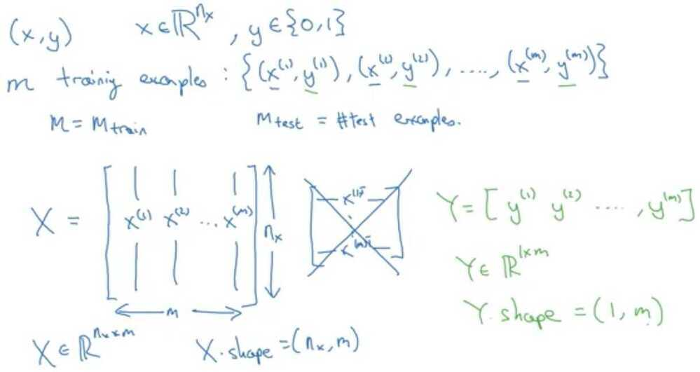

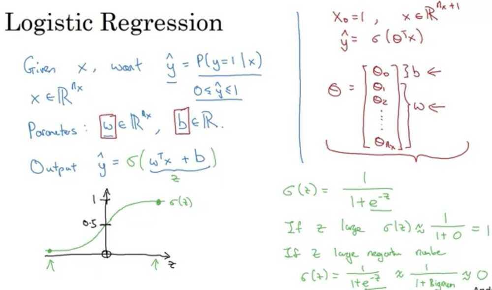

What are the parameters of Logistic Regression

W, an n~x~ dimensional vector, and b, a real number.

## Logistic Regression cost function


What is the difference between the cost function and the loss function for logistic regression?

The loss function computes the error for a single training example; the cost function is the average of the loss functions of the entire training set.

## Gradient Descent


A Convex function only have 1 local optima

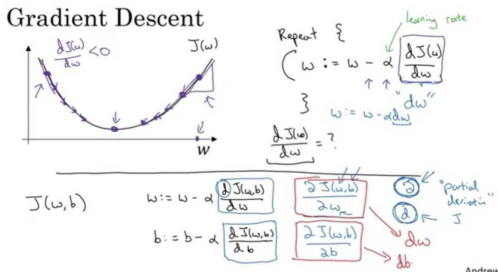

## Intuition about derivatives


On a straight line, the function's derivative **doesn't change**


## Computation Graph

The computations of a neural network are organized in terms of a forward pass or a forward propagation step, in which we compute the output of the neural network, followed by a backward pass or back propagation step, which we use to compute gradients or compute derivatives. The computation graph explains why it is organized this way.

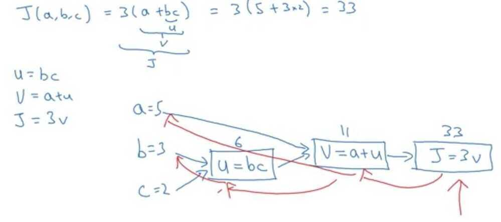

One step of **backward** propagation on a computation graph yields derivative of final output variable.

## Derivatives with a computation graph

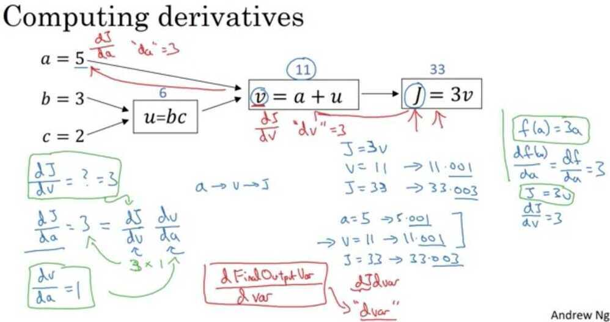

What does the coding convention dvar represent?

The derivative of a final output variable with respect to various intermediate quantities.

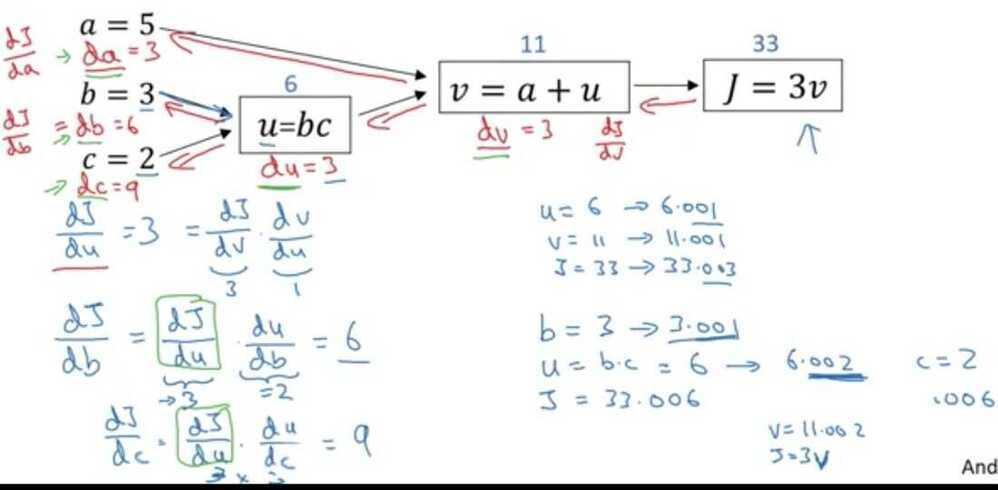

## Logistic Regression Gradient Descent

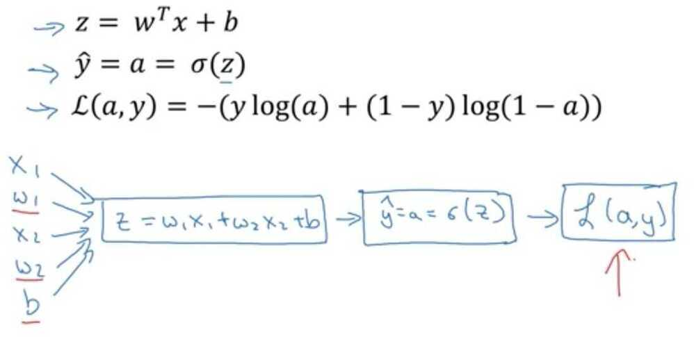

## Logistic regression derivatives

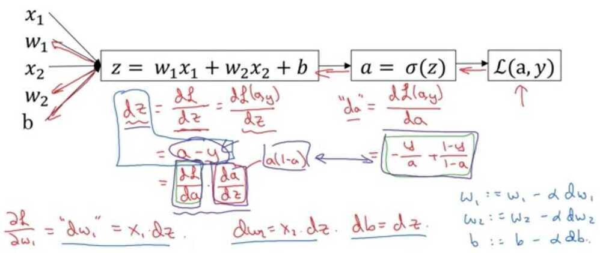

What is the simplified formula for the derivative of the losswith respect to z?

a - y

## Gradient Descent on m examples

Cost- function w, b, which you care about is this average,1/m sum from i equals one through m ofthe loss when you algorithm output a_i on the example y, where a_i is the prediction on the ith training example which is sigma of z_i, which is equal to sigma of w transpose x_i plus b.


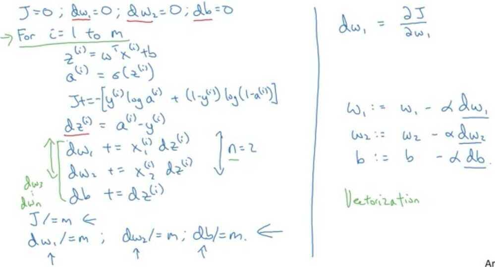

In the for loop depicted in the video, why is there only one dw variable (i.e. no i superscripts in the for loop)?

The value of dw in the code is cumulative.

## Derivation of dL/dz

https://www.coursera.org/learn/neural-networks-deep-learning/discussions/weeks/2/threads/ysF-gYfISSGBfoGHyLkhYg

https://towardsdatascience.com/derivative-of-the-sigmoid-function-536880cf918e

## Vectorization

When you're implementing deep learning algorithms, you find that having explicit for loops inyour code makes your algorithm run less efficiency.So, in the deep learning era, we would move to a bigger and bigger datasets, and so being able to implement your algorithms without using explicitfor loops is really important and will help you to scale to much bigger datasets.

So, it turns out that there are a set of techniques called vectorizationtechniques that allow you to get rid of these explicit for-loops in your code.I think in the pre-deep learning era, that's before the rise of deep learning, vectorization was a nice to have, so you could sometimes do it to speed up your code and sometimes not.But in the deep learning era, vectorization, that is getting rid of for loops, has become really important, because we're more and more training on very large datasets, and so you really need your code to be very efficient.

## Python and Vectorization


## Z = W^T^X + b

## Example

```python
import time

a = np.random.rand(1000000)
b = np.random.rand(1000000)

tic = time.time()
c = np.dot(a, b)
toc = time.time()

print(c)
print(f"Vectorized version {1000*(toc-tic)} ms")

c = 0
tic = time.time()
for i in range(1000000):
    c += a[i]*b[i]

toc = time.time()

print(c)
print(f"For loop {1000*(toc-tic)} ms")
```

## Neural network programming guideline

Whenever possible, avoid explicit for-loops

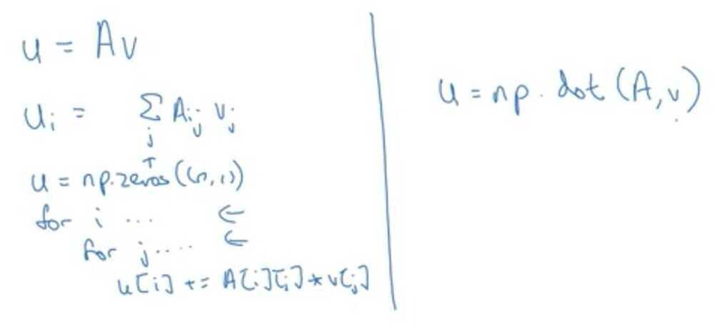

## Vectors and matrix valued functions

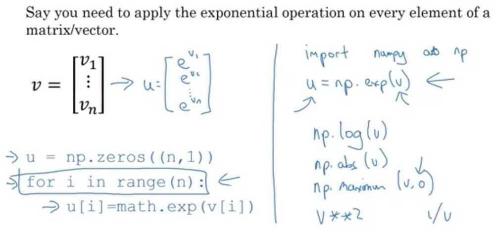

## Logistic regression derivatives

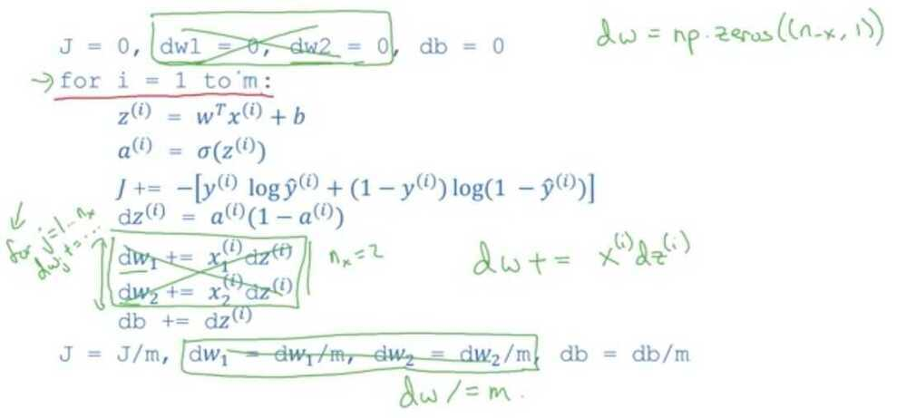

## Vectorizing Logistic Regression

## Forward propagation

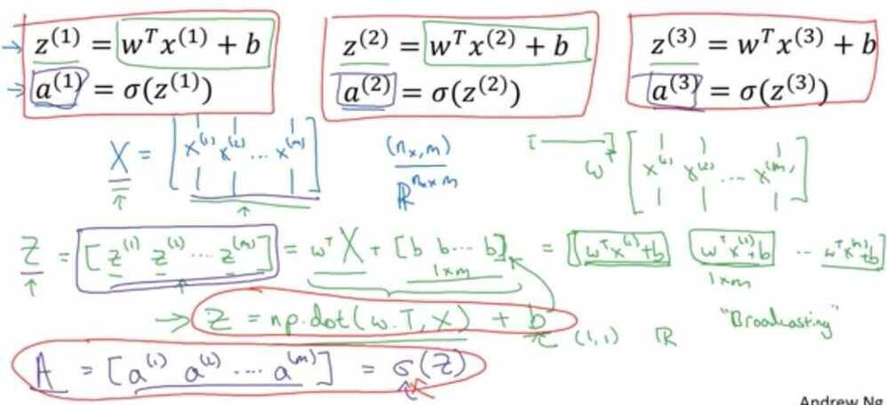

## Size of matrix X - (n~x~ , m)

## Vectorizing Logistic Regression's Gradient Output


How do you compute the derivative of *b* in one line of code in Python numpy?

1 / m*(np.sum(dz))

## Broadcasting in Python

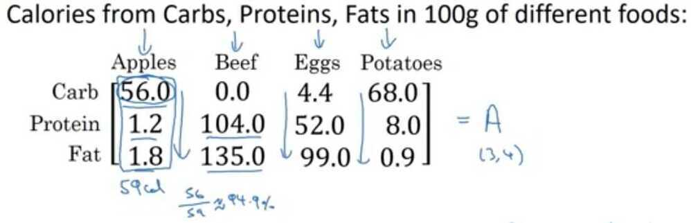

Calculate % of calories from carb, protein, fat, without explicit for loop?

cal = A.sum(axis = 0)

percentage = 100*A / (cal.reshape(1, 4))

matrix (3, 4) / matrix (1, 4)

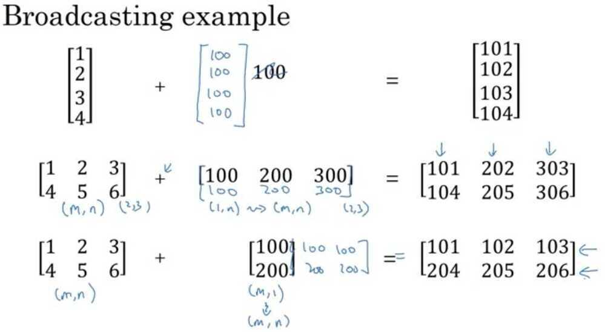

## Logistic Regression cost function

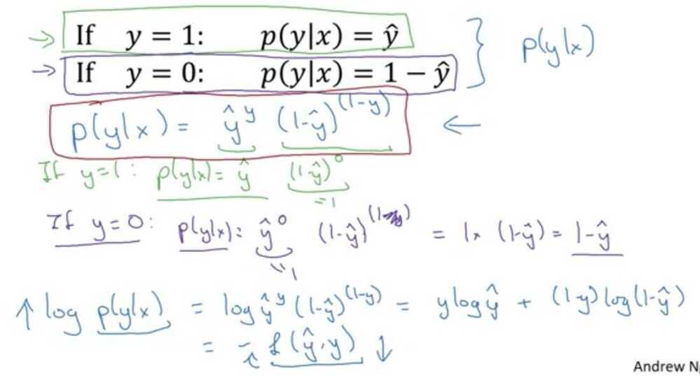


## IID - Identically Independently Distributed

True or False: Minimizing the loss corresponds with maximizing logp(y|x) - **True**

## Programming Assignment 1

- We rarely use the "math" library in deep learning because the inputs of the functions are real numbers. In deep learning we mostly use matrices and vectors. This is why numpy is more useful.
- sigmoid_grad() to compute the gradient of the sigmoid function with respect to its input x. The formula is:

sigmoid_derivative(x)=σ′(x)=σ(x)(1−σ(x))

- Another common technique we use in Machine Learning and Deep Learning is to normalize our data. It often leads to a better performance because gradient descent converges faster after normalization. Here, by normalization we mean changing x tox/∥x∥(dividing each row vector of x by its norm).

For example, if


Normalization is a technique often applied as part of data preparation for machine learning. The goal of normalization is to change the values of numeric columns in the dataset to use a common scale, without distorting differences in the ranges of values or losing information. Normalization is also required for some algorithms to model the data correctly.

For example, assume your input dataset contains one column with values ranging from 0 to 1, and another column with values ranging from 10,000 to 100,000. The great difference in thescaleof the numbers could cause problems when you attempt to combine the values as features during modeling.

Normalizationavoids these problems by creating new values that maintain the general distribution and ratios in the source data, while keeping values within a scale applied across all numeric columns used in the model.

## L1 Loss

- The loss is used to evaluate the performance of your model. The bigger your loss is, the more different your predictions (ŷy^) are from the true values (yy). In deep learning, you use optimization algorithms like Gradient Descent to train your model and to minimize the cost.
- L1 loss is defined as:


- L2 loss is defined as:


