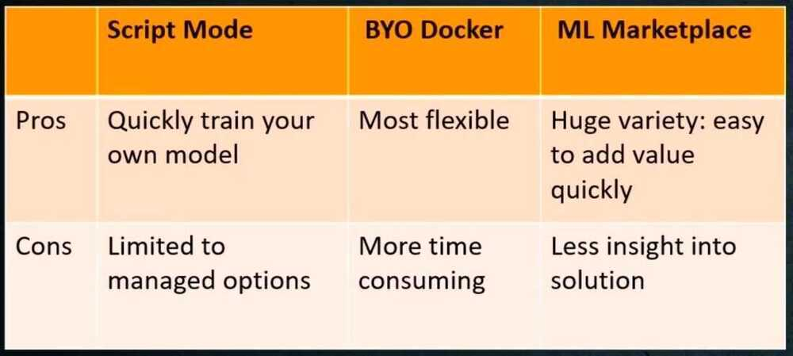
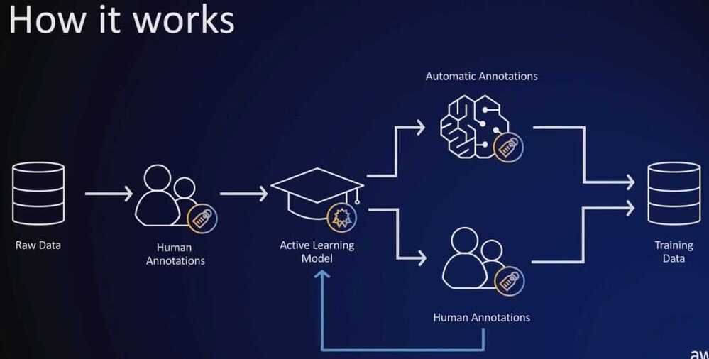

# AWS Sagemaker

https://www.youtube.com/playlist?list=PLhr1KZpdzukcOr_6j_zmSrvYnLUtgqsZz

Amazon SageMaker is a fully managed service that provides every developer and data scientist with the ability to build, train, and deploy machine learning (ML) models quickly. SageMaker removes the heavy lifting from each step of the machine learning process to make it easier to develop high quality models.

Traditional ML development is a complex, expensive, iterative process made even harder because there are no integrated tools for the entire machine learning workflow. You need to stitch together tools and workflows, which is time-consuming and error-prone. SageMaker solves this challenge by providing all of the components used for machine learning in a single toolset so models get to production faster with much less effort and at lower cost.

Many ways to train models on Sagemaker

- Built-in Algorithms
- Script Mode
- Docker container
- AWS ML Marketplace
- Notebook instance

## Amazon SageMaker includes the following features

[**SageMaker Studio**](https://docs.aws.amazon.com/sagemaker/latest/dg/studio.html)

An integrated machine learning environment where you can build, train, deploy, and analyze your models all in the same application.

[**SageMaker Model Registry**](https://docs.aws.amazon.com/sagemaker/latest/dg/model-registry.html)

Versioning, artifact and lineage tracking, approval workflow, and cross account support for deployment of your machine learning models.

[**SageMaker Projects**](https://docs.aws.amazon.com/sagemaker/latest/dg/sagemaker-projects.html)

Create end-to-end ML solutions with CI/CD by using SageMaker projects.

[**SageMaker Model Building Pipelines**](https://docs.aws.amazon.com/sagemaker/latest/dg/pipelines.html)

Create and manage machine learning pipelines integrated directly with SageMaker jobs.

[**SageMaker ML Lineage Tracking**](https://docs.aws.amazon.com/sagemaker/latest/dg/lineage-tracking.html)

Track the lineage of machine learning workflows.

[**SageMaker Data Wrangler**](https://docs.aws.amazon.com/sagemaker/latest/dg/data-wrangler.html)

Import, analyze, prepare, and featurize data in SageMaker Studio. You can integrate Data Wrangler into your machine learning workflows to simplify and streamline data pre-processing and feature engineering using little to no coding. You can also add your own Python scripts and transformations to customize your data prep workflow.

[**SageMaker Feature Store**](https://docs.aws.amazon.com/sagemaker/latest/dg/feature-store.html)

A centralized store for features and associated metadata so features can be easily discovered and reused. You can create two types of stores, an Online or Offline store. The Online Store can be used for low latency, real-time inference use cases and the Offline Store can be used for training and batch inference.

[**SageMaker JumpStart**](https://docs.aws.amazon.com/sagemaker/latest/dg/studio-jumpstart.html)

Learn about SageMaker features and capabilities through curated 1-click solutions, example notebooks, and pretrained models that you can deploy. You can also fine-tune the models and deploy them.

[**SageMaker Clarify**](https://docs.aws.amazon.com/sagemaker/latest/dg/clarify-fairness-and-explainability.html)

Improve your machine learning models by detecting potential bias and help explain the predictions that models make.

[**SageMaker Edge Manager**](https://docs.aws.amazon.com/sagemaker/latest/dg/edge.html)

Optimize custom models for edge devices, create and manage fleets and run models with an efficient runtime.

[**SageMaker Ground Truth**](https://docs.aws.amazon.com/sagemaker/latest/dg/sms.html)

High-quality training datasets by using workers along with machine learning to create labeled datasets. Can reduce labeling cost by 70%

## Workers

- Mechanical turk workers
- Private labeling workforce
- Third-party vendors

Label Consolidation

- Majority Voting
- Probabilities

[**https://www.labellerr.com/**](https://www.labellerr.com/)

[**Amazon Augmented AI**](https://docs.aws.amazon.com/sagemaker/latest/dg/a2i-use-augmented-ai-a2i-human-review-loops.html)

Build the workflows required for human review of ML predictions. Amazon A2I brings human review to all developers, removing the undifferentiated heavy lifting associated with building human review systems or managing large numbers of human reviewers.

[**SageMaker Studio Notebooks**](https://docs.aws.amazon.com/sagemaker/latest/dg/notebooks.html)

The next generation of SageMaker notebooks that include AWS Single Sign-On (AWS SSO) integration, fast start-up times, and single-click sharing.

[**SageMaker Experiments**](https://docs.aws.amazon.com/sagemaker/latest/dg/experiments.html)

Experiment management and tracking. You can use the tracked data to reconstruct an experiment, incrementally build on experiments conducted by peers, and trace model lineage for compliance and audit verifications.

[**SageMaker Debugger**](https://docs.aws.amazon.com/sagemaker/latest/dg/train-debugger.html)

Inspect training parameters and data throughout the training process. Automatically detect and alert users to commonly occurring errors such as parameter values getting too large or small.

[**SageMaker Autopilot**](https://docs.aws.amazon.com/sagemaker/latest/dg/autopilot-automate-model-development.html)

Users without machine learning knowledge can quickly build classification and regression models.

- Good for - classification, regression, some missing values, PCA is ok
- Not good for - vision, text, sequence-based, data mostly missing
    - You need feature interpretation upfront
    - You need pretrained models
- Remember
    - Try to include as much domain knowledge as you can in the features
    - You might have to wait upfront, but it's saving you time in the end
    - You will get all the code generated for you

[**SageMaker Model Monitor**](https://docs.aws.amazon.com/sagemaker/latest/dg/model-monitor.html)

Monitor and analyze models in production (endpoints) to detect data drift and deviations in model quality.

[**SageMaker Neo**](https://docs.aws.amazon.com/sagemaker/latest/dg/neo.html)

Train machine learning models once, then run anywhere in the cloud and at the edge.

[**SageMaker Elastic Inference**](https://docs.aws.amazon.com/sagemaker/latest/dg/ei.html)

Speed up the throughput and decrease the latency of getting real-time inferences.

[**Reinforcement Learning**](https://docs.aws.amazon.com/sagemaker/latest/dg/reinforcement-learning.html)

Maximize the long-term reward that an agent receives as a result of its actions.

[**Preprocessing**](https://docs.aws.amazon.com/sagemaker/latest/dg/processing-job.html)

Analyze and preprocess data, tackle feature engineering, and evaluate models.

[**Batch Transform**](https://docs.aws.amazon.com/sagemaker/latest/dg/batch-transform.html)

Preprocess datasets, run inference when you don't need a persistent endpoint, and associate input records with inferences to assist the interpretation of results.

## Built-in Algorithms

## Instances

t - tiny

m - memory optimized

c - compute optimized

p - gpu

## Best practices

1. Pick the right size - 5GB default

2. Think: store on EBS /home/ec2-user/SageMaker

3. Add or create git repository

4. Configure security settings
    - Encryption
    - Root volume access
    - Internet access
    - VPC Connection

5. Use a lifecycle config
    - Create, start notebook
    - Install packages, copy data
    - Run in background with '&'

6. Attach a portion of a GPU for local inference
    - Size, version, bandwidth

## Sagemaker SDK and examples

https://pypi.org/project/sagemaker

[**https://sagemaker.readthedocs.io/en/stable/**](https://sagemaker.readthedocs.io/en/stable/)

https://github.com/aws/sagemaker-python-sdk

https://github.com/aws/amazon-sagemaker-examples

https://github.com/aruncs2005/fraud-detection-workshop.git

## Sagemaker Lifecycle configurations (Auto shutdown)

https://aws.amazon.com/blogs/machine-learning/save-costs-by-automatically-shutting-down-idle-resources-within-amazon-sagemaker-studio

[**https://github.com/aws-samples/sagemaker-studio-auto-shutdown-extension**](https://github.com/aws-samples/sagemaker-studio-auto-shutdown-extension)

https://github.com/aws-samples/amazon-sagemaker-notebook-instance-lifecycle-config-samples

https://github.com/aws-samples/sagemaker-studio-auto-shutdown-extension/tree/main/auto-installer

## Managed Spot Training

https://towardsdatascience.com/a-quick-guide-to-using-spot-instances-with-amazon-sagemaker-b9cfb3a44a68

https://aws.amazon.com/blogs/aws/managed-spot-training-save-up-to-90-on-your-amazon-sagemaker-training-jobs

## Others

https://aws.amazon.com/blogs/machine-learning/understanding-amazon-sagemaker-notebook-instance-networking-configurations-and-advanced-routing-options

[AWS Innovate | Intro to Deep Learning: Building an Image Classifier on Amazon SageMaker - YouTube](https://www.youtube.com/watch?v=KCzgR7eQ3PY&ab_channel=AmazonWebServices)
