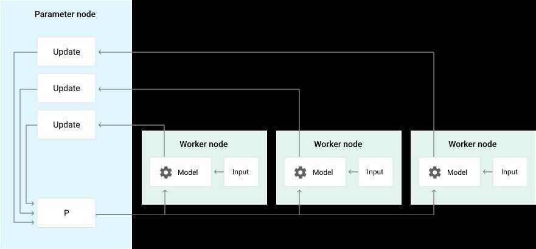
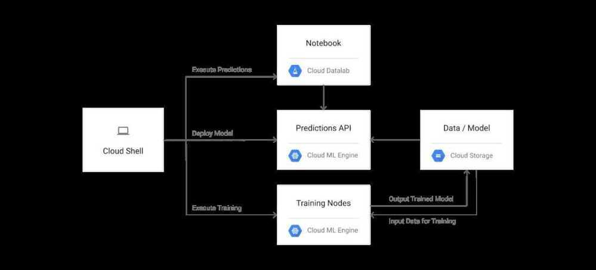

# Distributed Training

## Architecture of Distributed Training

There are three basic strategies to train a model with multiple nodes:

- Data-parallel training with synchronous updates.
- Data-parallel training with asynchronous updates.
- Model-parallel training.

## Data-parallel training with asynchronous updates (Using Google Cloud ML)

A training job is executed using the following types of nodes:

- Parameter server node. Update parameters with gradient vectors from worker and chief work nodes.
- Worker node. Calculate a gradient vector from the training dataset.
- Chief worker node. Coordinate the operations of multiple workers, in addition to working as one of the worker nodes.

Because you can use the data-parallel strategy regardless of the model structure, it is a good starting point for applying the distributed training method to your custom model. In data-parallel training, the whole model is shared with all worker nodes. Each node calculates gradient vectors independently from some part of the training dataset in the same manner as the mini-batch processing. The calculated gradient vectors are collected into the parameter server node, and model parameters are updated with the total summation of the gradient vectors. If you distribute 10,000 batches among 10 worker nodes, each node works on roughly 1,000 batches.

Data-parallel training can be done with either synchronous or asynchronous updates. When using asynchronous updates, the parameter server applies each gradient vector independently, right after receiving it from one of the worker nodes, as shown in the following diagram.

In a typical deployment, there are a few parameter server nodes, a single chief worker node, and several worker nodes. When you submit a training job through the service API, these nodes are automatically deployed in your project.

The following diagram describes the architecture for running a distributed training job on Cloud ML Engine and using Cloud Datalab to execute predictions with your trained model.

