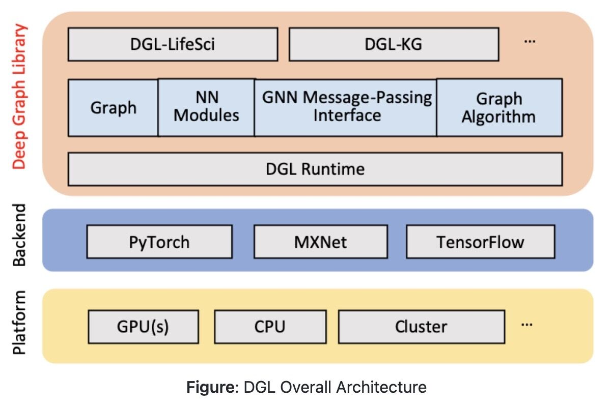

# Libraries

## Deep Graph Library (DGL)

Python package built to ease deep learning on graph, on top of existing DL frameworks.

Deep Graph Library (DGL) is a Python package built for easy implementation of graph neural network model family, on top of existing DL frameworks (currently supporting PyTorch, MXNet and TensorFlow). It offers a versatile control of message passing, speed optimization via auto-batching and highly tuned sparse matrix kernels, and multi-GPU/CPU training to scale to graphs of hundreds of millions of nodes and edges

https://www.dgl.ai

https://docs.dgl.ai/index.html

https://github.com/dmlc/dgl

[**https://github.com/dmlc/dgl/tree/master/examples**](https://github.com/dmlc/dgl/tree/master/examples)

## Libraries

### dlib

- Implementations of state-of-the-art CV and ML algorithms (including face recognition)
- Dlib is a modern C++ toolkit containing machine learning algorithms and tools for creating complex software in C++ to solve real world problems. It is used in both industry and academia in a wide range of domains including robotics, embedded devices, mobile phones, and large high performance computing environments.

### scikit-image

- Collection of algorithms for image processing. Contains some algorithm implementations that OpenCV does not.

### SimpleCV

http://simplecv.org

### Imbalanced-learn - ML

https://pypi.org/project/imbalanced-l

### Theano - deep learning library

http://deeplearning.net/software/theano

### LightGBM - machine learning

https://github.com/microsoft/LightGBM

### Eli5 - machine learning

https://pypi.org/project/eli5

### PyMC3 - Probabilistic Programming in Python

https://docs.pymc.io

## fastText (by facebookResearch)

FastText is an open-source, free, lightweight library that allows users to learn text representations and text classifiers. It works on standard, generic hardware. Models can later be reduced in size to even fit on mobile devices.

## CMU Sphinx

CMU Sphinx, also called Sphinx in short, is the general term to describe a group of [speech recognition](https://en.wikipedia.org/wiki/Speech_recognition) systems developed at [Carnegie Mellon University](https://en.wikipedia.org/wiki/Carnegie_Mellon_University). These include a series of speech recognizers (Sphinx 2 - 4) and an [acoustic model](https://en.wikipedia.org/wiki/Acoustic_Model) trainer (SphinxTrain)

## SymPy

SymPy - algebraic evaluation, differentiation, expansion, complex numbers

https://www.sympy.org/en/index.html

https://wordsandbuttons.online/sympy_makes_math_fun_again.html

## NetworkX

NetworkX is a Python package for the creation, manipulation, and study of the structure, dynamics, and functions of complex networks.

### Features

- Data structures for graphs, digraphs, and multigraphs
- Many standard graph algorithms
- Network structure and analysis measures
- Generators for classic graphs, random graphs, and synthetic networks
- Nodes can be "anything" (e.g., text, images, XML records)
- Edges can hold arbitrary data (e.g., weights, time-series)

### Other tools

- igraph
- SNAP

https://www.toptal.com/data-science/graph-data-science-python-networkx

## Graph-tool

Graph-tool is an efficient [Python](http://www.python.org/) module for manipulation and statistical analysis of [graphs](http://en.wikipedia.org/wiki/Graph_%28mathematics%29)(a.k.a.[networks](http://en.wikipedia.org/wiki/Network_theory)).

## GeoPy

Convert given string address to a location i.e. latitude and longitude values

## Biotite

The Biotite package bundles popular tools in computational biology into an unifying framework. It offers file I/O operations, analyses and manipulations for biological sequence and structure data. Furthermore, the package provides interfaces for popular biological databases and external software.

The internal structure and sequence representations are based onNumPyndarrays, taking the advantage of C-accelerated operations. Time consuming operations that could not be vectorised are mostly implemented inCythonin order to achieve C-accelerations in those places, too.

Additionally the package aims for simple usability and extensibility: The objects representing structures and sequences can be indexed and scliced like anndarray. Even the actual internalndarraysare easily accessible allowing advanced users to implement their own algorithms upon the existing types.

## Vaex

Vaex is a high performance Python library for lazy **Out-of-Core DataFrames** (similar to Pandas), to visualize and explore big tabular datasets. It calculates _statistics_ such as mean, sum, count, standard deviation etc, on an _N-dimensional grid_ for more than **a billion** (`10^9`) samples/rows **per second**. Visualization is done using **histograms**, **density plots** and **3d volume rendering**, allowing interactive exploration of big data. Vaex uses memory mapping, zero memory copy policy and lazy computations for best performance (no memory wasted).

https://github.com/vaexio/vaex

https://towardsdatascience.com/how-to-analyse-100s-of-gbs-of-data-on-your-laptop-with-python-f83363dda94

## Polars

Polars is a blazingly fast DataFrames library implemented in Rust using [Apache Arrow Columnar Format](https://arrow.apache.org/docs/format/Columnar.html) as the memory model.

- Lazy | eager execution
- Multi-threaded
- SIMD
- Query optimization
- Powerful expression API
- Hybrid Streaming (larger than RAM datasets)

[GitHub - pola-rs/polars: Fast multi-threaded, hybrid-out-of-core DataFrame library in Rust | Python | Node.js](https://github.com/pola-rs/polars)

[Polars](https://www.pola.rs/)

## Metatron

Self service solution for Big Data Discovery

All-in-one analytics from easy data preparation to fast visualization

https://metatron.app

## Lyft Amundsen Data Discovery Metadata Engine

https://eng.lyft.com/amundsen-lyfts-data-discovery-metadata-engine-62d27254fbb9

## Metacat

Making Big Data Discoverable and Meaningful atNetflix

## Genie

Genie is a completely open source distributed job orchestration engine developed by Netflix. Genie provides REST-ful APIs to run a variety of big data jobs like Hadoop, Pig, Hive, Spark, Presto, Sqoop and more. It also provides APIs for managing the metadata of many distributed processing clusters and the commands and applications which run on them.

https://netflix.github.io/genie

1. Stochastic Gradient Descent
2. Backpropogation

## Monotonic AI Models

https://www.toptal.com/machine-learning/monotonic-ai-models

## Pre-Trained Models

https://www.toptal.com/deep-learning/exploring-pre-trained-models

## ResNet

https://towardsdatascience.com/an-overview-of-resnet-and-its-variants-5281e2f56035

## MELTANO - Model, Extract, Load, Transform, Analyze, Notebook, Orchestrate

[Meltano](https://gitlab.com/meltano/meltano) is a convention-over-configuration framework for analytics, business intelligence, and data science. It leverages open source software and software development best practices including version control, CI, CD, and review apps.

[https://meltano.com](https://meltano.com/)

[GitHub - meltano/meltano: Meltano: the declarative code-first data integration engine that powers your wildest data and ML-powered product ideas. Say goodbye to writing, maintaining, and scaling your own API integrations.](https://github.com/meltano/meltano)

## Generative Art

https://tylerxhobbs.com/essays/2020/flow-fields

[Getting started with generative art | Nicola Rennie](https://nrennie.rbind.io/blog/getting-started-generative-art/)

## Kyso

Kyso is a central knowledge hub to manage, share and collaborate on technical reports - weconvertdata-science tools like Jupyter Notebooks to Medium-styleblog posts published to the web.We're fully integratedwithGithub, meaning when you push your commits, the changes are reflected immediately onKyso.It's very easy to get started - profiles, comments, etc. work right out of the box.

https://kyso.io

## Jina

Cloud-native neural search framework for 𝙖𝙣𝙮 kind of data

Jinaallows you to build search-as-a-service powered by deep learning in just minutes.

- **All data types-** Large-scale indexing and querying of any kind of unstructured data: video, image, long/short text, music, source code, PDF, etc.
- **Fast & cloud-native-** Distributed architecture from day one, scalable & cloud-native by design: enjoy containerizing, streaming, paralleling, sharding, async scheduling, HTTP/gRPC/WebSocket protocol.
- **Save time-** The design pattern of neural search systems, from zero to a production-ready system in minutes.
- **Own your stack-** Keep end-to-end stack ownership of your solution, avoid integration pitfalls you get with fragmented, multi-vendor, generic legacy tools.

https://jina.ai

https://github.com/jina-ai/jina

## Others

- [GitHub - h2oai/h2o-3: H2O is an Open Source, Distributed, Fast & Scalable Machine Learning Platform: Deep Learning, Gradient Boosting (GBM) & XGBoost, Random Forest, Generalized Linear Modeling (GLM with Elastic Net), K-Means, PCA, Generalized Additive Models (GAM), RuleFit, Support Vector Machine (SVM), Stacked Ensembles, Automatic Machine Learning (AutoML), etc.](https://github.com/h2oai/h2o-3)
