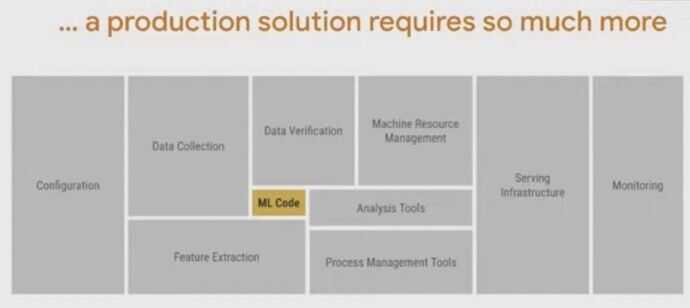
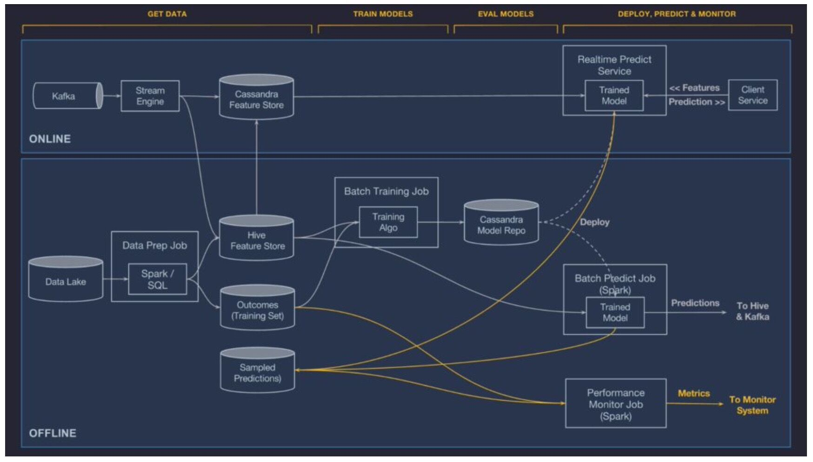

# MLOps / Model Deployment

## Offline Deployment

The model is deployed to an offline container and run in a Spark job to generate batch predictions either on demand or on a repeating schedule.

## Online Deployment

The model is deployed to an online prediction service cluster (generally containing hundreds of machines behind a load balancer) where clients can send individual or batched prediction requests as network RPC calls.

## Monitor predictions

## MLOps

MLOps is an engineering discipline that aims to unify ML systems development (dev) and ML systems deployment (ops) in order to standardize and streamline the continuous delivery of high-performing models in production.

### ML Lifecycle

- Framing ML problems from business goals
- Access, prepare and process data for the model
- Architect ML solution and develop ML models
- Deploy ML models
- Iterate - Monitor, optimize and maintain the performance of the model

###  Deploying models to the production system

There are mainly two ways of deploying an ML model:

- **Static deployment or embedded model**  -  where the model is packaged into installable application software and is then deployed. For example, an application that offers batch-scoring of requests.
- **Dynamic deployment**  -  where the model is deployed using a web framework like FastAPI or Flask and is offered as an API endpoint that responds to user requests.

[What is MLOps? Machine Learning Operations Explained](https://www.freecodecamp.org/news/what-is-mlops-machine-learning-operations-explained)

[MLOps Course - Build Machine Learning Production Grade Projects - YouTube](https://www.youtube.com/watch?v=-dJPoLm_gtE)

[MLOps guide](https://huyenchip.com/mlops/)

## Tools

### KubeFlow

Kubeflow is a Cloud Native platform for machine learning based on Google's internal machine learning pipelines.

https://www.kubeflow.org

https://github.com/kubeflow/kubeflow

### TensorFlow Serving

TensorFlow Serving is a flexible, high-performance serving system for machine learning models, designed for production environments. It deals with the _inference_ aspect of machine learning, taking models after _training_ and managing their lifetimes, providing clients with versioned access via a high-performance, reference-counted lookup table. TensorFlow Serving provides out-of-the-box integration with TensorFlow models, but can be easily extended to serve other types of models and data.

To note a few features:

- Can serve multiple models, or multiple versions of the same model simultaneously
- Exposes both gRPC as well as HTTP inference endpoints
- Allows deployment of new model versions without changing any client code
- Supports canarying new versions and A/B testing experimental models
- Adds minimal latency to inference time due to efficient, low-overhead implementation
- Features a scheduler that groups individual inference requests into batches for joint execution on GPU, with configurable latency controls
- Supports many _servables_: Tensorflow models, embeddings, vocabularies, feature transformations and even non-Tensorflow-based machine learning models

[GitHub - tensorflow/serving: A flexible, high-performance serving system for machine learning models](https://github.com/tensorflow/serving)

[Serving Models  |  TFX  |  TensorFlow](https://www.tensorflow.org/tfx/guide/serving)

### ONNX (Open Neural Network Exchange)

[ONNX](http://onnx.ai/) (Open Neural Network Exchange), an open-source format for representing deep learning models, was developed by Microsoft and is now managed by the Linux Foundation. It addresses the challenge of model packaging by providing a standardized format that enables easy transfer of machine learning models between different deep learning frameworks.

Since various deep learning frameworks use different formats to represent their models, using models trained in one framework with another can be challenging. ONNX resolves this issue by providing a standard format that multiple deep learning frameworks, including [TensorFlow](https://www.tensorflow.org/?gclid=Cj0KCQjwla-hBhD7ARIsAM9tQKsGQbp8c_KMjEsQHOz2bn1gt6gk1Sg8YSfdB5P9EdFDK1WqsnQnSbsaAkKyEALw_wcB), [PyTorch](https://pytorch.org/), and [Caffe2](https://caffe2.ai/) can use.

With ONNX, models can be trained in one framework and then easily exported to other frameworks for inference, making it convenient for developers to experiment with different deep learning frameworks and tools without having to rewrite their models every time they switch frameworks.  It can execute models on various hardware platforms, including CPUs, GPUs, and FPGAs, making deploying models on various devices easy.

### Seldon Core

An open source platform to deploy your machine learning models on Kubernetes at massive scale.

https://docs.seldon.io/projects/seldon-core/en/v1.1.0

https://www.seldon.io

### Others

- [ZenML - Seamless End-to-End MLOps](https://www.zenml.io/)
- [Starter guide - ZenML Documentation](https://docs.zenml.io/user-guide/starter-guide)
- [Home Page | Pachyderm](https://www.pachyderm.com/)
- [Blog - neptune.ai](https://neptune.ai/blog)
   	- [Building a Machine Learning Platform \[Definitive Guide\]](https://neptune.ai/blog/ml-platform-guide)
   	- [How to Build a CI/CD MLOps Pipeline | Case Study](https://neptune.ai/blog/build-ci-cd-mlops-pipeline)
- [ML Model Packaging \[The Ultimate Guide\]](https://neptune.ai/blog/ml-model-packaging)
- [Machine Learning: Models to Production | by Ashutosh Kumar | Analytics Vidhya | Medium](https://medium.com/analytics-vidhya/machine-learning-models-to-production-72280c3cb479)
- [Comet ML - Build better models faster](https://www.comet.com/)

## Roadmap

[sig-mlops/roadmap/2022/MLOpsRoadmap2022.md at main · cdfoundation/sig-mlops · GitHub](https://github.com/cdfoundation/sig-mlops/blob/main/roadmap/2022/MLOpsRoadmap2022.md)

[MLOps Roadmap](https://roadmap.sh/mlops)

### Examples

[GitHub - sayakpaul/ml-deployment-k8s-fastapi: This project shows how to serve an ONNX-optimized image classification model as a web service with FastAPI, Docker, and Kubernetes.](https://github.com/sayakpaul/ml-deployment-k8s-fastapi)

[MLOps roadmap 2024. The MLOps engineer role is different… | by Vechtomova Maria | Marvelous MLOps | Dec, 2023 | Medium](https://medium.com/marvelous-mlops/mlops-roadmap-2024-ff4216b8bc62)

[Roadmap To Become A Successful MLOps Engineer - The Workfall Blog](https://www.workfall.com/learning/blog/roadmap-to-become-a-successful-mlops-engineer/)

### Courses

[The Full Stack 7-Steps MLOps Framework - Paul Iusztin](https://www.pauliusztin.me/courses/the-full-stack-7-steps-mlops-framework)

[MLOps Course - Made With ML](https://madewithml.com/courses/mlops/)

**[GitHub - DataTalksClub/mlops-zoomcamp: Free MLOps course from DataTalks.Club](https://github.com/DataTalksClub/mlops-zoomcamp)**

- [MLOps Zoomcamp - YouTube](https://www.youtube.com/playlist?list=PL3MmuxUbc_hIUISrluw_A7wDSmfOhErJK)
- [MLOps Zoomcamp - DataTalks.Club](https://datatalks.club/blog/mlops-zoomcamp.html)

### Profiles

- [Machine Learning Engineer Job Description Jan 2024 | Toptal](https://www.toptal.com/machine-learning/job-description)
- [Meghana Bhange - Developer in Montreal, QC, Canada | Toptal](https://www.toptal.com/resume/meghana-bhange)
- [Alessandro Pedori - Developer in Berlin, Germany | Toptal](https://www.toptal.com/resume/alessandro-pedori)
- [Ruggiero Dargenio - Developer in Zürich, Switzerland | Toptal](https://www.toptal.com/resume/ruggiero-dargenio)
- [Andrei Apostol - Developer in Iași, Romania | Toptal](https://www.toptal.com/resume/andrei-apostol)
- [Artificial Intelligence Resume Sample and Writing guide - 2024](https://www.mygreatlearning.com/blog/artificial-intelligence-resume/)

## Newsletter

- [Pinterest introduces LinkSage, Google combines Neural Networks with Bayesian theory](https://mlops.substack.com/p/pinterest-introduces-linksage-google)
- [DSPy through a RAG System](https://mlops.substack.com/p/dspy-through-a-rag-system)
- [Pathscopes: Inspect Hidden Representation of Neural Networks!](https://mlops.substack.com/p/pathscopes-inspect-hidden-representation)
- [Personalizing Heart Rate Prediction](https://mlops.substack.com/p/personalizing-heart-rate-prediction)

## Links

- [Ray | Faster Python](python/advanced/faster-python.md#ray)
- [Home - MLOps Community](https://mlops.community/)
- [GitHub - visenger/awesome-mlops: A curated list of references for MLOps](https://github.com/visenger/awesome-mlops)
- [GitHub - kelvins/awesome-mlops: :sunglasses: A curated list of awesome MLOps tools](https://github.com/kelvins/awesome-mlops)
- [10 Awesome Resources for Learning MLOps | DataCamp](https://www.datacamp.com/blog/10-awesome-resources-for-learning-mlops)
- [Let’s Architect! Learn About Machine Learning on AWS | AWS Architecture Blog](https://aws.amazon.com/blogs/architecture/lets-architect-learn-about-machine-learning-on-aws/)
- [AWS re:Invent 2023 - Introduction to MLOps engineering on AWS (TNC215) - YouTube](https://www.youtube.com/watch?v=2kzJPhgDkDE)
- [AWS re:Invent 2023 - Zero to machine learning: Jump-start your data-driven journey (SMB204) - YouTube](https://www.youtube.com/watch?v=-CSrOKo8Qgs)
