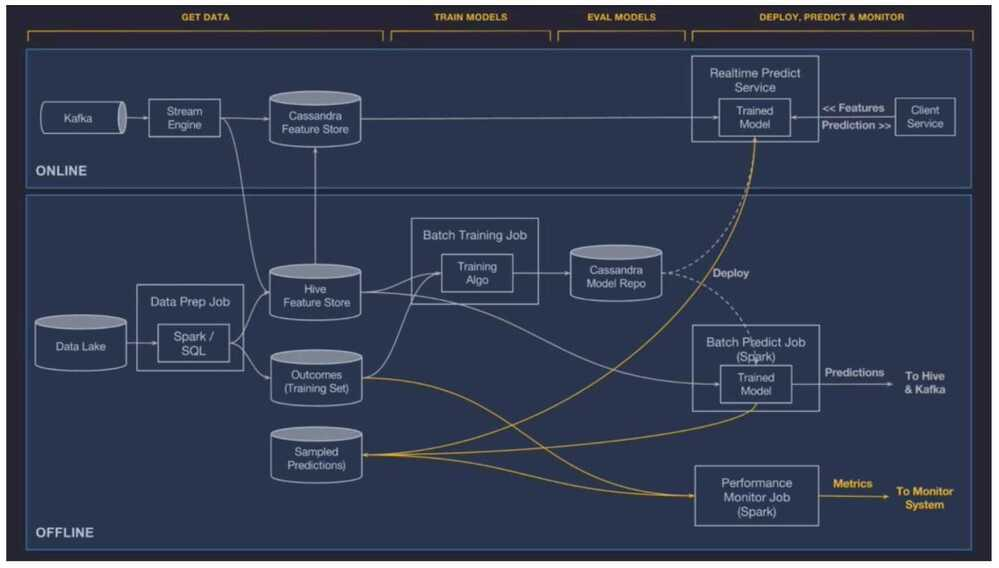

# MLOps / Model Deployment

## Offline Deployment

The model is deployed to an offline container and run in a Spark job to generate batch predictions either on demand or on a repeating schedule.

## Online Deployment

The model is deployed to an online prediction service cluster (generally containing hundreds of machines behind a load balancer) where clients can send individual or batched prediction requests as network RPC calls.

## Monitor predictions

## MLOps

MLOps is an engineering discipline that aims to unify ML systems development (dev) and ML systems deployment (ops) in order to standardize and streamline the continuous delivery of high-performing models in production.

### ML Lifecycle

- Framing ML problems from business goals
- Access, prepare and process data for the model
- Architect ML solution and develop ML models
- Deploy ML models
- Iterate - Monitor, optimize and maintain the performance of the model

###  Deploying models to the production system

There are mainly two ways of deploying an ML model:

- **Static deployment or embedded model**  -  where the model is packaged into installable application software and is then deployed. For example, an application that offers batch-scoring of requests.
- **Dynamic deployment**  -  where the model is deployed using a web framework like FastAPI or Flask and is offered as an API endpoint that responds to user requests.

[What is MLOps? Machine Learning Operations Explained](https://www.freecodecamp.org/news/what-is-mlops-machine-learning-operations-explained)

[MLOps Course – Build Machine Learning Production Grade Projects - YouTube](https://www.youtube.com/watch?v=-dJPoLm_gtE)

[MLOps guide](https://huyenchip.com/mlops/)

### Tools

[ZenML - Seamless End-to-End MLOps](https://www.zenml.io/)

[Starter guide - ZenML Documentation](https://docs.zenml.io/user-guide/starter-guide)
