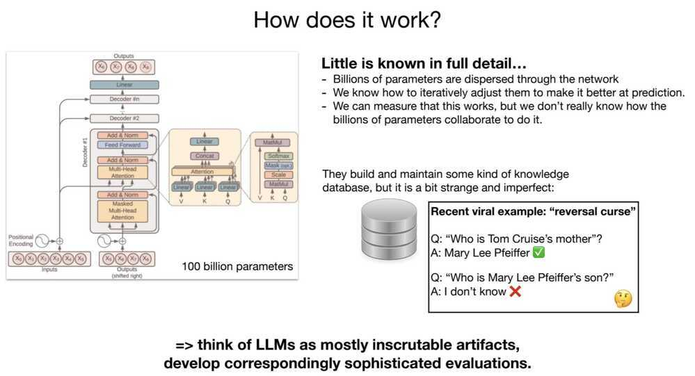

# LLM Building

- [Create a Large Language Model from Scratch with Python – Tutorial - YouTube](https://www.youtube.com/watch?v=UU1WVnMk4E8)
- [Understanding Large Language Models - by Sebastian Raschka](https://magazine.sebastianraschka.com/p/understanding-large-language-models)
- [Large language models, explained with a minimum of math and jargon](https://www.understandingai.org/p/large-language-models-explained-with)
- [Catching up on the weird world of LLMs](https://simonwillison.net/2023/Aug/3/weird-world-of-llms/)
- [Llama from scratch (or how to implement a paper without crying) | Brian Kitano](https://blog.briankitano.com/llama-from-scratch/)
- [Llama - EXPLAINED! - YouTube](https://www.youtube.com/watch?v=yZ9jkgN2xHQ)
- [LLM2 Module 1 - Transformers | 1.6 Base/Foundation Models - YouTube](https://www.youtube.com/watch?v=sJsPgRg883w)
- [20 papers to master Language modeling? - YouTube](https://www.youtube.com/watch?v=QQIwfpOY-qA)

## Architecture


[Emerging Architectures for LLM Applications | Andreessen Horowitz](https://a16z.com/2023/06/20/emerging-architectures-for-llm-applications/)

### RAG - retrieval-augmented generation

RAG is an AI framework for retrieving facts from an external knowledge base to ground large language models (LLMs) on the most accurate, up-to-date information and to give users insight into LLMs' generative process.

[Using ChatGPT to Search Enterprise Data with Pamela Fox - YouTube](https://www.youtube.com/watch?v=lj5NjKHuFlo)

[What is retrieval-augmented generation? | IBM Research Blog](https://research.ibm.com/blog/retrieval-augmented-generation-RAG)

## Others



### How to train your ChatGPT

#### Stage 1: Pretraining

1. Download ~10TB of text
2. Get a cluster of ~6,000 GPUs
3. Compress the text into a neural network, pay ~$2M, wait ~12 days
4. Obtain base model

#### Stage 2: Finetuning

1. Write labeling instructions
2. Hire people (or use scale.ai!), collect 100K high quality ideal Q&A responses, and/or comparisons
3. Finetune base model on this data, wait ~1 day
4. Obtain assistant model
5. Run a lot of evaluations
6. Deploy
7. Monitor, collect misbehaviors, go to step 1

### LLM Security

- Jailbreaking
- Prompt injection
- Backdoors & data poisoning
- Adversarial inputs
- Insecure output handling
- Data extraction & privacy
- Data reconstruction
- Denial of service
- Escalation
- Watermarking & evasion
- Model theft

[[1hr Talk] Intro to Large Language Models - YouTube](https://www.youtube.com/watch?v=zjkBMFhNj_g)

## Dev Tools

- [Welcome to LangChain - 🦜🔗 LangChain 0.0.180](https://python.langchain.com/en/latest/index.html)
  - [Building LLM applications for production](https://huyenchip.com/2023/04/11/llm-engineering.html)
  - [Introduction to LangChain LLM: A Beginner’s Guide](https://www.makeuseof.com/langchain-llm-introduction/)
  - [How to Build LLM Applications with LangChain | DataCamp](https://www.datacamp.com/tutorial/how-to-build-llm-applications-with-langchain)
- [GitHub - Significant-Gravitas/Auto-GPT: An experimental open-source attempt to make GPT-4 fully autonomous.](https://github.com/Significant-Gravitas/Auto-GPT)
- [Llama 2 - Meta AI](https://ai.meta.com/llama/)
- [Introducing Code Llama, a state-of-the-art large language model for coding](https://ai.meta.com/blog/code-llama-large-language-model-coding/)
- [GitHub - jerryjliu/llama\_index: LlamaIndex (GPT Index) is a data framework for your LLM applications](https://github.com/jerryjliu/llama_index)
- [Building your Generative AI apps with Meta's Llama 2 and Databricks | Databricks Blog](https://www.databricks.com/blog/building-your-generative-ai-apps-metas-llama-2-and-databricks)
- [GitHub - stoyan-stoyanov/llmflows: LLMFlows - Simple, Explicit and Transparent LLM Apps](https://github.com/stoyan-stoyanov/llmflows)
- [Patterns for Building LLM-based Systems & Products](https://eugeneyan.com/writing/llm-patterns/)
- [GitHub - ShishirPatil/gorilla: Gorilla: An API store for LLMs](https://github.com/ShishirPatil/gorilla)
- [gorilla-llm (Gorilla LLM (UC Berkeley))](https://huggingface.co/gorilla-llm)
- [Advancing Spark - LLM Evaluation with MLFlow 2 4 - YouTube](https://www.youtube.com/watch?v=t_WtkRdycTY)
- [GitHub - Chainlit/chainlit: Build Python LLM apps in minutes ⚡️](https://github.com/Chainlit/chainlit)
- [Awesome GPT-4](https://gpt4.tools/)
- [GitHub - xtekky/gpt4free: The official gpt4free repository | various collection of powerful language models](https://github.com/xtekky/gpt4free)
- [GitHub - yoheinakajima/babyagi](https://github.com/yoheinakajima/babyagi)
- [GitHub - coqui-ai/TTS: 🐸💬 - a deep learning toolkit for Text-to-Speech, battle-tested in research and production](https://github.com/coqui-ai/TTS)
- [GitHub - tensorchord/Awesome-LLMOps: An awesome & curated list of best LLMOps tools for developers](https://github.com/tensorchord/Awesome-LLMOps)
- [AI Development Cloud Platform | Deploy & Manage AI Logic](https://mindsdb.com/)

```bash
python -m pip install --upgrade langchain[llm]
pip install chromadb
pip install pypdf

pip install chainlit
chainlit hello

chainlit run document_qa.py
```

### HuggingFace

- [GitHub - huggingface/transformers: 🤗 Transformers: State-of-the-art Machine Learning for Pytorch, TensorFlow, and JAX.](https://github.com/huggingface/transformers)
- [Hugging Face – The AI community building the future.](https://huggingface.co/)

## Evaluation

- [Alpaca Eval Leaderboard](https://tatsu-lab.github.io/alpaca_eval/)
- [GitHub - tatsu-lab/alpaca\_eval: An automatic evaluator for instruction-following language models. Human-validated, high-quality, cheap, and fast.](https://github.com/tatsu-lab/alpaca_eval)

## Resources

- [GitHub - openai/openai-cookbook: Examples and guides for using the OpenAI API](https://github.com/openai/openai-cookbook)
- [Development with Large Language Models Tutorial – OpenAI, Langchain, Agents, Chroma - YouTube](https://www.youtube.com/watch?v=xZDB1naRUlk&t=1032s)
- [Vector Embeddings Tutorial – Create an AI Assistant with GPT-4 & Natural Language Processing - YouTube](https://www.youtube.com/watch?v=yfHHvmaMkcA)
