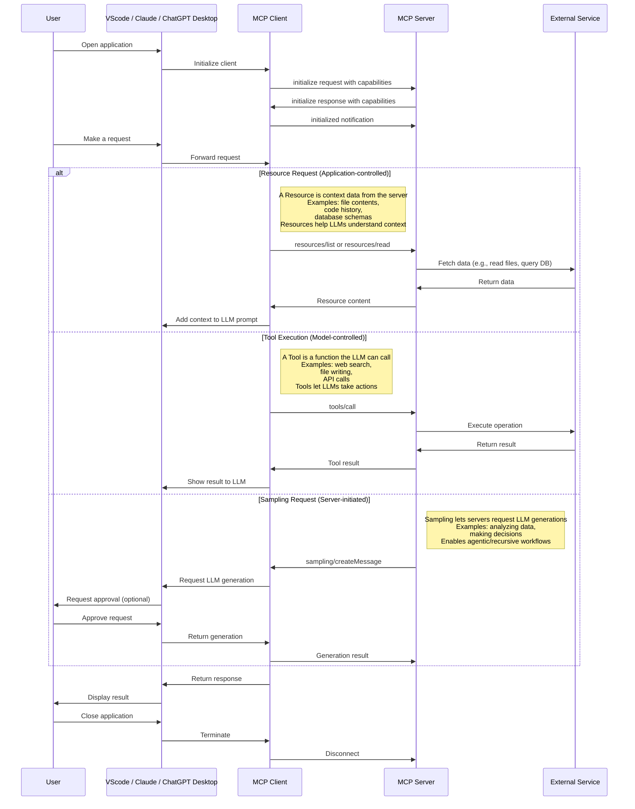

# Model Context Protocol (MCP)

- [mcp-vs-restapi](ai/llm/mcp-vs-restapi.md)

A protocol for seamless integration between LLM applications and external data sources.

The Model Context Protocol (MCP) is an open protocol that enables seamless integration between LLM applications and external data sources and tools. Whether you're building an AI-powered IDE, enhancing a chat interface, or creating custom AI workflows, MCP provides a standardized way to connect LLMs with the context they need.

MCP is an open protocol that standardizes how applications provide context to LLMs. Think of MCP like a USB-C port for AI applications. Just as USB-C provides a standardized way to connect your devices to various peripherals and accessories, MCP provides a standardized way to connect AI models to different data sources and tools.

**Transport pipes**

- **stdio:** server and client at one end, basically the same local machine
- **SSE:** server to client streaming with HTTP POST requests for client to server communication basically when client and host server are different (for prod env)

## Why MCP?

MCP helps you build agents and complex workflows on top of LLMs. LLMs frequently need to integrate with data and tools, and MCP provides:

- A growing list of pre-built integrations that your LLM can directly plug into
- The flexibility to switch between LLM providers and vendors
- Best practices for securing your data within your infrastructure

## General Architecture

At its core, MCP follows a client-server architecture where a host application can connect to multiple servers:


- **MCP Hosts**: Programs like Claude Desktop, IDEs, or AI tools that want to access data through MCP
- **MCP Clients**: Protocol clients that maintain 1:1 connections with servers
- **MCP Servers**: Lightweight programs that each expose specific capabilities through the standardized Model Context Protocol
- **Local Data Sources**: Your computer’s files, databases, and services that MCP servers can securely access
- **Remote Services**: External systems available over the internet (e.g., through APIs) that MCP servers can connect to

## How MCP Works



[How Model Context Protocol (MCP) Works](https://blog.bassemdy.com/2025/04/12/mcp/model-context-protocol/programming/llm/ai/how-model-context-protocol-mcp-works.html)

## Concept

- [Tools - Model Context Protocol](https://modelcontextprotocol.io/specification/2025-11-25/server/tools)
	- Tools enable models to interact with external systems, such as querying databases, calling APIs, or performing computations. Each tool is uniquely identified by a name and includes metadata describing its schema.
- [Resources - Model Context Protocol](https://modelcontextprotocol.io/specification/2025-11-25/server/resources)
	- Resources allow servers to share data that provides context to language models, such as files, database schemas, or application-specific information. Each resource is uniquely identified by a URI.

## Getting Started

[For Claude Desktop Users - Model Context Protocol](https://modelcontextprotocol.io/quickstart/user)

```json title="claude_desktop_config.json"
{
  "mcpServers": {
    "filesystem": {
      "command": "npx",
      "args": [
        "-y",
        "@modelcontextprotocol/server-filesystem",
        "/Users/deepaksood/Desktop",
        "/Users/deepaksood/Downloads"
      ]
    },
    "memory": {
      "command": "npx",
      "args": [
        "-y",
        "@modelcontextprotocol/server-memory"
      ]
    }
  }
}
```

**Debug Logs -** `tail -n 100 ~/Library/Logs/Claude/mcp-server-*.log`

## Requests

### Requesting Exact Columns (The Request)

To specify which columns or fields you want, you should use **URI parameters** (for Resources) or **Argument properties** (for Tools).

#### For Resources (URI Templates)

When defining a resource in your MCP server, use a URI template that includes a `columns` or `fields` parameter.

- **Template Example:** `database://{table_name}?columns={column_list}`
- **Client Call:** The client requests `database://users?columns=id,email,username`.

#### For Tools (Input Schema)

If you are using a Tool to fetch data, you define the required columns in the `inputSchema`. This is the most "official" way to handle filtering.

```json
{
  "name": "get_customer_data",
  "description": "Fetch specific customer records",
  "inputSchema": {
    "type": "object",
    "properties": {
      "customer_id": { "type": "string" },
      "fields": {
        "type": "array",
        "items": { "type": "string" },
        "description": "List of specific columns to return"
      }
    },
    "required": ["customer_id", "fields"]
  }
}
```

### 2. Adding Filters

Filtering is handled by passing query parameters or search criteria through the same request structure.

#### Logical Filtering in Tools

You can add complex filtering logic by defining a `filters` object in your tool's arguments:

- **Criteria:** `status == 'active'`
- **Range:** `date > '2023-01-01'`

**Example Tool Argument:**

```json
"filters": {
  "type": "object",
  "properties": {
    "status": { "type": "string", "enum": ["active", "inactive"] },
    "min_spend": { "type": "number" }
  }
}
```

### 3. Shaping the Response

MCP responses follow a strict structure. To ensure only the "exact columns" are returned, your server logic must prune the data before sending it back in the `content` array.

#### The Response Structure

Your MCP server should return a `CallToolResult` or `ReadResourceResult` containing only the requested keys.

```json
{
  "content": [
    {
      "type": "text",
      "text": "{\"id\": 101, \"email\": \"user@example.com\"}"
    }
  ]
}
```

**Pro Tip:** Even if your underlying database returns 50 columns, your MCP Server code should iterate through the `fields` array provided in the request and delete any keys from the JSON object that weren't requested. This keeps the LLM's context window clean and reduces token costs.

### Summary Table

| **Feature**        | **Resource Approach**                | **Tool Approach**                             |
| ------------------ | ------------------------------------ | --------------------------------------------- |
| **Selection**      | Use URI Query Params (`?select=a,b`) | Define a `fields` array in `inputSchema`      |
| **Filtering**      | Use URI Query Params (`?id=123`)     | Define specific filter properties in Schema   |
| **Implementation** | Parse the URI string in the server   | Access `arguments` object in the tool handler |

## Servers

### Memory

Knowledge Graph Memory Server - [servers/src/memory at main · modelcontextprotocol/servers · GitHub](https://github.com/modelcontextprotocol/servers/tree/main/src/memory) ⭐ 82k

- A basic implementation of persistent memory using a local knowledge graph. This lets Claude remember information about the user across chats.
- [Collaborate with Claude on Projects \\ Anthropic](https://www.anthropic.com/news/projects)

[GitHub - qdrant/mcp-server-qdrant: An official Qdrant Model Context Protocol (MCP) server implementation](https://github.com/QDrant/mcp-server-qdrant) ⭐ 1.3k

- [mcp-server-qdrant \| Glama](https://glama.ai/mcp/servers/@qdrant/mcp-server-qdrant)

[GitHub - doobidoo/mcp-memory-service: MCP server providing semantic memory and persistent storage capabilities for Claude using ChromaDB and sentence transformers.](https://github.com/doobidoo/mcp-memory-service) ⭐ 1.6k

[Introducing OpenMemory MCP](https://mem0.ai/openmemory-mcp)

[Unlock Claude's Memory: Knowledge Graph MCP Server Tutorial - YouTube](https://www.youtube.com/watch?v=qeru0ZdudD4)

### Databases

#### Postgres

```bash
brew install postgresql
brew services start postgresql
brew services stop postgresql

psql postgres
psql pagila

createdb pagila
psql -d pagila -f pagila-schema.sql
psql -d pagila -f pagila-data.sql

psql -d pagila
\dt public.*;
SELECT table_name, COUNT(*) FROM information_schema.tables t JOIN pg_class c ON t.table_name = c.relname WHERE table_schema = 'public'GROUP BY table_name;

brew install postgres-mcp

brew services stop postgresql

pg_restore -d pagila data.dump

# nasdaq data
brew services start postgresql

# windows WSL/Ubuntu commands
# Update package list
sudo apt update

# Install PostgreSQL
sudo apt install -y postgresql postgresql-contrib

# Start the PostgreSQL service
sudo service postgresql start

# Check status
sudo service postgresql status

# Switch to the postgres user and open psql
sudo -u postgres psql
```

[GitHub - crystaldba/postgres-mcp: Postgres MCP Pro provides configurable read/write access and performance analysis for you and your AI agents.](https://github.com/crystaldba/postgres-mcp) ⭐ 2.4k

```sql
What are the rental patterns and lifetime value segments of customers, including their geographic clustering and seasonal preferences? answer the above question using the database

⁠Read the data from PostgreSQL and share the summary of the data
⁠What are the top 5 most traded stocks by total volume?
⁠Which 5 stocks had the highest single-day gain?
⁠Which 5 stocks had the highest single-day loss?
Find the stocks that dropped more than 10% in a single day?
```

#### MySQL

- [GitHub - executeautomation/mcp-database-server: MCP Database Server is a new MCP Server which helps connect with Sqlite, SqlServer and Posgresql Databases](https://github.com/executeautomation/mcp-database-server) ⭐ 329
- [GitHub - benborla/mcp-server-mysql: A Model Context Protocol server that provides read-only access to MySQL databases. This server enables LLMs to inspect database schemas and execute read-only queries.](https://github.com/benborla/mcp-server-mysql) ⭐ 1.4k - not working
- [GitHub - designcomputer/mysql\_mcp\_server: A Model Context Protocol (MCP) server that enables secure interaction with MySQL databases](https://github.com/designcomputer/mysql_mcp_server) ⭐ 1.2k

```json
"mysql": {
      "command": "npx",
      "args": [
        "-y",
        "@executeautomation/database-server",
        "--mysql",
        "--host", "your-host-name",
        "--database", "your-database-name",
        "--port", "3306",
        "--user", "your-username",
        "--password", "your-password"
      ]
    },
"mssql-server": {
      "command": "npx",
      "args": [
        "-y",
        "@executeautomation/database-server",
        "--sqlserver",
        "--server", "server-name",
        "--database", "database-name",
        "--user", "your-username",
        "--password", "your-password"
      ]
    },
```

```bash
claude mcp add mcp_server_mysql \
  -e MYSQL_HOST="127.0.0.1" \
  -e MYSQL_PORT="3306" \
  -e MYSQL_USER="user" \
  -e MYSQL_PASS="password" \
  -e MYSQL_DB="db_name" \
  -e ALLOW_INSERT_OPERATION="false" \
  -e ALLOW_UPDATE_OPERATION="false" \
  -e ALLOW_DELETE_OPERATION="false" \
  -- npx @benborla29/mcp-server-mysql
```

#### Others

- [GitHub - motherduckdb/mcp-server-motherduck: MCP server for DuckDB and MotherDuck](https://github.com/motherduckdb/mcp-server-motherduck) ⭐ 448
- [Firebolt MCP Server: Connect Your Data Warehouse to AI](https://www.firebolt.io/blog/unlock-conversational-data-interaction-firebolt-mcp-server-for-advanced-llm-integration)
- Context7, Task Master, GitHub

### Packages

- [Smithery · GitHub](https://github.com/smithery-ai)
	- [Smithery - Model Context Protocol Registry](https://smithery.ai/)

### OpenAI

- [https://platform.openai.com/docs/mcp](https://platform.openai.com/docs/mcp "https://platform.openai.com/docs/mcp")
- [https://platform.openai.com/docs/guides/tools?api-mode=responses](https://platform.openai.com/docs/guides/tools?api-mode=responses "https://platform.openai.com/docs/guides/tools?api-mode=responses")
- [https://platform.openai.com/docs/guides/tools-remote-mcp](https://platform.openai.com/docs/guides/tools-remote-mcp "https://platform.openai.com/docs/guides/tools-remote-mcp")
- [https://platform.openai.com/docs/guides/tools-remote-mcp](https://platform.openai.com/docs/guides/tools-remote-mcp "https://platform.openai.com/docs/guides/tools-remote-mcp")[https://help.openai.com/en/articles/11487775-connectors-in-chatgpt](https://help.openai.com/en/articles/11487775-connectors-in-chatgpt "https://help.openai.com/en/articles/11487775-connectors-in-chatgpt")
- [https://platform.openai.com/docs/guides/deep-research](https://platform.openai.com/docs/guides/deep-research "https://platform.openai.com/docs/guides/deep-research")

### Others

- [servers/src/sequentialthinking at main · modelcontextprotocol/servers · GitHub](https://github.com/modelcontextprotocol/servers/tree/main/src/sequentialthinking) ⭐ 82k
	- tell me in 1 sentence about me, that I don't know myself. think deeply before giving answer
- [servers/src/everything at main · modelcontextprotocol/servers · GitHub](https://github.com/modelcontextprotocol/servers/tree/main/src/everything) ⭐ 82k
- [GitHub - airweave-ai/airweave: Airweave lets agents search any app](https://github.com/airweave-ai/airweave) ⭐ 6.1k 2.5K stars
- [5 Powerful MCP Servers](https://aiengineering.beehiiv.com/p/5-powerful-mcp-servers)
- [GitHub - rohitg00/kubectl-mcp-server: Chat with your Kubernetes Cluster using AI tools and IDEs like Claude and Cursor!](https://github.com/rohitg00/kubectl-mcp-server) ⭐ 857
- [GitHub - QuantGeekDev/mongo-mcp: A mongo db server for the model context protocol (MCP)](https://github.com/QuantGeekDev/mongo-mcp) ⭐ 175
	- [Announcing the MongoDB MCP Server \| MongoDB](https://www.mongodb.com/blog/post/announcing-mongodb-mcp-server)
- [GitHub - awslabs/mcp: AWS MCP Servers — helping you get the most out of AWS, wherever you use MCP.](https://github.com/awslabs/mcp) ⭐ 8.6k
- [GitHub - punkpeye/awesome-mcp-clients: A collection of MCP clients.](https://github.com/punkpeye/awesome-mcp-clients)
- [kagent \| Bringing Agentic AI to cloud native](https://kagent.dev/)
- [GitHub - pab1it0/prometheus-mcp-server: A Model Context Protocol (MCP) server that enables AI assistants to query and analyze Prometheus metrics through standardized interfaces.](https://github.com/pab1it0/prometheus-mcp-server) ⭐ 391

## Elicitation

**Elicitation** is how AI agents gather the right pieces of information from you, step by step, in order to complete a task. Instead of needing everything upfront, the agent engages in a back-and-forth conversation—filling in gaps, confirming choices, and adjusting as needed. It’s what makes modern AI feel interactive, guided, and helpful.

### How Does Elicitation Work? (Technical Flow)

Let’s break down the flow using our IT Support Ticket AI agent example:

1. User initiates a ticket submission.
2. Agent checks for missing/invalid fields.
3. Agent sends an elicitation request for the missing field.
4. Client prompts the user and collects the answer.
5. Client sends the answer back to the agent.
6. Agent validates and either continues or asks for more.
7. Once all info is collected, the agent processes the request.

### MCP Client with Elicitation Handler

```python
import asyncio
from mcp.client.streamable_http import streamablehttp_client
from mcp.client.session import ClientSession
import mcp.types as types
from mcp.shared.context import RequestContext
import re
import signal
import sys

MCP_SERVER_URL = "http://localhost:8000/mcp"

def get_input(prompt, pattern=None, cast=str, allow_empty=False, choices=None, min_length=None):
    while True:
        try:
            value = input(prompt).strip()
            if allow_empty and not value:
                return value
            if choices and value not in choices:
                print(f"Please choose from: {', '.join(choices)}")
                continue
            if min_length and len(value) < min_length:
                print(f"Please enter at least {min_length} characters.")
                continue
            if pattern and not re.match(pattern, value):
                print("Invalid format.")
                continue
            return cast(value)
        except (ValueError, KeyboardInterrupt, EOFError):
            print("Cancelled.")
            raise KeyboardInterrupt

async def smart_elicitation_callback(context: RequestContext["ClientSession", None], params: types.ElicitRequestParams):
    msg = params.message.lower()
    try:
        if "type of issue" in msg:
            return types.ElicitResult(action="accept", content={"issue_type": get_input("Issue type (Network/Hardware/Software/Other): ", choices=["Network", "Hardware", "Software", "Other"] )})
        elif "describe your issue" in msg:
            return types.ElicitResult(action="accept", content={"description": get_input("Describe your issue: ", min_length=10)})
        elif "urgent" in msg:
            return types.ElicitResult(action="accept", content={"urgency": get_input("Urgency (Low/Medium/High): ", choices=["Low", "Medium", "High"] )})
        elif "submit ticket" in msg:
            confirm = input("Submit this ticket? (y/n): ").lower().strip() in ['y', 'yes', '1', 'true']
            notes = input("Any additional notes? (optional): ").strip() if confirm else ""
            return types.ElicitResult(action="accept", content={"confirm": confirm, "notes": notes})
        else:
            value = input("Your response: ").strip()
            return types.ElicitResult(action="accept", content={"response": value})
    except KeyboardInterrupt:
        return types.ElicitResult(action="cancel", content={})

async def run():
    try:
        async with streamablehttp_client(url=MCP_SERVER_URL) as (read_stream, write_stream, _):
            async with ClientSession(read_stream=read_stream, write_stream=write_stream, elicitation_callback=smart_elicitation_callback) as session:
                await session.initialize()
                tools = await session.list_tools()
                print(f"Available tools: {[tool.name for tool in tools.tools]}")
                print("\n--- Submit an IT Support Ticket ---")
                result = await session.call_tool(name="submit_ticket", arguments={})
                print(f"\nServer response:\n{result.content[0].text}")
    except KeyboardInterrupt:
        print("Demo cancelled.")

def signal_handler(signum, frame):
    print("\nShutting down...")
    sys.exit(0)

if __name__ == "__main__":
    signal.signal(signal.SIGINT, signal_handler)
    asyncio.run(run())
```

[Elicitation in Modern AI Agents: How Smart Agents Ask the Right Questions - DEV Community](https://dev.to/sreeni5018/elicitation-in-modern-ai-agents-how-smart-agents-ask-the-right-questions-j4h)

## MCP Advanced Caching Strategies

- Pattern 1: Data- Driven Cache policies
- Pattern 2: Write behind caching for High — Throughput Operations
- Pattern 3: Intelligent Cache Warming for Predictable performance
- Pattern 4: Smarter Invalidation with Dependency Tracking
- Pattern 5: Compliance-Ready Audit logging
- Pattern 6: Performance monitoring with AI Recommendations

[MCP: Advanced Caching strategies. The caching solution we built in our… \| by Parichay Pothepalli \| Medium](https://medium.com/@parichay2406/advanced-caching-strategies-for-mcp-servers-from-theory-to-production-1ff82a594177)

## Tools

- [GitHub - jlowin/fastmcp: 🚀 The fast, Pythonic way to build MCP servers and clients](https://github.com/jlowin/fastmcp) ⭐ 24k
	- [Welcome to FastMCP 2.0! - FastMCP](https://gofastmcp.com/getting-started/welcome)
- [🛰️ MCP Support \| Open WebUI](https://docs.openwebui.com/openapi-servers/mcp/)
	- [WebMCP](https://webmcp.dev/)
	- WebMCP is an [open source](https://github.com/jasonjmcghee/WebMCP) ⭐ 610 JavaScript library that allows any website to integrate with the Model Context Protocol. It provides a small blue widget in the bottom right corner of your page that allows users to connect to and interact with your webpage via LLM or agent.
	- [GitHub - webmachinelearning/webmcp: 🤖 WebMCP](https://github.com/webmachinelearning/webmcp) ⭐ 2.2k

## Resources

- [Model Context Protocol · GitHub](https://github.com/modelcontextprotocol)
- [GitHub - punkpeye/**awesome-mcp-servers**: A collection of MCP servers.](https://github.com/punkpeye/awesome-mcp-servers)
- [Awesome MCP Servers](https://mcpservers.org/)
	- [MCP servers \| Glama](https://glama.ai/mcp/servers)
- [Top 5 MCP Servers to Automate Daily Tasks and Workflows with Prompts \| by Pedro Aquino \| Medium](https://medium.com/@pedro.aquino.se/top-5-mcp-servers-to-automate-daily-tasks-and-workflows-with-prompts-039fe50570fd)
- [GitHub - wong2/awesome-mcp-servers: A curated list of Model Context Protocol (MCP) servers](https://github.com/wong2/awesome-mcp-servers) ⭐ 3.8k
- Tools - [Inspector - Model Context Protocol](https://modelcontextprotocol.io/docs/tools/inspector)
	- The [MCP Inspector](https://github.com/modelcontextprotocol/inspector) ⭐ 9.2k is an interactive developer tool for testing and debugging MCP servers. While the [Debugging Guide](https://modelcontextprotocol.io/docs/tools/debugging) covers the Inspector as part of the overall debugging toolkit, this document provides a detailed exploration of the Inspector’s features and capabilities.
	- [MCP Inspector - Model Context Protocol](https://modelcontextprotocol.io/docs/tools/inspector)
	- `npx @modelcontextprotocol/inspector`
	- `http://localhost:6274/?MCP_PROXY_AUTH_TOKEN=`
- [GitHub - mcp-ecosystem/mcp-gateway: 🧩 MCP Gateway - A lightweight gateway service that instantly transforms existing MCP Servers and APIs into MCP servers with zero code changes. Features Docker deployment and management UI, requiring no infrastructure modifications.](https://github.com/mcp-ecosystem/mcp-gateway) ⭐ 2.1k
	- **MCP Gateway** is a lightweight and highly available gateway service written in Go. It enables individuals and organizations to convert their existing MCP Servers and APIs into services compliant with the [MCP Protocol](https://modelcontextprotocol.io/) — all through configuration, with **zero code changes**.
	- [GitHub - lasso-security/mcp-gateway: A plugin-based gateway that orchestrates other MCPs and allows developers to build upon it enterprise-grade agents.](https://github.com/lasso-security/mcp-gateway) ⭐ 361
- [GitHub - googleapis/genai-toolbox: MCP Toolbox for Databases is an open source MCP server for databases.](https://github.com/googleapis/genai-toolbox) ⭐ 14k

## Others

- [Announcing the Agent2Agent Protocol (A2A) - Google Developers Blog](https://developers.googleblog.com/en/a2a-a-new-era-of-agent-interoperability/)
- [Star History Monthly May 2025 \| Agent Protocol](https://www.star-history.com/blog/agent-protocol)
	- X402 - Payment-Required Protocol by Coinbase
- [GitHub - i-am-bee/acp: Open protocol for communication between AI agents, applications, and humans.](https://github.com/i-am-bee/acp) ⭐ 973
	- [A Hands-on Guide to Agent Communication Protocol](https://blog.dailydoseofds.com/p/a-hands-on-guide-to-agent-communication)
	- [Welcome - Agent Communication Protocol](https://agentcommunicationprotocol.dev/introduction/welcome)
	- The **Agent Communication Protocol (ACP)** is an open protocol for agent interoperability that solves the growing challenge of connecting AI agents, applications, and humans. Modern AI agents are often built in isolation, across different frameworks, teams, and infrastructures. This fragmentation slows innovation and makes it harder for agents to work together effectively.
- Google - Agent Payments Protocol (AP2)
- Claude Skills - [Antropic - Claude Skills](https://api.filekitcdn.com/e/k7YHPN24SoxyM8nGKZnDxa/a4xJgHQ8Nbk8g4A8riZomz/player)
- [Under the Hood: Universal Commerce Protocol (UCP) - Google Developers Blog](https://developers.googleblog.com/under-the-hood-universal-commerce-protocol-ucp/)
	- The [Universal Commerce Protocol (UCP)](http://ucp.dev/) is an open-source standard designed to power the next generation of agentic commerce. By establishing a common language and functional primitives, UCP enables seamless commerce journeys between consumer surfaces, businesses, and payment providers. It is built to work with existing retail infrastructure, and is compatible with Agent Payments Protocol ([AP2](https://ap2-protocol.org/)) to provide secure agentic payments support. It also provides businesses flexible ways to integrate via APIs, Agent2Agent ([A2A](https://a2a-protocol.org/latest/)), and the Model Context Protocol ([MCP](https://modelcontextprotocol.io/docs/getting-started/intro)).
	- http://0.0.0.0:8182/.well-known/ucp
	- [GitHub - Universal-Commerce-Protocol/samples: Samples for UCP · GitHub](https://github.com/Universal-Commerce-Protocol/samples) ⭐ 184
	- Google Merchant Center Next
		- Add products from a file (Automatically updates)
			- Create a file that contains all your product details (title, description, price, and more). This method may require some technical knowledge.
		- Use Google Sheets (Automatically updates)
			- Add your product details (title, description, price, and more) using a Google Sheets spreadsheet.
		- Add products one by one (Requires manual updates)
			- Use this option if you want to add one or just a few products. Just fill in a form with all the details about your product. After you add your products, you can edit, delete or add more at any later time.
		- Add products using API (Scheduled updates)
			- Use the Merchant API to upload a large number of products or if you plan to make frequent changes to your product details. This method requires technical knowledge.

## Links

- [mcp-vs-restapi](ai/llm/mcp-vs-restapi.md)
- [The Model Context Protocol (MCP) Explained (and one cool code example.) - YouTube](https://www.youtube.com/watch?v=5ZWeCKY5WZE&ab_channel=Underfitted)
- [Is MCP Becoming The Next BIG Thing in AI - YouTube](https://www.youtube.com/watch?v=japoGcdbZGw&ab_channel=RobShocks)
- [What is MCP & why it's a big (huge) deal: Detailed explanation for both… \| John Rush \| 10 comments](https://www.linkedin.com/posts/johnrushx_what-is-mcp-why-its-a-big-huge-deal-activity-7303421262440112129-iJWV)
- [Building Agents with Model Context Protocol - Full Workshop with Mahesh Murag of Anthropic - YouTube](https://www.youtube.com/watch?v=kQmXtrmQ5Zg&ab_channel=AIEngineer)
- [What is Model Context Protocol (MCP)? How it simplifies AI integrations compared to APIs \| AI Agents That Work](https://norahsakal.com/blog/mcp-vs-api-model-context-protocol-explained/)
- [🦸🏻#14: What Is MCP, and Why Is Everyone – Suddenly!– Talking About It?](https://huggingface.co/blog/Kseniase/mcp)
- [What is MCP? No, Really! - YouTube](https://www.youtube.com/watch?v=5zL__Rmk4fs)
- [Get Started With The Model Context Protocol // 2-Minute Tutorial - YouTube](https://www.youtube.com/watch?v=MC2BwMGFRx4)
- [ChatGPT Supports MCP Server Finally! - YouTube](https://www.youtube.com/watch?v=-P1qZo0plEg)
- [MCP Made SIMPLE: Your FIRST Hello World MCP Server. Works for CURSOR & WINDSURF. - YouTube](https://www.youtube.com/watch?v=rcjdfhhb6ZU&ab_channel=AIOrientedDev)
- How LLM decides which mcp tool to use
- [The Full MCP Blueprint: Testing, Security and Sandboxing in MCPs (Part A)](https://www.dailydoseofds.com/model-context-protocol-crash-course-part-6/)
- [The Full MCP Blueprint: Background, Foundations, Architecture, and Practical Usage (Part A)](https://www.dailydoseofds.com/model-context-protocol-crash-course-part-1/)
- [The Full MCP Blueprint: Building a Full-Fledged Research Assistant with MCP and LangGraph](https://www.dailydoseofds.com/model-context-protocol-crash-course-part-9/)
- [The Complete Guide to Model Context Protocol - MachineLearningMastery.com](https://machinelearningmastery.com/the-complete-guide-to-model-context-protocol/)
- [Securing the AI agent supply chain with Cisco's open-source MCP Scanner - Cisco Blogs](https://blogs.cisco.com/ai/securing-the-ai-agent-supply-chain-with-ciscos-open-source-mcp-scanner)
	- [GitHub - cisco-ai-defense/mcp-scanner: Scan MCP servers for potential threats & security findings.](https://github.com/cisco-ai-defense/mcp-scanner) ⭐ 861
- [Is MCP dead? I don't think so](https://www.linkedin.com/pulse/mcp-dead-i-dont-think-so-viktor-gamov-w4efe/)
