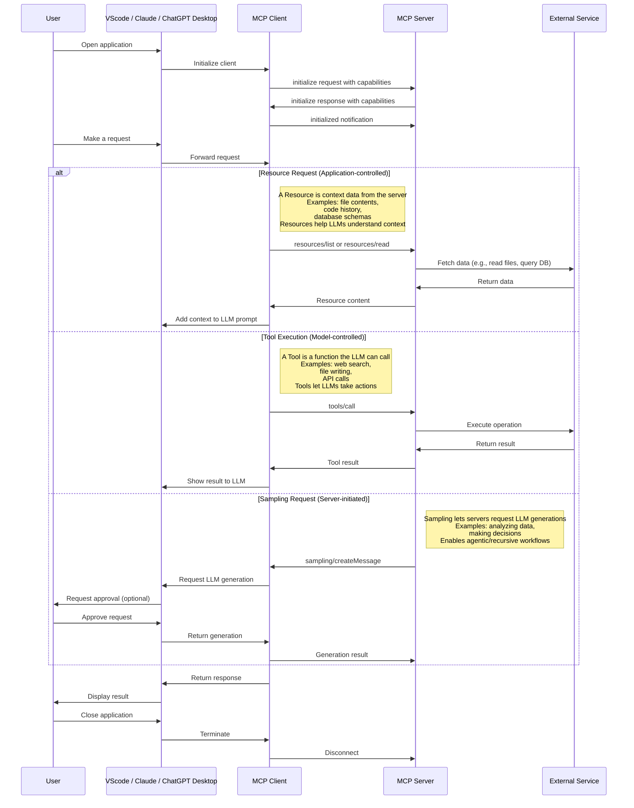

# Model Context Protocol (MCP)

A protocol for seamless integration between LLM applications and external data sources.

The Model Context Protocol (MCP) is an open protocol that enables seamless integration between LLM applications and external data sources and tools. Whether you're building an AI-powered IDE, enhancing a chat interface, or creating custom AI workflows, MCP provides a standardized way to connect LLMs with the context they need.

MCP is an open protocol that standardizes how applications provide context to LLMs. Think of MCP like a USB-C port for AI applications. Just as USB-C provides a standardized way to connect your devices to various peripherals and accessories, MCP provides a standardized way to connect AI models to different data sources and tools.

**Transport pipes**

- **stdio:** server and client at one end, basically the same local machine
- **SSE:** server to client streaming with HTTP POST requests for client to server communication basically when client and host server are different (for prod env)

## Why MCP?

MCP helps you build agents and complex workflows on top of LLMs. LLMs frequently need to integrate with data and tools, and MCP provides:

- A growing list of pre-built integrations that your LLM can directly plug into
- The flexibility to switch between LLM providers and vendors
- Best practices for securing your data within your infrastructure

## General Architecture

At its core, MCP follows a client-server architecture where a host application can connect to multiple servers:


- **MCP Hosts**: Programs like Claude Desktop, IDEs, or AI tools that want to access data through MCP
- **MCP Clients**: Protocol clients that maintain 1:1 connections with servers
- **MCP Servers**: Lightweight programs that each expose specific capabilities through the standardized Model Context Protocol
- **Local Data Sources**: Your computer’s files, databases, and services that MCP servers can securely access
- **Remote Services**: External systems available over the internet (e.g., through APIs) that MCP servers can connect to

## How MCP Works



[How Model Context Protocol (MCP) Works](https://blog.bassemdy.com/2025/04/12/mcp/model-context-protocol/programming/llm/ai/how-model-context-protocol-mcp-works.html)

## Getting Started

[For Claude Desktop Users - Model Context Protocol](https://modelcontextprotocol.io/quickstart/user)

```json
{
  "mcpServers": {
    "filesystem": {
      "command": "npx",
      "args": [
        "-y",
        "@modelcontextprotocol/server-filesystem",
        "/Users/deepaksood/Desktop",
        "/Users/deepaksood/Downloads"
      ]
    },
    "memory": {
        "command": "npx",
        "args": [
          "-y",
          "@modelcontextprotocol/server-memory"
        ]
      }
    }
  }
}
```

## Servers

### Memory

Knowledge Graph Memory Server - [servers/src/memory at main · modelcontextprotocol/servers · GitHub](https://github.com/modelcontextprotocol/servers/tree/main/src/memory)

- A basic implementation of persistent memory using a local knowledge graph. This lets Claude remember information about the user across chats.
- [Collaborate with Claude on Projects \\ Anthropic](https://www.anthropic.com/news/projects)

[GitHub - qdrant/mcp-server-qdrant: An official Qdrant Model Context Protocol (MCP) server implementation](https://github.com/QDrant/mcp-server-qdrant)

- [mcp-server-qdrant \| Glama](https://glama.ai/mcp/servers/@qdrant/mcp-server-qdrant)

[GitHub - doobidoo/mcp-memory-service: MCP server providing semantic memory and persistent storage capabilities for Claude using ChromaDB and sentence transformers.](https://github.com/doobidoo/mcp-memory-service)

[Introducing OpenMemory MCP](https://mem0.ai/openmemory-mcp)

[Unlock Claude's Memory: Knowledge Graph MCP Server Tutorial - YouTube](https://www.youtube.com/watch?v=qeru0ZdudD4)

### Obsidian

- [Obsidian MCP server + VScode Agent + Claude - YouTube](https://www.youtube.com/watch?v=BPGsl62rV-c)
- [Let Claude Automate Your Obsidian Notes: Second Brain AI Agent (MCP) - YouTube](https://www.youtube.com/watch?v=VeTnndXyJQI)
- [GitHub - MarkusPfundstein/mcp-obsidian: MCP server that interacts with Obsidian via the Obsidian rest API community plugin](https://github.com/MarkusPfundstein/mcp-obsidian)
- [Obsidian MCP servers: experiences and recommendations? - Help - Obsidian Forum](https://forum.obsidian.md/t/obsidian-mcp-servers-experiences-and-recommendations/99936/6)
- [Automate Note Generation in Obsidian with Claude Desktop and MCP Servers - Share & showcase - Obsidian Forum](https://forum.obsidian.md/t/automate-note-generation-in-obsidian-with-claude-desktop-and-mcp-servers/99542)
- [GitHub - StevenStavrakis/obsidian-mcp: A simple MCP server for Obsidian](https://github.com/StevenStavrakis/obsidian-mcp)
- [Mind blown: MCP + Obsidian : r/ClaudeAI](https://www.reddit.com/r/ClaudeAI/comments/1hdl0cl/mind_blown_mcp_obsidian/)
- [Writing 2,000 words in 90 minutes with Obsidian + MCP + Claude.](https://www.haihai.ai/obsidian-mcp/)
- [AI in Obsidian: Local LLM Setup Guide in CoPilot - YouTube](https://www.youtube.com/watch?v=hOaSO_e7MYs)
- [I started using NotebookLM with Obsidian and it’s been a game-changer](https://www.xda-developers.com/using-notebooklm-with-obsidian/)

### Databases

#### Postgres

```bash
brew install postgresql
brew services start postgresql

psql postgres
psql pagila

createdb pagila
psql -d pagila -f pagila-schema.sql
psql -d pagila -f pagila-data.sql

psql -d pagila
\dt public.*;
SELECT table_name, COUNT(*) FROM information_schema.tables t JOIN pg_class c ON t.table_name = c.relname WHERE table_schema = 'public'GROUP BY table_name;

brew install postgres-mcp

brew services stop postgresql

pg_restore -d pagila data.dump

# nasdaq data
brew services start postgresql
```

[GitHub - crystaldba/postgres-mcp: Postgres MCP Pro provides configurable read/write access and performance analysis for you and your AI agents.](https://github.com/crystaldba/postgres-mcp)

```sql
What are the rental patterns and lifetime value segments of customers, including their geographic clustering and seasonal preferences? answer the above question using the database

⁠Read the data from PostgreSQL and share the summary of the data
⁠What are the top 5 most traded stocks by total volume?
⁠Which 5 stocks had the highest single-day gain?
⁠Which 5 stocks had the highest single-day loss?
Find the stocks that dropped more than 10% in a single day?
```

#### MySQL

- [GitHub - executeautomation/mcp-database-server: MCP Database Server is a new MCP Server which helps connect with Sqlite, SqlServer and Posgresql Databases](https://github.com/executeautomation/mcp-database-server)
- [GitHub - benborla/mcp-server-mysql: A Model Context Protocol server that provides read-only access to MySQL databases. This server enables LLMs to inspect database schemas and execute read-only queries.](https://github.com/benborla/mcp-server-mysql) - not working
- [GitHub - designcomputer/mysql\_mcp\_server: A Model Context Protocol (MCP) server that enables secure interaction with MySQL databases](https://github.com/designcomputer/mysql_mcp_server)

```json
"mysql": {
      "command": "npx",
      "args": [
        "-y",
        "@executeautomation/database-server",
        "--mysql",
        "--host", "your-host-name",
        "--database", "your-database-name",
        "--port", "3306",
        "--user", "your-username",
        "--password", "your-password"
      ]
    },
"mssql-server": {
      "command": "npx",
      "args": [
        "-y",
        "@executeautomation/database-server",
        "--sqlserver",
        "--server", "server-name",
        "--database", "database-name",
        "--user", "your-username",
        "--password", "your-password"
      ]
    },
```

```bash
claude mcp add mcp_server_mysql \
  -e MYSQL_HOST="127.0.0.1" \
  -e MYSQL_PORT="3306" \
  -e MYSQL_USER="user" \
  -e MYSQL_PASS="password" \
  -e MYSQL_DB="db_name" \
  -e ALLOW_INSERT_OPERATION="false" \
  -e ALLOW_UPDATE_OPERATION="false" \
  -e ALLOW_DELETE_OPERATION="false" \
  -- npx @benborla29/mcp-server-mysql
```

#### Others

- [GitHub - motherduckdb/mcp-server-motherduck: MCP server for DuckDB and MotherDuck](https://github.com/motherduckdb/mcp-server-motherduck)
- [Firebolt MCP Server: Connect Your Data Warehouse to AI](https://www.firebolt.io/blog/unlock-conversational-data-interaction-firebolt-mcp-server-for-advanced-llm-integration)
- Context7, Task Master, GitHub

### Packages

- [Smithery · GitHub](https://github.com/smithery-ai)
	- [Smithery - Model Context Protocol Registry](https://smithery.ai/)

### OpenAI

- [https://platform.openai.com/docs/mcp](https://platform.openai.com/docs/mcp "https://platform.openai.com/docs/mcp")
- [https://platform.openai.com/docs/guides/tools?api-mode=responses](https://platform.openai.com/docs/guides/tools?api-mode=responses "https://platform.openai.com/docs/guides/tools?api-mode=responses")
- [https://platform.openai.com/docs/guides/tools-remote-mcp](https://platform.openai.com/docs/guides/tools-remote-mcp "https://platform.openai.com/docs/guides/tools-remote-mcp")
- [https://platform.openai.com/docs/guides/tools-remote-mcp](https://platform.openai.com/docs/guides/tools-remote-mcp "https://platform.openai.com/docs/guides/tools-remote-mcp")[https://help.openai.com/en/articles/11487775-connectors-in-chatgpt](https://help.openai.com/en/articles/11487775-connectors-in-chatgpt "https://help.openai.com/en/articles/11487775-connectors-in-chatgpt")
- [https://platform.openai.com/docs/guides/deep-research](https://platform.openai.com/docs/guides/deep-research "https://platform.openai.com/docs/guides/deep-research")

### Others

- [servers/src/sequentialthinking at main · modelcontextprotocol/servers · GitHub](https://github.com/modelcontextprotocol/servers/tree/main/src/sequentialthinking)
	- tell me in 1 sentence about me, that I don't know myself. think deeply before giving answer
- [servers/src/everything at main · modelcontextprotocol/servers · GitHub](https://github.com/modelcontextprotocol/servers/tree/main/src/everything)
- [GitHub - airweave-ai/airweave: Airweave lets agents search any app](https://github.com/airweave-ai/airweave) 2.5K stars
- [5 Powerful MCP Servers](https://aiengineering.beehiiv.com/p/5-powerful-mcp-servers)
- [GitHub - rohitg00/kubectl-mcp-server: Chat with your Kubernetes Cluster using AI tools and IDEs like Claude and Cursor!](https://github.com/rohitg00/kubectl-mcp-server)
- [GitHub - QuantGeekDev/mongo-mcp: A mongo db server for the model context protocol (MCP)](https://github.com/QuantGeekDev/mongo-mcp)
	- [Announcing the MongoDB MCP Server \| MongoDB](https://www.mongodb.com/blog/post/announcing-mongodb-mcp-server)
- [GitHub - awslabs/mcp: AWS MCP Servers — helping you get the most out of AWS, wherever you use MCP.](https://github.com/awslabs/mcp)
- [GitHub - punkpeye/awesome-mcp-clients: A collection of MCP clients.](https://github.com/punkpeye/awesome-mcp-clients)
- [kagent \| Bringing Agentic AI to cloud native](https://kagent.dev/)
- [GitHub - pab1it0/prometheus-mcp-server: A Model Context Protocol (MCP) server that enables AI assistants to query and analyze Prometheus metrics through standardized interfaces.](https://github.com/pab1it0/prometheus-mcp-server)

## Tools

- [GitHub - jlowin/fastmcp: 🚀 The fast, Pythonic way to build MCP servers and clients](https://github.com/jlowin/fastmcp)
	- [Welcome to FastMCP 2.0! - FastMCP](https://gofastmcp.com/getting-started/welcome)
- [🛰️ MCP Support \| Open WebUI](https://docs.openwebui.com/openapi-servers/mcp/)

## Resources

- [Model Context Protocol · GitHub](https://github.com/modelcontextprotocol)
- [GitHub - punkpeye/**awesome-mcp-servers**: A collection of MCP servers.](https://github.com/punkpeye/awesome-mcp-servers)
- [Awesome MCP Servers](https://mcpservers.org/)
	- [MCP servers \| Glama](https://glama.ai/mcp/servers)
- [Top 5 MCP Servers to Automate Daily Tasks and Workflows with Prompts \| by Pedro Aquino \| Medium](https://medium.com/@pedro.aquino.se/top-5-mcp-servers-to-automate-daily-tasks-and-workflows-with-prompts-039fe50570fd)
- [GitHub - wong2/awesome-mcp-servers: A curated list of Model Context Protocol (MCP) servers](https://github.com/wong2/awesome-mcp-servers)
- Tools - [Inspector - Model Context Protocol](https://modelcontextprotocol.io/docs/tools/inspector)
	- The [MCP Inspector](https://github.com/modelcontextprotocol/inspector) is an interactive developer tool for testing and debugging MCP servers. While the [Debugging Guide](https://modelcontextprotocol.io/docs/tools/debugging) covers the Inspector as part of the overall debugging toolkit, this document provides a detailed exploration of the Inspector’s features and capabilities.
- [GitHub - mcp-ecosystem/mcp-gateway: 🧩 MCP Gateway - A lightweight gateway service that instantly transforms existing MCP Servers and APIs into MCP servers with zero code changes. Features Docker deployment and management UI, requiring no infrastructure modifications.](https://github.com/mcp-ecosystem/mcp-gateway)
	- **MCP Gateway** is a lightweight and highly available gateway service written in Go. It enables individuals and organizations to convert their existing MCP Servers and APIs into services compliant with the [MCP Protocol](https://modelcontextprotocol.io/) — all through configuration, with **zero code changes**.
	- [GitHub - lasso-security/mcp-gateway: A plugin-based gateway that orchestrates other MCPs and allows developers to build upon it enterprise-grade agents.](https://github.com/lasso-security/mcp-gateway)
- [GitHub - googleapis/genai-toolbox: MCP Toolbox for Databases is an open source MCP server for databases.](https://github.com/googleapis/genai-toolbox)

## Others

- [Announcing the Agent2Agent Protocol (A2A) - Google Developers Blog](https://developers.googleblog.com/en/a2a-a-new-era-of-agent-interoperability/)
- [Star History Monthly May 2025 \| Agent Protocol](https://www.star-history.com/blog/agent-protocol)
	- X402 - Payment-Required Protocol by Coinbase
- [GitHub - i-am-bee/acp: Open protocol for communication between AI agents, applications, and humans.](https://github.com/i-am-bee/acp)
	- [A Hands-on Guide to Agent Communication Protocol](https://blog.dailydoseofds.com/p/a-hands-on-guide-to-agent-communication)
- Google - Agent Payments Protocol (AP2)
- Claude Skills - [Antropic - Claude Skills](https://api.filekitcdn.com/e/k7YHPN24SoxyM8nGKZnDxa/a4xJgHQ8Nbk8g4A8riZomz/player)

## Links

- [The Model Context Protocol (MCP) Explained (and one cool code example.) - YouTube](https://www.youtube.com/watch?v=5ZWeCKY5WZE&ab_channel=Underfitted)
- [Is MCP Becoming The Next BIG Thing in AI - YouTube](https://www.youtube.com/watch?v=japoGcdbZGw&ab_channel=RobShocks)
- [What is MCP & why it's a big (huge) deal: Detailed explanation for both… \| John Rush \| 10 comments](https://www.linkedin.com/posts/johnrushx_what-is-mcp-why-its-a-big-huge-deal-activity-7303421262440112129-iJWV)
- [Building Agents with Model Context Protocol - Full Workshop with Mahesh Murag of Anthropic - YouTube](https://www.youtube.com/watch?v=kQmXtrmQ5Zg&ab_channel=AIEngineer)
- [What is Model Context Protocol (MCP)? How it simplifies AI integrations compared to APIs \| AI Agents That Work](https://norahsakal.com/blog/mcp-vs-api-model-context-protocol-explained/)
- [🦸🏻#14: What Is MCP, and Why Is Everyone – Suddenly!– Talking About It?](https://huggingface.co/blog/Kseniase/mcp)
- [What is MCP? No, Really! - YouTube](https://www.youtube.com/watch?v=5zL__Rmk4fs)
- [Get Started With The Model Context Protocol // 2-Minute Tutorial - YouTube](https://www.youtube.com/watch?v=MC2BwMGFRx4)
- [ChatGPT Supports MCP Server Finally! - YouTube](https://www.youtube.com/watch?v=-P1qZo0plEg)
- [MCP Made SIMPLE: Your FIRST Hello World MCP Server. Works for CURSOR & WINDSURF. - YouTube](https://www.youtube.com/watch?v=rcjdfhhb6ZU&ab_channel=AIOrientedDev)
- How LLM decides which mcp tool to use
- [The Full MCP Blueprint: Testing, Security and Sandboxing in MCPs (Part A)](https://www.dailydoseofds.com/model-context-protocol-crash-course-part-6/)
- [The Full MCP Blueprint: Background, Foundations, Architecture, and Practical Usage (Part A)](https://www.dailydoseofds.com/model-context-protocol-crash-course-part-1/)
- [The Full MCP Blueprint: Building a Full-Fledged Research Assistant with MCP and LangGraph](https://www.dailydoseofds.com/model-context-protocol-crash-course-part-9/)
- [The Complete Guide to Model Context Protocol - MachineLearningMastery.com](https://machinelearningmastery.com/the-complete-guide-to-model-context-protocol/)
- [Securing the AI agent supply chain with Cisco's open-source MCP Scanner - Cisco Blogs](https://blogs.cisco.com/ai/securing-the-ai-agent-supply-chain-with-ciscos-open-source-mcp-scanner)
	- [GitHub - cisco-ai-defense/mcp-scanner: Scan MCP servers for potential threats & security findings.](https://github.com/cisco-ai-defense/mcp-scanner)
