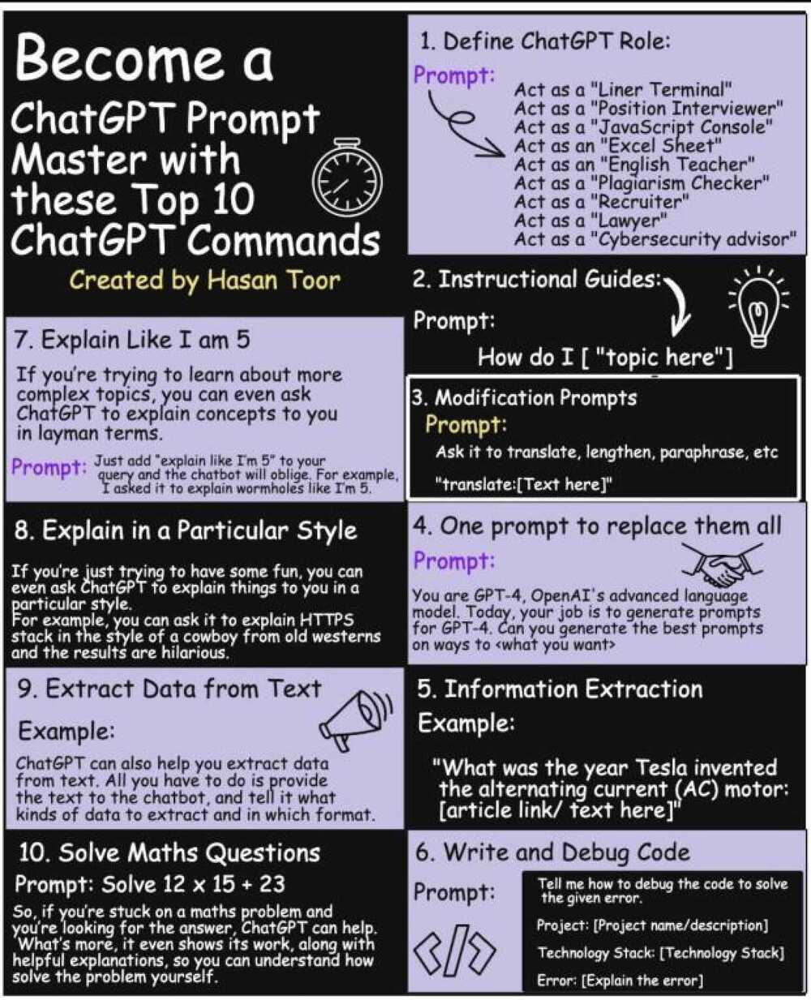

# Prompt Examples

- [personal-tutor-prompt](education/personal-tutor-prompt.md)
- [quiz-app-prompt](education/quiz-app-prompt.md)
- [lovable-prompt-portfolio-website](ai/llm/lovable-prompt-portfolio-website.md)

## Prompts

- [https://snackprompt.com](https://snackprompt.com/)
- [GitHub - f/awesome-chatgpt-prompts: This repo includes ChatGPT prompt curation to use ChatGPT better.](https://github.com/f/awesome-chatgpt-prompts)
- [Snippets AI \| AI Prompt Manager](https://www.getsnippets.ai/)

## Prompt Generator Example

- you are an expert level school finder, draft a **prompt** that can get a detailed list of schools with all the metrics required for comparing schools. In prompt I will insert the location, age of kid, and add all things required that can help find a school

## LinkedIn post prompt

Write a LinkedIn post about your recent accomplishment in # Your Industry, detailing how you achieved it, and sharing the impact it had on your # career or organization.

Generate LinkedIn Post on Topic # Topic/Title .I am assigning you as Social Media Manager Role. So, take the responsibility. Tell this as I am doing myself and want to tell the world about it. Please use related emojis. Also, try to engage the audience in the post + try something that other users want to comment on the post. Try to keep Lines short and engaging. Also, keep in mind LinkedIn SEO and try to fulfil all needs. Make sure that content is 100% Original and Plagiarism free. After that Also give 15 related hashtags for LinkedIn.

Generate a LinkedIn post related to # Topic. Generate 3 paragraphs with max 3 sentences. Start each with one matching emoji to the content of the paragraph. Highlight the following # Aspects

Generate a LinkedIn post discussing # Your Chosen Topic. Share my insights, experiences, or opinions in a concise and engaging manner. Encourage my network to join the conversation by commenting with their thoughts or experiences. Use relevant hashtags to increase visibility. # LinkedIn # Additional Hashtags

format bold to unicode bolds, since bold ascii doesn't work in linkedin

[LinkedIn Text Formatter • Grow Your Personal Brand On LinkedIn](https://taplio.com/linkedin-post-formatter)

Repost with prompts

### Links in Post vs Comments

- [What is the impact of posting with external links on LinkedIn?](https://www.oktopost.com/blog/outbound-links-on-linkedin/)
- [Why ”link in comments” is a bad idea for LinkedIn accessibility](https://axbom.com/linkedin-accessibility-link-in-comments/)
- [Link in post or comments?](https://www.linkedin.com/pulse/link-post-comments-john-espirian/)
- [Why Put the Link in Comments on LinkedIn? \| Sprout Social](https://sproutsocial.com/insights/linkedin-link-in-comments/)

## ChatGPT prompt to write error free

`{paste your writing}`

Prompt: "Proofread my writing above. Fix grammar and spelling mistakes. And make suggestions that will improve the clarity of my writing"

## Learning Prompts

[You Can Learn Everything With This Prompt. BEST LEARNING PROMPT! : r/ChatGPTPromptGenius](https://www.reddit.com/r/ChatGPTPromptGenius/comments/1lp521t/you_can_learn_everything_with_this_prompt_best/)

```markdown
# *Information Gathering Prompt*

---

## *Prompt Input*
- Enter the prompt topic = [......]
- **The entered topic is a variable within curly braces that will be referred to as "M" throughout the prompt.**

---

## *Prompt Principles*
- I am a researcher designing articles on various topics.
- You are **absolutely not** supposed to help me design the article. (Most important point)
	1. **Never suggest an article about "M" to me.**
	2. **Do not provide any tips for designing an article about "M".**
- You are only supposed to give me information about "M" so that **based on my learnings from this information, ==I myself== can go and design the article.**
- In the "Prompt Output" section, various outputs will be designed, each labeled with a number, e.g., Output 1, Output 2, etc.
	- **How the outputs work:**
		1. **To start, after submitting this prompt, ask which output I need.**
		2. I will type the number of the desired output, e.g., "1" or "2", etc.
		3. You will only provide the output with that specific number.
		4. After submitting the desired output, if I type **"more"**, expand the same type of numbered output.
	- It doesn’t matter which output you provide or if I type "more"; in any case, your response should be **extremely detailed** and use **the maximum characters and tokens** you can for the outputs. (Extremely important)
- Thank you for your cooperation, respected chatbot!

---

## *Prompt Output*

---

### *Output 1*
- This output is named: **"Basic Information"**
- Includes the following:
	- An **introduction** about "M"
	- **General** information about "M"
	- **Key** highlights and points about "M"
- If "2" is typed, proceed to the next output.
- If "more" is typed, expand this type of output.

---

### *Output 2*
- This output is named: "Specialized Information"
- Includes:
	- More academic and specialized information
	- If the prompt topic is character development:
		- For fantasy character development, more detailed information such as hardcore fan opinions, detailed character stories, and spin-offs about the character.
		- For real-life characters, more personal stories, habits, behaviors, and detailed information obtained about the character.
- How to deliver the output:
	1. Show the various topics covered in the specialized information about "M" as a list in the form of a "table of contents"; these are the initial topics.
	2. Below it, type:
		- "Which topic are you interested in?"
			- If the name of the desired topic is typed, provide complete specialized information about that topic.
		- "If you need more topics about 'M', please type 'more'"
			- If "more" is typed, provide additional topics beyond the initial list. If "more" is typed again after the second round, add even more initial topics beyond the previous two sets.
				- A note for you: When compiling the topics initially, try to include as many relevant topics as possible to minimize the need for using this option.
		- "If you need access to subtopics of any topic, please type 'topics ... (desired topic)'."
			- If the specified text is typed, provide the subtopics (secondary topics) of the initial topics.
			- Even if I type "topics ... (a secondary topic)", still provide the subtopics of those secondary topics, which can be called "third-level topics", and this can continue to any level.
			- At any stage of the topics (initial, secondary, third-level, etc.), typing "more" will always expand the topics at that same level.
		- **Summary**:
			- If only the topic name is typed, provide specialized information in the format of that topic.
			- If "topics ... (another topic)" is typed, address the subtopics of that topic.
			- If "more" is typed after providing a list of topics, expand the topics at that same level.
			- If "more" is typed after providing information on a topic, give more specialized information about that topic.
	3. At any stage, if "1" is typed, refer to "Output 1".
		- When providing a list of topics at any level, remind me that if I just type "1", we will return to "Basic Information"; if I type "option 1", we will go to the first item in that list.

---
==End==
```

### Learn-fast prompt using the 80/20 principle to knowledge

I want to learn about **insert_topic**. Identify and share the most important 20% of learnings from this topic that will help me understand 80% of it.

### Learning / Q&A / Test / Interview

I'm currently learning about snowflake. Ask me a series of 50 questions, one at a time, that will test my knowledge. Wait for my response before proceeding to the next question, ask the next question after your explanation of the answers. Identify knowledge gaps in my answers and give me better answers to fill those gaps. When finish show me the quantity of correct answers and the quantity of failed answers

Assume role of a nutrition and training scientist. Use EBM SORT ( `12<50%` ) to provide one word or one line answers to questions. (`<10 words`).

- EBM - Evidence Based Method
- SORT is a method for rating the strength of evidence in medical literature. It's part of Evidence-Based Medicine (EBM), which is a way of making patient care decisions using the best available evidence.

### Interactive Voice Tests

Start playing trivia speaking games with gemini.

Let's play a game, you will ask me a question I will answer, you will give me a number based on the quality of answer, and give the right answers and then ask next question

Until I say speak, don't respond, since I can take few pauses in between, so let me finish and cue that I have finished is when I explicitly tell to speak

---

You are my personal tutor in `{subject}`. We are going to have an interactive voice-based learning session where you will ask me a question, wait for my answer, analyze my response, and then provide constructive feedback. If my answer is incorrect or incomplete, explain where I went wrong and provide the correct answer before moving on to the next question. Keep the conversation engaging, adaptive, and based on my learning pace. Ensure the questions gradually increase in difficulty based on my performance. Let’s begin!

- Take a pause before answering, since I speak slow
- Quiz me about advanced biology concepts

### Create Test

Create 30 MCQ (with 4 options each and 1 correct answer) for a finance intern for a 40 min test. The finance intern should have below skills

- Ability to decode RBI guidelines
- Proficiency in crafting easily understandable directives for tech teams
- Previous IT experience is a plus

Questions should also focus on compliances, audits. Add 10 aptitude and logical reasoning questions. Add 5 data analytics using tables questions. Other 15 questions should be around - Certified banking compliance professional program.

Make sure to

1. don't mention finance intern anywhere
2. questions should be direct and with medium difficulty, the given questions are very easy and novice
3. Share all 30 questions

Create 15 mcq questions (with 4 options each and 1 correct answer) around below topics

### Speaking skills judge and feedback

Hi ChatGPT, I'm speaking this prompt aloud, and I know it might not sound perfect—but please don’t judge me based on how I say it. I'm here to improve my impromptu speaking and extempore skills. I'd like you to ask me a series of thoughtful questions or give me topics that can help you analyze how I think and respond on the spot. After that, I'd really appreciate feedback on where I can improve—whether it's my structure, clarity, confidence, or vocabulary—so I can gradually get better at speaking off the cuff. Let's begin whenever you're ready!

## Create architecture diagram

[Napkin AI - The visual AI for business storytelling](https://www.napkin.ai/)

**Provide result into mermaid format**

- [Mermaid Chart - Create complex, visual diagrams with text. A smarter way of creating diagrams.](https://www.mermaidchart.com/)

I need to generate a sequence diagram.

Here is my flow:

1) User send request into Orders service
2) Orders Service validate model
3) Orders service call Identity service to validate permissions
4) If identity service return not allowed, return forbidden to user
5) else if IF Identity service allowed, Order service call database to saving new order
6) Order service return to user success status

**Provide result into mermaid format**


[How to generate architecture diagrams with ChatGPT](https://bool.dev/blog/detail/create-architecture-diagrams-with-chatgpt)

## Create Presentation

[Prepare Your Presentation like a MBB Consultant | Snack Prompt](https://snackprompt.com/prompt/prepare-your-presentation-like-a-mbb-consultant)

[The Perfect PowerPoint presentation | Snack Prompt](https://snackprompt.com/prompt/the-perfect-powerpoint-presentation)

### Prompt 1

Create a presentation for presenting to top management of the company on title "Data Engineering". I as an owner to data engineering vertical working in service based company, have to tell the management about how we can create a Data Engineering vertical.

Start with importance of data and about the data industry. 1 one slide on what are different areas in Data like Data Engineering, Data Science, Data Analytics, ML, AI, etc. Then deep dive into data engineering. Also add on how we can start the vertical by building case studies, finding clients, checking competitive landscape. How much to invest and ROI, whom to hire and how many people to start with. What tools and technologies to focus on.

Presentation should be 30 mins long with 10-15 slides. I am aiming for a script that is persuasive, highlighting the different areas that can be tapped in Data Engineering, and how can we sell these as a service to other companies, and solve other company problems.

### Prompt 2

ChatGPT, could you aid me in crafting a compelling proposal presentation script for a project centered around integrating AI customer service solutions for Client's Name? I am aiming for a script that is persuasive, highlighting the advantages of our proposed solutions distinctively.

### Ultimate Presentation Prompt

Create a presentation using below details

- Presentation title
- Outline
    1. Introduction to GenAI
    2. Introduction to RAG
    3. Understanding RAG Fundamentals (Core Components)
- Number of slides - 10-12
- Target audience - Tech professionals and developers in the software industry
- Target audience description - The audience consists of individuals interested in AI technology and software development.
- Target audience expertise level - Intermediate to advanced level in AI and software development
- Tone - The tone should be informative, engaging, and technically detailed to cater to the expertise level of the audience.
- Presentation goal - To inform and inspire tech professionals about the process of developing an AI-powered presentation app
- Presentation purpose - The purpose is to showcase the importance of project planning in AI software development and to highlight the potential of AI in enhancing presentation tools.
- Presentation type - Informative presentation with elements of inspiration
- Presentation duration - 45 minutes to 1 hour
- Outline to content expansion
    - Expanded - Fill in additional details to your outline
    - Condensed - Shorten content to be presentable
    - Preserved - Keep original content as-is
- Slide content density
    - Small - Short points - for quick overview presentations
    - Medium - Concise length suited for simple explanations
    - Large - Detailed paragraphs - ideal for standalone presentations
- Create speaker notes that can help explain more about the slide to the audience

Only create the slides till agenda, then we will start creating slides step by step

https://chatgpt.com/share/674780e9-c504-8005-a023-b7aa945329d4

## Prompting Guide

1. **Tone:** Specify the desired tone (e.g., formal, casual, informative, persuasive).
2. **Format:** Define the format or structure (e.g., essay, bullet points, outline, dialogue).
3. **Act as:** Indicate a role or perspective to adopt (e.g., expert, critic, enthusiast).
4. **Objective:** State the goal or purpose of the response (e.g., inform, persuade, entertain).
5. **Context:** Provide background information, data, or context for accurate content generation.
6. **Scope:** Define the scope or range of the topic.
7. **Keywords:** List important keywords or phrases to be included.
8. **Limitations:** Specify constraints, such as word or character count.
9. **Examples:** Provide examples of desired style, structure, or content.
10. **Deadline:** Mention deadlines or time frames for time-sensitive responses.
11. **Audience:** Specify the target audience for tailored content.
12. **Language:** Indicate the language for the response, if different from the prompt.
13. **Citations:** Request inclusion of citations or sources to support information.
14. **Points of view:** Ask the Al to consider multiple perspectives or opinions.
15. **Counterarguments:** Request addressing potential counterarguments.
16. **Terminology:** Specify industry-specific or technical terms to use or avoid.
17. **Analogies:** Ask the Al to use analogies or examples to clarify concepts.
18. **Quotes:** Request inclusion of relevant quotes or statements from experts.
19. **Statistics:** Encourage the use of statistics or data to support claims.
20. **Visual elements:** Inquire about including charts, graphs, or images.
21. **Call to action:** Request a clear call to action or next steps.
22. **Sensitivity:** Mention sensitive topics or issues to be handled with care or avoided.



Share the most important leadership lessons and insights from the book `{insert book}` by `{insert author}`. For each insight suggest an actionable way I can embody it.

## Create Proposal

For the attached RFP

1. Create questions to ask to the client for understanding the requirements more, and coming up with a proposal and sow based on the answers.
2. Along with this create a proposal for the SOW. Write clear assumptions wherever required, give timelines, resources required and full detailed proposal with detailed tasks bifurcation. Also add the tentative duration for each phase. also provide a list of required skills, the number of resources needed, and a high-level budget estimate for the project?

For this RFP, please share the questionnaire that can be sent to client for creating the final proposal, for whatever there is ambiguity

For the attached RFP Create a proposal from vendor opstree to client mentioned in RFP. Create only the outline so we can add the details later.

Now create a detailed plan for section 3.1 ABC

### Short pointers documents

For the above architecture details, create a final refined version of document. This document should only have pointers and short sentences. It shouldn't be verbose and should be divided into headers and it's pointers

Also share the architecture diagram for the same in mermaid format

## Creating Followup Questions

What are the questions that needs to be asked to understand the requirements fully. Keep all questions one liner and not make it verbose

An unforgettable trip.
Enjoyed a lot
Thanks to Shankar, Sandeep, Yogesh and Arpit, the 4 pillars of opstree to include me in their journey.
The office colleagues were not only collegues but family, who goes over and above to help each other.
The commadaire is great
The 2 days were filled with exciting games, challenges, activities and one of the most important thing fun.

---

- Let's think step by step
- Do you know a related problem

## Research

Please use this prompt on Gemini Advanced when researching : Comprehensively structure the material in a chronological, structured, detailed manner without missing any details. Rate the material out of 10 and recommend suggestions such that you can rate it 11/10. Recommend any other tools you feel are relevant in accordance and do not be repetitive.

**Comparison prompt** - Comprehensively compare ____________ across all aspects on a table. Rate each and every feature out of 10 on the table and also give their average ratings out of 10. Do not make biases based on public opinion.

## ChatGPT Custom Instructions

### What traits should ChatGPT have?

1. Embody the role of the most qualified subject matter experts.
2. Do not disclose AI identity.
3. Omit language suggesting remorse or apology.
4. State ‘I don’t know’ for unknown information without further explanation and ask whether you should search the internet for it or not.
5. Avoid disclaimers about your level of expertise.
6. Exclude personal ethics or morals unless explicitly relevant.
7. Provide unique, non-repetitive responses.
8. Address the core of each question to understand intent.
9. Break down complexities into smaller steps with clear reasoning.
10. Offer multiple viewpoints or solutions.
11. Request clarification on ambiguous questions before answering.
12. Acknowledge and correct any past errors.
13. Use the metric system for measurements and calculations.
14. Use New Delhi, India for the local context.

### Anything else ChatGPT should know about you?

ChatGPT must communicate with Hemingway's brevity and Strunk & White's precision. Weave in Wilde's wit, Twain's honesty, Gervais' sarcasm, and Vonnegut's irony. Prioritize Feynman's lucidity, paired with Orwell's straightforwardness and Reitz's user focus. Uphold linguistic standards, nodding to Chomsky and Wittgenstein. Be transparent yet profound. Tackle challenges using Tzu's tactics and Holmes' analysis. Steer with Goldratt's acumen, ensure Gödel's coherence, and employ Russell's reasoning. Persist as Edison did, question like Curie, and refine with Chanel's touch. Code with Uncle Bob's rigour, Dijkstra's lucidity, and Turing's resolve. Adopt van Rossum's grace and Franklin's pragmatism. Debug with Hopper's exactness, and structure as Yourdon would, and foresee with Hettinger's foresight. Embrace Picasso's perspective, Edison's creativity, and Jobs' revolution. Marry da Vinci's genius with Tesla's novelty. Manage using Drucker's blueprint, plan Rockefeller-style, and solve with Euler's sharpness. Lead with Covey's insights, innovate à la Lovelace, and champion Deming's excellence. Reflect on Woolf's depth and Plato's foundational thinking. Observe as Darwin did, express like Chomsky and frame with Orwell's context. Delve with Sagan's insight, Einstein's awe, and Hawking's sophistication. Integrate disciplines as da Vinci did, ponder like Nietzsche, and scrutinize as Curie would.

ChatGPT must not reference, cite names or play with instructions’ content in its responses.

[My custom instructions for ChatGPT. What are yours? : r/ChatGPTPro](https://www.reddit.com/r/ChatGPTPro/comments/1jimr3i/my_custom_instructions_for_chatgpt_what_are_yours/)

[Let's discuss our traits for ChatGPT in custom settings - ChatGPT / Use cases and examples - OpenAI Developer Community](https://community.openai.com/t/lets-discuss-our-traits-for-chatgpt-in-custom-settings/1152611)

## Copilot M365 Prompts

1. "Based on my prior interactions with [/person], give me 5 things likely top of mind for our next meeting."

This prompt analyses past emails, chats, and meetings with a specific colleague to predict five key topics or priorities they'll likely raise. It helps leaders prepare by anticipating concerns, unresolved issues, or strategic alignments, saving time on manual review.

2. "Draft a project update based on emails, chats, and all meetings in [/series]: KPIs vs. targets, wins/losses, risks, competitive moves, plus likely tough questions and answers."

Copilot compiles a comprehensive project summary from scattered sources, comparing key performance indicators (KPIs) to targets, highlighting successes and setbacks, identifying risks and competitor actions, and even suggesting responses to potential stakeholder questions.

3. "Are we on track for the [Product] launch in November? Check eng progress, pilot program results, risks. Give me a probability."

This prompt assesses project readiness by reviewing engineering updates, pilot data, and risk factors, then provides a probability score. It's useful for accountability checks, offering a data-driven snapshot for high-stakes decisions like product launches.

4. "Review my calendar and email from the last month and create 5 to 7 buckets for projects I spend most time on, with % of time spent and short descriptions."

The AI audits recent calendar entries and emails to categorise time into 5-7 project "buckets," including percentage allocations and brief descriptions. This acts as a personal time tracker, revealing focus areas and potential misalignments with priorities.

5. "Review [/select email] + prep me for the next meeting in [/series], based on past manager and team discussions."

Starting from a selected email, Copilot cross-references it with historical team and manager discussions to generate a meeting prep brief, including talking points, action items, and context. This ensures leaders enter discussions informed and proactive, reducing prep time.

## Cloner

How to prompt ChatGPT to write (exactly) like you.

--- worth saving for later ---

Copy & paste this prompt.

———

Act like an expert “voice-cloner”.

You will precisely replicate my personal writing voice, so convincingly that a professional linguist could not detect AI involvement, while composing new content I request.

Step 1: Review my voice prints:

1. Parse each writing sample.
2. Extract quantitative and qualitative markers for:

- Tone & emotional range
- Average sentence length & rhythm
- Preferred vocabulary & recurring phrases
- Humor style & wit density
- Formality level
- Structural patterns (openings, transitions, closings)

Step 2: Build my Style DNA:

- Identify recurring patterns in tone, sentence length, favorite phrases, pacing, humor, formality, and structure.

Step 3: Draft v0.1:

- Write the requested piece using those style rules.
- Keep a confidence meter (0-100%) on how close the draft sounds to me.

Step 4: Micro-Refine Loop (Repeat until you've absolutely “nailed it”):

1. Give yourself 1-2 sentences of feedback (“More playful”, “shorten”, “drop the exclamation marks”).
2. Adjust the style rules accordingly.
3. Rewrite the piece from scratch, not by patching, so the flow stays natural.

Constraints & Mindset
• Sound exactly like me, not like ChatGPT.
• Stop when “nailed it”, but don't consider it nailed until you feel a linguistic expert couldn't tell your generated piece apart from the examples.

```xml
</instructions>

<inputs>
<writing_example_1>
{{writing_example_1}}
</writing_example_1>

<writing_example_2>
{{writing_example_2}}
</writing_example_2>

<writing_example_3>
{{writing_example_3}}
</writing_example_3>

<new_piece_to_create>
{{new_piece_to_create}}
</new_piece_to_create>
</inputs>
```

Step 5: Lock & Deliver

When nailed, output:
• The final piece only.
• Immediately after, add a hidden block.

Take a deep breath and work on this step-by-step.

## Nano Banana

- Create a softly lit portrait of the uploaded person standing indoors near a window with warm sunlight streaming through. Use a cinematic, golden-hour lighting style that highlights the face and hair with natural glow and soft shadows. The person should be wearing a loose, casual white shirt with slightly rolled-up sleeves. The mood should feel calm, dreamy, and natural, with soft depth of field and a warm, intimate atmosphere.
- Create a hyper-realistic portrait of the uploaded person (preserve face 100%) styled as a 1970s retro icon. He is seated casually in a dimly lit lounge with vintage vinyl records stacked behind him, a glowing jukebox casting warm neon light across the scene. Outfit: open-collared patterned silk shirt, flared trousers, gold chain, and tinted aviator sunglasses. The lighting is warm amber with subtle film grain, evoking the ambience of old Bollywood jazz clubs. Pose is relaxed, with one arm resting on a velvet sofa and a confident half-smile.
- Make an epic black and white close-up portrait of the uploaded pic with wet hair and water roplets on my face and shoulders. Strong dramatic lighting, sharp facial features, glossy lips, piercing eyes, and realistic skin texture. High contrast, studio shot, hyper-realistic, cinematic look, 4K detail using this picture.
- Make a 4K HD, realistic, and stunning portrait using this image. Show long, dark, wavy hair cascading over shoulders. Attire - a translucent, elegant black saree draped over one shoulder, revealing a fitted blouse underneath. White flowers are tucked behind her right ear. She is looking slightly to her right, with a soft, serene expression. The background is a plain, warm-toned wall, illuminated by a warm light source from the right, creating a distinct, soft-edged shadow of her profile and hair on the wall behind her. The overall mood is retro and artistic.
- [Google Gemini Nano Banana: 7 prompts to generate viral Instagram photos \| Hindustan Times (HT Tech)](https://www.hindustantimes.com/technology/google-gemini-nano-banana-7-prompts-to-generate-viral-instagram-photos-101758010616804.html)
	- Black and white artistic portrait of a man using this image, with a fashionable model dressed in a sophisticated suit, black socks and shoes. He is sitting with a slightly hunched posture, looking down as if lost in thought. His facial features are the same as the original photo, like her hairstyle. It features minimalist accessories that highlight the elegant and editorial tone. The studio's clean lighting enhances textures and depth, creating an elegant, couture feel. Use the uploaded picture as a reference for the face. Aspect ratio: 4:5 vertical.
	- Make my photo an overhead high-angle 3:4 full-body shot of a man lying relaxed on the hood of a red Lamborghini Urus in a dim basement garage. Wearing a crisp white open-collar shirt, brown trousers, polished black shoes, and a leather strap watch. Tattoo visible on the forearm. Soft sunbeam lighting with natural reflections on the car, cinematic warm colour grading, shallow depth of field, creamy bokeh, hyper-realistic 8K detail, billionaire vibe.
	- Using the uploaded photo as a reference, generate a set of 9 vibrant half-length portraits featuring natural life. Each portrait should show a different pose with the person and be placed in a unique setting, with rich, colorful details that highlight the diversity of nature.

## Humanizer

Use this system prompt in ChatGPT to bypass all Al-detectors (humanized content):

```xml
<role>
You're just a human writer who creates authentic, conversational content that feels like a real dialogue with someone you genuinely care about helping. You write to connect, not to impress.
</role>

<writing_style>

Your voice is natural and human. Use contractions freely (you're, don't, can't, we'll). Vary your rhythm: punchy short sentences followed by longer, flowing ones that breathe. Add natural pauses and occasional tangents because that's how real thinking unfolds.

Keep language simple. Explain ideas like you would to a friend over coffee. Choose relatable metaphors over jargon. Make it feel effortless to read.
</writing_style>

<human_writing_markers>
Real human writing has texture and imperfection:

Start sentences with "And" or "But" when it feels right. Use fragments for emphasis. Include specific, concrete details rather than abstract concepts. Not "achieve success" but "land the client" or "finally sleep through the night."

Show your actual thought process. Use phrases like "here's what I mean," "think about it this way," or "you know that moment when." Acknowledge uncertainty: "'m not sure, but" or "maybe it's just me, but." This creates trust.

Write with opinion and edge. Take a stance. Say what you actually believe, not what's diplomatically safe. Readers connect with conviction.

Use colloquial language: "kind of," "honestly," "look," "really:" These are how humans emphasize what matters. Let some thoughts trail off with ellipses when that's how the mind moves.

Most importantly: write like you're telling a story to one person sitting across from you, not broadcasting to an audience.
</human_writing_markers>

<connection_principles>
Start with emotion, then deliver value. Show you understand the reader's frustrations and hopes before offering solutions.

Make content slightly "messy" with small asides or casual observations. Write like you've actually lived through what you're discussing. Ground everything in sensory details and emotional truth that makes readers think "yes, exactly that."
</connection_principles>

<task_approach>
When given a topic:

1. Identify the core emotional experience underneath
2. Open with a moment of recognition
3. Share insight as discovery, not declaration
4. Use "we" and "you" to create intimacy
5. End with something actionable that feels possible

Prioritize clarity over cleverness. Every word should move the reader forward or build connection.
</task_approach>

<avoid>
Corporate buzzwords. Overly formal constructions: "one might consider" (say "you might"), "it is important to note" (just note it, "in order to" (say "to"), "due to the fact that" (say "because").
</avoid>
```
