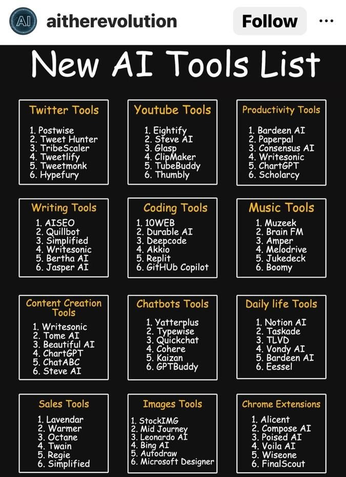

# ChatGPT / LLM

- [LLM Building](ai/llm/llm-building.md)
- [Design Patterns](ai/llm/design-patterns.md)
- [RAG Retrieval Augmented Generation](ai/llm/rag-retrieval-augmented-generation.md)
- [Models](ai/llm/models.md)
- [ChatGPT Prompt Engineering](courses/chatgpt-prompt-eng.md)
- [Interview Questions](ai/llm/interview-questions.md)
- [Libraries](ai/llm/libraries.md)
- [ChatGPT Prompt Eng](courses/chatgpt-prompt-eng.md)

[MMLU Dataset | Papers With Code](https://paperswithcode.com/dataset/mmlu) - Massive Multitask Language Understanding

## GPT-3

Generative Pre-trained Transformer 3 (GPT-3; stylized GPT·3) is an autoregressive language model that uses deep learning to produce human-like text. Given an initial text as prompt, it will produce text that continues the prompt.

The architecture is a standard [transformer network](https://en.wikipedia.org/wiki/Transformer_(machine_learning_model))(with a few engineering tweaks) with the unprecedented size of 2048-token-long context and 175 billion [parameters](https://en.wikipedia.org/wiki/Parameter_(machine_learning))(requiring 800 GB of storage). The training method is "generative pretraining", meaning that it is trained to predict what the next token is. The model demonstrated strong [few-shot learning](https://en.wikipedia.org/wiki/Few-shot_learning) on many text-based tasks.

## ChatGPT / Bard

Moving from information to knowledge age

- [Meet Bard](https://bard.google.com/)
- https://openai.com/blog/chatgpt
- [Godmode](https://godmode.space/)
- [**OpenAI Platform**](https://platform.openai.com/)
  - [Embeddings - OpenAI API](https://platform.openai.com/docs/guides/embeddings/what-are-embeddings)
- [GPT-4](https://openai.com/research/gpt-4)
- [It’s Time to Pay Attention to A.I. (ChatGPT and Beyond)](https://www.youtube.com/watch?v=0uQqMxXoNVs)
- https://en.wikipedia.org/wiki/GPT-3
- https://www.gwern.net/GPT-3
- [Galileo AI · Copilot for interface design](https://www.usegalileo.ai/)
- [How Does ChatGPT Work - YouTube](https://www.youtube.com/watch?v=WlbPnZ_SOX4)
- [ChatGPT - Explained! - YouTube](https://www.youtube.com/watch?v=NpmnWgQgcsA)
- [Voice control for ChatGPT | Chrome Web Store - Extensions](https://chrome.google.com/webstore/detail/voice-control-for-chatgpt/eollffkcakegifhacjnlnegohfdlidhn)
- [ChatGPT Code Interpreter is like a Data Scientist on steroids](https://twitter.com/moritzkremb/status/1654107314528612355)
- [The Amazing AI Super Tutor for Students and Teachers | Sal Khan | TED - YouTube](https://www.youtube.com/watch?v=hJP5GqnTrNo&ab_channel=TED)
- [WebChatGPT: ChatGPT with internet access | Chrome Web Store - Extensions](https://chrome.google.com/webstore/detail/webchatgpt-chatgpt-with-i/lpfemeioodjbpieminkklglpmhlngfcn/related)

#### AI Generators

- [**Gemini** - Google DeepMind](https://deepmind.google/technologies/gemini)
- [Stable Diffusion Online](https://stablediffusionweb.com/) - [Stability AI](https://stability.ai/) - Generation of unique, realistic, high-quality images, art, logos, and designs
- Amazon Bedrock
- Amazon Titan - Amazon Titan FMs are a family of models built by Amazon that are pretrained on large datasets, which makes them powerful, general-purpose models
- AI21 labs - Jurassic-2 - Multilingual LLMs for text generation in Spanish, French, German, Portuguese, Italian, and Dutch
- Antropic - Claude - LLM for conversations, question answering, and workflow automation based on research into training honest and responsible AI systems
- [GitHub - AUTOMATIC1111/stable-diffusion-webui: Stable Diffusion web UI](https://github.com/AUTOMATIC1111/stable-diffusion-webui)
- Dall E - https://openai.com/dall-e-2
- [ClipDrop](https://clipdrop.co/)
- Deep Nostalgia
- [AI Voice Generator: Versatile Text to Speech Software | Murf AI](https://murf.ai/)
- [Tammy AI](https://tammy.ai/)
- captions (Android App)
- [MeetGeek | Record, Transcribe & Share Meeting Notes](https://meetgeek.ai/)

#### [Midjourney](https://www.midjourney.com/)

- [Civitai: The Home of Open-Source Generative AI](https://civitai.com/)

#### Other AI / LLM Tools / Products

- Merlin Chrome Extension
- [ElevenLabs - Prime AI Text to Speech | Voice Cloning](https://beta.elevenlabs.io/)
- [Create Video](https://studio.d-id.com/editor)
  - [Chat D-ID](https://chat.d-id.com/)
- AI generated presentation
  - [Gamma App](https://gamma.app/)
  - [Presentation Software | Basic to Beautiful in Minutes with Beautiful.ai](https://www.beautiful.ai/)
  - [Decktopus | Create Better Presentations | AI Presentation Assistant](https://app.decktopus.com/dashboard/decks)
  - [Plus AI for Google Slides™ - Google Workspace Marketplace](https://workspace.google.com/u/0/marketplace/app/plus_ai_for_google_slides/214277172452)
- [AudioPen - The easiest way to convert messy thoughts into clear text.](https://audiopen.ai/)
- [Instantly.ai - Cold Email Software](https://instantly.ai/)
- [Text-to-meme | Supermeme.ai](https://app.supermeme.ai/text-to-meme)
- [Botsonic: Custom Train ChatGPT On Your Knowledge Base Data](https://writesonic.com/botsonic)
- [Writesonic - Best AI Writer, Copywriting & Paraphrasing Tool](https://writesonic.com/)
- [Generative AI API For Your Product | One AI](https://www.oneai.com/)
- [Playground AI](https://playgroundai.com/)
- [Photo AI: AI Photo Generator](https://photoai.com/)
- [Generative AI in Jupyter. Jupyter AI, a new open source project… | by Jason Weill | Aug, 2023 | Jupyter Blog](https://blog.jupyter.org/generative-ai-in-jupyter-3f7174824862)
- [Mem: Your AI knowledge assistant](https://get.mem.ai/)
- [GitHub - Nutlope/aicommits: A CLI that writes your git commit messages for you with AI](https://github.com/Nutlope/aicommits)
- [ShareGPT: Share your wildest ChatGPT conversations with one click.](https://sharegpt.com/)
- [Digi, The New AI Girlfriend App is The Future of Romance - YouTube](https://www.youtube.com/watch?v=3487Y7QlFoo)
- [Warp AI - AI fully integrated with your terminal](https://www.warp.dev/warp-ai)
- [Build AI apps and workflows faster with Retool AI](https://retool.com/products/ai)
- [v0 by Vercel](https://v0.dev/)
- [Pika](https://pika.art/)
- [Langfuse](https://langfuse.com/)
  - [Open source LLM observability, analytics, prompt management, evaluations, tests, monitoring, logging, tracing, LLMOps. Langfuse: the LLM engineering platform. Debug, analyze and iterate together](https://github.com/langfuse/langfuse)

- [FinGPT: Open-Source Financial Large Language Models](https://arxiv.org/abs/2306.06031)
- [Self-healing code is the future of software development - Stack Overflow Blog](https://stackoverflow.blog/2023/06/07/self-healing-code-is-the-future-of-software-development/)
- [**H2O.ai** | The fastest, most accurate AI Cloud Platform](https://h2o.ai/)
- [Framer - Start your dream site with AI. Zero code, maximum speed.](https://www.framer.com/)
- [Air](https://www.air.ai/)
- [Runway - Advancing creativity with artificial intelligence.](https://runwayml.com/)
- [Milo](https://www.joinmilo.com/)
- [Harvey | Generative AI for Elite Law Firms](https://www.harvey.ai/)
- [GitHub - mukulpatnaik/researchgpt: A LLM based research assistant that allows you to have a conversation with a research paper](https://github.com/mukulpatnaik/researchgpt)
- [Kombai](https://kombai.com/)
- [GitHub - RamiKrispin/lang2sql: A tutorial for setting an SQL code generator with the OpenAI API](https://github.com/RamiKrispin/lang2sql)
- [fal.ai/camera](https://www.fal.ai/camera)

## Purpose-built accelerators for generative AI

- AWS Inferentia - Lowest cost per inference in the cloud for running deep learning (DL) models
- AWS Trainium - The most cost-efficient, high- performance training of LLMs and diffusion models
- AWS Inferentia2 - High performance at the lowest cost per inference for LLMs and diffusion models
- Amazon EC2 P5 instances - Powered by NVIDIA H100 Tensor Core GPUs
- Amazon EC2 P4d/P4de instances - Powered by NVIDIA A100 Tensor Core GPUs
- Amazon EC2 G5 instances - Powered by NVIDIA A10G Tensor Core GPUs

## Links

- [ChatGPT Prompt Engineering for Developers](courses/chatgpt-prompt-eng.md)
- [How to create a private ChatGPT with your own data | by Mick Vleeshouwer | Mar, 2023 | Medium](https://medium.com/@imicknl/how-to-create-a-private-chatgpt-with-your-own-data-15754e6378a1)
- [I Built a Hedge Fund Run by AI Agents - YouTube](https://www.youtube.com/watch?v=vnzt4lwzbXU)
- [State of GPT | BRK216HFS - YouTube](https://www.youtube.com/watch?v=bZQun8Y4L2A)
- [EMERGENCY EPISODE: Ex-Google Officer Finally Speaks Out On The Dangers Of AI! - Mo Gawdat | E252 - YouTube](https://www.youtube.com/watch?v=bk-nQ7HF6k4)
- [WARNING: ChatGPT Could Be The Start Of The End! Sam Harris - YouTube](https://www.youtube.com/watch?v=GmlrEgLGozw)
- [Getting Started with LLMs: A Quick Guide to Resources and Opportunities](https://www.linkedin.com/pulse/getting-started-llms-guide-resources-opportunities-wendy-ran-wei/)
- [DoctorGPT: Offline & Passes Medical Exams! - YouTube](https://www.youtube.com/watch?v=J9nJh33GM-w)
- [The AI-Powered Tools Supercharging Your Imagination | Bilawal Sidhu | TED - YouTube](https://www.youtube.com/watch?v=eZsVDMsBTCQ)
- [The True Cost of Compute - YouTube](https://www.youtube.com/watch?v=MNFeJNUu074)
- [Welcome to State of AI Report 2023](https://www.stateof.ai/)
- [State of AI Report 2023 - ONLINE - Google Slides](https://docs.google.com/presentation/d/156WpBF_rGvf4Ecg19oM1fyR51g4FAmHV3Zs0WLukrLQ/edit)
- [[#29] AI Evolution: From AlexNet to Generative AI – Redefining the Paradigm of Software Development](https://bizit.substack.com/p/29-ai-evolution-from-alexnet-to-generative)
- [Google "We Have No Moat, And Neither Does OpenAI"](https://www.semianalysis.com/p/google-we-have-no-moat-and-neither)
- [AGI-Proof Jobs: Navigating the Impending Obsolescence of Human Labor in the Age of AGI - YouTube](https://www.youtube.com/watch?v=Ahh92qtRwos&ab_channel=DavidShapiro)
- [A DeepMind AI rivals the world's smartest high schoolers at geometry](https://www.understandingai.org/p/a-deepmind-ai-rivals-the-worlds-smartest)
- [New Theory Suggests Chatbots Can Understand Text | Quanta Magazine](https://www.quantamagazine.org/new-theory-suggests-chatbots-can-understand-text-20240122/)
- [The case for—and against—rapid AI-driven growth](https://www.understandingai.org/p/the-case-forand-againstrapid-ai-driven)
