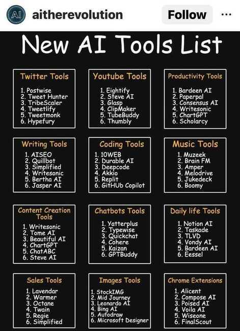

# Tools

## ChatGPT / Bard

- [Meet Bard](https://bard.google.com/)
- https://openai.com/blog/chatgpt
- [Claude](https://claude.ai/)
- https://chat.mistral.ai/
- [perplexity.ai](https://www.perplexity.ai/)
- [Godmode](https://godmode.space/)
- [**OpenAI Platform**](https://platform.openai.com/)
    - [Embeddings - OpenAI API](https://platform.openai.com/docs/guides/embeddings/what-are-embeddings)
- [GPT-4](https://openai.com/research/gpt-4)
- [It’s Time to Pay Attention to A.I. (ChatGPT and Beyond)](https://www.youtube.com/watch?v=0uQqMxXoNVs)
- https://en.wikipedia.org/wiki/GPT-3
- https://www.gwern.net/GPT-3
- [How Does ChatGPT Work - YouTube](https://www.youtube.com/watch?v=WlbPnZ_SOX4)
- [ChatGPT - Explained! - YouTube](https://www.youtube.com/watch?v=NpmnWgQgcsA)
- [Voice control for ChatGPT | Chrome Web Store - Extensions](https://chrome.google.com/webstore/detail/voice-control-for-chatgpt/eollffkcakegifhacjnlnegohfdlidhn)
- [ChatGPT Code Interpreter is like a Data Scientist on steroids](https://twitter.com/moritzkremb/status/1654107314528612355)
- [The Amazing AI Super Tutor for Students and Teachers | Sal Khan | TED - YouTube](https://www.youtube.com/watch?v=hJP5GqnTrNo&ab_channel=TED)
- [WebChatGPT: ChatGPT with internet access | Chrome Web Store - Extensions](https://chrome.google.com/webstore/detail/webchatgpt-chatgpt-with-i/lpfemeioodjbpieminkklglpmhlngfcn/related)
- [NotebookLM | Note Taking & Research Assistant Powered by AI](https://notebooklm.google/)
	- [How to Create YouTube Video Study Guides with NotebookLM - KDnuggets](https://www.kdnuggets.com/how-to-create-youtube-video-study-guides-with-notebooklm)

## AI Generators

- [**Gemini** - Google DeepMind](https://deepmind.google/technologies/gemini)
    - [Google Bard update: Image generation and Gemini Pro adds more languages](https://blog.google/products/bard/google-bard-gemini-pro-image-generation/)
- [Stable Diffusion Online](https://stablediffusionweb.com/) - [Stability AI](https://stability.ai/) - Generation of unique, realistic, high-quality images, art, logos, and designs
- Amazon Bedrock
- Amazon Titan - Amazon Titan FMs are a family of models built by Amazon that are pretrained on large datasets, which makes them powerful, general-purpose models
- AI21 labs - Jurassic-2 - Multilingual LLMs for text generation in Spanish, French, German, Portuguese, Italian, and Dutch
- Antropic - Claude - LLM for conversations, question answering, and workflow automation based on research into training honest and responsible AI systems
- [GitHub - AUTOMATIC1111/stable-diffusion-webui: Stable Diffusion web UI](https://github.com/AUTOMATIC1111/stable-diffusion-webui)
- Dall E - https://openai.com/dall-e-2
- [ClipDrop](https://clipdrop.co/)
- Deep Nostalgia
- [AI Voice Generator: Versatile Text to Speech Software | Murf AI](https://murf.ai/)
- [Tammy AI](https://tammy.ai/)
- captions (Android App)
- [MeetGeek | Record, Transcribe & Share Meeting Notes](https://meetgeek.ai/)
- [SIMA generalist AI agent for 3D virtual environments - Google DeepMind](https://deepmind.google/discover/blog/sima-generalist-ai-agent-for-3d-virtual-environments/)

## [Midjourney](https://www.midjourney.com/)

- [Civitai: The Home of Open-Source Generative AI](https://civitai.com/)

## Other AI / LLM Tools / Products

- Merlin Chrome Extension
- [ElevenLabs - Prime AI Text to Speech | Voice Cloning](https://beta.elevenlabs.io/)
- [Create Video](https://studio.d-id.com/editor)
    - [Chat D-ID](https://chat.d-id.com/)
- AI generated presentation
    - [Gamma App](https://gamma.app/)
    - https://www.presentations.ai/
    - [Presentation Software | Basic to Beautiful in Minutes with Beautiful.ai](https://www.beautiful.ai/)
    - [Decktopus | Create Better Presentations | AI Presentation Assistant](https://app.decktopus.com/dashboard/decks)
    - https://www.mentimeter.com/features/ai-builder
    - [Plus AI for Google Slides™ - Google Workspace Marketplace](https://wvorkspace.google.com/u/0/marketplace/app/plus_ai_for_google_slides/214277172452)
- [AudioPen - The easiest way to convert messy thoughts into clear text.](https://audiopen.ai/)
- [Instantly.ai - Cold Email Software](https://instantly.ai/)
- [Text-to-meme | Supermeme.ai](https://app.supermeme.ai/text-to-meme)
- [Botsonic: Custom Train ChatGPT On Your Knowledge Base Data](https://writesonic.com/botsonic)
- [Writesonic - Best AI Writer, Copywriting & Paraphrasing Tool](https://writesonic.com/)
- [Generative AI API For Your Product | One AI](https://www.oneai.com/)
- [Playground AI](https://playgroundai.com/)
- [Photo AI: AI Photo Generator](https://photoai.com/)
- [Generative AI in Jupyter. Jupyter AI, a new open source project… | by Jason Weill | Aug, 2023 | Jupyter Blog](https://blog.jupyter.org/generative-ai-in-jupyter-3f7174824862)
- [Mem: Your AI knowledge assistant](https://get.mem.ai/)
- [GitHub - Nutlope/aicommits: A CLI that writes your git commit messages for you with AI](https://github.com/Nutlope/aicommits)
- [ShareGPT: Share your wildest ChatGPT conversations with one click.](https://sharegpt.com/)
- [Digi, The New AI Girlfriend App is The Future of Romance - YouTube](https://www.youtube.com/watch?v=3487Y7QlFoo)
- [Warp AI - AI fully integrated with your terminal](https://www.warp.dev/warp-ai)
- [Build AI apps and workflows faster with Retool AI](https://retool.com/products/ai)
- [v0 by Vercel](https://v0.dev/)
- [Pika](https://pika.art/)
- [AI Detector - Trusted AI Checker for ChatGPT, GPT4 & Bard](https://www.zerogpt.com/)
- [Langfuse](https://langfuse.com/)
    - [Open source LLM observability, analytics, prompt management, evaluations, tests, monitoring, logging, tracing, LLMOps. Langfuse: the LLM engineering platform. Debug, analyze and iterate together](https://github.com/langfuse/langfuse)
- [DaLMatian](https://www.dalmatian.ai/)
- [DataGPT - Conversational AI Data Analyst](https://datagpt.com/)
- [tl;dv.io | AI Meeting Notetaker for Zoom, Google Meet & MS Teams](https://tldv.io/)
- [FinGPT: Open-Source Financial Large Language Models](https://arxiv.org/abs/2306.06031)
- [GitHub - mshumer/gpt-investor](https://github.com/mshumer/gpt-investor)
- [Self-healing code is the future of software development - Stack Overflow Blog](https://stackoverflow.blog/2023/06/07/self-healing-code-is-the-future-of-software-development/)
- [**H2O.ai** | The fastest, most accurate AI Cloud Platform](https://h2o.ai/)
- [Air](https://www.air.ai/)
- [Runway - Advancing creativity with artificial intelligence.](https://runwayml.com/)
- [Milo](https://www.joinmilo.com/)
- [Harvey | Generative AI for Elite Law Firms](https://www.harvey.ai/)
- [GitHub - mukulpatnaik/researchgpt: A LLM based research assistant that allows you to have a conversation with a research paper](https://github.com/mukulpatnaik/researchgpt)
- [Kombai](https://kombai.com/)
- [GitHub - RamiKrispin/lang2sql: A tutorial for setting an SQL code generator with the OpenAI API](https://github.com/RamiKrispin/lang2sql)
- [fal.ai/camera](https://www.fal.ai/camera)
- [GitHub - lxe/llm-companion: Mobile web app for audio "push-to-talk" + TTS chat interface with OpenAI-like APIs](https://github.com/lxe/llm-companion)
- [GitHub - adithya-s-k/CompanionLLM: CompanionLLM - A framework to finetune LLMs to be your own sentient conversational companion](https://github.com/adithya-s-k/CompanionLLM)
- [Waii - World's most powerful SQL API built with generative AI](https://www.waii.ai/)
- [Introducing Devin, the first AI software engineer](https://www.cognition-labs.com/introducing-devin)
- [Tabnine is an AI assistant that speeds up delivery and keeps your code safe](https://www.tabnine.com/)
- [GitHub - gofireflyio/aiac: Artificial Intelligence Infrastructure-as-Code Generator.](https://github.com/gofireflyio/aiac)
- [Invideo AI - Turn ideas into videos - AI video creator](https://invideo.io/)
- [\[2407.09025\] SpreadsheetLLM: Encoding Spreadsheets for Large Language Models](https://arxiv.org/abs/2407.09025)
- [GitHub - WecoAI/aideml: AIDE: the Machine Learning CodeGen Agent](https://github.com/WecoAI/aideml)
- [aiPDF - Your AI-Powered PDF Chat App](https://aipdf.ai/)
- [Knorish Flow AI - Knorish](https://knorish.com/knorish-flow-ai.html)
	- Clone yourself with AI using your content. Coach and mentor your audience 24/7 with an AI digital version of yourself, offering expert advice and insights.
- [Study.lol/](http://study.lol/) - Youtube.com summarizer
- [Seyhan Lee](https://seyhanlee.com/)

## Purpose-built accelerators for generative AI

- AWS Inferentia - Lowest cost per inference in the cloud for running deep learning (DL) models
- AWS Trainium - The most cost-efficient, high- performance training of LLMs and diffusion models
- AWS Inferentia2 - High performance at the lowest cost per inference for LLMs and diffusion models
- Amazon EC2 P5 instances - Powered by NVIDIA H100 Tensor Core GPUs
- Amazon EC2 P4d/P4de instances - Powered by NVIDIA A100 Tensor Core GPUs
- Amazon EC2 G5 instances - Powered by NVIDIA A10G Tensor Core GPUs
- [Fireworks - Fastest Inference for Generative AI](https://fireworks.ai/)

## Links

- [code-generators](ai/llm/code-generators.md)
- [Libraries](ai/llm/libraries.md)
