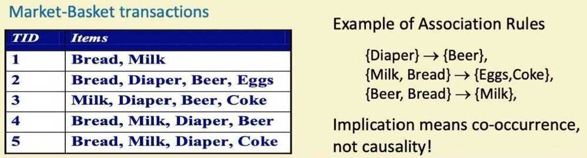
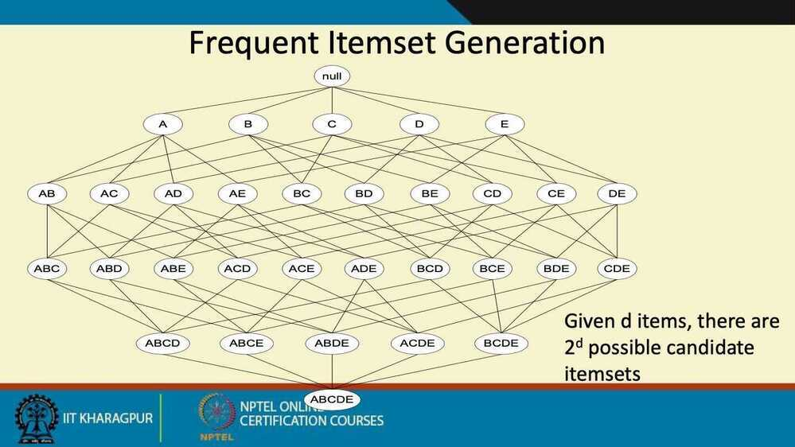
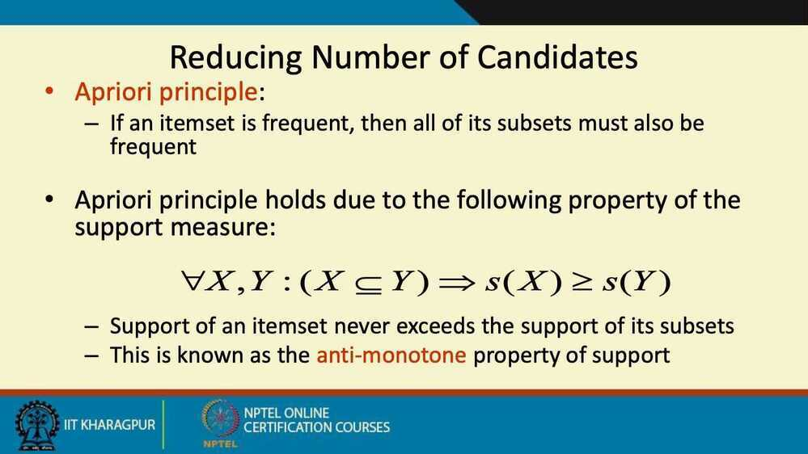
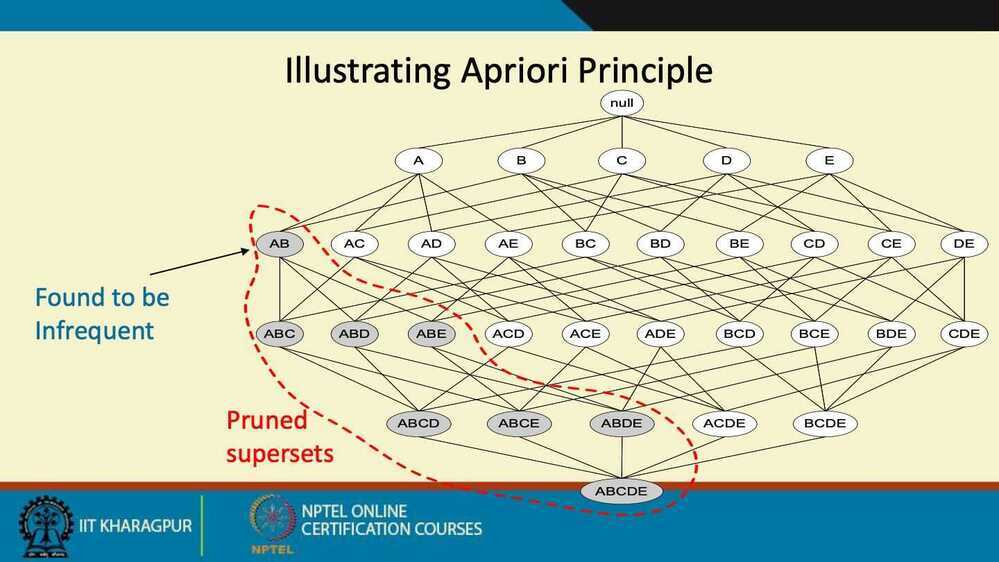

# Association Rules & Apriori Algorithm

## Association Rule Mining

- Given a set of transactions, find rules that will predict the occurrence of an item based on the occurrences of other items in the transaction

## Definition: Frequent Itemset

- **Itemset**
    - A collection of one or more items
        - Example: `{Milk, Bread, Diaper}`
    - k-itemset
        - An itemset that contains k items
- **Support count (σ)**
    - Frequency of occurrence of an itemset
    - E.g. `σ({Milk, Break, Diaper}) = 2`
- **Support**
    - Fraction of transactions that contain an itemset
    - E.g. `s({Milk, Bread, Diaper}) = 2/5`
- **Frequent Itemset**
    - An itemset whose support is greater than or equal to a *minsup* threshold
- **Association Rule**
    - An implication expression of the form `X->Y`, where X and Y are itemsets
    - Example
        - `{Milk, Diaper} -> {Beer}`
- **Rule Evaluation Metrics**
    - Support (s)
        - Fraction of transactions that contain both X and Y
    - Confidence (c)
        - Measures how often items in Y appear in transactions that contain X
    - Example

## Association Rule Mining Task

- Given a set of transactions T, the goal of association rule mining is to find all rules having
    - support >= *minsup* threshold
    - confidence >= *minconf* threshold
- Brute-force approach
    - List all possible association rules
    - Compute the support and confindence for each rule
    - Prune rules that fail the *minsup* and *minconf* thresholds
    - Computationally prohibitive

## Mining Association Rules

- Two-step approach

    1. Frequent Itemset Generation
        - Generate all itemsets whose support >= minsup

    2. Rule Generation
        - Generate high confidence rules from each frequent itemset, where each rule is a binary partitioning of a frequent itemset
- Frequent itemset generation is still computationally expresive

## Frequent Itemset Generation Strategies

- Reduce the number of candidates (M)
    - Complete search: M = 2^d^
    - Use pruning techniques to reduce M
- Reduce the number of transactions (N)
    - Reduce size of N as the size of itemset increases
    - Used by DHP and vertical-based mining algorithms
- Reduce the number of comparisons (NM)
    - Use efficient data structures to store the candidates or transactions
    - No need to match every candidate against every transaction

DHP - Direct Hashing and Pruning

Example - If bat + ball are not frequent, then we can say that bat + ball + gloves is also not frequent.

Other way around of Apriori principle - if an itemset is not frequent, then all its superset are also not frequent.

## Apriori Algorithm

- Let k = 1
- Generate frequent itemsets of length 1
- Repeat until no new frequent itemsets are identified
    - Generate length (k+1) candidate itemsets from length k frequent itemsets
    - Prune candidate itemsets containing subsets of length k that are infrequent
    - Count the support of each candidate by scanning the DB
    - Eliminate candidates that are infrequent, leaving only those that are frequent

## Factors affecting complexity

- Choice of minimum support threshold
    - Lowering support threshold results in more frequent itemsets
    - this may increase number of candidates and max length of frequent itemsets
- Dimensionality (number of items) of the data set
    - more space is needed to store support count of each item
    - if number of frequent items also increases, both computation and I/O costs may also increase
- Size of database
    - Apriori makes multiple passes, run time of algorithm increase with number of transactions
- Average transaction width
    - This may increase max length of frequent itemsets and traverals of hash tree (number of subsets in a transaction increases with its width)
