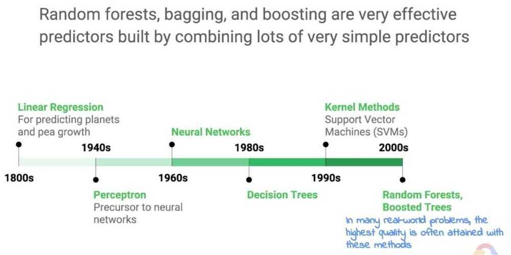
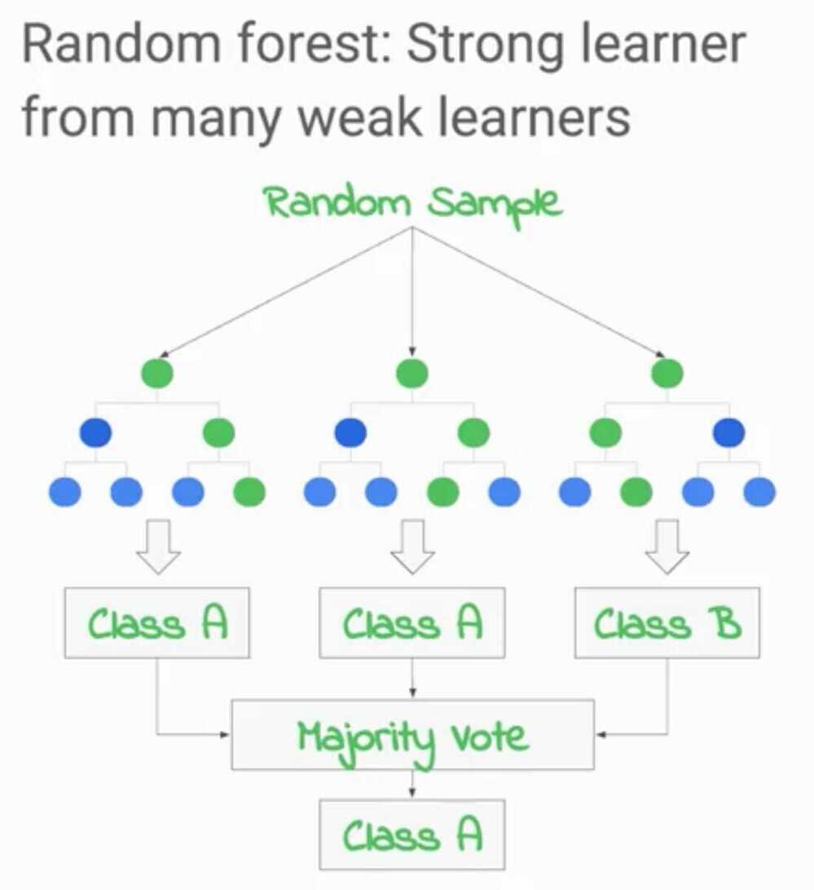
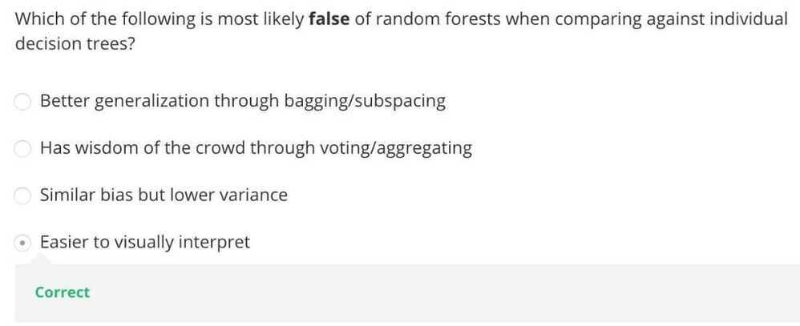

# Bagging and Random Forest

Random Forest is one of the most popular machine learning algorithms. It is a type of ensemble machine learning algorithm called Bootstrap Aggregation or bagging.

The bootstrap is a powerful statistical method for estimating a quantity from a data sample, such as a mean. You take lots of samples of your data, calculate the mean, then average all of your mean values to give you a better estimation of the true mean value.

In bagging, the same approach is used, but instead for estimating entire statistical models, most common decision trees are used.

Multiple samples of your training data are taken then models are constructed for each data sample. When you need to make a prediction for new data, each model makes a prediction and the predictions are averaged to give a better estimate of the true output value.

Random forest is a tweak on this approach where decision trees are created so that rather than selecting optimal split points, suboptimal splits are made by introducing randomness.

The models created for each sample of the data are therefore more different than they otherwise would be, but still accurate in their unique and different ways. Combining their predictions results in a better estimate of the true underlying output value.

If you get good results with an algorithm with high variance (like decision trees), you can often get better results by bagging that algorithm.

https://victorzhou.com/blog/intro-to-random-forests

## What is a Random Forest?

The Random Forest algorithm uses multiple decision trees with varying subsets of parameters to make a judgment of the input with each decision tree. This relies on the majority rule choosing the most frequent outcome as the correct one. The Random Forest technique bypasses the disadvantage of having a single decision tree with a biased system.

## Random Forests

