# Bayes Classification

## Naive Bayes

Naive Bayes is a simple but surprisingly powerful algorithm for predictive modeling.

The model is comprised of two types of probabilities that can be calculated directly from your training data:

1. The probability of each class.

2. The conditional probability for each class given each x value.

Once calculated, the probability model can be used to make predictions for new data using Bayes Theorem.

When your data is real-valued it is common to assume a Gaussian distribution (bell curve) so that you can easily estimate these probabilities.

Naive Bayes is called naive because it assumes that each input variable is independent. This is a strong assumption and unrealistic for real data, nevertheless, the technique is very effective on a large range of complex problems.

A simple species classification problem

- Measure the length of a fish, and decide its class - Hilsa or Tuna
- Collect Statistics
- Distribution of "Fish Length"

- Decision Rule
  - If length L <= B
    - Hilsa
  - Else
    - Tuna
  - What should be the value of B ("boundary" length)
    - Based on population statistics
- Error of Decision Rule

Errors: Type 1 + Type 2

Type 1: Actually Tuna, Classified as Hilsa (area under pink curve to the left of a B)

Type 2: Actually Hilsa, Classified as Tuna (area under blue curve to the right of a B)

- Optimal Decision Rule

- Species Identification Problem
  - Measure lengths of a (sizeable) population of Hilsa and Tuna fishes
  - Estimate Class Conditional Distributions for Hilsa and Tuna classes respectively
  - Find Optimal Decision Boundary B* from the distributions
  - Apply Decision Rule to classify a newly caught (and measured) fish as either Hilsa or Tuna
    - with minimum error probability
- Location / Time of Experiment
  - Calcutta in Monsoon
    - More Hilsa few Tuna
  - California in Winter
    - More Tuna less Hilsa
  - Even a 2ft fish is likely to be Hilsa in Calcutta a 1.5ft fish may be Tuna in California

- If the distribution is biased, we can scale up the class conditional probability to make b* optimal.
- We can do the scaling using Apriori Probability

## Apriori Probability

- Without measuring lengh what can we guess about the class of a fish
  - Depends on location / time of experiment
    - Calcutta: Hilsa, California: Tuna
- Apriori probability: P(HILSA), P(TUNA)
  - Property of the frequency of classes during experiment
    - Not a property of length of the fish
  - Calcutta: P(Hilsa) = 0.90, P(Tuna) = 0.10
  - California: P(Tuna) = 0.95, P(Hilsa) = 0.05
  - London: P(Tuna) = 0.50, P(Hilsa) = 0.50
- Also a determining factor in class decision along with class conditional probability

- We multiply the class conditional curve by the Apriori Probability

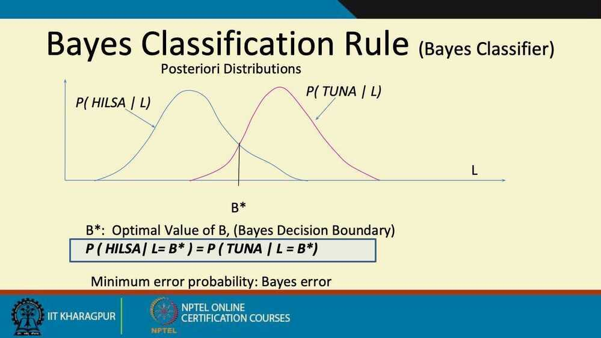

- Also called Bayes Optimal Classifier
- and B* is called Bayes Optimal Boundary

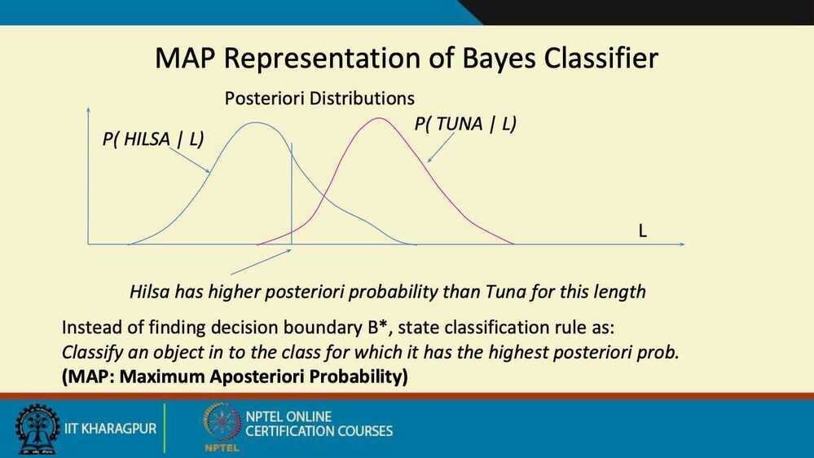

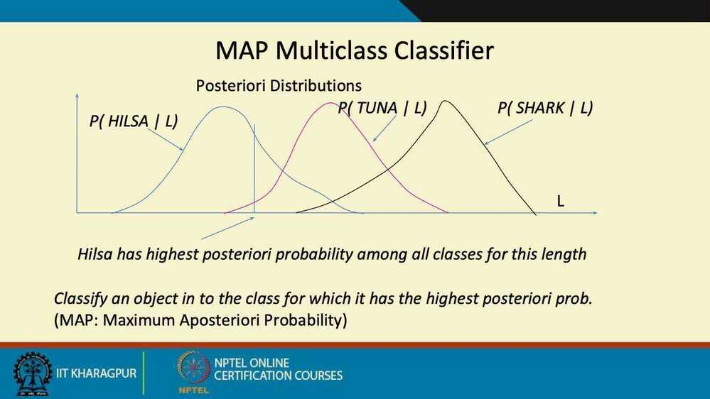

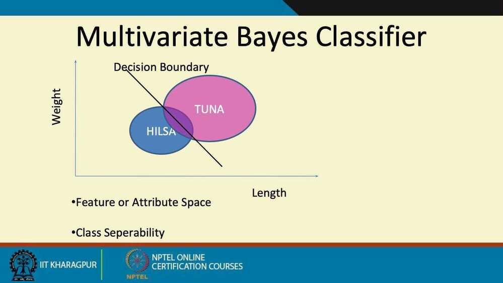

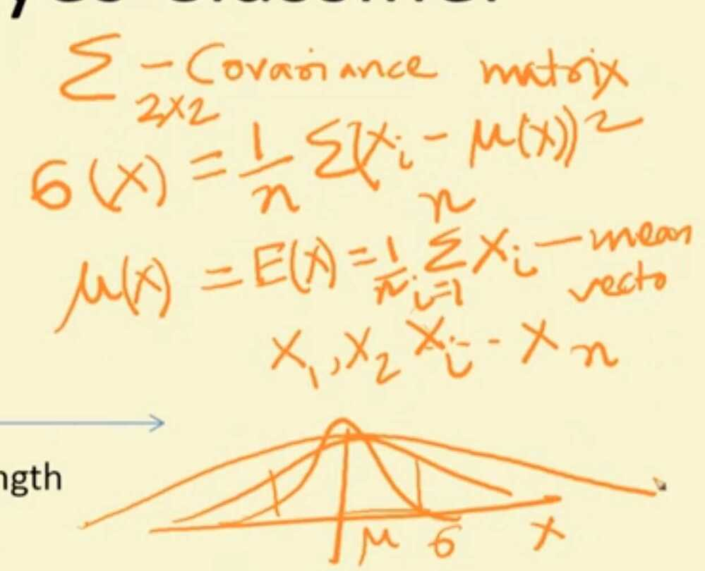

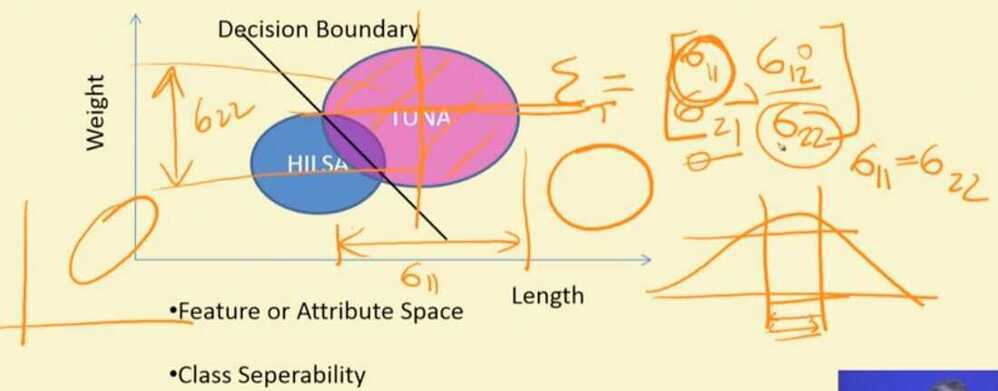

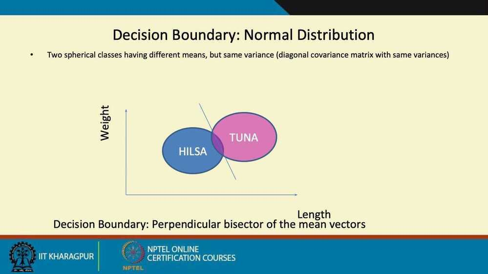

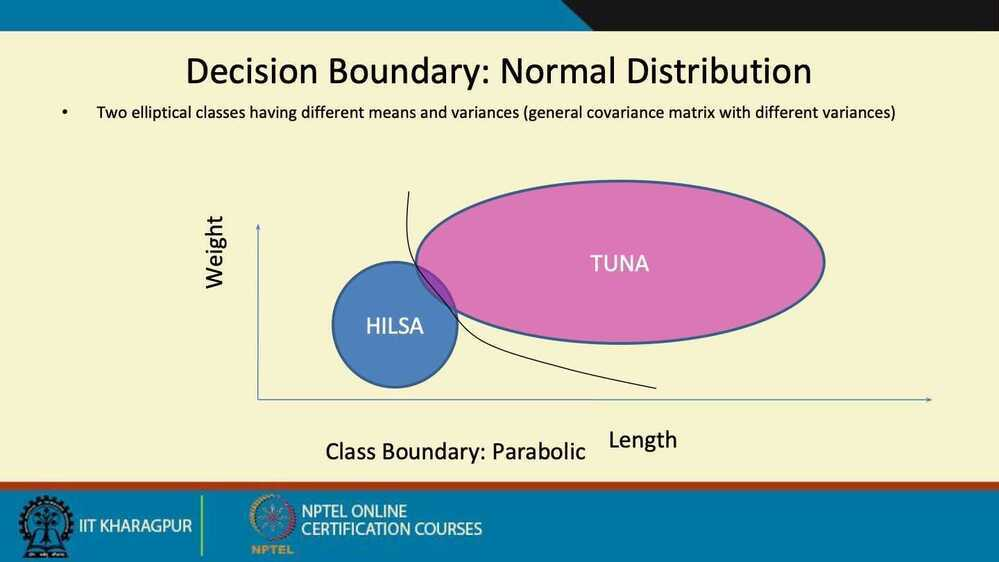

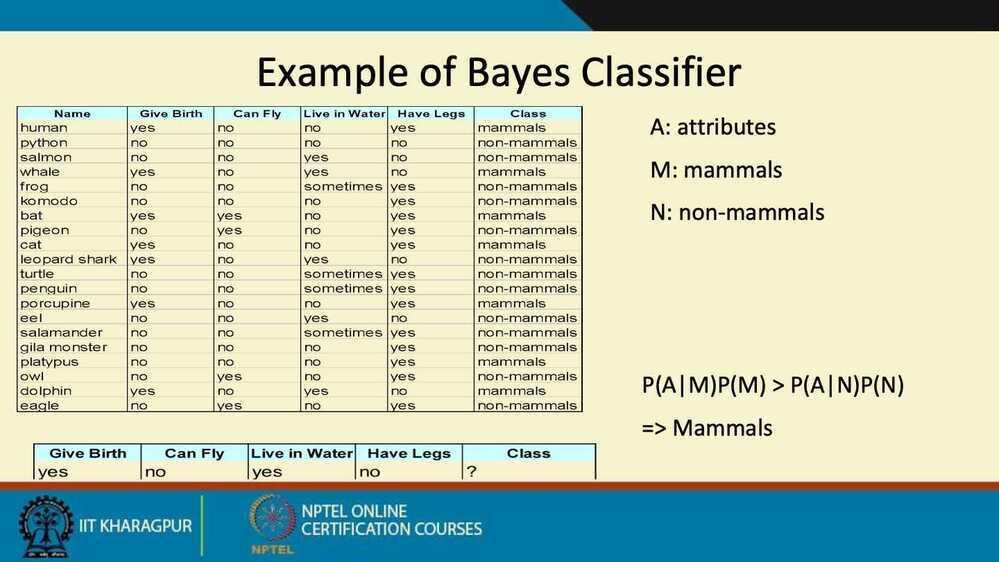

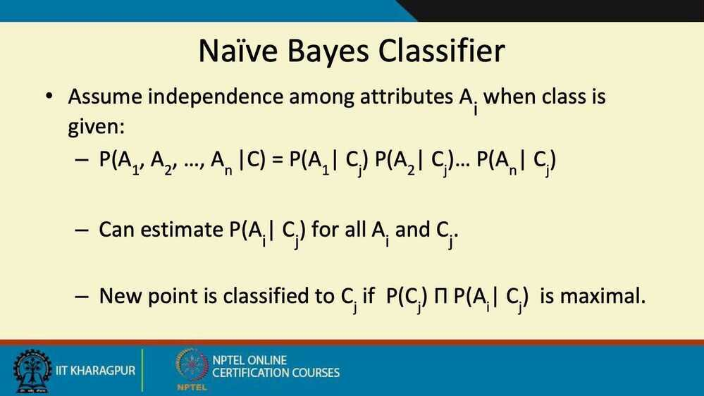

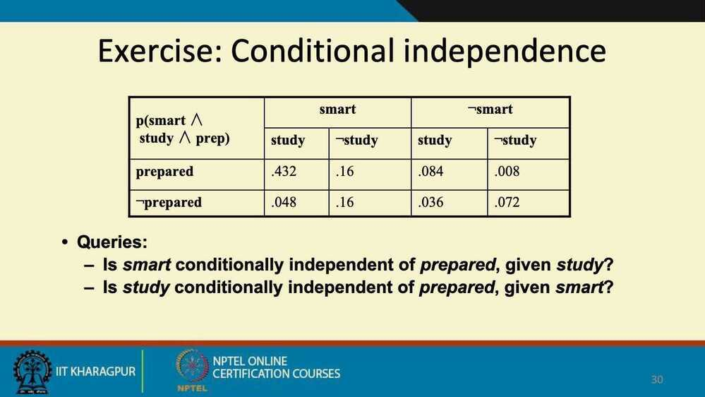

## Summary

- **Advantages**
  - Robust to isolated noise points
  - Handle missing values by ignoring the instance during probability estimate calculations
  - Robus to irrelevant attributes
- **Drawback**
  - Independence assumption may not hold for some attributes
    - Lenght and weight of a fish are not independent
    - Conditional Independence
