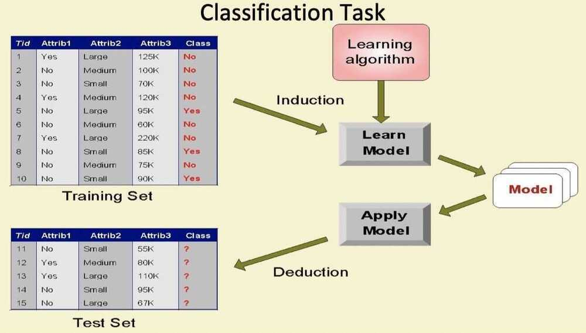

# Classification

https://neptune.ml/blog/evaluation-metrics-binary-classification

## Classification

- Given a collection of records **(training set)**
  - Each record contains a set of **attributes**, one of the attributes is the **class**
- Find a **model** for class attribute as a function of the values of other attributes.
- Goal: **Previously unseen** records should be assigned a class as accurately as possible
  - A **test set** is used to determine the accuracy of the model. Usually, the given data set is divided into training and test sets, with training set used to build the model and test set used to validate it

## Examples of Classification Task

- Classifying credit card transactions as legitimate or fraudulent
- Classifying secondary structures of protein as alpha-helix, beta-sheet, or random coil
- Categorizing news stories as finance, weather, entertainment, sports, etc

## Classification Techniques

- Decision Tree
- Bayes Classifier
- Nearest Neighbor (KNN)
- Support Vector Machine
- Neural Networks
- Linear learner
- Factorization methods
- XGBoost
